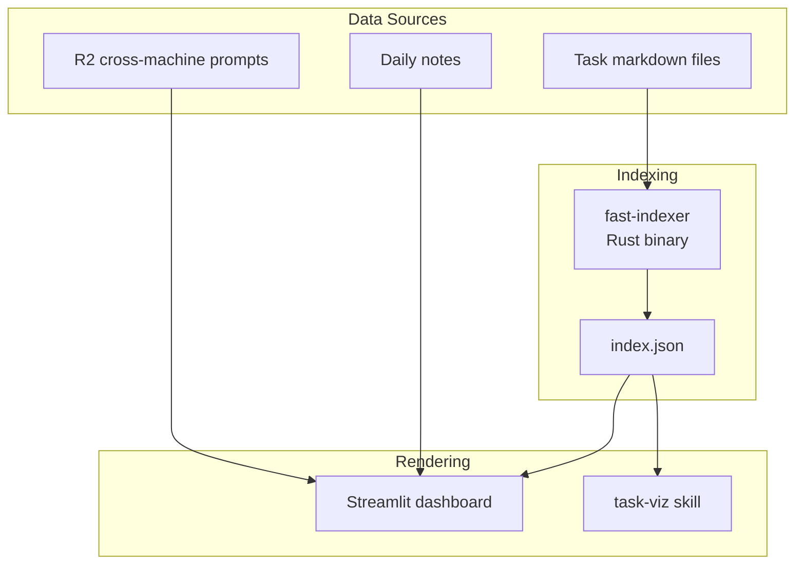

# Overwhelm Dashboard

## Giving Effect

- [[aops-tools/fast_indexer/]] - Rust binary for fast task indexing
- [[skills/task-viz/SKILL.md]] - Task visualization skill (JSON, GraphML, DOT output)
- [[skills/dashboard/SKILL.md]] - Cognitive Load Dashboard skill
- [[mcp__plugin_aops-core_task_manager__get_graph_metrics]] - Graph metrics for dashboard
- [[mcp__plugin_aops-core_task_manager__rebuild_index]] - Index rebuild using fast-indexer

Single system for task visibility and cognitive load management.

## Architecture



## Core Problem

Task state is scattered and not visible where needed. User returns to terminal and can't remember what they were doing across multiple machines and projects.

## User Story

**As** an overwhelmed academic with ADHD,
**I want** one place that shows all my tasks and what I was working on,
**So that** I can recover context quickly and stay oriented.

## User Workflow

The dashboard is designed for a specific user pattern:

### Daily Activities

- **Long-running agents**: Multiple terminals with "crew" agents working on tasks
- **Ad-hoc work**: Direct interaction with agents for one-off tasks
- **Polecat batches**: Invoking batch processes and overseeing merge workflows
- **Academic tasks**: Research, writing, analysis work
- **Email and prioritization**: Triage and task management

### Pain Points (What the Dashboard Solves)

1. **Overwhelm from simultaneous tasks** - Too many things running, can't see the big picture
2. **Losing track of progress** - What got done? What's still pending?
3. **Context switching difficulty**:
   - Not clear what each terminal was doing
   - Not clear what the user wanted when they started that task
   - Not clear what they planned to do next when they resumed

### What the User Needs to Know

When returning to work, the user needs to answer:

- **"What terminal is this?"** → Session identity from initial prompt
- **"What was I trying to do?"** → User intent, not agent state
- **"What's the next step?"** → Planned action when resuming

The dashboard must surface these answers directly, not require the user to reconstruct them from raw agent metadata.

## Streamlit Dashboard

### Data source

index.json (created by [[fast-indexer]])
**Consumers**:

- [[Task MCP server]] - `rebuild_index()` wraps fast-indexer
- [[Overwhelm dashboard]] - reads index.json directly
- [[task-viz]] - generates graph visualizations

### Dashboard Implementation Details

Location: `aops/lib/overwhelm/`

Renders task state and session context. No LLM calls in render path.

**Invocation**:

```bash
cd $AOPS && uv run streamlit run lib/overwhelm/dashboard.py
```

### Data Flow

```
Task files ──> fast-indexer ──> index.json ──> Dashboard
                                    │
                                    └──> Task MCP server
                                    └──> task-viz

Agent sessions --> session state json files --> Dashboard
```

**Key principle**: Dashboard is pure rendering. All computation happens in fast-indexer or pre-computed synthesis.

## Index Schema (index.json)

```json
{
  "generated": "2026-01-21T10:00:00Z",
  "total_tasks": 42,
  "tasks": [
    {
      "id": "20260121-task-slug",
      "title": "Task title",
      "status": "active",
      "priority": 0,
      "project": "project-slug",
      "due": "2026-01-25",
      "parent": "20260120-parent-task",
      "depends_on": ["20260119-dependency"],
      "tags": ["tag1", "tag2"],
      "file": "data/aops/tasks/20260121-task-slug.md"
    }
  ],
  "priority_by_project": {
    "aops": ["task-1", "task-2"],
    "uncategorized": ["misc-task"]
  },
  "priority_by_due": {
    "overdue": [],
    "this_week": ["task-1"],
    "next_week": [],
    "later": ["task-2"],
    "no_date": ["misc-task"]
  }
}
```

## Page Layout

Single-page layout (no tabs). Content flows top-to-bottom:

1. **Task Graph** - Interactive network visualization
2. **Project Boxes** - One box per project with context

### Task Graph Section

Interactive force-directed graph at the top of the page.

**Renderer**: Force-Graph (WebGL/Canvas)

- Replaced vis.js (slow) and Cytoscape (removed for simplicity)
- GPU-accelerated, handles large graphs smoothly

**Controls**:

| Control    | Options                                     |
| ---------- | ------------------------------------------- |
| **View**   | Tasks, Knowledge Base                       |
| **Layout** | ↓ Top-Down, → Left-Right, ◎ Radial, ⚛ Force |

**Visual Settings** (in collapsible expander):

| Setting      | Range       | Default | Purpose                          |
| ------------ | ----------- | ------- | -------------------------------- |
| Node Size    | 1-20        | 6       | Size of node circles             |
| Link Width   | 0.5-5.0     | 1.0     | Thickness of edges               |
| Text Size    | 6-24        | 12      | Base font size for labels        |
| Link Opacity | 0.1-1.0     | 0.6     | Edge transparency                |
| Repulsion    | -500 to -10 | -100    | Node repulsion strength          |
| Show Labels  | checkbox    | On      | Toggle label visibility          |
| Hide Orphans | checkbox    | Off     | Remove nodes with no connections |

**Filter** (in collapsible expander):

| Setting    | Type        | Purpose                          |
| ---------- | ----------- | -------------------------------- |
| Show Types | multiselect | Filter nodes by frontmatter type |

**Layout modes** (DAG layouts for hierarchical task trees):

- `td` - Top-down: goals at top, actions at bottom
- `lr` - Left-right: horizontal hierarchy
- `radial-out` - Radial: goals in center, tasks radiate outward
- `force` - Organic force-directed (default)

**Data Sources**:

- Tasks view: `$ACA_DATA/outputs/graph.json`
- Knowledge Base view: `$ACA_DATA/outputs/knowledge-graph.json`

**Default Type Filtering**:

- Tasks view defaults to: `goal`, `project`, `epic`, `task`, `action`, `bug`, `feature`, `learn`
- Knowledge Base view defaults to: all types
- Users can adjust via the Filter expander

**Node colors** (Tasks view by status):

- Blue: active
- Green: done
- Red: blocked
- Yellow: waiting
- Purple: review

### Recent Prompts Section

Displays user prompts from session summaries for quick context recovery.

**Data Source**: `~/writing/sessions/summaries/*.json` - `prompts` field

**Placement**: After "Where You Left Off" section, before Project Boxes.

**Display**:

- Reverse chronological by session date
- Grouped by session ID
- Each session shows: project badge, session ID, date, prompts list
- `st.expander` for collapsible display
- `st.code()` blocks for copy functionality (built-in copyable behavior)

**Prompts field parsing**:

- `null` → skip session (no prompts captured)
- `"[\"prompt1\", \"prompt2\"]"` → `json.loads()` to get array
- Plain string → wrap in array

**Function**: `get_recent_prompts(days: int = 7) -> list[dict]`

- Scans session summary files
- Parses prompts field (handles null, JSON string, plain string)
- Returns list of session dicts with prompts, sorted by date descending

### Project Boxes

Grid of project cards below the graph. Each box contains:

| Section            | Content                                   | Data Source         |
| ------------------ | ----------------------------------------- | ------------------- |
| **⚡ WORKING NOW** | Active sessions with conversation context | Session state files |
| **📌 UP NEXT**     | Top 3 priority tasks                      | index.json          |
| **✅ RECENTLY**    | Recent accomplishments                    | Daily notes         |

**Sorting**: Projects sorted by activity score:

- +1000 per active session
- +100 if has P0 task
- +recency bonus

**Filtering**: Empty projects (no sessions, tasks, or accomplishments) are hidden.

## Session Context Model

**Core principle**: A session is a **conversation thread**, not an agent process. The user recognizes sessions by what they asked, not by agent IDs.

### What Makes a Session Identifiable

The user identifies "which terminal is this?" by:

1. **Initial prompt** - What they first asked the agent to do
2. **Follow-up prompts** - Subsequent requests that shaped the work
3. **Working directory/project** - Secondary context

### Session Context Schema

Each displayed session MUST include:

```json
{
  "session_id": "abc123",
  "project": "academicOps",
  "initial_prompt": "Review PR #42 for the fast-indexer changes",
  "follow_up_prompts": [
    "Also check the test coverage",
    "Fix the linting errors you found"
  ],
  "last_user_message": "Fix the linting errors you found",
  "current_status": "Fixing 3 linting errors in src/indexer.rs",
  "planned_next_step": "Run tests after fixes, then mark PR ready for review",
  "last_activity": "2026-02-03T10:30:00Z",
  "started": "2026-02-03T09:15:00Z"
}
```

### Session Display

**Good** (conversation-centric):

```
📍 academicOps (2h ago)
   Started: "Review PR #42 for fast-indexer changes"
   Now: Fixing 3 linting errors
   Next: Run tests, mark PR ready
```

**Bad** (agent-centric - REJECTED):

```
🤖 unknown: No specific task (started 165h ago)
```

### Minimum Viable Context

A session MUST have at least:

- Initial prompt OR current task status
- If neither exists, session is not displayed (hidden as "unidentified")

Sessions showing "unknown: No specific task" provide zero value and MUST be filtered out or prompted for archival.

## Design Principles

### Context Recovery, Not Decision Support

The dashboard answers:

- **What's running where?** - Multiple terminals, multiple projects
- **Where did I leave off?** - Per-project context recovery
- **What's the state of X?** - Quick status check

It does NOT try to:

- Recommend ONE thing to do
- Hide options or force single-focus mode
- Make decisions for the user

### Scale Considerations

The problem changes at scale:

| Session Count | Primary Problem                          | Solution                          |
| ------------- | ---------------------------------------- | --------------------------------- |
| 1-10 sessions | **Memory**: "What was I doing?"          | Context recovery (current design) |
| 10+ sessions  | **Prioritization**: "Which one matters?" | Session triage (see below)        |

At 10+ active sessions, displaying a flat list creates decision paralysis. The dashboard must shift from pure context recovery to **context recovery with triage assistance**.

### Session Triage

**Always apply** recency-based triage (not just at 10+ sessions):

| Bucket         | Definition                | Display                                      |
| -------------- | ------------------------- | -------------------------------------------- |
| **Active Now** | Activity within 4 hours   | Full session cards with conversation context |
| **Paused**     | 4-24 hours since activity | Collapsed cards, click to expand             |
| **Stale**      | >24 hours since activity  | Auto-archive prompt (see below)              |

Within buckets, group by project for orientation.

**Implementation**: `fetch_session_activity(hours=4)` for Active Now bucket.

### Stale Session Handling

Sessions >24h without activity are **not displayed in the main list**. Instead:

```
┌─────────────────────────────────────────────────────┐
│ 📦 12 stale sessions (no activity >24h)             │
│                                                     │
│ [Archive All]  [Review & Select]  [Dismiss]         │
└─────────────────────────────────────────────────────┘
```

**Archive** = Move session state to archive folder, remove from active display
**Review** = Expand to see session summaries, select which to archive
**Dismiss** = Hide prompt for this dashboard visit (reappears next load)

**Rationale**: 499 sessions from days ago create noise, not signal. The user can't meaningfully act on them. Prompting for cleanup reduces cognitive load and keeps the dashboard focused on current work.

### Anti-Patterns

**Decision-support anti-patterns:**

- GPS/directive mode that hides options
- Single-focus design that ignores multitasking reality
- Over-indexing on "recommend ONE thing" _at baseline scale_
- Assuming decision paralysis when the problem is memory _at baseline scale_

**Display anti-patterns:**

- **Agent-centric display**: Showing "499 agents running" instead of meaningful session context
- **Unknown/empty sessions**: Displaying "unknown: No specific task" provides zero value
- **Flat lists at scale**: 499 items in a list creates paralysis, not orientation
- **Ignoring recency**: Treating 275h-old sessions the same as 2h-old sessions
- **Truncation that destroys meaning**: Cutting prompts to 60 chars makes them useless

**The litmus test**: If a user sees a session entry and can't answer "what was I doing there?", the display has failed.

### Information Density

- Show top priorities with "X more" indicators
- Group by project for orientation
- LLM synthesis for human-readable summaries (pre-computed, not in render path)

## Implementation Phasing

### Phase 1: Parameter Tuning (Non-Breaking)

Quick wins that don't change UI structure:

| Change                         | File           | Line | Effort                           |
| ------------------------------ | -------------- | ---- | -------------------------------- |
| Truncation 60→120 chars        | `dashboard.py` | 1782 | 1 line                           |
| Time window 24h→4h             | `dashboard.py` | 1916 | 1 line                           |
| Kill "Local activity" fallback | `dashboard.py` | 604  | Replace with `""` or git context |

### Phase 2: Session Triage UI (Breaking)

Structural changes requiring new components:

1. **Recency bucket logic**: Categorize sessions into Active Now / Paused / Stale
2. **Collapsible cards**: Implement expand/collapse for Paused bucket
3. **Grouped summary**: "X stale sessions" with drill-down
4. **Project grouping**: Within-bucket organization

### Phase 3: Rich Fallback Context (Optional)

If Phase 1 fallback removal leaves too many empty cards:

1. Extract git branch from session state
2. Show recently modified files
3. Parse working directory for project indicators

## Knowledge Base View

The graph section includes a View toggle to switch between Tasks and Knowledge Base.

**Node colors** (Knowledge Base view by type):

- Red: goal
- Purple: project
- Blue: task
- Cyan: action
- Orange: bug
- Pink: contact
- Teal: workflow
- Sky: spec

The Knowledge Base graph visualizes:

- Notes and documents as nodes
- Wikilinks as edges
- Color-coded by frontmatter `type` field

## Task Management Interface

CRUD operations for tasks directly through the dashboard UI.

### Required Operations

| Operation    | UI Element                      | Backend                  |
| ------------ | ------------------------------- | ------------------------ |
| **Create**   | Quick task form in sidebar      | Task MCP `create_task`   |
| **Read**     | Task details on node click      | Task MCP `get_task`      |
| **Update**   | Inline edit on task card        | Task MCP `update_task`   |
| **Delete**   | Delete button with confirmation | Task MCP `delete_task`   |
| **Complete** | Checkbox/button on task card    | Task MCP `complete_task` |

### Inline Task Editor

When a task node is clicked or a task card is selected:

```
┌──────────────────────────────────────────────────┐
│ ✏️ Edit Task: Fix fallback violations            │
├──────────────────────────────────────────────────┤
│ Title:    [Fix fallback violations in X.py    ] │
│ Status:   [active ▼]  Priority: [P1 ▼]         │
│ Project:  [aops ▼]    Due: [____-__-__]        │
│ Tags:     [bug, framework]                      │
├──────────────────────────────────────────────────┤
│ Body:                                            │
│ ┌────────────────────────────────────────────┐  │
│ │ Description markdown...                    │  │
│ └────────────────────────────────────────────┘  │
├──────────────────────────────────────────────────┤
│ [Save]  [Cancel]  [Complete ✓]  [Delete 🗑️]     │
└──────────────────────────────────────────────────┘
```

### Task Operations Design Principles

- **Non-blocking**: Task operations should not freeze the UI
- **Optimistic updates**: Show changes immediately, sync in background
- **Minimal clicks**: Common operations (complete, change status) in 1-2 clicks
- **Context preservation**: Editing a task shouldn't lose graph position

## Acceptance Criteria

### Core Rendering

- [x] fast-indexer generates valid index.json from task files
- [ ] Dashboard renders index.json without errors
- [ ] Cross-machine prompts visible via R2 integration
- [ ] Mobile/tablet accessible via browser
- [ ] Graceful degradation when data sources unavailable
- [ ] No LLM calls in render path (pre-computed synthesis only)

### Session Display (Critical)

- [ ] Each session shows initial prompt (what user asked)
- [ ] Each session shows current status or planned next step
- [ ] Sessions without meaningful context are hidden (not "unknown: No specific task")
- [ ] Truncation preserves enough context to identify session (≥120 chars minimum)
- [ ] Recency triage applied: Active (<4h), Paused (4-24h), Stale (>24h)
- [ ] Stale sessions trigger auto-archive prompt, not flat list display
- [ ] User can answer "what was I doing?" for every displayed session

### Session Triage Acceptance Criteria

- [ ] Active sessions (last 4h) shown with full conversation context
- [ ] Paused sessions (4-24h) shown collapsed, expandable
- [ ] Stale sessions (>24h) show archive prompt with count
- [ ] Archive action moves session to archive, removes from display
- [ ] Review action expands stale sessions for selective archival

### Graph Visualization

- [ ] Task graph renders without freezing browser
- [ ] Knowledge Base graph view displays notes and wikilinks
- [ ] Graph loads within 2 seconds for typical data size
- [ ] Node selection shows task/note details

### Task Management

- [ ] Create task from dashboard UI
- [ ] Edit task inline (title, status, priority, project)
- [ ] Complete task with single click
- [ ] Delete task with confirmation
- [ ] Changes sync to task files immediately

## Path Reconstruction

### Problem

User runs parallel sessions, gets sidetracked by bugs, and loses their thread. After 30 minutes they can't remember what they were doing or what to do next. Two specific problems:

1. **Session display shows agent output, not user intent** — WLO cards show "Successfully completed: Standardized session short hashes..." instead of the user's initial prompt
2. **No plan-level tracking** — no way to see across sessions what path was taken, what deviated, what was dropped

### Path Reconstruction Architecture

**Data flow:**

```
Raw JSONL sessions
    ↓ (transcript.py — existing processing pass)
    ↓ extract_timeline_events() during processing
    ↓
Session summary JSONs (enriched with timeline_events)
    ↓
path_reconstructor.py (reads JSONs, assembles cross-session view)
    ↓
Dashboard rendering (HTML/CSS in dashboard.py)
```

**Key principle:** No double-handling. The existing `SessionProcessor` already parses tool calls from JSONL into `ConversationTurn` objects with `assistant_sequence` items containing `tool_name`, `tool_input`, and timestamps. Timeline events are extracted from this already-parsed data and saved to the summary JSON.

### Event Types

| Event           | Source                                         | Description                    |
| --------------- | ---------------------------------------------- | ------------------------------ |
| `user_prompt`   | User message in turn                           | First ~120 chars of user input |
| `task_create`   | `task_manager__create_task` tool call          | Task title and project         |
| `task_complete` | `task_manager__complete_task` tool call        | Task ID completed              |
| `task_claim`    | `task_manager__claim_next_task` tool call      | Task claimed from queue        |
| `task_update`   | `task_manager__update_task` with status change | New status value               |

### Display Design

```
┌─────────────────────────────────────────────────────────┐
│  YOUR PATH (what actually happened)                      │
│                                                          │
│ ⚠ DROPPED THREADS (started but not finished)             │
│   □ "Investigate daily skill bug" (aops-6c93)            │
│   □ "Design light-touch QA gate" (aops-f67d)             │
│                                                          │
│ academicOps (cd6a8da0)  │ gemini (4b0ecf85)  │ writing  │
│ ● 07:21 Started:        │ ● 07:18 Started:   │ (f36b6d)│
│   "dogfood polecats..."  │   "learn session"  │ ● 07:25 │
│ ○ 07:25 Created task    │ ○ 07:22 Created    │   daily  │
│   aops-84c88881          │   learn task        │   notes  │
│ ✓ 07:45 Done             │ ✓ 07:40 Done       │ ✓ Done   │
└──────────────────────────┴────────────────────┴─────────┘
```

- **DROPPED THREADS first** — most actionable info for someone who's lost
- **Parallel columns** — visual layout communicates concurrent work
- **HH:MM timestamps** — scannable, not ISO noise
- **Colored dots** — status at a glance without reading

### ADHD Accommodation Notes

- Dropped threads shown first because that's the most actionable information for context recovery
- Timeline is scannable — events are one line each, not paragraphs
- Reactive design — reconstructs from existing data, no pre-planning required from user
- Directive framing — "YOUR PATH" not "Session History"

### Future: Proactive Deviation Tracking

Agents should eventually detect scope-escape and do task bookkeeping (e.g., when a user says "actually fix this bug first", the agent creates a deviation event). This is not yet implemented — current design is purely reactive reconstruction from transcript data.

### Path Reconstruction Giving Effect

- `aops-core/lib/transcript_parser.py`

— `extract_timeline_events()` function

- `aops-core/scripts/transcript.py` — calls extractor, saves to summary JSON
- `aops-core/lib/path_reconstructor.py` — reads summary JSONs, assembles path
- `lib/overwhelm/dashboard.py` — CSS + rendering for path section

## Related

- [[aops-0a7f6861]] - EPIC: fast-indexer adoption
- [[Task MCP server]] - Primary task operations interface
- [[task-viz]] - Network graph visualization (standalone skill)
- [[fast-indexer]] - Rust binary for index generation
