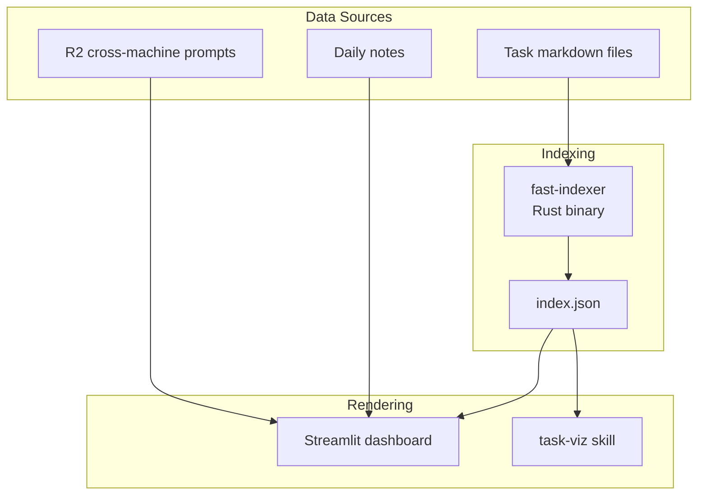

# Overwhelm Dashboard

Single system for task visibility and cognitive load management.

## Architecture



## Core Problem

Task state is scattered and not visible where needed. User returns to terminal and can't remember what they were doing across multiple machines and projects.

## User Story

**As** an overwhelmed academic with ADHD,
**I want** one place that shows all my tasks and what I was working on,
**So that** I can recover context quickly and stay oriented.

## Streamlit Dashboard
### Data source
index.json (created by [[fast-indexer]])
**Consumers**:
- [[Task MCP server]] - `rebuild_index()` wraps fast-indexer
- [[Overwhelm dashboard]] - reads index.json directly
- [[task-viz]] - generates graph visualizations

### Streamlit Dashboard

Location: `aops/lib/overwhelm/`

Renders task state and session context. No LLM calls in render path.

**Invocation**:
```bash
cd $AOPS && uv run streamlit run lib/overwhelm/dashboard.py
```

### Data Flow

```
Task files ──> fast-indexer ──> index.json ──> Dashboard
                                    │
                                    └──> Task MCP server
                                    └──> task-viz

Agent sessions --> session state json files --> Dashboard
```

**Key principle**: Dashboard is pure rendering. All computation happens in fast-indexer or pre-computed synthesis.

## Index Schema (index.json)

```json
{
  "generated": "2026-01-21T10:00:00Z",
  "total_tasks": 42,
  "tasks": [
    {
      "id": "20260121-task-slug",
      "title": "Task title",
      "status": "active",
      "priority": 0,
      "project": "project-slug",
      "due": "2026-01-25",
      "parent": "20260120-parent-task",
      "depends_on": ["20260119-dependency"],
      "tags": ["tag1", "tag2"],
      "file": "data/aops/tasks/20260121-task-slug.md"
    }
  ],
  "priority_by_project": {
    "aops": ["task-1", "task-2"],
    "uncategorized": ["misc-task"]
  },
  "priority_by_due": {
    "overdue": [],
    "this_week": ["task-1"],
    "next_week": [],
    "later": ["task-2"],
    "no_date": ["misc-task"]
  }
}
```

## Page Layout

Single-page layout (no tabs). Content flows top-to-bottom:

1. **Task Graph** - Interactive network visualization
2. **Project Boxes** - One box per project with context

### Task Graph Section

Interactive force-directed graph at the top of the page.

**Renderer**: Force-Graph (WebGL/Canvas)
- Replaced vis.js (slow) and Cytoscape (removed for simplicity)
- GPU-accelerated, handles large graphs smoothly

**Controls**:

| Control | Options |
|---------|---------|
| **View** | Tasks, Knowledge Base |
| **Layout** | ↓ Top-Down, → Left-Right, ◎ Radial, ⚛ Force |

**Visual Settings** (in collapsible expander):

| Setting | Range | Default | Purpose |
|---------|-------|---------|---------|
| Node Size | 1-20 | 6 | Size of node circles |
| Link Width | 0.5-5.0 | 1.0 | Thickness of edges |
| Text Size | 6-24 | 12 | Base font size for labels |
| Link Opacity | 0.1-1.0 | 0.6 | Edge transparency |
| Repulsion | -500 to -10 | -100 | Node repulsion strength |
| Show Labels | checkbox | On | Toggle label visibility |
| Hide Orphans | checkbox | Off | Remove nodes with no connections |

**Filter** (in collapsible expander):

| Setting | Type | Purpose |
|---------|------|---------|
| Show Types | multiselect | Filter nodes by frontmatter type |

**Layout modes** (DAG layouts for hierarchical task trees):
- `td` - Top-down: goals at top, actions at bottom
- `lr` - Left-right: horizontal hierarchy
- `radial-out` - Radial: goals in center, tasks radiate outward
- `force` - Organic force-directed (default)

**Data Sources**:
- Tasks view: `$ACA_DATA/outputs/graph.json`
- Knowledge Base view: `$ACA_DATA/outputs/knowledge-graph.json`

**Default Type Filtering**:
- Tasks view defaults to: `goal`, `project`, `epic`, `task`, `action`, `bug`, `feature`, `learn`
- Knowledge Base view defaults to: all types
- Users can adjust via the Filter expander

**Node colors** (Tasks view by status):
- Blue: active
- Green: done
- Red: blocked
- Yellow: waiting
- Purple: review

### Project Boxes

Grid of project cards below the graph. Each box contains:

| Section | Content | Data Source |
|---------|---------|-------------|
| **⚡ WORKING NOW** | Active agent sessions | Session state files |
| **📌 UP NEXT** | Top 3 priority tasks | index.json |
| **✅ RECENTLY** | Recent accomplishments | Daily notes |

**Sorting**: Projects sorted by activity score:
- +1000 per active session
- +100 if has P0 task
- +recency bonus

**Filtering**: Empty projects (no sessions, tasks, or accomplishments) are hidden.

## Design Principles

### Context Recovery, Not Decision Support

The dashboard answers:
- **What's running where?** - Multiple terminals, multiple projects
- **Where did I leave off?** - Per-project context recovery
- **What's the state of X?** - Quick status check

It does NOT try to:
- Recommend ONE thing to do
- Hide options or force single-focus mode
- Make decisions for the user

### Scale Considerations

The problem changes at scale:

| Session Count | Primary Problem | Solution |
|--------------|-----------------|----------|
| 1-10 sessions | **Memory**: "What was I doing?" | Context recovery (current design) |
| 10+ sessions | **Prioritization**: "Which one matters?" | Session triage (see below) |

At 10+ active sessions, displaying a flat list creates decision paralysis. The dashboard must shift from pure context recovery to **context recovery with triage assistance**.

### Session Triage

When session count exceeds threshold (default: 10), apply recency-based triage:

| Bucket | Definition | Display |
|--------|-----------|---------|
| **Active Now** | Activity within 4 hours | Full session cards, expanded |
| **Paused** | 4-24 hours since activity | Collapsed cards, click to expand |
| **Stale** | >24 hours since activity | Grouped summary: "X stale sessions" |

Within buckets, group by project for orientation.

**Implementation**: `fetch_session_activity(hours=4)` for Active Now bucket.

### Anti-Patterns

- GPS/directive mode that hides options
- Single-focus design that ignores multitasking reality
- Over-indexing on "recommend ONE thing" *at baseline scale*
- Assuming decision paralysis when the problem is memory *at baseline scale*
- **Ignoring scale transitions**: Flat lists work for 5 sessions, not 50

### Information Density

- Show top priorities with "X more" indicators
- Group by project for orientation
- LLM synthesis for human-readable summaries (pre-computed, not in render path)

## Implementation Phasing

### Phase 1: Parameter Tuning (Non-Breaking)

Quick wins that don't change UI structure:

| Change | File | Line | Effort |
|--------|------|------|--------|
| Truncation 60→120 chars | `dashboard.py` | 1782 | 1 line |
| Time window 24h→4h | `dashboard.py` | 1916 | 1 line |
| Kill "Local activity" fallback | `dashboard.py` | 604 | Replace with `""` or git context |

### Phase 2: Session Triage UI (Breaking)

Structural changes requiring new components:

1. **Recency bucket logic**: Categorize sessions into Active Now / Paused / Stale
2. **Collapsible cards**: Implement expand/collapse for Paused bucket
3. **Grouped summary**: "X stale sessions" with drill-down
4. **Project grouping**: Within-bucket organization

### Phase 3: Rich Fallback Context (Optional)

If Phase 1 fallback removal leaves too many empty cards:

1. Extract git branch from session state
2. Show recently modified files
3. Parse working directory for project indicators

## Knowledge Base View

The graph section includes a View toggle to switch between Tasks and Knowledge Base.

**Node colors** (Knowledge Base view by type):
- Red: goal
- Purple: project
- Blue: task
- Cyan: action
- Orange: bug
- Pink: contact
- Teal: workflow
- Sky: spec

The Knowledge Base graph visualizes:
- Notes and documents as nodes
- Wikilinks as edges
- Color-coded by frontmatter `type` field

## Task Management Interface

CRUD operations for tasks directly through the dashboard UI.

### Required Operations

| Operation | UI Element | Backend |
|-----------|------------|---------|
| **Create** | Quick task form in sidebar | Task MCP `create_task` |
| **Read** | Task details on node click | Task MCP `get_task` |
| **Update** | Inline edit on task card | Task MCP `update_task` |
| **Delete** | Delete button with confirmation | Task MCP `delete_task` |
| **Complete** | Checkbox/button on task card | Task MCP `complete_task` |

### Inline Task Editor

When a task node is clicked or a task card is selected:

```
┌──────────────────────────────────────────────────┐
│ ✏️ Edit Task: Fix fallback violations            │
├──────────────────────────────────────────────────┤
│ Title:    [Fix fallback violations in X.py    ] │
│ Status:   [active ▼]  Priority: [P1 ▼]         │
│ Project:  [aops ▼]    Due: [____-__-__]        │
│ Tags:     [bug, framework]                      │
├──────────────────────────────────────────────────┤
│ Body:                                            │
│ ┌────────────────────────────────────────────┐  │
│ │ Description markdown...                    │  │
│ └────────────────────────────────────────────┘  │
├──────────────────────────────────────────────────┤
│ [Save]  [Cancel]  [Complete ✓]  [Delete 🗑️]     │
└──────────────────────────────────────────────────┘
```

### Design Principles

- **Non-blocking**: Task operations should not freeze the UI
- **Optimistic updates**: Show changes immediately, sync in background
- **Minimal clicks**: Common operations (complete, change status) in 1-2 clicks
- **Context preservation**: Editing a task shouldn't lose graph position

## Acceptance Criteria

- [x] fast-indexer generates valid index.json from task files
- [ ] Dashboard renders index.json without errors
- [ ] Cross-machine prompts visible via R2 integration
- [ ] Mobile/tablet accessible via browser
- [ ] Graceful degradation when data sources unavailable
- [ ] No LLM calls in render path (pre-computed synthesis only)
- [ ] Truncation length ≥120 chars for session prompts
- [ ] Active sessions use 4h window (not 24h)
- [ ] No "Local activity" placeholder displayed
- [ ] Session triage buckets visible when count >10

### Graph Visualization
- [ ] Task graph renders without freezing browser
- [ ] Knowledge Base graph view displays notes and wikilinks
- [ ] Graph loads within 2 seconds for typical data size
- [ ] Node selection shows task/note details

### Task Management
- [ ] Create task from dashboard UI
- [ ] Edit task inline (title, status, priority, project)
- [ ] Complete task with single click
- [ ] Delete task with confirmation
- [ ] Changes sync to task files immediately

## Related

- [[aops-0a7f6861]] - EPIC: fast-indexer adoption
- [[Task MCP server]] - Primary task operations interface
- [[task-viz]] - Network graph visualization (standalone skill)
- [[fast-indexer]] - Rust binary for index generation
