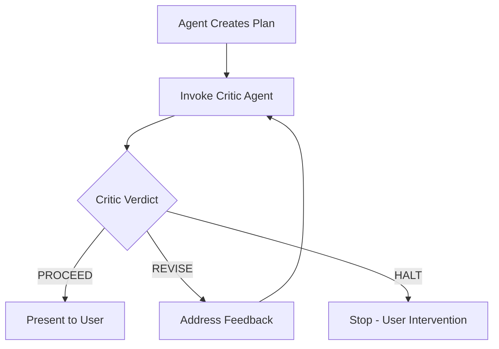

# Plan Quality Gate

## User Story

**As a** user asking an agent to make a plan,
**I expect** the plan to come back critiqued and refined,
**So that** I receive plans that have been stress-tested before I see them.

## Acceptance Criteria

1. When agent creates a plan, it MUST invoke critic agent before presenting
2. Critic feedback MUST be addressed (revisions made) before user sees plan
3. If critic returns HALT, agent must not proceed without user intervention
4. Plan presented to user should reflect post-critique refinements

## Workflow

## Enforcement Landscape

Multi-layered enforcement - no single mechanism, multiple reinforcement points.

### Current Enforcement Points

| Location | Mentions Critic? | Strength | Notes |
|----------|------------------|----------|-------|
| [[critic]] agent | Defines it | N/A | - |
| [[HEURISTICS]] H14 | Mandatory review | Medium | Heuristics aren't binding |
| [[specs/prompt-hydration]] | Task classification + guardrails | High | Covers framework + planning tasks |
| [[meta\|/meta]] command | MANDATORY section | High | Primary entry for framework work |
| [[hypervisor]] agent | Phase 0 + example | High | Multi-step orchestration |
| [[supervise\|/supervise]] command | Phase 0 mention | Medium | Workflow orchestration |

### Scope Clarification

**This spec applies to implementation plans** - concrete "how do I build X" plans that will be presented to the user for approval.

**This does NOT apply to**:
- [[effectual-planner]] - strategic/project planning agent for knowledge-building under uncertainty. That agent produces hypotheses and fragments, not implementation plans requiring approval.
- Simple single-step tasks that don't need formal planning

### Where Critic Is Already Strong

1. **Prompt hydration** catches planning tasks and injects critic reminder
2. **/meta** has mandatory critic section for framework work
3. **Hypervisor** includes critic in Phase 0 for multi-step work

### Where Enforcement Could Be Strengthened

1. **Claude Code's Plan agent** - the built-in implementation planner doesn't have framework-specific instructions. When agents enter Plan Mode via `EnterPlanMode()`, critic reminder comes from prompt hydration, not from Plan Mode itself.

2. **HEURISTICS H14** - worded as "should", could strengthen to MUST with clearer triggers:
   - Before ExitPlanMode
   - Before presenting conclusions from investigation

### No Hook Enforcement (Intentional)

A PreToolUse hook on ExitPlanMode would be heavy-handed and create friction for simple plans. The multi-point prompt enforcement approach is preferred.

## Verification

To verify enforcement is working:
1. Check session transcripts for plans presented without critic invocation
2. Track via `/log critic-skip: [observation]` when noticed
3. Periodic audit of planning sessions
