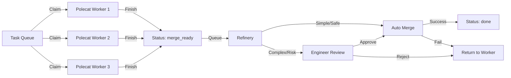

# Polecat Swarms & Engineer Review

## User Story

As a **framework user**, I want multiple agents to work on tasks in parallel in isolated worktrees, with an automated merge queue and engineer review for complex changes, so that development throughput scales while maintaining code quality.

**Goal**: Scale development throughput by enabling multiple concurrent "polecat" workers to execute tasks in parallel, while maintaining high code quality through an automated "Refinery" and an intelligent "Engineer" review gate.

## 1. Swarm Architecture

The Swarm builds upon the [Polecat System](./polecat-system.md) (ephemeral git worktrees) to allow multiple agents to work simultaneously on the same repository without file locking or branch conflicts.

### Components

*   **Task Queue**: The single source of truth (TaskDB). Holds tasks in `ready` state.
*   **Swarm Workers**: Independent agent instances, each operating in its own isolated polecat worktree (`~/.aops/polecat/<task-id>`).
*   **The Refinery**: A centralized process (or singleton agent) responsible for integrating completed work.
*   **Engineer Agent**: A specialized persona responsible for code review and quality assurance.

### Workflow

### Conflict Avoidance
*   **Atomic Claiming**: `TaskStorage` provides atomic `update_task` operations. Workers "claim" a task by setting status to `in_progress`.
*   **Isolation**: Each worker has a dedicated git worktree/branch.
*   **Rebasing**: Workers must rebase on `main` before `polecat finish` to ensure their branch is current, reducing merge conflicts in the Refinery.

## 2. Auto-merge System (The Refinery)

The Refinery is the "merge queue" processor. It serializes the integration of parallel work to maintain a green build.

### Criteria for Auto-merge
A task qualifies for immediate auto-merge *without* human/engineer intervention if:
1.  **Tests Pass**: CI checks (pre-commit, unit tests) pass on the branch.
2.  **No Conflicts**: Merge to `main` is clean.
3.  **Low Complexity**: The task is marked as `mechanical` or `chore` (e.g., formatting, dependency bumps).
4.  **Verified Author**: The change was produced by a trusted tool/workflow (e.g., automated refactor).

### Merge Strategy
1.  **Lock**: Pick oldest `merge_ready` task.
2.  **Verify**: Run project validation (lint/test) one last time on the merge commit candidate.
3.  **Merge**: Squash merge to `main`.
4.  **Push**: Push to origin.
5.  **Cleanup**: Delete branch and worktree.

## 3. Engineer Agent Review

The "Engineer" is a specialized agent invocation that acts as a quality gate. It is triggered by the Refinery when a task does not meet auto-merge criteria or requires judgment.

### Triggers
*   **Complexity**: Task complexity is `requires-judgment` or `multi-step`.
*   **Heuristics**: Changes touch critical paths (core logic, security).
*   **Random Sampling**: % of "mechanical" tasks are reviewed to prevent drift.
*   **Merge Conflict**: Refinery fails to auto-merge; Engineer attempts to resolve or kicks back.

### Review Workflow
1.  **Checkout**: Engineer spins up a viewing context (or reuses the polecat).
2.  **Analysis**:
    *   **Code Quality**: Linter checks, complexity analysis.
    *   **Test Coverage**: Did the worker add tests? Do they pass?
    *   **Architectural Fit**: Does the change align with `AXIOMS.md` and `HEURISTICS.md`?
3.  **Decision**:
    *   **Approve**: Signs off. Refinery proceeds to merge.
    *   **Request Changes**: Annotates task with specific feedback. Status -> `in_progress` (or assigned back to worker).
    *   **Reject**: Marks task as `cancelled` or `blocked` if fundamentally flawed.

## 4. Design Resolutions

### How do swarm workers claim tasks without conflicts?
Utilize the existing `TaskStorage` backend. Workers query for `status=active` and perform an atomic CAS (Compare-And-Swap) or locked update to `status=in_progress` + `assignee=<worker-id>`.

### Rollback Strategy
If a merged task causes regression (detected post-merge):
1.  **Detect**: Monitoring/User report -> New `bug` task created.
2.  **Revert**: Refinery/Engineer executes `git revert <commit-hash>`.
3.  **Reopen**: The original task is set back to `in_progress` (or `todo`) with the bug report appended to its body.

### Status Workflow Integration
Existing: `active` -> `in_progress` -> `merge_ready` -> `done`

**Revised with Swarm/Engineer**:
*   `active`: Ready for worker.
*   `in_progress`: Worker executing.
*   `merge_ready`: Worker finished. Waiting for Refinery.
*   `review`: (New/Refined) Refinery routed to Engineer for review.
*   `approved`: (New internal state) Engineer approved, waiting for merge.
*   `done`: Merged.
*   `blocked`: Kickback/Conflict requiring human intervention.

## 5. Future Work
*   **Speculative Merging**: Run tests on "virtual" merges of queued tasks to predict conflicts early.
*   **Reviewer Personas**: Different "Engineer" profiles (Security, Perf, Style).

## Acceptance Criteria

### Success Criteria
- Multiple workers can claim and work on different tasks simultaneously
- Atomic task claiming prevents double-assignment
- Auto-merge proceeds for mechanical/passing tasks
- Engineer review triggered for complex/risky changes
- Merge conflicts handled gracefully with kickback to worker

### Failure Modes
- Race condition in claiming → two workers on same task
- Auto-merge without tests → broken main branch
- Engineer review skipped → quality regression
- Merge conflict not detected → corrupted merge
- Rollback fails → stuck broken state
