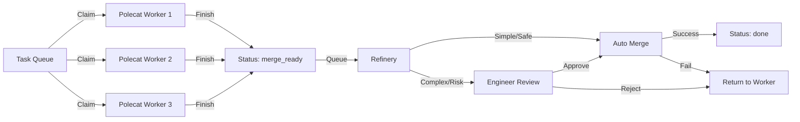

# Polecat Swarms & Engineer Review

## Giving Effect

- [[polecat/swarm.py]] - Swarm orchestration: parallel worker management
- [[polecat/engineer.py]] - Refinery and Engineer agent for merge queue processing
- [[polecat/manager.py]] - Worktree management (`claim_next_task` with atomic claiming)
- [[skills/swarm-supervisor/SKILL.md]] - Swarm supervisor skill (full lifecycle orchestration)
- [[WORKERS.md]] - Worker registry (types, capabilities, selection rules, thresholds)
- [[LIFECYCLE-HOOKS.md]] - Trigger hooks (queue-drain, stale-check, merge-ready, post-finish)
- [[specs/polecat-system.md]] - Foundation system this builds upon

**Goal**: Scale development throughput by enabling multiple concurrent "polecat" workers to execute tasks in parallel, while maintaining high code quality through an automated "Refinery" and an intelligent "Engineer" review gate.

## 1. Swarm Architecture

The Swarm builds upon the [Polecat System](./polecat-system.md) (ephemeral git worktrees) to allow multiple agents to work simultaneously on the same repository without file locking or branch conflicts.

### Components

- **Task Queue**: The single source of truth (TaskDB). Holds tasks in `ready` state.
- **Worker Registry**: [[WORKERS.md]] defines available worker types, capabilities, selection rules, and operational thresholds. Deployment-specific; modify without changing code or skill prompts.
- **Swarm Workers**: Independent agent instances, each operating in its own isolated polecat worktree (`~/.aops/polecat/<task-id>`). Worker types and dispatch rules are configured in the registry.
- **The Refinery**: A centralized process (or singleton agent) responsible for integrating completed work.
- **Engineer Agent**: A specialized persona responsible for code review and quality assurance.

### Workflow

### Conflict Avoidance

- **Atomic Claiming**: Workers use `claim_next_task()` API for atomic task claiming. This prevents duplicate work across concurrent workers.
- **Isolation**: Each worker has a dedicated git worktree/branch.
- **Rebasing**: Workers must rebase on `main` before `polecat finish` to ensure their branch is current, reducing merge conflicts in the Refinery.

## 2. Auto-merge System (The Refinery)

The Refinery is the "merge queue" processor. It serializes the integration of parallel work to maintain a green build.

### Criteria for Auto-merge

A task qualifies for immediate auto-merge _without_ human/engineer intervention if:

1. **Tests Pass**: CI checks (pre-commit, unit tests) pass on the branch.
2. **No Conflicts**: Merge to `main` is clean.
3. **Low Complexity**: Task complexity is `mechanical` or equivalent (see Complexity Routing in [[WORKERS.md]] for current values).
4. **Verified Author**: The change was produced by a trusted tool/workflow (e.g., automated refactor).

### Merge Strategy

1. **Lock**: Pick oldest `merge_ready` task.
2. **Verify**: Run project validation (lint/test) one last time on the merge commit candidate.
3. **Merge**: Squash merge to `main`.
4. **Push**: Push to origin.
5. **Cleanup**: Delete branch and worktree.

## 3. Engineer Agent Review

Pre-execution review uses a multi-agent protocol (see swarm-supervisor SKILL.md Phase 2 for full detail). The Refinery's Engineer agent remains as the post-execution quality gate.

### Pre-Execution Review (Multi-Agent)

Before worker dispatch, the supervisor invokes mandatory reviewers in parallel:

| Reviewer | Role | Model |
|----------|------|-------|
| Critic | Pedantic review: assumptions, logic errors, missing cases | opus |
| Custodiet | Authority check: is task within granted scope? | haiku |
| Domain specialist | Subject matter expertise (if task tags match) | varies |

Reviewers return verdicts (PROCEED/REVISE/HALT and OK/WARN/BLOCK). The supervisor
synthesizes these into a combined result and either proceeds to human approval,
revises the decomposition, or blocks. Unresolved disagreements between reviewers
trigger a debate protocol (max 2 rounds) before escalating to human.

### Post-Execution Review (Engineer / Refinery)

The Engineer acts as a quality gate when tasks don't meet auto-merge criteria.

**Triggers**:

- **Complexity**: Task complexity routes to Engineer review (see Complexity Routing in [[WORKERS.md]]).
- **Heuristics**: Changes touch critical paths (tags matching high-stakes tags in [[WORKERS.md]]).
- **Random Sampling**: % of `mechanical` tasks are reviewed to prevent drift.
- **Merge Conflict**: Refinery fails to auto-merge; Engineer attempts to resolve or kicks back.

**Review Workflow**:

1. **Checkout**: Engineer spins up a viewing context (or reuses the polecat).
2. **Analysis**:
   - **Code Quality**: Linter checks, complexity analysis.
   - **Test Coverage**: Did the worker add tests? Do they pass?
   - **Architectural Fit**: Does the change align with `AXIOMS.md` and `HEURISTICS.md`?
3. **Decision**:
   - **Approve**: Signs off. Refinery proceeds to merge.
   - **Request Changes**: Annotates task with specific feedback. Status -> `in_progress` (or assigned back to worker).
   - **Reject**: Marks task as `cancelled` or `blocked` if fundamentally flawed.

## 4. Design Resolutions

### How do swarm workers claim tasks without conflicts?

Workers use the `claim_next_task()` MCP API which atomically finds the highest-priority ready task and claims it (sets `status=in_progress`, `assignee=caller`). File locking prevents race conditions between concurrent workers.

### Rollback Strategy

If a merged task causes regression (detected post-merge):

1. **Detect**: Monitoring/User report -> New `bug` task created.
2. **Revert**: Refinery/Engineer executes `git revert <commit-hash>`.
3. **Reopen**: The original task is set back to `in_progress` (or `todo`) with the bug report appended to its body.

### Status Workflow Integration

Full lifecycle status flow (see swarm-supervisor SKILL.md for detailed phase descriptions):

- `active`: Ready for worker (leaf task with no unmet dependencies).
- `in_progress`: Worker executing.
- `review`: Multi-agent review in progress (Phase 2) or Engineer review.
- `waiting`: Awaiting human decision (approval gate, Phase 3).
- `merge_ready`: Worker finished, PR ready for merge (Phase 5).
- `done`: Merged and knowledge captured.
- `blocked`: Unresolved dependency, conflict, or reviewer HALT verdict.

## 5. Configuration Separation

This spec describes the **architecture and protocols** (hard). Deployment-specific
parameters are in **[[WORKERS.md]]** (soft):

| Concern | Spec (hard) | WORKERS.md (soft) |
|---------|------------|-------------------|
| Worker types | Architecture, lifecycle | Names, capabilities, cost/speed |
| Selection | Decision tree structure | Tag lists, complexity mappings, thresholds |
| Monitoring | Stall detection protocol | Heartbeat intervals, alert thresholds |
| Failure handling | Recovery protocol structure | Exit codes, retry limits, backoff |
| Review routing | Engineer trigger logic | Which complexity values trigger review |
| Domain review | Specialist invocation protocol | Specialist registry, domain mappings |

To customize for a different deployment, modify WORKERS.md only.

## 6. Lifecycle Automation

Shell hooks in `scripts/hooks/lifecycle/` provide non-interactive triggers for
the swarm lifecycle. These are **pure triggers** — they check preconditions and
start agent sessions or run mechanical commands. All dispatch decisions are made
by the supervisor agent.

See [[LIFECYCLE-HOOKS.md]] for hook registry, configuration, and cron schedules.

**Design principle**: Agents decide, code triggers.

| Concern | Shell hooks do | Supervisor agent does |
|---------|---------------|----------------------|
| Queue non-empty? | Yes | No |
| Which/how many runners? | No | Yes (reads WORKERS.md) |
| Task-to-worker routing? | No | Yes (reads tags + complexity) |
| Notifications? | Yes (mechanical) | No |
| Reset stale tasks? | Yes (threshold) | No |

## 7. Future Work

- **Speculative Merging**: Run tests on "virtual" merges of queued tasks to predict conflicts early.
