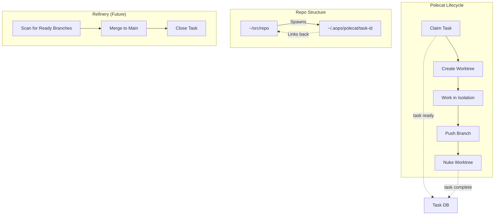

# Polecat System: Ephemeral Agent Workspaces

The Polecat System is a mechanism for highly concurrent, isolated agent work using **git worktrees**. It allows multiple agents to work on different tasks simultaneously without interfering with each other or the main repository.

This system is inspired by the "Gas Town" architecture but adapted for the `academicOps` environment using the existing `task` infrastructure.



## Core Concept: The "Kennel"

Instead of creating temporary clones inside the main repo (which confuses IDEs), we use a centralized directory:

*   **Location:** `~/.aops/polecat/`
*   **Structure:** `~/.aops/polecat/<task-id>/`
*   **Mechanism:** `git worktree` linked to bare mirror repositories.

### Bare Mirror Architecture

Worktrees are spawned from **bare mirror clones** stored in `~/.aops/polecat/.repos/`, not from your active development repos in `~/src/`. This provides:

- **Isolation**: Complete decoupling from your dev environment
- **Concurrency**: Bare repos handle unlimited concurrent worktrees
- **Clean state**: Each spawn starts from origin, not local uncommitted changes

```
~/.aops/polecat/
├── .repos/                    # Hidden bare mirror repos
│   ├── aops.git               # bare clone of academicOps
│   ├── buttermilk.git         # bare clone of buttermilk
│   └── writing.git            # bare clone of writing
├── crew/                      # Persistent crew worktrees
└── task-abc123/               # worktree spawned from .repos/aops.git
```

**Setup:** Run `polecat init` once to create bare mirrors for all registered projects. Use `polecat sync` to fetch latest from origin before spawning new polecats.

## Components

### 1. Polecat Manager (`manager.py`)

A Python library that handles the lifecycle:

*   **`claim_next_task(caller, project)`**:
    *   Finds the highest priority `active` task.
    *   Atomically locks it and updates status to `in_progress`.
    *   Assigns it to the caller (e.g., `nic`, `bot`).
*   **`setup_worktree(task)`**:
    *   Identifies the correct parent repo (e.g., `academicOps`, `buttermilk`).
    *   Creates a `git worktree` at `~/.aops/polecat/<task-id>`.
    *   Creates a feature branch `polecat/<task-id>` from `main`.
*   **`nuke_worktree(task_id)`**:
    *   Force-removes the worktree.
    *   Deletes the local branch.

### 2. CLI Tool (`polecat/cli.py`)

The unified interface for worktree management and merging:

```bash
# One-time setup: create bare mirrors for all projects
polecat init

# Refresh mirrors with latest from origin
polecat sync

# Start working on the next priority task
polecat start --caller nic --project aops

# Checkout a specific task by ID
polecat checkout <task-id>

# List active polecats
polecat list

# Mark work complete and ready for merge
polecat finish [--no-push] [--nuke]

# Clean up worktree (without marking ready)
polecat nuke <task-id>

# Run the Refinery: merge all merge_ready tasks to main
polecat merge

# Full automation: claim → run agent → finish
polecat run -p aops
```

#### The `finish` Command

The `finish` command is the critical transition that marks a task as **ready to merge**:

1. **Validates** uncommitted changes (warns if dirty)
2. **Pushes** the current branch to origin
3. **Updates** task status from `in_progress` → `merge_ready`
4. **Optionally** nukes the worktree with `--nuke`

This explicit command ensures workers intentionally signal completion rather than accidentally triggering merge through cleanup.

#### The `merge` Command

The `merge` command runs the Refinery to process all tasks in `merge_ready` status:

1. **Scans** for tasks with `status: merge_ready`
2. **Fetches** and squash-merges each polecat branch to main
3. **Runs tests** after merge
4. **Marks** task as `done` on success
5. **Cleans up** the branch and worktree

On failure, the task status is set to `review` for manual intervention.

#### The `run` Command

The `run` command automates the polecat setup cycle:

1. **Claims** the next ready task (or a specific task with `-t`)
2. **Creates** the worktree
3. **Runs** `claude -p "/pull <task-id>"` in the worktree
4. **Reports** exit status (agents should call `polecat finish` themselves when ready)

```bash
polecat run -p aops              # Run next ready task from aops
polecat run -t task-123          # Run specific task
```

Note: Agents are responsible for calling `polecat finish` at the end of their workflow to mark work as ready for merge. This ensures agents explicitly signal completion rather than having it triggered automatically.

## Workflow

1.  **Start:** `polecat start` claims a task (e.g., `osb-c36de7ec`).
2.  **Context Switch:** The user/agent `cd`s to `/home/nic/polecats/osb-c36de7ec`.
3.  **Work:** Code changes are made, tested, and committed in this isolated environment.
4.  **Finish:** `polecat finish` pushes the branch and marks the task as `merge_ready`.
5.  **Cleanup:** `polecat nuke` removes the worktree directory.
6.  **Merge:** The Refinery scans `merge_ready` tasks, merges them to `main`, and marks them `done`.

### Task Status Lifecycle

```
active → in_progress → merge_ready → done
         (claimed)     (finish)      (merged)
                    ↘ review (on failure)
```

- **active**: Task is ready to be claimed by a worker
- **in_progress**: Worker is actively working on the task
- **merge_ready**: Work is complete, branch pushed, ready for automated merge
- **review**: Merge failed, requires human intervention
- **done**: Merged to main, branch cleaned up

## Repository Mapping

Since worktrees depend on a parent repo, the system maps projects to paths:

| Project | Repository Path |
|---------|-----------------|
| `aops` | `~/src/academicOps` |
| `buttermilk` | `~/src/buttermilk` |
| `writing` | `~/writing` |

## Integration with Task System

This system builds *on top* of the existing Task MCP:
- It consumes tasks via `get_ready_tasks`.
- It updates tasks via `update_task` (status/assignee).
- It does NOT replace the task database; it just provides the **workspace** for executing them.

## Refinery System

The Refinery completes the lifecycle by merging completed work back into the main repository.

### Components

1.  **Engineer (`polecat/engineer.py`)**:
    *   **`scan_and_merge()`**: Finds tasks with status `merge_ready`.
    *   **`process_merge(task)`**:
        1. Locates the repo using `PolecatManager.get_repo_path`.
        2. Fetches `origin` to find the `polecat/<task-id>` branch.
        3. Checks out `main` and pulls latest.
        4. **Squash Merges** the feature branch (dry run to check conflicts).
        5. **Runs Tests** (default: `uv run pytest`).
        6. Commits and pushes to `main`.
        7. Deletes the feature branch (local & remote).
        8. Updates task status to `done`.
        9. **Nukes** the local worktree via `PolecatManager`.

2.  **CLI (unified with polecat)**:
    ```bash
    # Run a single pass of the merge queue
    polecat merge
    ```

### Kickback & Recovery Workflow

If a merge fails (due to conflicts or failing tests), the Refinery implements a "Kickback" logic:

1.  **Status Change**: The task status is set to `review`.
2.  **Annotation**: A `🏭 Refinery Report` is appended to the task body, containing the error log and timestamp.
3.  **Manual/LLM Intervention**: An interactive agent picks up `review` tasks, fixes the code, and sets status back to `merge_ready` to retry.
