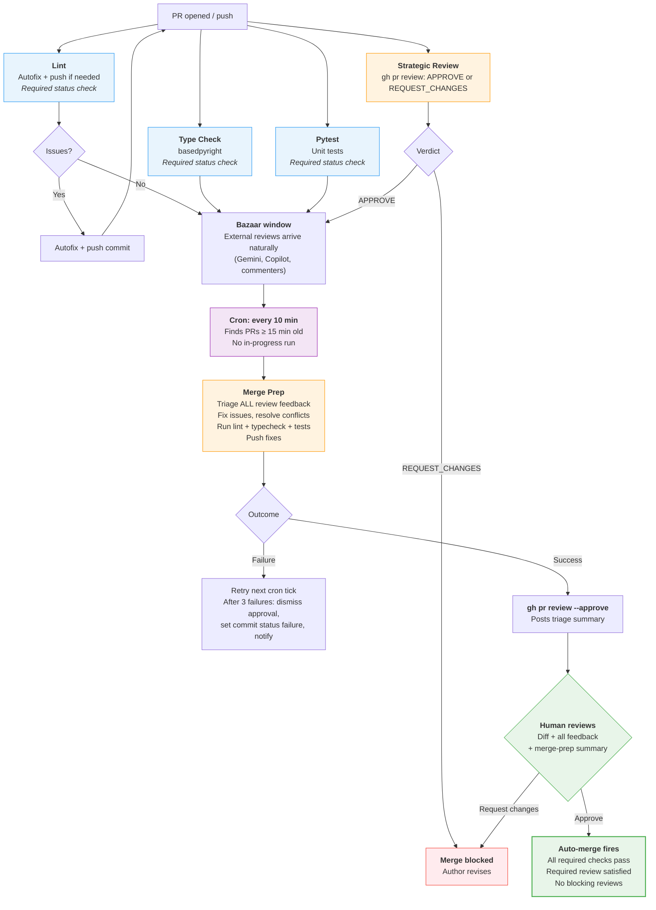

# PR Pipeline v2

## Giving Effect

- [[.github/workflows/code-quality.yml]] → split into [[.github/workflows/lint.yml]] + [[.github/workflows/typecheck.yml]]
- [[.github/workflows/agent-merge-prep.yml]] → rewrite: drop LGTM gate, cron-driven, post PR review instead of commit status, add `workflow_dispatch` trigger (already exists in current impl), add loop ceiling check, set `merge-prep-status` commit status on halt
- [[.github/workflows/merge-prep-cron.yml]] → simplify: 10-min cron, label-free qualification (commit status replaces comment-text scanning)
- [[.github/workflows/agent-conceptual-review.yml]] → rename to [[.github/workflows/agent-strategic-review.yml]], switch to `gh pr review`
- [[.github/rulesets/pr-review-and-merge.yml]] → add Pytest to required status checks
- [[.github/agents/merge-prep.agent.md]] → remove commit-status instructions, add PR review approval, add loop-ceiling logic
- [[.github/agents/conceptual-review.agent.md]] → update to use `gh pr review` instead of commit status

## Overview

**As** the repository maintainer,
**I want** a PR pipeline where bots handle all preparation automatically on a timer,
**So that** when I look at a PR, it is already reviewed, fixed, and ready — and I approve once to merge.

The previous pipeline ([[specs/pr-process.md]]) required a human LGTM to trigger merge-prep. This created a sequencing problem: merge-prep fixes failing checks, so it cannot wait for checks to pass before running. The new design inverts the dependency — merge-prep runs automatically on a cron, bots prepare everything, and the human approves or denies once at the end.

## Design Principles

1. **Bots prepare, human decides.** All mechanical work (lint fixes, review triage, conflict resolution) happens before the human looks at the PR. The human's job is approval or rejection, not preparation.
2. **Single decision point.** The human approves (or dismisses) once. Merge is immediate after approval if merge-prep has already succeeded.
3. **No labels for coordination.** Labels are unreliable state machines. In-progress detection uses `gh run list`; halt state uses the `merge-prep-status` commit status API. No load-bearing labels; no comment-text scanning.
4. **Graduation via PR review.** Merge-prep signals readiness by posting a GitHub PR review (APPROVE). This is the native GitHub mechanism for "this change is ready." No custom commit statuses, no environments, no secondary triggers.
5. **Cron replaces LGTM dispatch.** Merge-prep runs every 10 minutes on all qualifying PRs. No human trigger needed, no label gate, no event chain to break.
6. **Independence.** Every check runs independently on every push. Lint does not gate Type Check. Type Check does not gate Pytest. If Lint autofixes and pushes, the others re-run on the new commit without waiting.
7. **GitHub affordances only.** Required status checks, PR reviews, commit status API, and auto-merge handle state. No custom orchestration where GitHub provides a native mechanism. No comment parsing; no label-based state machines.

## Architecture: Four Phases



## Phase 1: On Every Push (Deterministic Checks)

All four jobs run concurrently and independently on every `pull_request` push. No job waits for another.

| Workflow         | File                         | Job name           | Required check?     | Action                                                        |
| ---------------- | ---------------------------- | ------------------ | ------------------- | ------------------------------------------------------------- |
| Lint             | `lint.yml`                   | `Lint`             | Yes                 | `ruff check --fix` + `ruff format`. Autofix + push if needed. |
| Type Check       | `typecheck.yml`              | `Type Check`       | Yes                 | `basedpyright`. Read-only.                                    |
| Pytest           | `pytest.yml`                 | `Pytest`           | Yes                 | `pytest -m "not requires_local_env"`. Read-only.              |
| Strategic Review | `agent-strategic-review.yml` | `Strategic Review` | Via required review | Advisory + judgment. Posts `gh pr review`.                    |

**Lint autofix loop:** When Lint pushes a fix commit, the new push re-triggers all four workflows on the new commit. Type Check and Pytest were never waiting for Lint — they re-run on the fixed commit naturally.

**Strategic Review uses `gh pr review`, not commit status.** PR reviews are GitHub's native mechanism for "does this change look right?" A `REQUEST_CHANGES` review blocks merge natively via branch protection, with no custom status machinery needed.

## Phase 2: Merge Prep (Cron-Driven)

Merge Prep runs on a 10-minute cron. It finds all qualifying PRs and processes each one.

### Qualification criteria (label-free)

A PR qualifies for merge-prep if ALL of the following are true:

1. **Age gate:** Last commit was >= 15 minutes ago. This preserves a bazaar window for external reviews (Gemini, Copilot) to arrive before merge-prep triages them.
2. **No in-progress run:** `gh run list --workflow=agent-merge-prep.yml --json status` shows no `in_progress` or `queued` run for this PR. Replaces the `merge-prep-running` label.
3. **Not permanently halted:** The latest commit does not have a `merge-prep-status` commit status (via `gh api repos/{owner}/{repo}/commits/{sha}/statuses`) with `state: failure`. Set by merge-prep after 3 consecutive failures. Replaces the `merge-prep-failed` label and comment-text scanning.

The cron dispatcher does not check whether checks are passing. Merge-prep runs regardless — it will fix what it can and post an honest outcome.

### What Merge Prep does

1. **Dismiss prior merge-prep approval** — `gh pr review --dismiss` any existing approval from `github-actions[bot]` on this PR (ensures approval always reflects the latest code state, not a prior run).
2. Checks for a self-loop (last commit has `Merge-Prep-By:` trailer — skip if so).
3. Checks the runaway loop ceiling (see below) — halt if exceeded.
4. Resolves merge conflicts if present (`git merge origin/main --no-edit`).
5. Reads ALL GitHub PR review feedback: Strategic Review agent, external bots (Gemini, Copilot), human reviewers. Triages each piece: fix, dismiss, or defer.
6. Runs `ruff check --fix && ruff format`, `basedpyright`, `pytest` locally.
7. Commits and pushes fixes with `Merge-Prep-By: agent` trailer.
8. Posts a triage summary comment.
9. Posts `gh pr review --approve` to signal completion.

**No comment parsing.** Merge-prep reads GitHub PR *reviews* (step 5) — a structured, native GitHub mechanism. It does not scan arbitrary comment text for instructions. Human direction comes through the review mechanism (REQUEST_CHANGES with notes), not freeform comments.

### Graduation mechanism: PR review

Merge-prep signals readiness by posting a **GitHub PR review (`--approve`)**. Rationale:

- Uses GitHub's native approval API — no custom commit statuses, no environment gates.
- The PR review appears in the same UI as human reviews.
- `dismiss_stale_reviews_on_push: false` means merge-prep's approval survives subsequent pushes by *other* actors (e.g., lint autofixes). Merge-prep itself dismisses its own prior approval at the start of each run, so its approval always reflects the latest code state.
- No secondary trigger needed — auto-merge fires when all required status checks pass AND the required 1 approving review is met.

**Why not GitHub Environments?** Environments are designed for deployment gates (staging -> production), not PR readiness. Using an Environment for "merge-prep is done" introduces a deployment concept into a code review workflow, creating confusion in the GitHub UI and requiring additional configuration. PR reviews are simpler and already in use.

**Why not commit statuses for graduation?** Commit statuses are for CI results ("did tests pass?"), not judgment calls ("is this PR ready?"). Using a commit status for merge-prep readiness would require adding it as a required status check, creating a naming dependency that `validate-ruleset.yml` must track. PR reviews need no such coordination.

### Failure handling (label-free)

| Failure count | Action                                                                                                                                                                                |
| ------------- | ------------------------------------------------------------------------------------------------------------------------------------------------------------------------------------- |
| 1st failure   | Workflow run shows as failed in Actions tab. Retry on next cron tick (10 min).                                                                                                        |
| 2nd failure   | Same.                                                                                                                                                                                 |
| 3rd failure   | (1) Dismiss any prior merge-prep approval. (2) Set `merge-prep-status: failure` commit status on latest commit via GitHub API. (3) Post notification comment for human visibility. Subsequent cron ticks skip this PR (detected via commit status API, not comment text). |
| Manual retry  | Human uses Actions → Agent: Merge Prep → Run workflow (with PR number). The workflow_dispatch trigger already exists. Merge-prep re-runs; if successful, sets `merge-prep-status: success` and posts a new approval. |

No `merge-prep-failed` label. No `merge-prep-running` label. No comment-text scanning. State is read from run history (in-progress check) and the commit status API (halt check).

### Runaway loop protection

**Self-loop detection** (existing): If the last commit on the branch has a `Merge-Prep-By:` trailer, merge-prep skips the run. Prevents processing on top of its own unreviewed output.

**Cascade ceiling** (new, replaces v1 cascade limit): Count commits in the branch since diverging from `origin/main` that contain a `Merge-Prep-By:` trailer:

```bash
git log origin/main..HEAD --grep="^Merge-Prep-By:" --oneline | wc -l
```

If this count reaches `MAX_MERGE_PREP_RUNS` (default: **10**), merge-prep treats the situation as a permanent failure: dismisses its approval, sets `merge-prep-status: failure`, and posts a notification. No further cron runs occur until manual retry.

This ceiling is:

- **Label-free and comment-parsing-free** — derived entirely from git history.
- **Mathematically bounded** — convergent cycles (e.g., lint + merge-prep alternating) cannot exceed MAX_MERGE_PREP_RUNS total merge-prep commits regardless of success/failure mix.
- **Transparent** — visible in `git log` with no external state to query.
- **Equivalent to the v1 cascade limit** from the PR 582 post-mortem, but more robust: the old limit counted pipeline runs via comment-tracked counters; this counts actual merge-prep commits in git history.

## Phase 3: Human Decision (Single Action)

By the time the human looks at the PR:

- Cheap checks (Lint, Type Check, Pytest) are green on the latest commit.
- Strategic Review has posted its assessment.
- External reviews (Gemini, Copilot) have arrived.
- Merge Prep has triaged all review feedback, pushed any fixes, and posted a summary.
- Merge Prep's `--approve` review is on record.

The human's decision:

- **Approve (GitHub review UI):** Auto-merge fires immediately. No second action needed.
- **Request changes:** Blocks merge. Author revises and pushes; the whole cycle repeats.
- **Close without merging:** Normal PR closure.

The human does NOT need to trigger anything. Merge-prep has already run. The human approves the work that has been done, not the work yet to be done.

If merge-prep was permanently halted (3 failures or loop ceiling), its approval is gone. The human can still approve the PR directly (taking responsibility for the unresolved issues), or wait for a manual retry to succeed.

## Phase 4: Auto-Merge

GitHub's native auto-merge fires when ALL branch protection requirements are met:

**Required status checks:**

- `Lint` — success
- `Type Check` — success
- `Pytest` — success

**Required reviews:**

- At least 1 approving review (satisfied by merge-prep's approval, or human's approval, or both)
- No outstanding `REQUEST_CHANGES` reviews (Strategic Review or human)

`dismiss_stale_reviews_on_push: false` means the human's approval survives subsequent bot pushes. After merge-prep fixes code and pushes, the required checks re-run on the new commit; once they pass, auto-merge fires without any further human action.

## Workflow Files: Changes Required

| File                          | Action              | Notes                                                                                                                                      |
| ----------------------------- | ------------------- | ------------------------------------------------------------------------------------------------------------------------------------------ |
| `code-quality.yml`            | **Split into two**  | Create `lint.yml` (Lint job) and `typecheck.yml` (Type Check job). Remove `needs: lint` dependency.                                        |
| `agent-conceptual-review.yml` | **Rename + update** | Rename to `agent-strategic-review.yml`. Switch from commit status to `gh pr review`.                                                       |
| `agent-merge-prep.yml`        | **Rewrite**         | Drop `lgtm-gate` job. Remove all label operations. Replace commit status with `gh pr review --approve`. Add: dismiss prior approval (step 1), loop ceiling check (step 3), set `merge-prep-status` commit status on halt. Add `workflow_dispatch` trigger with `pr_number` input (already present in current impl). |
| `merge-prep-cron.yml`         | **Simplify**        | Change cron to `*/10 * * * *`. Replace label checks with `gh run list` (in-progress) + commit status API (halt). Remove `gh workflow run` label manipulation. |
| `pytest.yml`                  | **No change**       | Already independent.                                                                                                                       |
| Ruleset                       | **Update**          | Add `Pytest` to required status checks.                                                                                                    |
| `merge-prep.agent.md`         | **Update**          | Remove commit status instructions. Add: `gh pr review --approve` graduation, dismiss-prior-approval step, loop ceiling logic.              |
| `conceptual-review.agent.md`  | **Update**          | Replace commit status with `gh pr review`.                                                                                                 |

### Workflows to delete after migration

| File               | Reason                                   |
| ------------------ | ---------------------------------------- |
| `code-quality.yml` | Replaced by `lint.yml` + `typecheck.yml` |

## GitHub Ruleset

```yaml
rules:
  - type: pull_request
    parameters:
      required_approving_review_count: 1
      dismiss_stale_reviews_on_push: false

  - type: required_status_checks
    parameters:
      strict_required_status_checks_policy: false
      required_status_checks:
        - context: Lint          # lint.yml
        - context: Type Check    # typecheck.yml
        - context: Pytest        # pytest.yml
```

## Acceptance Criteria

- [ ] A PR triggers Lint, Type Check, Pytest, and Strategic Review concurrently on every push
- [ ] Lint autofixes and pushes without blocking Type Check or Pytest
- [ ] Strategic Review posts a `gh pr review` (not a commit status)
- [ ] A Strategic Review `REQUEST_CHANGES` blocks merge via branch protection
- [ ] Merge Prep runs automatically within 25 minutes of a PR being opened (10-min cron + 15-min age gate)
- [ ] Merge Prep dismisses its prior approval before each run (approval always reflects latest code state)
- [ ] Merge Prep posts a triage summary and `gh pr review --approve` on success
- [ ] No `lgtm`, `merge-prep-running`, or `merge-prep-failed` labels in any workflow file
- [ ] No comment-text scanning in merge-prep-cron.yml (halt detection uses commit status API)
- [ ] In-progress detection uses `gh run list` — no duplicate merge-prep runs
- [ ] After 3 consecutive merge-prep failures: merge-prep approval dismissed, `merge-prep-status: failure` commit status set, notification comment posted, cron skips the PR
- [ ] Runaway loop ceiling: merge-prep halts (same as above) when `Merge-Prep-By:` commit count in branch ≥ 10
- [ ] Manual retry via workflow_dispatch resets halt state (merge-prep runs and sets `merge-prep-status: success` on success)
- [ ] Merge-prep does not parse arbitrary comment text for instructions (reads PR reviews only)
- [ ] After merge-prep approves and the human approves, auto-merge fires immediately
- [ ] `validate-ruleset.yml` passes with new job names
- [ ] `Merge-Prep-By: agent` self-loop detector still works

## Design Decisions

**Why cron instead of event-driven dispatch?**
Merge-prep fixes failing checks, so it cannot be gated on check completion. A `workflow_run` trigger (fire when checks pass) would prevent merge-prep from running on PRs with failing checks — exactly the PRs that need it most. Cron is simpler and avoids this chicken-and-egg problem entirely.

**Why 15-minute age gate with 10-minute cron?**
The age gate ensures external reviews (Gemini, Copilot) have time to arrive before merge-prep triages them. 15 minutes is a provisional estimate based on observed bot review latency; validate against actual Copilot/Gemini response times over the first few PRs and adjust if needed. Worst case: 25 minutes from push to merge-prep start.

**Why PR review for graduation, not GitHub Environments?**
Environments are designed for deployment gates, not PR readiness. PR reviews are GitHub's native "this is ready" signal and require no additional infrastructure.

**Why commit status for halt detection, not comment text?**
Comment text scanning is fragile: a human quoting the halt string in a comment would accidentally suppress merge-prep. It also lacks delete-reset semantics that are easy to reason about. The `merge-prep-status` commit status uses GitHub's native Commit Statuses API — queryable without text parsing, set and cleared programmatically, and visible in the PR UI alongside other checks. The cron can query `GET /repos/{owner}/{repo}/commits/{sha}/statuses` for a `merge-prep-status` context with state `failure` in one deterministic API call.

**Why a runaway loop ceiling based on git history?**
The v1 cascade limit (max 3 pipeline runs, tracked via comments) was added after a real bot-loop incident (PR 582 post-mortem). This spec removes that safeguard and replaces it with a stronger one: counting `Merge-Prep-By:` commits in git history. This is preferable because: (a) the count is derived from immutable git history rather than mutable comments; (b) it caps total merge-prep activity regardless of success/failure mix, not just consecutive failures; (c) it is label-free and comment-parsing-free. The ceiling of 10 is conservative — normal convergent cycles (lint fix → merge-prep, author fix → merge-prep) produce 2–4 merge-prep commits. If 10 merge-prep commits have accumulated without the PR stabilising, something structural is wrong and human review is warranted.

**Why dismiss merge-prep's prior approval before each run?**
`dismiss_stale_reviews_on_push: false` is set so that the *human's* approval is not wiped out by every bot push. Without this setting, a lint autofix push would dismiss the human's approval and require a second human action. However, this means merge-prep's approval from a prior run would also survive subsequent pushes. If merge-prep then runs again (because new commits arrived), its old approval might represent code that no longer exists. Dismissing the prior approval at the start of each run (step 1 in "What Merge Prep does") ensures merge-prep's approval is always freshly earned.

**Why remove LGTM entirely?**
The LGTM workflow was a dispatch mechanism because merge-prep was event-driven. With cron, there is no dispatch to coordinate — the cron finds qualifying PRs itself. The `lgtm` label, comment pattern, and LGTM workflow are all eliminated.

**Why split `code-quality.yml`?**
The current `needs: lint` dependency in Type Check is a false dependency. Running them in parallel is faster and respects the independence principle.

**Why `dismiss_stale_reviews_on_push: false`?**
Ensures the human's approval survives subsequent bot pushes (lint autofixes, merge-prep commits). See "Why dismiss merge-prep's prior approval" above for how this interacts with merge-prep's own approval management.

## Migration Plan

Each step leaves the pipeline functional. Never delete a workflow until its replacement is verified on 2-3 real PRs.

### Step 1: Split `code-quality.yml` (low risk)

1. Create `lint.yml` with the Lint job (autofix logic intact).
2. Create `typecheck.yml` with the Type Check job (no `needs:` dependency).
3. Run both in parallel with `code-quality.yml` for 2-3 PRs.
4. Update `validate-ruleset.yml` check list.
5. Delete `code-quality.yml`.

### Step 2: Convert Strategic Review to PR review (medium risk)

1. Rename `agent-conceptual-review.yml` to `agent-strategic-review.yml`.
2. Update agent instructions: replace `gh api .../statuses/` with `gh pr review`.
3. Verify on 2-3 PRs that APPROVE and REQUEST_CHANGES work correctly.

### Step 3: Rewrite merge-prep and cron (higher risk)

**Cron changes:**

- Schedule from `*/5` to `*/10`.
- Replace label checks with `gh run list` in-progress check and `merge-prep-status` commit status halt check.
- Keep age gate at 15 minutes.

**Merge-prep changes:**

- Drop `lgtm-gate` job entirely.
- Remove all label operations.
- Add step 1: dismiss prior merge-prep approval.
- Add step 3: check loop ceiling (`git log origin/main..HEAD --grep="^Merge-Prep-By:"`) — halt if ≥ 10.
- Replace commit status with `gh pr review --approve`.
- On 3rd failure or ceiling breach: dismiss approval + set `merge-prep-status: failure` commit status + post notification comment.

### Step 4: Update ruleset and clean up (low risk)

1. Add `Pytest` to required status checks.
2. Remove unused label definitions (`lgtm`, `merge-prep-running`, `merge-prep-failed`).
3. Update `specs/INDEX.md` to link to this spec and mark `specs/pr-process.md` as superseded.

## Open Questions

1. **Pytest reliability.** Before adding Pytest as a required check, verify it passes reliably on bot-authored PRs and PRs with non-Python changes. If flaky, keep it advisory until stabilised.

2. **Copilot review timing.** Copilot is configured with `review_on_push: false`. If changed to `true`, its reviews will arrive during Phase 1/2. No pipeline change needed, but worth confirming timing against the 15-minute age gate.

3. **Multiple concurrent PRs.** The cron dispatcher may dispatch 5+ merge-prep runs simultaneously. The per-PR concurrency group (`concurrency: group: merge-prep-{pr_number}`) prevents duplicate runs on the same PR. There is no global throttle; monitor for API rate limits over the first 10 PRs and add a global serialisation mechanism if needed.

4. **Human approval before merge-prep.** If the human approves before merge-prep runs, auto-merge waits for required checks. After merge-prep pushes fixes and checks re-run, auto-merge fires. No special handling needed.

5. **`validate-ruleset.yml` update.** After the split, the validation script needs to find `Lint` in `lint.yml`, `Type Check` in `typecheck.yml`, and `Pytest` in `pytest.yml`. Verify the script handles multi-file checks.

## Related Specifications

- [[specs/pr-process.md]] — superseded by this spec
- [[specs/polecat-supervision.md]] — polecat PR auto-merge criteria
- [[specs/non-interactive-agent-workflow-spec.md]] — Phase 5 (PR Review and Merge) references this pipeline
