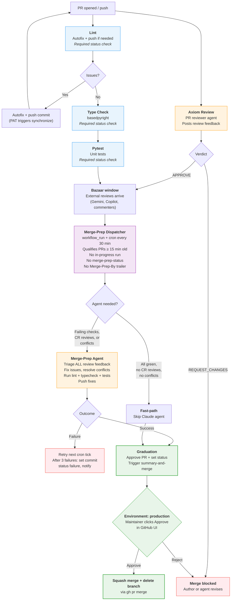

# PR Pipeline

## Giving Effect

- [[.github/workflows/pr-pipeline.yml]] → CI-only orchestrator: sequential lint → typecheck → pytest
- [[.github/workflows/lint.yml]] → uses `AOPS_BOT_GH_TOKEN` for checkout so autofix pushes trigger workflow restart
- [[.github/workflows/typecheck.yml]] → basedpyright type checking
- [[.github/workflows/pytest.yml]] → unit tests
- [[.github/workflows/pr-review.yml]] → standalone Axiom Review (Claude PR reviewer, no settle delay)
- [[.github/workflows/agent-merge-prep.yml]] → cron-driven merge prep agent
- [[.github/workflows/merge-prep-cron.yml]] → `workflow_run` trigger watches "Axiom Review" completion + cron fallback
- [[.github/workflows/agent-enforcer.yml]] → reusable enforcer for other repos (not wired into this repo's pipeline)
- GitHub Ruleset: required checks = `PR Review Pipeline / lint / Lint`, `PR Review Pipeline / typecheck / Type Check`, `PR Review Pipeline / pytest / Pytest`, `Axiom Review / Axiom Review`

## Overview

**As** the repository maintainer,
**I want** a PR pipeline where bots handle all preparation automatically on a timer,
**So that** when I look at a PR, it is already reviewed, fixed, and ready — and I approve once to merge.

The previous pipeline ([[specs/pr-process.md]]) required a human LGTM to trigger merge-prep. This created a sequencing problem: merge-prep fixes failing checks, so it cannot wait for checks to pass before running. The new design inverts the dependency — merge-prep runs automatically on a cron, bots prepare everything, and the human approves or denies once at the end.

## Design Principles

1. **Bots prepare, human decides.** All mechanical work (lint fixes, review triage, conflict resolution) happens before the human looks at the PR. The human's job is approval or rejection, not preparation.
2. **Single decision point.** The human approves (or denies) once via a GitHub Environment gate. Merge is immediate after approval.
3. **No labels for coordination.** Labels are unreliable state machines. In-progress detection uses `gh run list`; halt state uses the `merge-prep-status` commit status API. No load-bearing labels; no comment-text scanning.
4. **Environment gate for graduation.** Merge-prep signals readiness by triggering a `summary-and-merge.yml` workflow. Job 1 posts a decision brief (summary of all changes, reviews, and fixes). Job 2 requires the `production` environment — the maintainer clicks "Approve" in the GitHub UI to merge. One click, no PR comment archaeology needed.
5. **Event-driven + cron fallback.** Merge-prep dispatch fires immediately when Phase 1 checks complete (`workflow_run` trigger), plus a 30-minute cron as safety net. The existing qualification logic (age gate, in-progress check, commit status) handles premature firings gracefully. No human trigger needed, no label gate.
6. **Sequential CI, independent review.** CI checks run sequentially (lint → typecheck → pytest) so that if lint pushes an autofix commit, typecheck and pytest haven't started yet — no wasted compute on the cancelled run. Axiom Review runs as a separate workflow, independent of the CI pipeline. Lint uses a PAT (`AOPS_BOT_GH_TOKEN`) for checkout so autofix pushes trigger a new `synchronize` event, restarting the pipeline on the clean commit with correct check run names on the actual HEAD.
7. **GitHub affordances only.** Required status checks, PR reviews, commit status API, environments, and auto-merge handle state. No custom orchestration where GitHub provides a native mechanism. No comment parsing; no label-based state machines.

## Architecture: Four Phases



## Phase 1: On Every Push (CI + Axiom Review)

Two workflows run independently on every `pull_request` push:

### CI Pipeline (`pr-pipeline.yml`) — sequential

Three CI jobs run sequentially: lint → typecheck → pytest.

| Workflow   | File            | Job name     | Required check?                 | Action                                                        |
| ---------- | --------------- | ------------ | ------------------------------- | ------------------------------------------------------------- |
| Lint       | `lint.yml`      | `Lint`       | Yes (`Lint / Lint`)             | `ruff check --fix` + `ruff format`. Autofix + push if needed. |
| Type Check | `typecheck.yml` | `Type Check` | Yes (`Type Check / Type Check`) | `basedpyright`. Read-only.                                    |
| Pytest     | `pytest.yml`    | `Pytest`     | Yes (`Pytest / Pytest`)         | `pytest -m "not slow"`. Read-only.                            |

**Why sequential?** When lint pushes an autofix commit, typecheck and pytest haven't started yet — no wasted compute on the cancelled run. The `cancel-in-progress` concurrency group cancels the old run and a new pipeline starts on the clean commit.

**Lint autofix with PAT:** Lint checks out using `AOPS_BOT_GH_TOKEN` (a PAT). When it pushes an autofix commit, the PAT push triggers a new `synchronize` event, restarting the pipeline on the new commit. This ensures check runs appear on the actual HEAD — pushes with `GITHUB_TOKEN` are deliberately ignored by GitHub Actions and would leave the new commit with zero check runs.

**Loop safety:** Lint is idempotent — the second run finds nothing to fix, no push, pipeline completes normally.

### Axiom Review (`pr-review.yml`) — independent

The Axiom Review workflow runs independently of the CI pipeline, triggered by the same `pull_request` events.

**PR event handling:** On `pull_request` events, the workflow extracts the PR number and ref directly from the event context, producing a single-item matrix that reviews only the triggering PR. On `workflow_dispatch` without a PR number, it discovers all open PRs for batch review. On `workflow_call` or `workflow_dispatch` with a PR number, it reviews only the specified PR.

**Missing prompt file:** If the PR branch lacks `.github/agents/pr-reviewer.agent.md` (e.g. old branches), the review step is skipped gracefully instead of failing.

**Axiom Review:** The PR reviewer agent (`pr-reviewer.agent.md`) checks compliance against axioms, heuristics, and project rules. Posts review feedback via `claude-code-action`. Read-only — never pushes code.

Check run name: `Axiom Review / Axiom Review` (required status check in ruleset).

**No Agent Fix in the pipeline.** CI failures are handled by the Merge-Prep Agent (Phase 2), which already triages all review feedback and fixes issues. This simplifies the pipeline and avoids duplicate fix attempts.

## Phase 2: Merge Prep (Cron-Driven)

Phase 2 has two components:

- **Merge-Prep Dispatcher** (`merge-prep-cron.yml`) — finds qualifying PRs and dispatches the agent. Runs on `workflow_run` (when PR Review Pipeline completes) + 30-minute cron as safety net.
- **Merge-Prep Agent** (`agent-merge-prep.yml` + `merge-prep.agent.md`) — the Claude agent that does the actual work: triaging reviews, fixing CI failures, resolving conflicts, and gating graduation.

### Dispatcher qualification criteria (label-free)

A PR qualifies for dispatch if ALL of the following are true:

1. **Age gate:** Last commit was >= 15 minutes ago. This preserves a bazaar window for external reviews (Gemini, Copilot) to arrive before the Merge-Prep Agent triages them.
2. **No in-progress run:** `gh run list --workflow=agent-merge-prep.yml --json status` shows no `in_progress` or `queued` run. Replaces the `merge-prep-running` label.
3. **Not already completed or permanently halted:** The latest commit does not have a `merge-prep-status` commit status with `state: success` or `state: failure`. The Merge-Prep Agent sets `success` at the end of every successful run; it sets `failure` after 3 consecutive failures. A new commit from any actor clears this automatically — the new SHA has no status yet, so the agent will re-run. **Exception — late reviews:** If `merge-prep-status` is `success` but `CHANGES_REQUESTED` reviews arrived _after_ the status was set, the PR re-qualifies. This handles the race where merge-prep's own commits trigger the Axiom Review, which finishes after merge-prep has already declared success.
4. **Not a merge-prep commit:** The HEAD commit message does not contain a `Merge-Prep-By:` trailer. This is a race-condition guard: the `workflow_run` trigger can fire before the agent workflow sets `merge-prep-status: success` on a freshly pushed commit. The trailer check prevents wasteful re-dispatch.

The dispatcher does not check whether checks are passing. The Merge-Prep Agent runs regardless — it will fix what it can and post an honest outcome.

### What the Merge-Prep Agent does

The agent workflow (`agent-merge-prep.yml`) performs pre-checks, then either invokes the Claude agent or takes the fast-path:

**Pre-checks (always run):**

1. **Dismiss prior merge-prep approval** — `gh pr review --dismiss` any existing approval from `github-actions[bot]` on this PR (ensures approval always reflects the latest code state, not a prior run).
2. **Self-loop detection** — if the last commit has a `Merge-Prep-By:` trailer, skip (prior run's work is still valid; set `merge-prep-status: success` and exit).
3. **Runaway loop ceiling** (see below) — halt if exceeded.

**Fast-path (no Claude call):** If all CI checks pass, no `CHANGES_REQUESTED` reviews remain, and the PR has no merge conflicts, the Claude agent is skipped entirely. The workflow proceeds directly to the graduation steps (approve, set status, trigger summary-and-merge). This preserves the architectural invariant — the Merge-Prep Agent always gates graduation — while avoiding expensive Claude API calls when nothing needs fixing.

**Full agent path (Claude call):** When there is work to do (failing checks, unresolved reviews, or conflicts):

4. Resolves merge conflicts if present (`git merge origin/main --no-edit`).
5. Reads ALL GitHub PR review feedback: Axiom Review, external bots (Gemini, Copilot), human reviewers. Triages each piece: fix, dismiss, or defer.
6. Runs `ruff check --fix && ruff format`, `basedpyright`, `pytest` locally.
7. Commits and pushes fixes with `Merge-Prep-By: agent` trailer (if any fixes are needed).
8. Posts a triage summary comment.

**Graduation (both paths):**

9. Posts `gh pr review --approve` (satisfies `required_approving_review_count: 1` in branch protection, and ensures approval always reflects this run's output).
10. Sets `merge-prep-status: success` commit status on the latest commit.
11. Triggers `summary-and-merge.yml` via `repository_dispatch`.

**No comment parsing.** The Merge-Prep Agent reads GitHub PR _reviews_ (step 5) — a structured, native GitHub mechanism. It does not scan arbitrary comment text for instructions. Human direction comes through the review mechanism (REQUEST_CHANGES with notes), not freeform comments. Failure counting uses `gh run list` (run history), not comment text.

### Graduation mechanism: Environment gate

Merge-prep signals readiness by triggering **`summary-and-merge.yml`**, which:

- **Job 1 (summary):** Posts a decision brief comment on the PR — a concise summary of what changed, what reviews said, what merge-prep fixed, and what's left. The human reads this one comment, not 30 scattered review threads.
- **Job 2 (merge):** Requires the `production` environment. The maintainer sees the summary, clicks "Approve" in the GitHub Environments UI, and the PR merges automatically.

Merge-prep still posts `gh pr review --approve` (step 9 above) to satisfy the `required_approving_review_count: 1` branch protection rule. The environment gate supplements this: rather than the human providing a second approval in the PR review UI (same interface, same comment thread), the human decides via the Actions environment gate — a clean, separate UI that presents only the decision brief and an Approve/Reject button.

**Why GitHub Environments?** The maintainer's stated requirement is "I want a summary and a decision, not a bunch of PR comments." Environments provide exactly this: a clean gate with a single approval button, separate from the PR review thread. The decision brief gives context; the environment gate gives the action.

### Global concurrency

All merge-prep runs share a global concurrency group `merge-prep-global` to prevent API rate limit issues when multiple PRs qualify simultaneously. PRs are processed sequentially within each cron tick. The per-PR concurrency group (`merge-prep-{pr_number}`) also remains to prevent duplicate runs on the same PR across cron ticks.

### Failure handling (label-free)

Failure counting uses `gh run list --workflow=agent-merge-prep.yml` filtered by PR branch — no comment-text parsing.

| Failure count | Action                                                                                                                                                                                                                                                                                                  |
| ------------- | ------------------------------------------------------------------------------------------------------------------------------------------------------------------------------------------------------------------------------------------------------------------------------------------------------- |
| 1st failure   | Workflow run shows as failed in Actions tab. Retry on next cron tick (≤30 min) or next Phase 1 completion.                                                                                                                                                                                              |
| 2nd failure   | Same.                                                                                                                                                                                                                                                                                                   |
| 3rd failure   | (1) Dismiss any prior merge-prep approval. (2) Set `merge-prep-status: failure` commit status on latest commit via GitHub API. (3) Post notification comment for human visibility. Subsequent cron ticks skip this PR (detected via commit status API, not comment text).                               |
| Manual retry  | Human uses Actions → Agent: Merge Prep → Run workflow (with PR number). The workflow_dispatch trigger already exists. The Merge-Prep Agent re-runs; if successful, posts `gh pr review --approve`, sets `merge-prep-status: success`, and triggers summary-and-merge (same as a normal successful run). |

No `merge-prep-failed` label. No `merge-prep-running` label. No comment-text scanning. State is read from run history (in-progress check via `gh run list`) and the commit status API (halt check).

### Runaway loop protection

**Self-loop detection** (existing): If the last commit on the branch has a `Merge-Prep-By:` trailer, merge-prep skips the run. Prevents processing on top of its own unreviewed output.

**Cascade ceiling** (new, replaces v1 cascade limit): Count commits in the branch since diverging from `origin/main` that contain a `Merge-Prep-By:` trailer:

```bash
git log origin/main..HEAD --grep="^Merge-Prep-By:" --oneline | wc -l
```

If this count reaches `MAX_MERGE_PREP_RUNS` (default: **5**, provisional), merge-prep treats the situation as a permanent failure: dismisses its approval, sets `merge-prep-status: failure`, and posts a notification. No further cron runs occur until manual retry.

This ceiling is:

- **Label-free and comment-parsing-free** — derived entirely from git history.
- **Mathematically bounded** — convergent cycles (e.g., lint + merge-prep alternating) cannot exceed MAX_MERGE_PREP_RUNS total merge-prep commits regardless of success/failure mix.
- **Transparent** — visible in `git log` with no external state to query.
- **Equivalent to the v1 cascade limit** from the PR 582 post-mortem, but more robust: the old limit counted pipeline runs via comment-tracked counters; this counts actual merge-prep commits in git history.
- **Provisional** — 5 is conservative. Normal convergent cycles produce 2–3 merge-prep commits. If 5 have accumulated without the PR stabilising, something structural is wrong. Calibrate based on real-world data over the first 20 PRs.

## Phase 3: Environment Gate (Human Decision)

By the time the human sees the environment approval prompt:

- Cheap checks (Lint, Type Check, Pytest) are green on the latest commit.
- Agent Review has posted its assessment.
- External reviews (Gemini, Copilot) have arrived.
- Merge Prep has triaged all review feedback, pushed any fixes, and posted a decision brief.

The **`summary-and-merge.yml`** workflow has two jobs:

### Job 1: Decision Brief

Runs immediately. Collects and posts a structured summary comment:

- What changed (files, scope)
- Review verdicts (Agent Review, Gemini, Copilot, human comments)
- What merge-prep fixed vs. deferred
- Outstanding concerns (if any)
- Final recommendation: MERGE or HOLD

### Job 2: Merge (environment-gated)

```yaml
merge:
  needs: summary
  runs-on: ubuntu-latest
  environment: production
  steps:
    - name: Merge PR
      run: gh pr merge ${{ needs.summary.outputs.pr_number }} --squash --delete-branch
      env:
        GH_TOKEN: ${{ github.token }}
```

The `production` environment requires approval from one or more designated maintainers. The maintainer:

- Reads the decision brief (Job 1 output)
- Clicks **Approve** in the GitHub Actions environment approval UI
- PR merges automatically (squash + delete branch)

Or clicks **Reject** to block the merge. The PR stays open; author revises.

The human does NOT wade through individual PR review comments. The decision brief synthesises everything into one summary.

## Phase 4: Merge

Merge happens as part of Job 2 in `summary-and-merge.yml`. After environment approval:

1. `gh pr merge --squash --delete-branch`
2. Branch is deleted
3. Done

No separate auto-merge configuration needed — the merge is executed by the workflow job itself, not by GitHub's auto-merge feature.

## Workflow Files

| File                   | Purpose                                                                                       |
| ---------------------- | --------------------------------------------------------------------------------------------- |
| `pr-pipeline.yml`      | CI orchestrator: sequential lint → typecheck → pytest. Triggers on `pull_request`.            |
| `lint.yml`             | Ruff lint + format with autofix. Uses `AOPS_BOT_GH_TOKEN` so pushes trigger workflow restart. |
| `typecheck.yml`        | basedpyright. Read-only gate.                                                                 |
| `pytest.yml`           | Unit tests. Read-only gate.                                                                   |
| `pr-review.yml`        | Standalone Axiom Review. Triggers on `pull_request` + dispatch/call.                          |
| `merge-prep-cron.yml`  | Dispatcher: `workflow_run` (Axiom Review) + cron. Label-free qualification.                   |
| `agent-merge-prep.yml` | Merge-prep agent: triage reviews, fix issues, approve, set status.                            |
| `agent-enforcer.yml`   | Reusable enforcer for other repos (dispatch/call only, not wired into this repo).             |

## GitHub Ruleset

```yaml
rules:
  - type: pull_request
    parameters:
      required_approving_review_count: 1
      dismiss_stale_reviews_on_push: false

  - type: required_status_checks
    parameters:
      strict_required_status_checks_policy: false
      required_status_checks:
        - context: "PR Review Pipeline / lint / Lint"          # pr-pipeline.yml → lint.yml
        - context: "PR Review Pipeline / typecheck / Type Check"  # pr-pipeline.yml → typecheck.yml
        - context: "PR Review Pipeline / pytest / Pytest"      # pr-pipeline.yml → pytest.yml
        - context: "Axiom Review / Axiom Review"               # pr-review.yml (independent)
```

**Note on check run names:** The compound format (`Caller / Callee`) is produced by `workflow_call`. The caller job name and callee job name must both match to produce the expected check run name. Changing either job name will break the required status check. The `PR Review Pipeline` prefix comes from the `pr-pipeline.yml` workflow name.

**Note:** The `required_approving_review_count: 1` is still needed for PRs where merge-prep doesn't run (e.g., trivial changes merged directly).

## GitHub Environment: `production`

```yaml
# Settings → Environments → production
environment:
  name: production
  protection_rules:
    required_reviewers:
      - maintainer-team  # or specific usernames
    wait_timer: 0  # no delay after approval
  deployment_branch_policy:
    protected_branches: false
    custom_branch_policies: true
    # Allow all branches (PRs come from feature branches)
```

## Acceptance Criteria

- [ ] A PR triggers Lint, Type Check, Pytest, and Agent Review concurrently on every push
- [ ] Lint autofixes and pushes without blocking Type Check or Pytest
- [ ] Agent Review posts a `gh pr review` (not a commit status)
- [ ] An Agent Review `REQUEST_CHANGES` blocks merge via branch protection
- [ ] Merge Prep runs automatically within ~20 minutes of a PR being opened (Phase 1 completion triggers dispatcher; 15-min age gate; 30-min cron fallback)
- [ ] Merge Prep dismisses its prior approval before each run (approval always reflects latest code state)
- [ ] Merge Prep triggers `summary-and-merge.yml` on success
- [ ] `summary-and-merge.yml` Job 1 posts a decision brief comment
- [ ] `summary-and-merge.yml` Job 2 requires `production` environment approval
- [ ] After environment approval, PR is squash-merged and branch deleted
- [ ] No `lgtm`, `merge-prep-running`, or `merge-prep-failed` labels in any workflow file
- [ ] No comment-text scanning in merge-prep-cron.yml (halt detection uses commit status API)
- [ ] In-progress detection uses `gh run list` — no duplicate merge-prep runs
- [ ] On every successful merge-prep run: `gh pr review --approve` posted, `merge-prep-status: success` commit status set on latest commit, `summary-and-merge.yml` triggered
- [ ] Cron qualification skips PRs where latest commit has `merge-prep-status: success` (already processed) or `failure` (halted), unless `CHANGES_REQUESTED` reviews arrived after the `success` status was set (late-review re-qualification)
- [ ] After 3 consecutive merge-prep failures: merge-prep approval dismissed, `merge-prep-status: failure` commit status set, notification comment posted, cron skips the PR
- [ ] Runaway loop ceiling: merge-prep halts (same as above) when `Merge-Prep-By:` commit count in branch ≥ 5
- [ ] Manual retry via workflow_dispatch resets halt state (re-runs full success sequence if successful)
- [ ] Merge-prep does not parse arbitrary comment text for instructions (reads PR reviews only)
- [ ] Global concurrency group prevents simultaneous merge-prep runs across PRs
- [ ] `validate-ruleset.yml` passes with new job names
- [ ] `Merge-Prep-By: agent` self-loop detector still works

## Design Decisions

**Why event-driven dispatch + cron fallback?**
The original design used cron-only dispatch (every 10 minutes), but GitHub Actions cron is unreliable — observed gaps of 30–80+ minutes between ticks, and sometimes cron stops firing entirely for hours. Adding `workflow_run` triggers on Phase 1 check completions provides reliable, event-driven dispatch: when checks finish, the dispatcher fires immediately. The existing qualification logic (15-min age gate, in-progress check, commit status halt check) means premature firings are gracefully skipped — no new guard logic needed. The 30-minute cron remains as a safety net for edge cases where `workflow_run` events are missed. Note: merge-prep is triggered on check _completion_ (regardless of pass/fail), not check _success_ — so it still runs on PRs with failing checks.

**Why 15-minute age gate?**
The age gate ensures external reviews (Gemini, Copilot) have time to arrive before merge-prep triages them. 15 minutes is a provisional estimate based on observed bot review latency (Gemini ~2 min, Copilot ~6 min on PR #878); validate against actual response times and adjust if needed. With the `workflow_run` trigger, the dispatcher fires when each Phase 1 check completes — the age gate causes early firings to skip gracefully, and later firings (after the bazaar window) proceed to dispatch.

**Why GitHub Environments for graduation?**
The maintainer's requirement: "I want a summary and a decision, not a bunch of PR comments." Environments provide a clean gate with a single "Approve" button in the GitHub Actions UI, completely separate from PR review threads. The decision brief (Job 1) gives context; the environment gate (Job 2) gives the action. This is the cleanest GitHub-native mechanism for "bot is done, human decides."

**Why not PR reviews for graduation?**
PR reviews work but force the human to interact with the PR review UI — the same place where 5 bot reviewers have left 30 comments. The environment gate is a cleaner separation: bots work in PR comments/reviews, human decides in the Actions tab with a synthesised summary.

**Why `agent-review.yml` (not `agent-strategic-review.yml`)?**
The original name `agent-conceptual-review.yml` was already being renamed. `agent-strategic-review.yml` risks collision with other agent workflows and is unnecessarily specific. `agent-review.yml` is simple, descriptive, and leaves room for the review scope to evolve.

**Why commit status for halt detection, not comment text?**
Comment text scanning is fragile: a human quoting the halt string in a comment would accidentally suppress merge-prep. It also lacks delete-reset semantics that are easy to reason about. The `merge-prep-status` commit status uses GitHub's native Commit Statuses API — queryable without text parsing, set and cleared programmatically, and visible in the PR UI alongside other checks. The cron can query `GET /repos/{owner}/{repo}/commits/{sha}/statuses` for a `merge-prep-status` context with state `failure` in one deterministic API call.

**Why a runaway loop ceiling based on git history?**
The v1 cascade limit (max 3 pipeline runs, tracked via comments) was added after a real bot-loop incident (PR 582 post-mortem). This spec removes that safeguard and replaces it with a stronger one: counting `Merge-Prep-By:` commits in git history. This is preferable because: (a) the count is derived from immutable git history rather than mutable comments; (b) it caps total merge-prep activity regardless of success/failure mix, not just consecutive failures; (c) it is label-free and comment-parsing-free. The ceiling of 5 is provisional — calibrate based on real-world data.

**Why dismiss merge-prep's prior approval before each run?**
`dismiss_stale_reviews_on_push: false` is set so that the _human's_ approval is not wiped out by every bot push. Without this setting, a lint autofix push would dismiss the human's approval and require a second human action. However, this means merge-prep's approval from a prior run would also survive subsequent pushes. If merge-prep then runs again (because new commits arrived), its old approval might represent code that no longer exists. Dismissing the prior approval at the start of each run ensures merge-prep's approval is always freshly earned.

**Why set `merge-prep-status: success` on every successful run, not just manual retry?**
Without a `success` status, the cron qualification criteria only check for `failure` (permanent halt) and in-progress runs. If merge-prep succeeds without pushing any commits (all checks pass, no review feedback to address), there is no `Merge-Prep-By:` trailer on the latest commit (the self-loop check relies on this), so the next cron tick dispatches merge-prep again. This repeats every 10 minutes until the human approves — posting duplicate triage summaries and triggering duplicate `summary-and-merge` runs. Setting `merge-prep-status: success` after every successful completion closes this gap: the cron skips the PR until a new commit arrives (which creates a new SHA without any status, resetting the check naturally). This uses zero new infrastructure — the same commit status API already specified for the failure path.

**Why remove LGTM entirely?**
The LGTM workflow was a dispatch mechanism because merge-prep was event-driven. With cron, there is no dispatch to coordinate — the cron finds qualifying PRs itself. The `lgtm` label, comment pattern, and LGTM workflow are all eliminated.

**Why split `code-quality.yml`?**
The current `needs: lint` dependency in Type Check is a false dependency. Running them in parallel is faster and respects the independence principle.

**Why `dismiss_stale_reviews_on_push: false`?**
Ensures the human's approval survives subsequent bot pushes (lint autofixes, merge-prep commits). See "Why dismiss merge-prep's prior approval" above for how this interacts with merge-prep's own approval management.

**Why global concurrency for merge-prep?**
Without a global limit, 5+ merge-prep runs could fire simultaneously when the cron ticks, all calling GitHub APIs and Claude. A `merge-prep-global` concurrency group serialises runs across PRs, preventing API rate limits and reducing cost. Each PR still gets processed — just sequentially within a cron tick rather than in parallel.

## Migration Plan

Each step leaves the pipeline functional. Never delete a workflow until its replacement is verified on 2-3 real PRs.

### Step 1: Create `production` environment and `summary-and-merge.yml` (low risk)

1. Create `production` environment in GitHub Settings → Environments.
2. Add required reviewers (maintainer(s)).
3. Create `summary-and-merge.yml` with two jobs: decision brief + environment-gated merge.
4. Test manually on a disposable PR.

### Step 2: Split `code-quality.yml` (low risk)

1. Create `lint.yml` with the Lint job (autofix logic intact).
2. Create `typecheck.yml` with the Type Check job (no `needs:` dependency).
3. Run both in parallel with `code-quality.yml` for 2-3 PRs.
4. Update `validate-ruleset.yml` check list.
5. Delete `code-quality.yml`.

### Step 3: Convert Agent Review to PR review (medium risk)

1. Rename `agent-conceptual-review.yml` to `agent-review.yml`.
2. Update agent instructions: replace `gh api .../statuses/` with `gh pr review`.
3. Verify on 2-3 PRs that APPROVE and REQUEST_CHANGES work correctly.

### Step 4: Rewrite merge-prep and cron (higher risk)

**Cron changes:**

- Schedule from `*/10` to `*/30`. Add `workflow_run` trigger on Phase 1 completions. Add early exit when no open PRs.
- Replace label checks with `gh run list` in-progress check and `merge-prep-status` commit status halt check.
- Keep age gate at 15 minutes.

**Merge-prep changes:**

- Drop `lgtm-gate` job entirely.
- Remove all label operations.
- Add step 1: dismiss prior merge-prep approval.
- Add step 3: check loop ceiling (`git log origin/main..HEAD --grep="^Merge-Prep-By:"`) — halt if ≥ 5.
- On success: post `gh pr review --approve` (step 9), set `merge-prep-status: success` commit status (step 10), then trigger `summary-and-merge.yml` (step 11).
- Add global concurrency group `merge-prep-global`.
- On 3rd failure or ceiling breach: dismiss approval + set `merge-prep-status: failure` commit status + post notification comment.

### Step 5: Update ruleset and clean up (low risk)

1. Add `Pytest` to required status checks.
2. Remove unused label definitions (`lgtm`, `merge-prep-running`, `merge-prep-failed`).
3. Update `specs/INDEX.md` to link to this spec and mark `specs/pr-process.md` as superseded.

## Open Questions

1. **Pytest reliability.** Before adding Pytest as a required check, verify it passes reliably on bot-authored PRs and PRs with non-Python changes. If flaky, keep it advisory until stabilised.

2. **Copilot review timing.** Copilot is configured with `review_on_push: false`. If changed to `true`, its reviews will arrive during Phase 1/2. No pipeline change needed, but worth confirming timing against the 15-minute age gate.

3. **Multiple concurrent PRs.** The global concurrency group `merge-prep-global` serialises merge-prep across PRs. Monitor whether this causes excessive queueing when many PRs are open. If so, consider raising the limit or switching to per-PR concurrency only.

4. **Human approval before merge-prep.** If the human approves before merge-prep runs, auto-merge waits for required checks. After merge-prep pushes fixes and checks re-run, auto-merge fires without any further human action.

5. **`validate-ruleset.yml` update.** After the split, the validation script needs to find `Lint` in `lint.yml`, `Type Check` in `typecheck.yml`, and `Pytest` in `pytest.yml`. Verify the script handles multi-file checks.

6. **PR reviewer integration.** ~~Resolved~~: Axiom Review (`pr-review.yml`) runs as a standalone workflow using `pr-reviewer.agent.md`. The enforcer agent (`agent-enforcer.yml`) is available as a reusable workflow for other repos but is not wired into this repo's pipeline.

7. **Loop ceiling calibration.** The ceiling of 5 is conservative. After 20 real PRs, review actual `Merge-Prep-By:` commit counts and adjust if warranted. A ceiling too low causes false halts; too high defeats the purpose.

8. **Summary workflow trigger filtering.** `summary-and-merge.yml` should only run when triggered by merge-prep (not manually or accidentally). Consider using a `workflow_dispatch` input to pass the PR number and a validation step to confirm merge-prep actually succeeded.

9. **Decision brief + environment approval UX.** The maintainer reads the decision brief as a PR comment (Job 1) but approves in the GitHub Actions environment UI (Job 2) — two different pages. After 5–10 real PRs, evaluate whether this navigation split causes friction in practice, or whether the clean separation of "reading" (PR tab) and "deciding" (Actions tab) is actually preferred over a single-page decision point.

## Related Specifications

- [[specs/pr-process.md]] — superseded by this spec
- [[specs/polecat-supervision.md]] — polecat PR auto-merge criteria
- [[specs/non-interactive-agent-workflow-spec.md]] — Phase 5 (PR Review and Merge) references this pipeline
