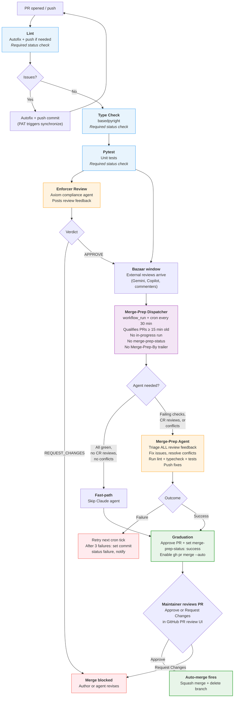

# PR Pipeline

## Giving Effect

- [[.github/workflows/pr-pipeline.yml]] → CI-only orchestrator: sequential lint → typecheck → pytest
- [[.github/workflows/lint.yml]] → uses `AOPS_BOT_GH_TOKEN` for checkout so autofix pushes trigger workflow restart
- [[.github/workflows/typecheck.yml]] → basedpyright type checking
- [[.github/workflows/pytest.yml]] → unit tests
- [[.github/workflows/agent-enforcer.yml]] → axiom compliance reviewer; fires automatically on `workflow_run` (PR Review Pipeline completion) + reusable via `workflow_call` for other repos
- [[.github/workflows/agent-merge-prep.yml]] → cron-driven merge prep agent; on success enables `gh pr merge --auto`
- [[.github/workflows/merge-prep-cron.yml]] → `workflow_run` trigger watches "PR Review Pipeline" completion + 30-min cron fallback
- GitHub Ruleset: required checks = `PR Review Pipeline / lint / Lint`, `PR Review Pipeline / typecheck / Type Check`, `PR Review Pipeline / pytest / Pytest`, `merge-prep-status`; `required_approving_review_count` ≥ 1 maintainer approval is the human merge gate

## Overview

**As** the repository maintainer,
**I want** a PR pipeline where bots handle all preparation automatically on a timer,
**So that** when I look at a PR, it is already reviewed, fixed, and ready — and I provide the final approval to merge.

The previous pipeline ([[specs/pr-process.md]]) required a human LGTM to trigger merge-prep. This created a sequencing problem: merge-prep fixes failing checks, so it cannot wait for checks to pass before running. The current design inverts the dependency — merge-prep runs automatically on a cron, bots prepare everything, and the human approves or denies once at the end.

**Where the human gate lives.** GitHub branch protection enforces `required_approving_review_count` ≥ 1 maintainer approval. The bot pipeline's job is to leave each PR green and armed: all CI passing, `merge-prep-status: success`, and `gh pr merge --auto --squash --delete-branch` enabled. When the maintainer adds the human approval, GitHub fires the queued auto-merge automatically. The human approval review is the decision point; no separate environment gate or summary-and-merge dispatcher is in use.

## Design Principles

1. **Bots prepare, human decides.** All mechanical work (lint fixes, review triage, conflict resolution) happens before the human looks at the PR. The human's job is approval or rejection, not preparation.
2. **Single decision point.** The human approves (or denies) once via the standard PR review UI. Auto-merge is pre-armed, so the maintainer's approval immediately satisfies branch protection and the merge fires automatically.
3. **No labels for coordination.** Labels are unreliable state machines. In-progress detection uses `gh run list`; halt state uses the `merge-prep-status` commit status API. No load-bearing labels; no comment-text scanning.
4. **Auto-merge for graduation.** Merge-prep signals readiness by setting `merge-prep-status: success` and calling `gh pr merge --auto --squash --delete-branch`. The merge is then queued behind the unmet requirements (the maintainer's approval). When the maintainer approves, GitHub fires the merge with no further bot involvement.
5. **Event-driven + cron fallback.** Merge-prep dispatch fires immediately when Phase 1 checks complete (`workflow_run` trigger), plus a 30-minute cron as safety net. The existing qualification logic (age gate, in-progress check, commit status) handles premature firings gracefully. No human trigger needed, no label gate.
6. **Sequential CI, independent review.** CI checks run sequentially (lint → typecheck → pytest) so that if lint pushes an autofix commit, typecheck and pytest haven't started yet — no wasted compute on the cancelled run. The Enforcer fires independently after CI completes (`workflow_run` on PR Review Pipeline), not on every push — reducing review frequency while preserving axiom compliance coverage. Lint uses a PAT (`AOPS_BOT_GH_TOKEN`) for checkout so autofix pushes trigger a new `synchronize` event, restarting the pipeline on the clean commit with correct check run names on the actual HEAD.
7. **GitHub affordances only.** Required status checks, PR reviews, commit status API, and auto-merge handle state. No custom orchestration where GitHub provides a native mechanism. No comment parsing; no label-based state machines.

## Architecture: Four Phases



## Phase 1: On Every Push (CI + Axiom Review)

Two workflows run independently on every `pull_request` push:

### CI Pipeline (`pr-pipeline.yml`) — sequential

The CI pipeline runs four jobs: initialization, lint, typecheck, and pytest.

**Initialization (Always Pending Until Triage):** To prevent PRs from appearing "green" before the Merge-Prep Agent has triaged reviews, the pipeline starts with an `initialize` job. This job sets the `merge-prep-status` commit status to `pending` on the latest SHA. Because this status is required by the ruleset, the PR remains in a "yellow" state until the agent explicitly sets it to `success` (after triage) or `failure` (after persistent errors).

| Workflow   | File              | Job name     | Required check?                 | Action                                                        |
| ---------- | ----------------- | ------------ | ------------------------------- | ------------------------------------------------------------- |
| Init       | `pr-pipeline.yml` | `Initialize` | Yes (`merge-prep-status`)       | Sets `merge-prep-status: pending` via GitHub Statuses API.    |
| Lint       | `lint.yml`        | `Lint`       | Yes (`Lint / Lint`)             | `ruff check --fix` + `ruff format`. Autofix + push if needed. |
| Type Check | `typecheck.yml`   | `Type Check` | Yes (`Type Check / Type Check`) | `basedpyright`. Read-only.                                    |
| Pytest     | `pytest.yml`      | `Pytest`     | Yes (`Pytest / Pytest`)         | `pytest -m "not slow"`. Read-only.                            |

**Why sequential?** When lint pushes an autofix commit, typecheck and pytest haven't started yet — no wasted compute on the cancelled run. The `cancel-in-progress` concurrency group cancels the old run and a new pipeline starts on the clean commit.

**Lint autofix with PAT:** Lint checks out using `AOPS_BOT_GH_TOKEN` (a PAT). When it pushes an autofix commit, the PAT push triggers a new `synchronize` event, restarting the pipeline on the new commit. This ensures check runs appear on the actual HEAD — pushes with `GITHUB_TOKEN` are deliberately ignored by GitHub Actions and would leave the new commit with zero check runs.

**Loop safety:** Lint is idempotent — the second run finds nothing to fix, no push, pipeline completes normally.

### Enforcer Review (`agent-enforcer.yml`) — fires after CI

The Enforcer fires automatically via `workflow_run` when the PR Review Pipeline completes. This means one enforcer run per CI cycle (not per push), reducing Claude API calls compared to a per-push trigger.

**PR discovery:** The enforcer extracts the PR number from the triggering branch name (`github.event.workflow_run.head_branch`). If no open PR is found for that branch, it exits cleanly. `branches-ignore: [main, release-please*]` prevents spurious fires on non-PR branches.

**Enforcement:** The enforcer agent checks compliance against axioms and project rules. It can push fixes directly to the PR branch (`Enforcer-By: agent` trailer) or post a `REQUEST_CHANGES` review for issues requiring human judgment.

**Loop detection:** Skips if the last commit has an agent trailer (`Enforcer-By`, `Autofix-By`, `Merge-Prep-By`) to avoid processing its own output.

**Reusable:** Also available as `workflow_call` for installation on other repos.

**Not a required status check.** The enforcer's review is read by the Merge-Prep Agent as part of its normal triage — no separate required check needed.

## Phase 2: Merge Prep (Cron-Driven)

Phase 2 has two components:

- **Merge-Prep Dispatcher** (`merge-prep-cron.yml`) — finds qualifying PRs and dispatches the agent. Runs on `workflow_run` (when PR Review Pipeline completes) + 30-minute cron as safety net.
- **Merge-Prep Agent** (`agent-merge-prep.yml` + `merge-prep.agent.md`) — the Claude agent that does the actual work: triaging reviews, fixing CI failures, resolving conflicts, and gating graduation.

### Dispatcher qualification criteria (label-free)

A PR qualifies for dispatch if ALL of the following are true:

1. **Age gate:** Last commit was >= 15 minutes ago. This preserves a bazaar window for external reviews (Gemini, Copilot) to arrive before the Merge-Prep Agent triages them.
2. **No in-progress run:** `gh run list --workflow=agent-merge-prep.yml --json status` shows no `in_progress` or `queued` run. Replaces the `merge-prep-running` label.
3. **Not already completed or permanently halted:** The latest commit does not have a `merge-prep-status` commit status with `state: success` or `state: failure`. The Merge-Prep Agent sets `success` at the end of every successful run; it sets `failure` after 3 consecutive failures. A new commit from any actor clears this automatically — the new SHA has no status yet, so the agent will re-run. **Exception — late reviews:** If `merge-prep-status` is `success` but `CHANGES_REQUESTED` reviews arrived _after_ the status was set, the PR re-qualifies. This handles the race where merge-prep's own commits trigger the Axiom Review, which finishes after merge-prep has already declared success.
4. **Not a merge-prep commit:** The HEAD commit message does not contain a `Merge-Prep-By:` trailer. This is a race-condition guard: the `workflow_run` trigger can fire before the agent workflow sets `merge-prep-status: success` on a freshly pushed commit. The trailer check prevents wasteful re-dispatch.

The dispatcher does not check whether checks are passing. The Merge-Prep Agent runs regardless — it will fix what it can and post an honest outcome.

### What the Merge-Prep Agent does

The agent workflow (`agent-merge-prep.yml`) performs pre-checks, then either invokes the Claude agent or takes the fast-path:

**Pre-checks (always run):**

1. **Dismiss prior merge-prep approval** — `gh pr review --dismiss` any existing approval from `github-actions[bot]` on this PR (ensures approval always reflects the latest code state, not a prior run).
2. **Self-loop detection** — if the last commit has a `Merge-Prep-By:` trailer, skip (prior run's work is still valid; set `merge-prep-status: success` and exit).
3. **Runaway loop ceiling** (see below) — halt if exceeded.

**Fast-path (no Claude call):** If all CI checks pass, no `CHANGES_REQUESTED` reviews remain, and the PR has no merge conflicts, the Claude agent is skipped entirely. The workflow proceeds directly to the graduation steps (approve, set `merge-prep-status: success`, enable auto-merge). This preserves the architectural invariant — the Merge-Prep Agent always gates graduation — while avoiding expensive Claude API calls when nothing needs fixing.

**PR classifier (judgement layer on top of the mechanical fast-path):** The mechanical fast-path catches "nothing failed". It does not catch stale-task PRs, over-engineered implementations, or intent mismatches. Those risks are addressed by the tier classifier defined in [[aops-core/commands/review-pr.md]] Step 3 (signals 1–10, Tier 0–3 definitions). The classifier is currently specified for the local `review-pr` command; integrating it into `agent-merge-prep.yml` is a follow-up so the pipeline can auto-reject stale-task PRs (Tier 0) and auto-approve trusted sanity-check PRs (Tier 1) without invoking the full Claude agent. Until that integration, the full agent path below handles these cases via its normal review triage.

**Full agent path (Claude call):** When there is work to do (failing checks, unresolved reviews, or conflicts):

4. Resolves merge conflicts if present (`git merge origin/main --no-edit`).
5. Reads ALL GitHub PR review feedback: Axiom Review, external bots (Gemini, Copilot), human reviewers. Triages each piece: fix, dismiss, or defer.
6. Runs `ruff check --fix && ruff format`, `basedpyright`, `pytest` locally.
7. Commits and pushes fixes with `Merge-Prep-By: agent` trailer (if any fixes are needed).
8. Posts a triage summary comment.

**Graduation (both paths) — performed by the workflow's `Handle success` step, not by the agent:**

9. Posts `gh pr review --approve` from `github-actions[bot]` if the agent did not already approve (one bot approval; the human's approval is still required separately).
10. Sets `merge-prep-status: success` commit status on the latest commit, using `AOPS_BOT_GH_TOKEN` (the bot PAT — the Claude action's own token lacks `statuses: write`, which is why the agent must not attempt this itself).
11. Calls `gh pr merge --auto --squash --delete-branch` to arm GitHub's native auto-merge. The merge is queued behind any remaining unmet branch-protection requirement — in practice, the maintainer's approval.

The agent itself stops at step 8 (approve). Steps 9–11 belong to the workflow.

**No comment parsing.** The Merge-Prep Agent reads GitHub PR _reviews_ (step 5) — a structured, native GitHub mechanism. It does not scan arbitrary comment text for instructions. Human direction comes through the review mechanism (REQUEST_CHANGES with notes), not freeform comments. Failure counting uses `gh run list` (run history), not comment text.

### Graduation mechanism: pre-armed auto-merge + human approval

Once the workflow has set `merge-prep-status: success` and enabled auto-merge, the PR is fully prepped. From the maintainer's perspective:

- All bot work is finished. The PR is green.
- The PR's review tab shows the bot approval and any external bot reviews (Gemini, Copilot, Enforcer).
- Branch protection still requires `required_approving_review_count` ≥ 1 from a human maintainer.
- The maintainer reads the PR, the triage summary comment, and the diff, and either **Approves** or **Requests Changes** in the standard PR review UI.
- An approval immediately satisfies branch protection and GitHub fires the queued auto-merge. Squash + branch delete happen automatically.
- A change request reopens the loop: merge-prep will pick up the new commits on the next dispatch.

**No environment gate, no `summary-and-merge.yml` workflow.** An earlier design specified a separate `production` environment + decision-brief workflow as the human gate. That was not implemented; the simpler "pre-arm auto-merge, human approval gates merge via branch protection" path is what runs today. The triage comment posted by the agent (§7) serves the same role as the decision brief.

### Global concurrency

All merge-prep runs share a global concurrency group `merge-prep-global` to prevent API rate limit issues when multiple PRs qualify simultaneously. PRs are processed sequentially within each cron tick. The per-PR concurrency group (`merge-prep-{pr_number}`) also remains to prevent duplicate runs on the same PR across cron ticks.

### Failure handling (label-free)

Failure counting uses `gh run list --workflow=agent-merge-prep.yml` filtered by PR branch — no comment-text parsing.

| Failure count | Action                                                                                                                                                                                                                                                                                                 |
| ------------- | ------------------------------------------------------------------------------------------------------------------------------------------------------------------------------------------------------------------------------------------------------------------------------------------------------ |
| 1st failure   | Workflow run shows as failed in Actions tab. Retry on next cron tick (≤30 min) or next Phase 1 completion.                                                                                                                                                                                             |
| 2nd failure   | Same.                                                                                                                                                                                                                                                                                                  |
| 3rd failure   | (1) Dismiss any prior merge-prep approval. (2) Set `merge-prep-status: failure` commit status on latest commit via GitHub API. (3) Post notification comment for human visibility. Subsequent cron ticks skip this PR (detected via commit status API, not comment text).                              |
| Manual retry  | Human uses Actions → Agent: Merge Prep → Run workflow (with PR number). The workflow_dispatch trigger already exists. The Merge-Prep Agent re-runs; if successful, posts `gh pr review --approve`, sets `merge-prep-status: success`, and arms `gh pr merge --auto` (same as a normal successful run). |

No `merge-prep-failed` label. No `merge-prep-running` label. No comment-text scanning. State is read from run history (in-progress check via `gh run list`) and the commit status API (halt check).

### Runaway loop protection

**Self-loop detection** (existing): If the last commit on the branch has a `Merge-Prep-By:` trailer, merge-prep skips the run. Prevents processing on top of its own unreviewed output.

**Cascade ceiling** (new, replaces v1 cascade limit): Count commits in the branch since diverging from `origin/main` that contain a `Merge-Prep-By:` trailer:

```bash
git log origin/main..HEAD --grep="^Merge-Prep-By:" --oneline | wc -l
```

If this count reaches `MAX_MERGE_PREP_RUNS` (default: **5**, provisional), merge-prep treats the situation as a permanent failure: dismisses its approval, sets `merge-prep-status: failure`, and posts a notification. No further cron runs occur until manual retry.

This ceiling is:

- **Label-free and comment-parsing-free** — derived entirely from git history.
- **Mathematically bounded** — convergent cycles (e.g., lint + merge-prep alternating) cannot exceed MAX_MERGE_PREP_RUNS total merge-prep commits regardless of success/failure mix.
- **Transparent** — visible in `git log` with no external state to query.
- **Equivalent to the v1 cascade limit** from the PR 582 post-mortem, but more robust: the old limit counted pipeline runs via comment-tracked counters; this counts actual merge-prep commits in git history.
- **Provisional** — 5 is conservative. Normal convergent cycles produce 2–3 merge-prep commits. If 5 have accumulated without the PR stabilising, something structural is wrong. Calibrate based on real-world data over the first 20 PRs.

## Phase 3: Human Approval (Branch Protection Gate)

By the time the human looks at the PR:

- Cheap checks (Lint, Type Check, Pytest) are green on the latest commit.
- Enforcer Review has posted its assessment.
- External reviews (Gemini, Copilot) have arrived and been triaged.
- Merge Prep has fixed what it could, posted a triage summary comment, and approved with `github-actions[bot]`.
- `merge-prep-status: success` is set on HEAD.
- `gh pr merge --auto --squash --delete-branch` is armed.

The maintainer opens the PR, reads the agent's triage summary comment plus the diff, and decides in the standard PR review UI:

- **Approve** → branch protection's `required_approving_review_count` is satisfied → GitHub fires the queued auto-merge → squash + branch delete → done.
- **Request Changes** → merge stays blocked. Author revises (or merge-prep picks up the new commits on the next dispatch).

The bot approval from `github-actions[bot]` does **not** count toward the human approval requirement; branch protection requires the approval to come from a maintainer. This is the system's actual human gate.

## Phase 4: Merge

Merge fires automatically when the human approval lands, via GitHub's native auto-merge (armed in Phase 2 step 11):

1. GitHub detects all branch-protection requirements are met
2. `gh pr merge --auto --squash --delete-branch` executes the squash merge
3. Source branch is deleted
4. Done

No separate workflow runs at merge time. The bot pipeline's job ends at "armed and green"; GitHub's auto-merge feature handles the actual merge once the human approves.

## Session Artifacts (Observability)

All three agent workflows upload Claude session files as GHA artifacts on every run, including failures. This enables post-mortem analysis of turn usage, tool call sequences, and failure modes — without which resource exhaustion failures (e.g. `FatalTurnLimitedError`) are impossible to diagnose correctly.

### Pattern

Each agent job uses a three-part pattern:

1. **`continue-on-error: true`** on the agent step — allows cleanup steps to always run.
2. **Upload artifact** (immediately after agent step, `if: always()`):
   ```yaml
   - name: Upload Claude session artifacts
     if: always()
     uses: actions/upload-artifact@v4
     with:
       name: claude-session-${{ github.job }}-${{ github.run_id }}-${{ github.run_attempt }}
       path: ~/.claude/projects/
       if-no-files-found: ignore
       retention-days: 30
   ```
3. **Propagate exit status** (final step, `if: always()`):
   ```yaml
   - name: Propagate agent exit status
     if: always()
     run: |
       if [ "${{ steps.claude.outcome }}" != "success" ]; then
         echo "::error::Agent run failed. Session artifacts uploaded for post-mortem analysis."
         exit 1
       fi
   ```

**`agent-merge-prep.yml` exception:** Merge-prep omits the propagate step because it uses explicit `Handle success` / `Handle failure` steps with their own exit codes and commit status API calls. It does upload artifacts.

### Accessing artifacts

In the GHA run view → **Artifacts** section, download `claude-session-{job}-{run_id}-{attempt}`. Then:

```bash
uv run python aops-core/scripts/transcript.py <path/to/session.jsonl>
```

Session files live at `~/.claude/projects/-workspace/*.jsonl` on the runner (project dir name = workspace path with `/` → `-`).

**Retention:** 30 days. Sufficient for PR post-mortems; adjustable.

**Why not Gemini CLI?** Consumer repos using Gemini CLI (e.g. `nicsuzor/mem`) need equivalent steps targeting `~/.gemini/tmp/`. That is tracked as a follow-up in the consumer repo — this spec covers the academicOps Claude workflows only.

## Workflow Files

| File                   | Purpose                                                                                                               |
| ---------------------- | --------------------------------------------------------------------------------------------------------------------- |
| `pr-pipeline.yml`      | CI orchestrator: sequential lint → typecheck → pytest. Triggers on `pull_request`.                                    |
| `lint.yml`             | Ruff lint + format with autofix. Uses `AOPS_BOT_GH_TOKEN` so pushes trigger workflow restart.                         |
| `typecheck.yml`        | basedpyright. Read-only gate.                                                                                         |
| `pytest.yml`           | Unit tests. Read-only gate.                                                                                           |
| `merge-prep-cron.yml`  | Dispatcher: `workflow_run` (PR Review Pipeline) + 30-min cron. Label-free qualification.                              |
| `agent-merge-prep.yml` | Merge-prep agent: triage reviews, fix issues, approve, set status. Uploads session artifacts.                         |
| `agent-enforcer.yml`   | Axiom compliance reviewer. Fires on `workflow_run` (PR Review Pipeline) + `workflow_call`. Uploads session artifacts. |
| `claude.yml`           | Interactive Claude Code agent triggered by `@claude` mentions. Uploads session artifacts.                             |

## GitHub Ruleset

```yaml
rules:
  - type: pull_request
    parameters:
      required_approving_review_count: 2
      dismiss_stale_reviews_on_push: false

  - type: required_status_checks
    parameters:
      strict_required_status_checks_policy: false
      required_status_checks:
        - context: "PR Review Pipeline / lint / Lint"          # pr-pipeline.yml → lint.yml
        - context: "PR Review Pipeline / typecheck / Type Check"  # pr-pipeline.yml → typecheck.yml
        - context: "PR Review Pipeline / pytest / Pytest"      # pr-pipeline.yml → pytest.yml
        - context: "merge-prep-status"                         # agent-merge-prep.yml (status API)
```

**Note on check run names:** The compound format (`Caller / Callee`) is produced by `workflow_call`. The caller job name and callee job name must both match to produce the expected check run name. Changing either job name will break the required status check. The `PR Review Pipeline` prefix comes from the `pr-pipeline.yml` workflow name.

**Two Approvals Requirement:** The ruleset requires 2 approvals. Approval #1 is provided by the Merge-Prep Agent after its successful run (`github-actions[bot]`). Approval #2 must come from a human maintainer. Branch protection does not distinguish bot vs. human approvals at the count level, but the bot approval alone never satisfies the human-judgement gate in practice — the maintainer's approval is what permits the merge to fire.

## Reusable workflow surface

The PR pipeline workflows are designed to be reusable in other repositories (cross-repo shims). Consumers should pin to a versioned ref (e.g., `@pipeline-v1`) to ensure stability.

### `@pipeline-v1` Convention

The `pipeline-v1` tag represents the stable surface for the reusable workflows. Consumers should use this tag in their `uses:` declarations:

```yaml
uses: nicsuzor/academicOps/.github/workflows/agent-merge-prep.yml@pipeline-v1
```

### Secrets Contract

The following secrets must be explicitly provided by the caller if the corresponding workflow is used:

- `AOPS_BOT_GH_TOKEN`: PAT with `contents: write`, `pull-requests: write`, `statuses: write`, and `actions: read/write` permissions. Required for `agent-merge-prep.yml` and `pr-pipeline.yml` (for lint autofix).
- `CLAUDE_CODE_OAUTH_TOKEN`: OAuth token for the Claude agent. Required for `agent-merge-prep.yml`.
- `GITHUB_TOKEN`: Standard repository token. Required for `merge-prep-cron.yml`.

### Workflow Inputs

#### `agent-merge-prep.yml`

| Input          | Type    | Default               | Description                                         |
| -------------- | ------- | --------------------- | --------------------------------------------------- |
| `pr_number`    | string  | **Required**          | PR number to prepare                                |
| `force`        | boolean | `false`               | Skip self-loop detection                            |
| `bot_identity` | string  | `github-actions[bot]` | Identity of the bot for failure counting/dismissals |

#### `merge-prep-cron.yml`

| Input          | Type   | Default                | Description                                   |
| -------------- | ------ | ---------------------- | --------------------------------------------- |
| `pr_number`    | string | `''`                   | Override: process specific PR immediately     |
| `workflow_ref` | string | `agent-merge-prep.yml` | Filename/ID of the agent workflow to dispatch |
| `bot_identity` | string | `github-actions[bot]`  | Identity of the bot for state checks          |

## CHANGELOG

### [2026-04-27] - pipeline-v1

- **Initial reusable surface**: Refactored `agent-merge-prep.yml` and `merge-prep-cron.yml` with `workflow_call` support.
- **Defensive Primitives**:
  - Added `bot_identity` input for venue-neutral bot identity.
  - Added `workflow_ref` input for configurable agent dispatch.
  - Explicit `secrets:` contract in `workflow_call` blocks.
- **Cross-repo shims**: Added working fixtures at `examples/cross-repo-shim/`.

## Acceptance Criteria

- [ ] A PR triggers Lint, Type Check, Pytest, and Agent Review concurrently on every push
- [ ] Lint autofixes and pushes without blocking Type Check or Pytest
- [ ] Agent Review posts a `gh pr review` (not a commit status)
- [ ] An Agent Review `REQUEST_CHANGES` blocks merge via branch protection
- [ ] Merge Prep runs automatically within ~20 minutes of a PR being opened (Phase 1 completion triggers dispatcher; 15-min age gate; 30-min cron fallback)
- [ ] Merge Prep dismisses its prior approval before each run (approval always reflects latest code state)
- [ ] On success, the Merge Prep workflow enables `gh pr merge --auto --squash --delete-branch`
- [ ] After human maintainer approval, GitHub's auto-merge fires and the PR is squash-merged with branch deleted
- [ ] No `lgtm`, `merge-prep-running`, or `merge-prep-failed` labels in any workflow file
- [ ] No comment-text scanning in merge-prep-cron.yml (halt detection uses commit status API)
- [ ] In-progress detection uses `gh run list` — no duplicate merge-prep runs
- [ ] On every successful merge-prep run: `gh pr review --approve` posted, `merge-prep-status: success` commit status set on latest commit, auto-merge enabled
- [ ] Cron qualification skips PRs where latest commit has `merge-prep-status: success` (already processed) or `failure` (halted), unless `CHANGES_REQUESTED` reviews arrived after the `success` status was set (late-review re-qualification)
- [ ] After 3 consecutive merge-prep failures: merge-prep approval dismissed, `merge-prep-status: failure` commit status set, notification comment posted, cron skips the PR
- [ ] Runaway loop ceiling: merge-prep halts (same as above) when `Merge-Prep-By:` commit count in branch ≥ 5
- [ ] Manual retry via workflow_dispatch resets halt state (re-runs full success sequence if successful)
- [ ] Merge-prep does not parse arbitrary comment text for instructions (reads PR reviews only)
- [ ] Global concurrency group prevents simultaneous merge-prep runs across PRs
- [ ] `validate-ruleset.yml` passes with new job names
- [ ] `Merge-Prep-By: agent` self-loop detector still works

## Design Decisions

**Why event-driven dispatch + cron fallback?**
The original design used cron-only dispatch (every 10 minutes), but GitHub Actions cron is unreliable — observed gaps of 30–80+ minutes between ticks, and sometimes cron stops firing entirely for hours. Adding `workflow_run` triggers on Phase 1 check completions provides reliable, event-driven dispatch: when checks finish, the dispatcher fires immediately. The existing qualification logic (15-min age gate, in-progress check, commit status halt check) means premature firings are gracefully skipped — no new guard logic needed. The 30-minute cron remains as a safety net for edge cases where `workflow_run` events are missed. Note: merge-prep is triggered on check _completion_ (regardless of pass/fail), not check _success_ — so it still runs on PRs with failing checks.

**Why 15-minute age gate?**
The age gate ensures external reviews (Gemini, Copilot) have time to arrive before merge-prep triages them. 15 minutes is a provisional estimate based on observed bot review latency (Gemini ~2 min, Copilot ~6 min on PR #878); validate against actual response times and adjust if needed. With the `workflow_run` trigger, the dispatcher fires when each Phase 1 check completes — the age gate causes early firings to skip gracefully, and later firings (after the bazaar window) proceed to dispatch.

**Why pre-armed auto-merge instead of a separate environment gate?**
An earlier draft of this spec proposed a `production` GitHub Environment + `summary-and-merge.yml` workflow as the human gate, on the rationale that environments offer a clean separate UI from the noisy PR review thread. That was not built. In practice, branch protection's `required_approving_review_count` already provides a single human decision point (the maintainer's PR review approval), and `gh pr merge --auto` already provides the queue-and-fire mechanism. Adding a separate environment-gated workflow on top would duplicate the gate without adding signal. The agent's triage summary comment (§7) already serves the role the "decision brief" was meant to play.

**Why `agent-review.yml` (not `agent-strategic-review.yml`)?**
The original name `agent-conceptual-review.yml` was already being renamed. `agent-strategic-review.yml` risks collision with other agent workflows and is unnecessarily specific. `agent-review.yml` is simple, descriptive, and leaves room for the review scope to evolve.

**Why commit status for halt detection, not comment text?**
Comment text scanning is fragile: a human quoting the halt string in a comment would accidentally suppress merge-prep. It also lacks delete-reset semantics that are easy to reason about. The `merge-prep-status` commit status uses GitHub's native Commit Statuses API — queryable without text parsing, set and cleared programmatically, and visible in the PR UI alongside other checks. The cron can query `GET /repos/{owner}/{repo}/commits/{sha}/statuses` for a `merge-prep-status` context with state `failure` in one deterministic API call.

**Why a runaway loop ceiling based on git history?**
The v1 cascade limit (max 3 pipeline runs, tracked via comments) was added after a real bot-loop incident (PR 582 post-mortem). This spec removes that safeguard and replaces it with a stronger one: counting `Merge-Prep-By:` commits in git history. This is preferable because: (a) the count is derived from immutable git history rather than mutable comments; (b) it caps total merge-prep activity regardless of success/failure mix, not just consecutive failures; (c) it is label-free and comment-parsing-free. The ceiling of 5 is provisional — calibrate based on real-world data.

**Why dismiss merge-prep's prior approval before each run?**
`dismiss_stale_reviews_on_push: false` is set so that the _human's_ approval is not wiped out by every bot push. Without this setting, a lint autofix push would dismiss the human's approval and require a second human action. However, this means merge-prep's approval from a prior run would also survive subsequent pushes. If merge-prep then runs again (because new commits arrived), its old approval might represent code that no longer exists. Dismissing the prior approval at the start of each run ensures merge-prep's approval is always freshly earned.

**Why set `merge-prep-status: success` on every successful run, not just manual retry?**
Without a `success` status, the cron qualification criteria only check for `failure` (permanent halt) and in-progress runs. If merge-prep succeeds without pushing any commits (all checks pass, no review feedback to address), there is no `Merge-Prep-By:` trailer on the latest commit (the self-loop check relies on this), so the next cron tick dispatches merge-prep again. This repeats every 30 minutes until the human approves — posting duplicate triage summaries and re-arming auto-merge for no reason. Setting `merge-prep-status: success` after every successful completion closes this gap: the cron skips the PR until a new commit arrives (which creates a new SHA without any status, resetting the check naturally). This uses zero new infrastructure — the same commit status API already specified for the failure path.

**Why must the agent itself not set `merge-prep-status` or call `gh api .../statuses/$SHA`?**
The Claude agent runs under the `anthropics/claude-code-action@v1` token, which is the Claude GitHub App's installation token. That token does not have `statuses: write` — `gh api .../statuses/$SHA` returns `403 Resource not accessible by integration` from inside the agent. The job-level `GH_TOKEN: AOPS_BOT_GH_TOKEN` (a bot PAT with `statuses: write`) is available to the workflow's shell steps, not to the agent's tool calls. So graduation steps (set commit status, enable auto-merge) live in the workflow's `Handle success` step, which runs after the agent exits. The agent's job ends at §8 (approve). No permission change is required — the split is intentional.

**Why remove LGTM entirely?**
The LGTM workflow was a dispatch mechanism because merge-prep was event-driven. With cron, there is no dispatch to coordinate — the cron finds qualifying PRs itself. The `lgtm` label, comment pattern, and LGTM workflow are all eliminated.

**Why split `code-quality.yml`?**
The current `needs: lint` dependency in Type Check is a false dependency. Running them in parallel is faster and respects the independence principle.

**Why `dismiss_stale_reviews_on_push: false`?**
Ensures the human's approval survives subsequent bot pushes (lint autofixes, merge-prep commits). See "Why dismiss merge-prep's prior approval" above for how this interacts with merge-prep's own approval management.

**Why global concurrency for merge-prep?**
Without a global limit, 5+ merge-prep runs could fire simultaneously when the cron ticks, all calling GitHub APIs and Claude. A `merge-prep-global` concurrency group serialises runs across PRs, preventing API rate limits and reducing cost. Each PR still gets processed — just sequentially within a cron tick rather than in parallel.

## Migration History

The pipeline reached its current state through these steps. Retained for context; the current pipeline is described in the sections above.

### Step 1: Split `code-quality.yml`

1. Created `lint.yml` (autofix), `typecheck.yml` (no `needs:` on lint), `pytest.yml`.
2. Updated `validate-ruleset.yml` check list and deleted `code-quality.yml`.

### Step 2: Convert Agent Review to PR review

1. Renamed `agent-conceptual-review.yml` → `agent-review.yml` (later → `agent-enforcer.yml`).
2. Replaced `gh api .../statuses/` with `gh pr review` in agent instructions.

### Step 3: Rewrite merge-prep and cron

- Cron: schedule `*/30` + `workflow_run` trigger on Phase 1 completions; label-free qualification via `gh run list` and the `merge-prep-status` commit status; 15-min age gate.
- Merge-prep: dropped `lgtm-gate`, removed all label ops, added dismiss-prior-approval, added loop ceiling, added global concurrency.
- Graduation moved into the workflow's `Handle success` step (set `merge-prep-status: success` + `gh pr merge --auto`), not the agent.

### Step 4: Ruleset and cleanup

1. Added `Pytest` and `merge-prep-status` to required checks.
2. Removed unused label definitions (`lgtm`, `merge-prep-running`, `merge-prep-failed`).
3. Marked `specs/pr-process.md` as superseded.

## Open Questions

1. **Pytest reliability.** Before adding Pytest as a required check, verify it passes reliably on bot-authored PRs and PRs with non-Python changes. If flaky, keep it advisory until stabilised.

2. **Copilot review timing.** Copilot is configured with `review_on_push: false`. If changed to `true`, its reviews will arrive during Phase 1/2. No pipeline change needed, but worth confirming timing against the 15-minute age gate.

3. **Multiple concurrent PRs.** The global concurrency group `merge-prep-global` serialises merge-prep across PRs. Monitor whether this causes excessive queueing when many PRs are open. If so, consider raising the limit or switching to per-PR concurrency only.

4. **Human approval before merge-prep.** If the human approves before merge-prep runs, auto-merge waits for required checks. After merge-prep pushes fixes and checks re-run, auto-merge fires without any further human action.

5. **`validate-ruleset.yml` update.** After the split, the validation script needs to find `Lint` in `lint.yml`, `Type Check` in `typecheck.yml`, and `Pytest` in `pytest.yml`. Verify the script handles multi-file checks.

6. **PR reviewer integration.** ~~Resolved~~: Axiom Review (`pr-review.yml`) runs as a standalone workflow using `pr-reviewer.agent.md`. The enforcer agent (`agent-enforcer.yml`) is available as a reusable workflow for other repos but is not wired into this repo's pipeline.

7. **Loop ceiling calibration.** The ceiling of 5 is conservative. After 20 real PRs, review actual `Merge-Prep-By:` commit counts and adjust if warranted. A ceiling too low causes false halts; too high defeats the purpose.

## Related Specifications

- [[specs/pr-process.md]] — superseded by this spec
- [[specs/polecat-supervision.md]] — polecat PR auto-merge criteria
- [[specs/non-interactive-agent-workflow-spec.md]] — Phase 5 (PR Review and Merge) references this pipeline
