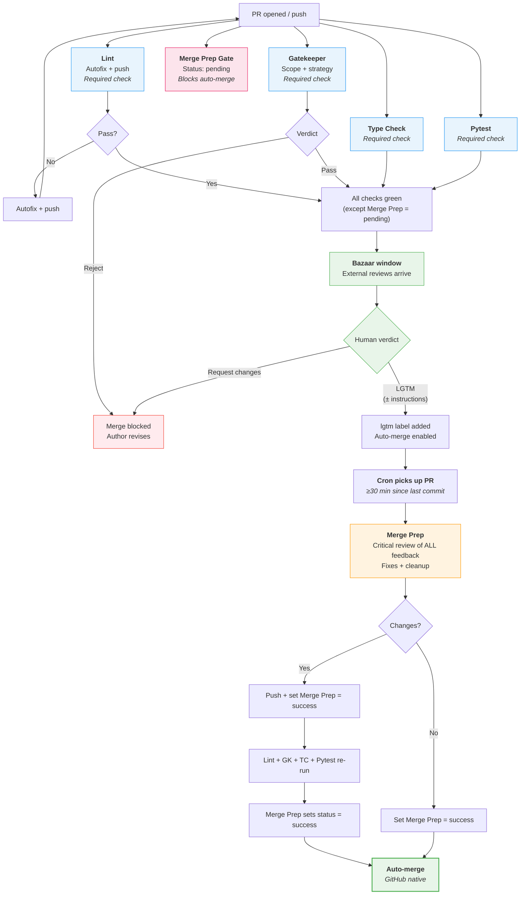

# PR Process v2 — DRAFT

How pull requests move from open to merged (or rejected) in the aops repository.

## Design principles

1. **Bazaar model**: embrace ALL contributions from any source. External reviews (Gemini Code Assist, GitHub Copilot, etc.) are first-class feedback. We get maximum value from them but are not reliant on them.
2. **Separate cheap from expensive**: deterministic checks (lint, typecheck, tests) run on every push. Expensive LLM reviews run once, at the right time.
3. **Use GitHub affordances**: required status checks, PR reviews, and auto-merge handle state management. No custom comment counting or cascade detectors where GitHub provides a native mechanism.
4. **One human action**: the human reviews once and says "lgtm." Everything after that is automated — no second approval needed.
5. **Time for the bazaar**: merge-prep waits for external reviews to arrive before processing feedback. The pipeline doesn't race to completion.

## Workflow files

| Workflow | File | Trigger | Purpose |
|----------|------|---------|---------|
| Code Quality | `code-quality.yml` | `pull_request`, `push` (main) | Lint autofix + type check (cheap, every push) |
| Gatekeeper | `agent-gatekeeper.yml` | `pull_request: [opened, synchronize]` | Scope/strategy gate (commit status, immediate) |
| Merge Prep Gate | `merge-prep-gate.yml` | `pull_request: [opened, synchronize]` | Sets `Merge Prep` status to `pending` (blocks auto-merge) |
| LGTM | `pr-lgtm.yml` | `pull_request_review`, `issue_comment` | Records human approval, enables auto-merge |
| Merge Prep | `merge-prep-cron.yml` | `schedule: */15`, `workflow_dispatch` | Deferred review + cleanup (runs after LGTM + time gate) |
| Pytest | `pytest.yml` | `pull_request`, `push` (main) | Unit tests (required status check) |
| Claude | `claude.yml` | `@claude` in comments | On-demand interaction |
| Polecat | `polecat-issue-trigger.yml` | `@polecat` in comments | On-demand agent work |

### Reusable agent workflows

| Agent | File | Role | Authority |
|-------|------|------|-----------|
| Gatekeeper | `agent-gatekeeper.yml` | Scope/strategy guardian | Commit status (pass/fail), gates merge |
| Merge Prep | `agent-merge-prep.yml` | Critical reviewer + cleanup | Edit code, push commits, post comments |

**Simplified agent roster**: Custodiet and QA are absorbed into Merge Prep. Merge Prep is a smart LLM that does critical review — scope compliance, acceptance criteria, and fixing — in one pass. Fewer agents means fewer comments, fewer cascades, and a clearer PR conversation.

> **Alternative**: keep Custodiet and QA as separate agents that post reviews during Phase 2 (bazaar window). Merge Prep then reads their feedback alongside bazaar reviews. This preserves separation of concerns but adds more bot comments. Decision: TBD — user to decide.

Agent prompts live in `.github/agents/<name>.md`. Each reusable workflow reads its own prompt file.

## How it works

The pipeline is designed so that **by the time the human looks at a PR, cheap checks are already green and external reviews have arrived**. The human's approval triggers a smart LLM to clean everything up and merge — no second approval needed.

### Phase 1: Immediate (on every push)

**Cheap, deterministic, quiet.** These run on every push including bot pushes.

- **Lint**: `ruff check` + `ruff format`. Autofix and push if needed. Required status check.
- **Type Check**: `basedpyright`. Required status check.
- **Pytest**: fast unit tests (slow/integration excluded). Required status check.
- **Gatekeeper**: evaluates scope/strategy alignment against STATUS.md, VISION.md, AXIOMS.md. Posts a **commit status** (not a PR review) — pass or fail. Required status check. If it fails, merge is blocked at the GitHub level.
- **Merge Prep gate**: sets the `Merge Prep` commit status to `pending`. This is the key mechanism that prevents auto-merge from firing before merge-prep has run. Only the merge-prep agent can set this status to `success`.

Gatekeeper is the only LLM call in Phase 1, but it's fast (single evaluation, ~30s) and critical (locks in scope or rejects immediately).

### Phase 2: Bazaar window (~30 min)

**No pipeline activity.** External reviewers do their thing at their own pace.

- Gemini Code Assist posts its review
- GitHub Copilot posts suggestions
- Other contributors comment
- Human reads, thinks, asks questions

This is not enforced mechanically — it's the natural delay between "PR opened" and "human is ready to approve." For trivial PRs, the human can approve immediately. For complex PRs, the bazaar has time to contribute.

### Phase 3: Human review (single action)

The human reviews the PR with full context: the diff, Gatekeeper's verdict, and any bazaar feedback that has arrived. They give their verdict:

- **"lgtm"** — approve as-is, let merge-prep clean up and merge
- **"lgtm, but change x y z"** — approve the direction, instruct merge-prep what to fix
- **Approve via GitHub review UI** — same as "lgtm"
- **Request changes** — not ready yet, author/agent needs to revise

The LGTM workflow:
1. Detects human approval (PR review `state: approved` from any human, OR "lgtm" comment from authorized users)
2. Adds the `lgtm` label to the PR (for cron to pick up)
3. Enables GitHub auto-merge (rebase mode)
4. Posts acknowledgment: "LGTM recorded. Merge Prep will process this PR on the next cycle."

**This is the human's only action.** They do not need to approve again after merge-prep pushes.

### Phase 4: Merge Prep (cron-triggered, after LGTM)

A scheduled workflow runs every 15 minutes on `main`. It queries for open PRs that meet ALL conditions:

1. **LGTM given**: PR has the `lgtm` label
2. **Not already being processed**: PR does NOT have the `merge-prep-running` label
3. **Cheap checks passing**: Lint + Type Check + Pytest all green on HEAD
4. **Gatekeeper passed**: Gatekeeper commit status is `success` on HEAD
5. **Time gate**: last commit was ≥30 minutes ago (bazaar had time to contribute)

For each qualifying PR, the cron workflow:
1. Adds the `merge-prep-running` label (prevents re-dispatch on next tick)
2. Dispatches the Merge Prep agent workflow via `workflow_dispatch`

**Merge Prep** is a smart LLM with instructions to do critical review. It:

1. Reads the PR description and diff
2. Reads ALL review feedback from every source:
   - Gatekeeper's assessment
   - Bazaar reviews (Gemini, Copilot, human commenters, etc.)
   - The human's LGTM comment (including any specific instructions like "change x y z")
3. Makes judgment calls about each piece of feedback:
   - **Fix**: genuine bugs, valid improvements, human's explicit instructions
   - **Dismiss**: false positives, misunderstandings, irrelevant suggestions
   - **Defer**: scope creep, future work suggestions
4. Runs lint + typecheck + tests locally to verify clean code
5. Pushes fixes (if any) with a `Merge-Prep-By: agent` trailer
6. Posts a triage summary comment
7. Sets the `Merge Prep` commit status to `success` on the HEAD commit
8. Removes the `merge-prep-running` label and the `lgtm` label

After merge-prep pushes:
- Lint, Type Check, Pytest re-run (required status checks) — cheap, expected
- Gatekeeper re-runs (required status check) — evaluates final code
- Merge Prep gate sets `Merge Prep` status to `pending` on the new commit
- Merge Prep agent (still running) sets `Merge Prep` status to `success` on the new commit after verifying checks
- Human's approval is still valid (`dismiss_stale_reviews_on_push: false`)
- Auto-merge fires when all required checks pass

If merge-prep makes no changes (PR was already clean), it sets the status to `success` and auto-merge fires on that tick.

#### Failure handling

If Merge Prep fails (API timeout, logic error, etc.):
- The `merge-prep-running` label is removed (allows cron to retry on next tick)
- The `lgtm` label is preserved (human approval still stands)
- The `Merge Prep` status remains `pending` (blocks auto-merge)
- After 3 consecutive failures, the workflow adds a `merge-prep-failed` label and posts a comment requesting human intervention

### Phase 5: Auto-merge

GitHub's native auto-merge handles the final step. It merges (rebase) when ALL required status checks pass AND the required review count is met:

- Lint: `success`
- Type Check: `success`
- Pytest: `success`
- Gatekeeper: `success`
- Merge Prep: `success`
- Human approval: 1 approving review

If merge conflicts exist, the merge workflow posts `@claude` to resolve them.

## Flowchart



## GitHub ruleset (proposed changes)

Current:
```json
{
  "required_approving_review_count": 0,
  "required_status_checks": [{"context": "Lint"}],
  "dismiss_stale_reviews_on_push": false
}
```

Proposed:
```json
{
  "required_approving_review_count": 1,
  "required_status_checks": [
    {"context": "Lint"},
    {"context": "Gatekeeper"},
    {"context": "Type Check"},
    {"context": "Pytest"},
    {"context": "Merge Prep"}
  ],
  "dismiss_stale_reviews_on_push": false
}
```

Changes:
- **Add 1 required review**: the human's approval. Enforced by GitHub, not by keyword matching.
- **Add Gatekeeper as required status check**: scope/strategy gate enforced natively.
- **Add Type Check as required status check**: currently advisory, should be mandatory.
- **Add Pytest as required status check**: no merging code that fails tests.
- **Add Merge Prep as required status check**: initialized to `pending` on every push, only set to `success` by the merge-prep agent. This is the gate that prevents auto-merge from firing before merge-prep runs.
- **Keep `dismiss_stale_reviews_on_push: false`**: merge-prep's push must not invalidate the human's approval.

## LGTM detection

The LGTM workflow detects human approval via:

1. **`pull_request_review` event**: `state: approved` from a non-bot user
2. **`issue_comment` event**: LGTM-pattern comment from authorized users (nicsuzor)

LGTM patterns (case-insensitive, start of comment):
```
lgtm | merge | ship it
```

The LGTM comment body is preserved and passed to Merge Prep as human instructions. "lgtm, but fix the docstring on line 42" means Merge Prep will read "fix the docstring on line 42" as a directive.

On detection, the workflow:
1. Adds the `lgtm` label to the PR
2. Enables GitHub auto-merge (rebase mode)
3. Posts acknowledgment: "LGTM recorded. Merge Prep will process this PR on the next cycle (~15 min)."

## Merge Prep (cron dispatcher)

The cron workflow (`merge-prep-cron.yml`) runs every 15 minutes on `main`:

```yaml
on:
  schedule:
    - cron: '*/15 * * * *'
  workflow_dispatch:
    inputs:
      pr_number:
        description: 'Override: process specific PR immediately'
        type: string
```

Qualification logic:
```bash
# Find PRs ready for merge-prep
for each open PR with label 'lgtm' and WITHOUT label 'merge-prep-running':
  # Get last commit timestamp (not updatedAt — comments would reset that)
  LAST_COMMIT_TIME=$(gh pr view $PR --json commits --jq '.commits[-1].committedDate')

  # Check: last commit was ≥30 min ago (bazaar had time)
  if (now - LAST_COMMIT_TIME) < 1800 seconds:
    skip  # too soon, bazaar still arriving

  # Check: all required checks pass (except Merge Prep which is pending)
  if not all checks passing (Lint, Gatekeeper, Type Check, Pytest):
    skip  # code isn't clean yet

  # Qualify: dispatch merge-prep for this PR
  add label 'merge-prep-running'
  dispatch agent-merge-prep workflow
```

For `workflow_dispatch` with explicit `pr_number`: skip all qualification checks and process immediately. This is the manual override for urgent merges or debugging.

## Gatekeeper as commit status

Gatekeeper changes from posting a PR review (`gh pr review --approve`) to posting a commit status:

```bash
# On approval
gh api repos/{owner}/{repo}/statuses/{sha} \
  -f state=success \
  -f context="Gatekeeper" \
  -f description="Scope and strategy alignment verified" \
  -f target_url="$GITHUB_SERVER_URL/$GITHUB_REPOSITORY/actions/runs/$GITHUB_RUN_ID"

# On rejection
gh api repos/{owner}/{repo}/statuses/{sha} \
  -f state=failure \
  -f context="Gatekeeper" \
  -f description="REJECT: conflicts with STATUS.md — see details"
```

Gatekeeper ALSO posts a PR comment with its full assessment (strategic analysis, design notes). The commit status is the gate; the comment is the explanation.

## Merge Prep gate

A lightweight workflow that runs on every `pull_request: [opened, synchronize]` and sets the `Merge Prep` commit status to `pending`:

```bash
gh api repos/{owner}/{repo}/statuses/{sha} \
  -f state=pending \
  -f context="Merge Prep" \
  -f description="Awaiting LGTM + merge-prep review"
```

This is the mechanism that prevents the "race to merge" — even if all other checks pass and the human approves, auto-merge waits for this status to become `success`. Only the merge-prep agent (dispatched by cron after LGTM) can set it to `success`.

## What this eliminates

| Removed | Replaced by |
|---------|-------------|
| Cascade counter (MAX_PIPELINE_RUNS) | Cron-based dispatch can't cascade — time-gated |
| `workflow_run` trigger chain | Cron dispatch — no event-driven cascading |
| Merge-prep loop detector | Cron + label state machine — dispatches once per LGTM |
| Custom merge workflow logic | GitHub native auto-merge + required status checks |
| PR Review Pipeline workflow | Merge Prep runs standalone, dispatched by cron |
| Custodiet + QA as separate agents | Absorbed into Merge Prep's critical review (TBD) |
| Comment-based state tracking | Label-based state + commit status API |

## Safety mechanisms

| Mechanism | What it prevents |
|-----------|-----------------|
| Gatekeeper (required status check) | Misaligned/harmful PRs reaching merge |
| Merge Prep gate (`pending` status) | Auto-merge firing before merge-prep reviews |
| Required review count = 1 | Merging without human oversight |
| `dismiss_stale_reviews_on_push: false` | Merge-prep push invalidating human approval |
| Cron time gate (30 min since last commit) | Merge-prep running before bazaar reviews arrive |
| `lgtm` label gating | Merge-prep running before human approval |
| `merge-prep-running` label | Duplicate cron dispatches |
| `merge-prep-failed` label (after 3 failures) | Infinite retry loops |
| `Merge-Prep-By:` commit trailer | Identifying bot commits in git history |
| `workflow_dispatch` override | Manual intervention when cron isn't enough |

## Concurrency

| Scope | Group key | Cancel in-progress? |
|-------|-----------|---------------------|
| Lint + Type Check | `code-quality-{pr_number}` | Yes |
| Gatekeeper | `gatekeeper-{pr_number}` | Yes |
| Pytest | `pytest-{pr_number}` | Yes |
| Merge Prep | `merge-prep-{pr_number}` | Yes |

## Migration path

1. **Create `merge-prep-gate.yml`**: sets `Merge Prep` status to `pending` on PR open/sync
2. **Update Gatekeeper**: post commit status instead of PR review; keep PR comment for explanation
3. **Create `merge-prep-cron.yml`**: cron dispatcher with label-based qualification
4. **Update `agent-merge-prep.yml`**: set `Merge Prep` status to `success` after completion
5. **Update LGTM workflow**: add `lgtm` label + enable auto-merge
6. **Update ruleset**: require Gatekeeper + Type Check + Pytest + Merge Prep status checks + 1 review
7. **Remove `pr-review-pipeline.yml`**: the event-driven chain is replaced by cron dispatch
8. **Remove cascade counter + loop detector**: no longer needed
9. **Test** on a real PR with supervised monitoring

## Configuration

- **Bazaar window**: 30 minutes (hardcoded in cron dispatcher; change the `1800` seconds threshold)
- **Cron frequency**: every 15 minutes (`*/15 * * * *`)
- **Max merge-prep retries**: 3 (before adding `merge-prep-failed` label)
- **LGTM patterns**: `lgtm | merge | ship it` (case-insensitive, start of comment)
- **Agent prompts**: `.github/agents/<name>.md`
- **Lint rules**: `pyproject.toml` under `[tool.ruff.lint]`
- **Type checking**: `pyproject.toml` under `[tool.basedpyright]`
- **Test markers**: `@pytest.mark.slow` (skipped in CI), `@pytest.mark.integration`

## Open questions

- [ ] Should Custodiet and QA remain as separate agents posting reviews during the bazaar window, or be absorbed into Merge Prep?
- [ ] Should Gatekeeper skip re-evaluation on bot commits (check commit author before running LLM)?
- [ ] Is 30 minutes the right bazaar window? Should the human be able to override via `workflow_dispatch`?
- [ ] Should the Merge Prep gate workflow also initialize Gatekeeper status to `pending` (single workflow for all gate initialization)?
