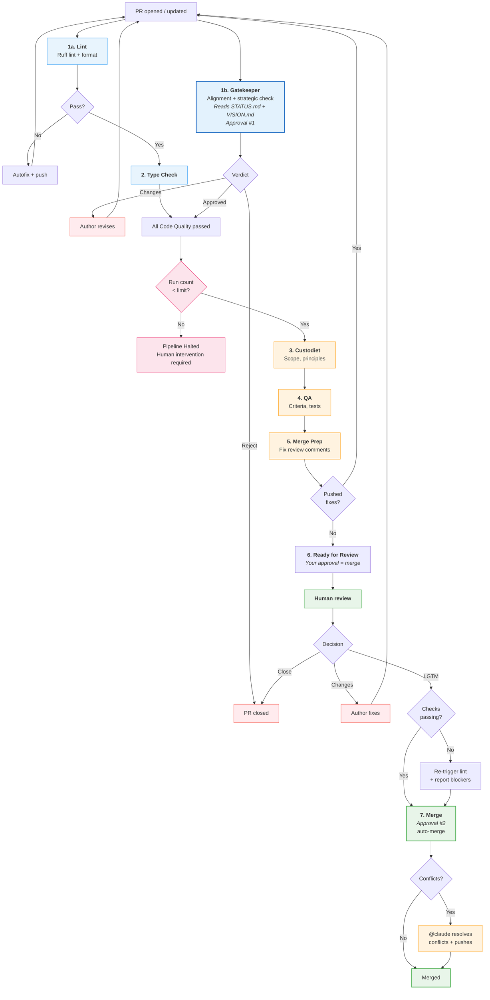

# PR Process

How pull requests move from open to merged (or rejected) in the aops repository.

## Workflow files

| Workflow         | File                        | Trigger                                        | Purpose                                      |
| ---------------- | --------------------------- | ---------------------------------------------- | -------------------------------------------- |
| Code Quality     | `code-quality.yml`          | `push` (main), `pull_request` (opened, synchronize, assigned) | Lint + gatekeeper (parallel), then type-check |
| PR Review        | `pr-review-pipeline.yml`    | `workflow_run` (Code Quality completed)        | Sequential: custodiet -> QA -> merge-prep -> notify |
| Merge            | `pr-lgtm-merge.yml`         | `pull_request_review`, `issue_comment`, `workflow_dispatch` | Human-triggered: approve + auto-merge (+ lint re-run + conflict resolution) |
| Pytest           | `pytest.yml`                | `push` (main), `pull_request` (opened, synchronize), `workflow_dispatch` | Fast unit tests (slow/integration excluded) |
| Claude           | `claude.yml`                | `@claude` in comments                          | On-demand Claude interaction                 |
| Polecat          | `polecat-issue-trigger.yml` | `@polecat` in comments, `workflow_dispatch`    | On-demand agent work |
| Issue: Custodiet | `issue-review-custodiet.yml`| `issues` (opened)                              | Proposal quality review |
| Issue: Hydrator  | `issue-review-hydrator.yml` | `issues` (opened)                              | Infrastructure context for proposals |

### Reusable agent workflows

Each agent is a first-class entity with its own `workflow_call` file, personality, and defined authority. Orchestrators call agents; agents don't trigger on their own.

| Agent | File | Personality | Authority |
|-------|------|-------------|-----------|
| Gatekeeper | `agent-gatekeeper.yml` | Authoritative guardian. Defaults to approval. Gates everything. | APPROVE, REQUEST CHANGES (fails job on rejection) |
| Custodiet | `agent-custodiet.yml` | Vigilant, precise. Rules enforcer. | PRs: APPROVE/REQUEST CHANGES. Issues: COMMENT only |
| QA | `agent-qa.yml` | Methodical, evidence-based. Verifies claims. | APPROVE, REQUEST CHANGES |
| Merge Prep | `agent-merge-prep.yml` | Diligent, thorough. The janitor. Fixes what reviewers found. | EDIT code, push commits, post comments |
| Hydrator | `agent-hydrator.yml` | Helpful, contextual. Surfaces infrastructure knowledge. | COMMENT only (advisory) |

Agent prompts live in `.github/agents/<name>.md`. Each reusable workflow reads its own prompt file.

## How it works

The pipeline is designed so that **by the time the human looks at a PR, everything should be clean**. The human's approval is the last step -- it triggers an immediate merge.

```
code-quality.yml:        [lint --- gatekeeper] (parallel)
                              |
                          type-check
                              | (workflow_run: all pass, gatekeeper approved)
pr-review-pipeline.yml:  cascade-check -> custodiet -> qa -> merge-prep -> notify-ready

pr-lgtm-merge.yml:       human approves -> check-status -> approve (Approval #2) -> auto-merge
                         (if lint failing -> re-trigger lint autofix)
                         (if conflicts -> @claude resolves -> auto-merge on clean)
```

If gatekeeper rejects, its job fails -> Code Quality fails -> the review pipeline never starts.

If custodiet or QA request changes, merge-prep attempts to auto-fix them and push a new commit. Each push re-triggers the PR Review pipeline and reruns the custodiet -> QA -> merge-prep chain. The notify-ready step **only** posts "Ready for human review" after verifying that the latest custodiet and QA reviews are all in the APPROVED state; if any agent still has CHANGES_REQUESTED, it does not declare readiness.

### Anti-cascade guard

The pipeline has two layers of protection against infinite bot loops:

1. **Merge-prep loop detector**: Checks if the last commit has a `Merge-Prep-By:` trailer. If so, merge-prep skips its run to avoid push -> review -> fix -> push cycles.

2. **Pipeline run-count limit**: The PR Review pipeline tracks how many times it has completed for a given PR (by counting sentinel comments from `github-actions[bot]`). After `MAX_PIPELINE_RUNS` (default: 3) completions, the pipeline halts and posts a notice requesting human intervention. This catches cascades that the merge-prep loop detector alone cannot prevent (e.g., lint autofix -> gatekeeper -> custodiet -> QA -> merge-prep cycles).

The run counter is reset when the pipeline is triggered via `workflow_dispatch` (manual re-run).

### LGTM with failing checks

When a human says "lgtm" but required status checks are failing:

1. The merge workflow checks the current state of all check runs on the PR HEAD commit
2. If lint is failing (or has not run), it triggers `code-quality.yml` via `workflow_dispatch` on the PR's branch
3. It posts a comment explaining what's blocking and what it did about it
4. It still enables auto-merge, which will merge once all checks pass
5. The human does not need to take further action unless the lint autofix cannot resolve the issues

## Approval architecture

The ruleset requires **2 approving reviews** before merge:

| Approval | Actor | When | How |
|----------|-------|------|-----|
| #1 Gatekeeper | `claude[bot]` | Automated, parallel with lint | `gh pr review --approve` in gatekeeper agent |
| #2 Human merge | `github-actions[bot]` | After human triggers merge via approval/LGTM | `gh pr review --approve` via GITHUB_TOKEN |

The human reviewer's approval or LGTM comment triggers the merge workflow, which lodges Approval #2 and merges via rebase. The human only acts once.

## Flowchart



## Stage-by-stage walkthrough

### 1a. Lint

**Workflow**: `code-quality.yml` | **Blocking**: Yes (required status check)

Runs `ruff check` and `ruff format --check`. Auto-fixes and pushes corrections on failure.

### 1b. Gatekeeper

**Workflow**: `code-quality.yml` -> `agent-gatekeeper.yml` | **Blocking**: Yes (Approval #1, gates pipeline)

Runs in parallel with lint. Reads three documents:
- `docs/VISION.md` -- abstract project vision and design philosophy
- `aops-core/AXIOMS.md` -- inviolable principles
- `.agent/STATUS.md` -- **current strategic state**: what components exist, their maturity, key decisions, and the roadmap

The strategic check against STATUS.md is critical for catching PRs that delete working components, conflict with recorded decisions, or ignore in-progress work. A PR that removes a component listed as "WORKING" in STATUS.md without validated replacement should be rejected.

On approval, lodges formal GitHub review. On rejection, the job fails -- blocking the entire downstream review pipeline.

### 2. Type Check

**Workflow**: `code-quality.yml` | **Blocking**: Yes

Runs `basedpyright` after lint passes.

### 3. Custodiet

**Workflow**: `pr-review-pipeline.yml` -> `agent-custodiet.yml` | **Blocking**: Advisory (may request changes)

Only runs after ALL Code Quality jobs pass (gatekeeper approved). Compares actual changes against stated scope, checks framework principles (P#87, P#65, P#25, P#5, P#31, etc.), flags unauthorized modifications.

### 4. QA

**Workflow**: `pr-review-pipeline.yml` -> `agent-qa.yml` | **Blocking**: Advisory (may request changes)

Runs after custodiet. Verifies acceptance criteria, checks CI and test coverage, scans for regressions.

### 5. Merge Prep

**Workflow**: `pr-review-pipeline.yml` -> `agent-merge-prep.yml` | **Blocking**: May push fixes

Runs after QA. Reads all review comments from custodiet, QA, and external bots. Triages into: genuine bugs (fix), valid improvements (fix), false positives (respond), scope creep (defer). Pushes fixes if needed -- this re-triggers the pipeline for a clean pass.

Has a **loop guard**: skips if the last commit was from itself (prevents infinite re-runs).

### 6. Notify Ready

Posts a summary comment: "Pipeline Complete -- Ready for Human Review. Your approval is the last step needed to merge." Includes the run count (e.g., "run 2/3") so the human can see how many review cycles have occurred.

### 7. Human Approval -> Merge

**Workflow**: `pr-lgtm-merge.yml`

The human reviews the clean PR. Their approval or LGTM comment triggers the merge workflow, which:
1. Checks whether required status checks are passing
2. If lint is failing, re-triggers `code-quality.yml` via `workflow_dispatch` and reports what's blocking
3. Lodges Approval #2 (`github-actions[bot]`)
4. Enables GitHub auto-merge (rebase mode) -- merges immediately if clean, or waits for checks
5. If merge conflicts exist, posts `@claude` comment requesting rebase + conflict resolution -- Claude fixes conflicts and pushes, auto-merge completes when checks pass

**Important**: "lgtm" means **merge now**. It is a final approval signal, not a request for changes. Use `@claude` or `@polecat` to request fixes before approving.

## Issue review

Each agent has its own trigger workflow for issues:

| Workflow | Agent | What it does |
|----------|-------|-------------|
| `issue-review-custodiet.yml` | Custodiet | Assesses user story quality, acceptance criteria, scope clarity |
| `issue-review-hydrator.yml` | Hydrator | Surfaces existing infrastructure, inconsistencies, downstream impacts |

Both trigger independently on `issues: [opened]`. Skips: bot-created issues, epics. Silence means the proposal is fine.

## Trigger reference

### Merge triggers

| Event | Filter | Why |
|-------|--------|-----|
| `pull_request_review: [submitted]` | Human only (`user.type != 'Bot'`), state = `approved` | Formal human approval |
| `issue_comment: [created]` | `nicsuzor` only, on PRs, LGTM pattern | Owner's merge signal |
| `workflow_dispatch` | Manual | Explicit trigger for specific PRs |

LGTM patterns (case-insensitive, must appear at the **start** of the comment):
```
lgtm | merge | rebase | ship it | @claude merge
```

### On-demand agents

| Mention   | Workflow     | Use case                              |
| --------- | ------------ | ------------------------------------- |
| `@claude` | `claude.yml` | Questions, debugging, analysis, fixes |
| `@polecat` | `polecat-issue-trigger.yml` | Task processing, guided work |

## Concurrency controls

| Scope           | Group key                    | Cancel in-progress? |
| --------------- | ---------------------------- | ------------------- |
| Lint            | `code-quality-{pr_number}`   | Yes |
| Type Check      | `code-quality-{pr_number}` (shares lint group) | Yes |
| Gatekeeper      | `gatekeeper-{pr_number}`     | Yes |
| Pytest          | `pytest-{pr_number}`         | Yes |
| PR Review       | `pr-review-{pr_number}`      | Yes |
| Merge Prep      | `pr-review-{pr_number}` (inherits PR Review group) | Yes |
| Merge           | `pr-merge-{pr_number}`       | No |

## Safety mechanisms

| Mechanism | Where | What it prevents |
|-----------|-------|-----------------|
| Merge-prep loop detector | `agent-merge-prep.yml` | Infinite push -> review -> fix cycles (checks `Merge-Prep-By:` trailer) |
| Pipeline run-count limit | `pr-review-pipeline.yml` | Bot cascade spirals (max 3 full pipeline runs per PR) |
| LGTM check-status gate | `pr-lgtm-merge.yml` | Silent merge failures from failing required checks |
| Lint re-trigger on LGTM | `pr-lgtm-merge.yml` | Stale lint failures blocking merge after human approval |
| Bot comment filter | `claude.yml` | Bot-posted `@claude` mentions triggering Claude Code |
| Human-only merge trigger | `pr-lgtm-merge.yml` | Bot reviews triggering merge workflow |

## Known limitations

- **Force-pushes disable auto-merge**: If Claude (or anyone) force-pushes to resolve conflicts, auto-merge must be re-enabled. The merge workflow does not currently handle this automatically.
- **All agent reviews show as `github-actions[bot]`**: Reviews from gatekeeper, custodiet, QA, and merge-prep all share the `GITHUB_TOKEN` identity. Agents identify themselves in the review body text. Distinct bot identities would require registering separate GitHub Apps.
- **`issue_comment` triggers are noisy**: Any PR comment triggers Claude Code, Polecat, and Merge workflows (all skip via job-level `if:` filters, but show as 1-second skipped runs in Actions). This is a GitHub limitation -- `on: issue_comment` cannot be filtered at the trigger level.
- **PR Review pipeline only runs on `pull_request` events**: The `push: main` trigger on Code Quality does not cascade to the PR Review pipeline (filtered by `workflow_run.event == 'pull_request'`).
- **Run-count limit is approximate**: The counter is based on comment pattern matching, not a database. Deleted comments or unusual comment patterns could skew the count. The `workflow_dispatch` manual trigger bypasses the counter.

## Configuration

- **Add a new review agent**: Create `agent-<name>.yml` + `.github/agents/<name>.md`, add `uses:` line to orchestrator
- **Add agent to issue review**: Create `issue-review-<name>.yml` trigger file
- **Change agent behavior**: Edit `.github/agents/<name>.md`
- **Change merge trigger patterns**: Edit LGTM grep in `pr-lgtm-merge.yml`
- **Change cascade limit**: Edit `MAX_PIPELINE_RUNS` env var in `pr-review-pipeline.yml` (default: 3)
- **Lint rules**: `pyproject.toml` under `[tool.ruff.lint]`
- **Type checking**: `pyproject.toml` under `[tool.basedpyright]`
- **Test markers**: `@pytest.mark.slow` (skipped in CI), `@pytest.mark.integration`
