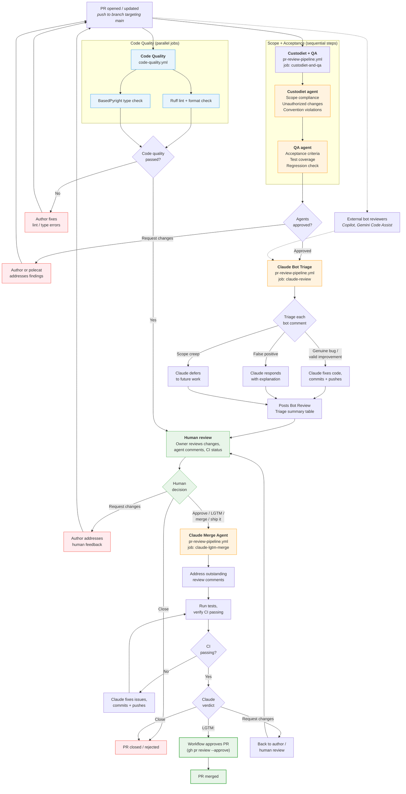

# PR Process

How pull requests move from open to merged (or rejected) in the aops repository.

## Workflow files

| Workflow     | File                        | Trigger                                     | Purpose                         |
| ------------ | --------------------------- | ------------------------------------------- | ------------------------------- |
| Code Quality | `code-quality.yml`          | `pull_request → main`                       | Lint + type check gate          |
| PR Pipeline  | `pr-review-pipeline.yml`    | `pull_request`, comments, reviews, dispatch | Agent review + merge flow       |
| Polecat      | `polecat-issue-trigger.yml` | `@polecat` in comments                      | Ad-hoc agent work on issues/PRs |
| Claude       | `claude.yml`                | `@claude` in comments                       | Ad-hoc Claude interaction       |

## Flowchart



## Stage-by-stage walkthrough

### 1. Code Quality gate

**Workflow**: `code-quality.yml`
**Trigger**: `pull_request` targeting `main`
**Blocking**: Yes -- must pass before merge

Two independent jobs run in parallel:

| Job          | Tool                                 | What it checks                             |
| ------------ | ------------------------------------ | ------------------------------------------ |
| `lint`       | `ruff check` + `ruff format --check` | Lint errors, import order, code formatting |
| `type-check` | `basedpyright`                       | Static type analysis (basic mode)          |

If either fails, the author fixes and pushes. The workflow re-runs on `synchronize`.

### 2. Custodiet + QA agents

**Workflow**: `pr-review-pipeline.yml`, job `custodiet-and-qa`
**Trigger**: `pull_request` opened or synchronized (skips bot actors)
**Blocking**: Posts reviews that may request changes

Runs as sequential steps in one job:

**Custodiet** (scope compliance):

- Compares actual diff against PR description
- Flags out-of-scope file changes
- Detects unauthorized CI/CD, secrets, or permission modifications
- Checks convention compliance
- Posts `gh pr review --approve` or `--request-changes`

**QA** (acceptance criteria):

- Verifies stated acceptance criteria are met
- Checks CI status and test coverage
- Scans for regressions (broken imports, removed references)
- Lightweight bug/security scan
- Posts `gh pr review --approve` or `--request-changes`

### 3. Bot Review Triage

**Workflow**: `pr-review-pipeline.yml`, job `claude-review`
**Trigger**: Runs after `custodiet-and-qa` completes (the delay gives external bots time to post)
**Blocking**: No -- informational, fixes issues proactively

Claude triages comments from external bot reviewers (Copilot, Gemini Code Assist):

| Category          | Action                                |
| ----------------- | ------------------------------------- |
| Genuine bug       | Fix the code, commit + push           |
| Valid improvement | Fix the code, commit + push           |
| False positive    | Reply explaining why no change needed |
| Scope creep       | Acknowledge as future work            |

Posts a summary table to the PR when done.

### 4. Human review

The human reviewer (repo owner) evaluates:

- Code changes and PR description
- Agent review results (custodiet, QA, bot triage)
- CI status

Three possible outcomes:

- **Request changes** -- author iterates, PR re-enters the pipeline
- **Close** -- PR is rejected
- **Approve** -- triggers the merge agent (via LGTM comment, formal approval, or assigning to `claude-for-github[bot]`)

### 5. Merge agent

**Workflow**: `pr-review-pipeline.yml`, job `claude-lgtm-merge`
**Trigger**: Human approval, LGTM-pattern comment from owner, workflow dispatch, or PR assigned to claude bot
**Blocking**: Yes -- controls final approval

The merge agent:

1. Addresses any outstanding review comments (human comments are highest priority)
2. Re-triages bot comments if the earlier triage job didn't run
3. Commits and pushes any fixes
4. Rebases if needed (never merge-commits from main)
5. Verifies CI checks pass
6. Posts a final verdict:
   - `LGTM:` -- workflow auto-approves the PR
   - `Request changes:` -- back to human review
   - `Close:` -- PR rejected

The workflow's final step checks Claude's last comment. If it starts with `LGTM:`, the PR gets an automatic `gh pr review --approve`.

## Trigger reference

LGTM patterns that activate the merge agent (case-insensitive, from repo owner only):

```
lgtm | merge | rebase | ship it | @claude merge
```

## Ad-hoc agent triggers

Outside the main pipeline, two workflows respond to mentions in comments:

| Mention                         | Workflow                    | Use case                               |
| ------------------------------- | --------------------------- | -------------------------------------- |
| `@claude`                       | `claude.yml`                | General questions, debugging, analysis |
| `@polecat` or `ready for agent` | `polecat-issue-trigger.yml` | Agent-driven issue/PR processing       |

These are independent of the PR review pipeline and don't affect merge decisions.

## Concurrency controls

| Scope          | Group key                | Cancel in-progress?              |
| -------------- | ------------------------ | -------------------------------- |
| Custodiet + QA | `pr-review-{pr_number}`  | Yes (new push cancels stale run) |
| Merge agent    | `pr-merge-{pr_number}`   | No (merge runs to completion)    |
| Polecat        | `polecat-{issue_number}` | No (serial per issue)            |

## Configuration

To modify this process:

- **Add/remove lint rules**: Edit `pyproject.toml` under `[tool.ruff.lint]`
- **Change type checking strictness**: Edit `pyproject.toml` under `[tool.basedpyright]`
- **Modify custodiet behavior**: Edit `.github/agents/custodiet.md`
- **Modify QA behavior**: Edit `.github/agents/qa.md`
- **Change merge trigger patterns**: Edit the LGTM grep pattern in `pr-review-pipeline.yml`
- **Add new CI checks**: Add jobs to `code-quality.yml`
- **Adjust concurrency**: Edit `concurrency` blocks in `pr-review-pipeline.yml`
- **Pre-commit hooks** (local): Edit `.pre-commit-config.yaml`
