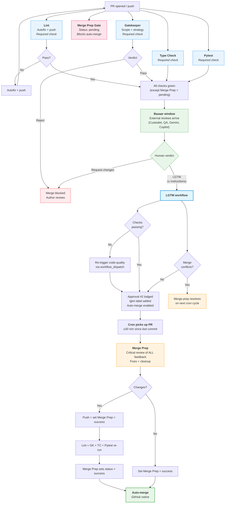

# PR Process

How pull requests move from open to merged (or rejected) in the aops repository.

## Design principles

1. **Bazaar model**: embrace ALL contributions from any source. External reviews (Gemini Code Assist, GitHub Copilot, etc.) are first-class feedback. We get maximum value from them but are not reliant on them.
2. **Separate cheap from expensive**: deterministic checks (lint, typecheck, tests) run on every push. Expensive LLM reviews run once, at the right time.
3. **Use GitHub affordances**: required status checks, PR reviews, and auto-merge handle state management. No custom comment counting or cascade detectors where GitHub provides a native mechanism.
4. **One human action**: the human reviews once and says "lgtm." Everything after that is automated — no second approval needed.
5. **Time for the bazaar**: merge-prep waits for external reviews to arrive before processing feedback. The pipeline doesn't race to completion.

## Workflow files

| Workflow | File | Trigger | Purpose |
|----------|------|---------|---------|
| Code Quality | `code-quality.yml` | `pull_request`, `push` (main), `workflow_dispatch` | Lint autofix + type check (cheap, every push) |
| Gatekeeper | `agent-gatekeeper.yml` | `pull_request: [opened, synchronize]` | Scope/strategy gate (commit status, immediate) |
| Merge Prep Gate | `merge-prep-gate.yml` | `pull_request: [opened, synchronize]` | Sets `Merge Prep` status to `pending` (blocks auto-merge) |
| LGTM | `pr-lgtm-merge.yml` | `pull_request_review`, `issue_comment`, `workflow_dispatch` | Records human approval, checks status, re-triggers if needed, enables auto-merge |
| Merge Prep Dispatcher | `merge-prep-cron.yml` | `schedule: */15`, `workflow_dispatch` | Deferred review + cleanup (runs after LGTM + time gate) |
| Pytest | `pytest.yml` | `pull_request`, `push` (main) | Unit tests (required status check) |
| Claude | `claude.yml` | `@claude` in comments | On-demand interaction |
| Polecat | `polecat-issue-trigger.yml` | `@polecat` in comments | On-demand agent work |

### Reusable agent workflows

| Agent | File | Role | Authority |
|-------|------|------|-----------|
| Gatekeeper | `agent-gatekeeper.yml` | Scope/strategy guardian | Commit status (pass/fail), gates merge |
| Custodiet | `agent-custodiet.yml` | Scope compliance reviewer | APPROVE / REQUEST CHANGES on PRs, COMMENT on issues |
| QA | `agent-qa.yml` | Verification and testing | APPROVE / REQUEST CHANGES |
| Merge Prep | `agent-merge-prep.yml` | Critical reviewer + cleanup | Edit code, push commits, post comments, set commit status |

Custodiet and QA are independent agents that post reviews during Phase 2 (bazaar window). Merge Prep reads their feedback alongside bazaar reviews in Phase 4.

Agent prompts live in `.github/agents/<name>.md`. Each reusable workflow reads its own prompt file.

## How it works

The pipeline is designed so that **by the time the human looks at a PR, cheap checks are already green and external reviews have arrived**. The human's approval triggers a smart LLM to clean everything up and merge — no second approval needed.

### Phase 1: Immediate (on every push)

**Cheap, deterministic, quiet.** These run on every push including bot pushes.

- **Lint**: `ruff check` + `ruff format`. Autofix and push if needed. Required status check.
- **Type Check**: `basedpyright`. Required status check.
- **Pytest**: fast unit tests (slow/integration excluded). Required status check.
- **Gatekeeper**: evaluates scope/strategy alignment against STATUS.md, VISION.md, AXIOMS.md. Posts a **commit status** (not a PR review) — pass or fail. Required status check. If it fails, merge is blocked at the GitHub level.
- **Merge Prep gate**: sets the `Merge Prep` commit status to `pending`. This is the key mechanism that prevents auto-merge from firing before merge-prep has run. Only the merge-prep agent can set this status to `success`.

Gatekeeper is the only LLM call in Phase 1, but it's fast (single evaluation, ~30s) and critical (locks in scope or rejects immediately).

### Phase 2: Bazaar window (~30 min)

**No pipeline activity.** External reviewers do their thing at their own pace.

- Gemini Code Assist posts its review
- GitHub Copilot posts suggestions
- Custodiet and QA post their reviews
- Other contributors comment
- Human reads, thinks, asks questions

This is not enforced mechanically — it's the natural delay between "PR opened" and "human is ready to approve." For trivial PRs, the human can approve immediately. For complex PRs, the bazaar has time to contribute.

### Phase 3: Human review (single action)

The human reviews the PR with full context: the diff, Gatekeeper's verdict, and any bazaar feedback that has arrived. They give their verdict:

- **"lgtm"** — approve as-is, let merge-prep clean up and merge
- **"lgtm, but change x y z"** — approve the direction, instruct merge-prep what to fix
- **Approve via GitHub review UI** — same as "lgtm"
- **Request changes** — not ready yet, author/agent needs to revise

The LGTM workflow (`pr-lgtm-merge.yml`):
1. Detects human approval (PR review `state: approved` from any human, OR "lgtm" comment from authorized users)
2. Checks whether required status checks are passing on the PR HEAD
3. If checks haven't run or are failing, re-triggers `code-quality.yml` via `workflow_dispatch` (recovers stuck PRs where checks never triggered — e.g., bot-created branches using GITHUB_TOKEN)
4. Lodges **Approval #2** — a formal PR review (`gh pr review --approve`) from `github-actions[bot]` that satisfies the 1-review ruleset requirement
5. Adds the `lgtm` label to the PR (for cron to pick up)
6. Enables GitHub auto-merge (rebase mode)
7. If merge conflicts are detected, notes them in acknowledgment (merge-prep will resolve on next cron cycle)
8. Posts acknowledgment summarizing status: what's passing, what's blocking, what was re-triggered

**This is the human's only action.** They do not need to approve again after merge-prep pushes.

### Phase 4: Merge Prep (cron-triggered, after LGTM)

A scheduled workflow runs every 15 minutes on `main`. It queries for open PRs that meet ALL conditions:

1. **LGTM given**: PR has the `lgtm` label
2. **Not already being processed**: PR does NOT have the `merge-prep-running` label
3. **Cheap checks passing**: Lint + Type Check + Pytest all green on HEAD
4. **Gatekeeper passed**: Gatekeeper commit status is `success` on HEAD
5. **Time gate**: last commit was ≥30 minutes ago (bazaar had time to contribute)

For each qualifying PR, the cron workflow:
1. Adds the `merge-prep-running` label (prevents re-dispatch on next tick)
2. Dispatches the Merge Prep agent workflow via `workflow_dispatch`

**Merge Prep** is a smart LLM with instructions to do critical review. It:

1. Reads the PR description and diff
2. Reads ALL review feedback from every source:
   - Gatekeeper's assessment
   - Custodiet and QA reviews
   - Bazaar reviews (Gemini, Copilot, human commenters, etc.)
   - The human's LGTM comment (including any specific instructions like "change x y z")
3. Makes judgment calls about each piece of feedback:
   - **Fix**: genuine bugs, valid improvements, human's explicit instructions
   - **Dismiss**: false positives, misunderstandings, irrelevant suggestions
   - **Defer**: scope creep, future work suggestions
4. Runs lint + typecheck + tests locally to verify clean code
5. Pushes fixes (if any) with a `Merge-Prep-By: agent` trailer
6. Posts a triage summary comment
7. Sets the `Merge Prep` commit status to `success` on the HEAD commit
8. Removes the `merge-prep-running` label and the `lgtm` label

After merge-prep pushes:
- Lint, Type Check, Pytest re-run (required status checks) — cheap, expected
- Gatekeeper re-runs (required status check) — evaluates final code
- Merge Prep gate sets `Merge Prep` status to `pending` on the new commit
- Merge Prep agent (still running) sets `Merge Prep` status to `success` on the new commit after verifying checks
- Human's approval is still valid (`dismiss_stale_reviews_on_push: false`)
- Auto-merge fires when all required checks pass

If merge-prep makes no changes (PR was already clean), it sets the status to `success` and auto-merge fires on that tick.

#### Failure handling

If Merge Prep fails (API timeout, logic error, etc.):
- The `merge-prep-running` label is removed (allows cron to retry on next tick)
- The `lgtm` label is preserved (human approval still stands)
- The `Merge Prep` status remains `pending` (blocks auto-merge)
- After 3 consecutive failures, the workflow adds a `merge-prep-failed` label and posts a comment requesting human intervention

### Phase 5: Auto-merge

GitHub's native auto-merge handles the final step. It merges (rebase) when ALL required status checks pass AND the required review count is met:

- Lint: `success`
- Type Check: `success`
- Pytest: `success`
- Gatekeeper: `success`
- Merge Prep: `success`
- Approval: 1 approving review (lodged by LGTM workflow as Approval #2)

If merge conflicts exist, the LGTM workflow adds the `lgtm` label and enables auto-merge as normal. On the next cron cycle, merge-prep dispatches for conflicting PRs (bypassing the checks-passing requirement) and the merge-prep agent resolves conflicts by merging from main. If conflicts arise later (e.g., another PR merges first), re-trigger the LGTM workflow or comment `lgtm` again.

## Flowchart



## Approval architecture

The ruleset requires **1 approving review** before merge:

| Approval | Actor | When | How |
|----------|-------|------|-----|
| Approval #2 | `github-actions[bot]` | After human LGTM detected | `gh pr review --approve` in LGTM workflow |

The human's LGTM (comment or GitHub review) triggers the LGTM workflow, which lodges a formal bot review to satisfy the ruleset. Gatekeeper posts a **commit status**, not a review — it gates via required status checks, not review count.

## GitHub ruleset

Current live configuration:

```json
{
  "required_approving_review_count": 1,
  "required_status_checks": [{"context": "Lint"}],
  "dismiss_stale_reviews_on_push": false
}
```

Target (Phase 2 rollout — after workflows are verified working):

```json
{
  "required_approving_review_count": 1,
  "required_status_checks": [
    {"context": "Lint"},
    {"context": "Gatekeeper"},
    {"context": "Type Check"},
    {"context": "Pytest"},
    {"context": "Merge Prep"}
  ],
  "dismiss_stale_reviews_on_push": false
}
```

The additional required status checks will be added after 1-2 successful PRs demonstrate the workflows are stable. Until then, Gatekeeper/Type Check/Pytest/Merge Prep run but are advisory.

## LGTM detection

The LGTM workflow detects human approval via:

1. **`pull_request_review` event**: `state: approved` from a non-bot user
2. **`issue_comment` event**: LGTM-pattern comment from authorized users (nicsuzor)
3. **`workflow_dispatch`**: manual trigger with PR number

LGTM patterns (case-insensitive, start of comment):
```
lgtm | merge | ship it
```

The LGTM comment body is preserved and passed to Merge Prep as human instructions. "lgtm, but fix the docstring on line 42" means Merge Prep will read "fix the docstring on line 42" as a directive.

### LGTM with failing or missing checks

When a human says "lgtm" but required status checks are failing or haven't run:

1. The LGTM workflow checks the current state of all check runs on the PR HEAD commit
2. If any check hasn't run or is failing, it re-triggers `code-quality.yml` via `workflow_dispatch` on the PR's branch
3. It posts a comment explaining what's blocking and what it did about it
4. It still enables auto-merge, which will merge once all checks pass
5. The human does not need to take further action unless the issue cannot be auto-resolved

This handles the common case where bot-created branches (using `GITHUB_TOKEN`) never triggered Phase 1 workflows.

### LGTM with merge conflicts

When the PR has merge conflicts at LGTM time:

1. The LGTM workflow detects `mergeable: CONFLICTING` state
2. LGTM still adds the `lgtm` label and enables auto-merge, but notes conflicts in the acknowledgment
3. On the next cron cycle (~15 min), the merge-prep dispatcher sees the `lgtm` label and dispatches merge-prep **even though checks aren't passing** (conflicts bypass the checks-passing requirement)
4. The merge-prep agent resolves conflicts by merging from main, then proceeds with normal review triage
5. After merge-prep pushes the resolved branch, checks re-run and auto-merge fires when they pass

The human does not need to take further action unless the merge-prep agent cannot resolve the conflicts (after 3 failures, it adds `merge-prep-failed` label and halts).

## Merge Prep (cron dispatcher)

The cron workflow (`merge-prep-cron.yml`) runs every 15 minutes on `main`:

```yaml
on:
  schedule:
    - cron: '*/15 * * * *'
  workflow_dispatch:
    inputs:
      pr_number:
        description: 'Override: process specific PR immediately'
        type: string
```

Qualification logic:
```bash
# Find PRs ready for merge-prep
for each open PR with label 'lgtm' and WITHOUT label 'merge-prep-running':
  # Get last commit timestamp (not updatedAt — comments would reset that)
  LAST_COMMIT_TIME=$(gh pr view $PR --json commits --jq '.commits[-1].committedDate')

  # Check: last commit was ≥30 min ago (bazaar had time)
  if (now - LAST_COMMIT_TIME) < 1800 seconds:
    skip  # too soon, bazaar still arriving

  # Check: all required checks pass (except Merge Prep which is pending)
  if not all checks passing (Lint, Gatekeeper, Type Check, Pytest):
    skip  # code isn't clean yet

  # Qualify: dispatch merge-prep for this PR
  add label 'merge-prep-running'
  dispatch agent-merge-prep workflow
```

For `workflow_dispatch` with explicit `pr_number`: skip all qualification checks and process immediately. This is the manual override for urgent merges or debugging.

## Gatekeeper as commit status

Gatekeeper posts a commit status (not a PR review):

```bash
# On approval
gh api repos/{owner}/{repo}/statuses/{sha} \
  -f state=success \
  -f context="Gatekeeper" \
  -f description="Scope and strategy alignment verified" \
  -f target_url="$GITHUB_SERVER_URL/$GITHUB_REPOSITORY/actions/runs/$GITHUB_RUN_ID"

# On rejection
gh api repos/{owner}/{repo}/statuses/{sha} \
  -f state=failure \
  -f context="Gatekeeper" \
  -f description="REJECT: conflicts with STATUS.md — see details"
```

Gatekeeper ALSO posts a PR comment with its full assessment (strategic analysis, design notes). The commit status is the gate; the comment is the explanation.

## Merge Prep gate

A lightweight workflow that runs on every `pull_request: [opened, synchronize]` and sets the `Merge Prep` commit status to `pending`:

```bash
gh api repos/{owner}/{repo}/statuses/{sha} \
  -f state=pending \
  -f context="Merge Prep" \
  -f description="Awaiting LGTM + merge-prep review"
```

This is the mechanism that prevents the "race to merge" — even if all other checks pass and the human approves, auto-merge waits for this status to become `success`. Only the merge-prep agent (dispatched by cron after LGTM) can set it to `success`.

## Safety mechanisms

| Mechanism | What it prevents |
|-----------|-----------------|
| Gatekeeper (required status check) | Misaligned/harmful PRs reaching merge |
| Merge Prep gate (`pending` status) | Auto-merge firing before merge-prep reviews |
| Required review count = 1 | Merging without human oversight |
| `dismiss_stale_reviews_on_push: false` | Merge-prep push invalidating human approval |
| Cron time gate (30 min since last commit) | Merge-prep running before bazaar reviews arrive |
| `lgtm` label gating | Merge-prep running before human approval |
| `merge-prep-running` label | Duplicate cron dispatches |
| `merge-prep-failed` label (after 3 failures) | Infinite retry loops |
| `Merge-Prep-By:` commit trailer | Identifying bot commits in git history |
| LGTM check re-trigger | Stuck PRs where checks never ran (bot-created branches) |
| LGTM conflict detection | Merge conflicts blocking auto-merge silently |
| `workflow_dispatch` override | Manual intervention when cron isn't enough |
| Conflict bypass in cron dispatcher | Conflicting PRs dispatch merge-prep without waiting for checks |

## Concurrency

| Scope | Group key | Cancel in-progress? |
|-------|-----------|---------------------|
| Lint + Type Check | `code-quality-{pr_number}` | Yes |
| Gatekeeper | `gatekeeper-{pr_number}` | Yes |
| Pytest | `pytest-{pr_number}` | Yes |
| Merge Prep | `merge-prep-{pr_number}` | Yes |
| LGTM | `pr-lgtm-{pr_number}` | No |

## Issue review

Each agent has its own trigger workflow for issues:

| Workflow | Agent | What it does |
|----------|-------|-------------|
| `issue-review-custodiet.yml` | Custodiet | Assesses user story quality, acceptance criteria, scope clarity |
| `issue-review-hydrator.yml` | Hydrator | Surfaces existing infrastructure, inconsistencies, downstream impacts |

Both trigger independently on `issues: [opened]`. Skips: bot-created issues, epics. Silence means the proposal is fine.

## Trigger reference

### Merge triggers

| Event | Filter | Why |
|-------|--------|-----|
| `pull_request_review: [submitted]` | Human only (`user.type != 'Bot'`), state = `approved` | Formal human approval |
| `issue_comment: [created]` | `nicsuzor` only, on PRs, LGTM pattern | Owner's merge signal |
| `workflow_dispatch` | Manual | Explicit trigger for specific PRs |

### On-demand agents

| Mention | Workflow | Use case |
|---------|----------|----------|
| `@claude` | `claude.yml` | Questions, debugging, analysis, fixes |
| `@polecat` | `polecat-issue-trigger.yml` | Task processing, guided work |

## Configuration

- **Bazaar window**: 30 minutes (hardcoded in cron dispatcher; change the `1800` seconds threshold)
- **Cron frequency**: every 15 minutes (`*/15 * * * *`)
- **Max merge-prep retries**: 3 (before adding `merge-prep-failed` label)
- **LGTM patterns**: `lgtm | merge | ship it` (case-insensitive, start of comment)
- **Agent prompts**: `.github/agents/<name>.md`
- **Lint rules**: `pyproject.toml` under `[tool.ruff.lint]`
- **Type checking**: `pyproject.toml` under `[tool.basedpyright]`
- **Test markers**: `@pytest.mark.slow` (skipped in CI), `@pytest.mark.integration`

## Design decisions

- **Custodiet and QA remain independent agents.** They post reviews during the bazaar window. Merge Prep reads their feedback alongside other reviewers. This preserves independent review perspectives.
- **Gatekeeper skips re-evaluation on bot commits** where the PR author is `github-actions[bot]` — the LLM call is redundant for autofix pushes.
- **30 minutes is the default bazaar window.** The human can override via `workflow_dispatch` on the cron dispatcher to process a PR immediately.
- **LGTM workflow is lightweight** — uses only `GITHUB_TOKEN` for gh commands. Heavy work (conflict resolution, review triage) is handled by merge-prep.

## Known limitations

- **Force-pushes disable auto-merge**: Merge-prep uses `git merge` (not rebase) to avoid force-pushes. If a force-push happens for other reasons, auto-merge must be re-enabled manually or by re-triggering LGTM.
- **All agent reviews show as `github-actions[bot]`**: Reviews from gatekeeper, custodiet, QA, and merge-prep all share the `GITHUB_TOKEN` identity. Agents identify themselves in the review body text.
- **`issue_comment` triggers are noisy**: Any PR comment triggers Claude Code, Polecat, and LGTM workflows (all skip via job-level `if:` filters, but show as 1-second skipped runs in Actions).
- **Cron dispatcher requires checks to be green**: If checks never ran, the cron dispatcher will never qualify the PR. The LGTM workflow's check re-trigger handles this, but only after the human says LGTM.
