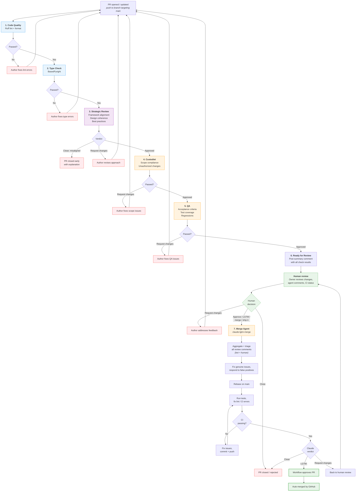

# PR Process

How pull requests move from open to merged (or rejected) in the aops repository.

## Workflow files

| Workflow    | File                        | Trigger                                 | Purpose                            |
| ----------- | --------------------------- | --------------------------------------- | ---------------------------------- |
| PR Pipeline | `pr-review-pipeline.yml`    | `pull_request`, LGTM comments, dispatch | Sequential review + merge pipeline |
| Claude      | `claude.yml`                | `@claude` in comments                   | On-demand Claude interaction       |
| Polecat     | `polecat-issue-trigger.yml` | `@polecat` in comments                  | On-demand agent work on issues/PRs |

Merge is handled by GitHub's auto-merge feature. The pipeline's job is to get the PR to an approved state; GitHub merges it automatically once status checks pass and approval is granted.

## Flowchart



## Pipeline design

The entire PR lifecycle runs as **one sequential pipeline** in `pr-review-pipeline.yml`. Each stage depends on the previous one passing. This is intentional: sequential execution fails fast and avoids wasting LLM compute on PRs that can't pass earlier gates.

GitHub auto-merge handles the final merge once the pipeline approves.

## Stage-by-stage walkthrough

### 1. Code Quality: lint

**Job**: `lint`
**Depends on**: PR opened/synchronized
**Blocking**: Yes

Runs `ruff check` and `ruff format --check`. If either fails, the pipeline stops. The author fixes and pushes; the pipeline re-runs from the top on `synchronize`.

### 2. Code Quality: type check

**Job**: `type-check`
**Depends on**: `lint`
**Blocking**: Yes

Runs `basedpyright` in basic mode. Fails the pipeline if type errors are found.

### 3. Strategic Review

**Job**: `strategic-review`
**Depends on**: `type-check`
**Blocking**: Yes -- can close PRs early

A new agent that evaluates the PR at a higher level than scope or correctness. It asks: _is this the right change for the framework?_

What it checks:

- **Framework alignment**: Does this PR further the project's vision and architectural direction? Does it fit with existing patterns or introduce unnecessary divergence?
- **Design coherence**: Is the approach well-structured? Would a different decomposition or ordering serve better?
- **Best practices**: Does the code follow established conventions, not just syntactically (that's lint's job) but structurally?
- **Proportionality**: Is the scope of change proportional to the problem? Does it try to do too much?

The strategic reviewer **can close a PR** if it's fundamentally misaligned -- e.g., it takes the wrong approach entirely, conflicts with framework principles, or tries to do too many things at once. However, closing should be rare and reserved for cases where revision won't help. The default action is to request changes with clear guidance on what needs to shift.

Agent instructions: `.github/agents/strategic-review.md`

### 4. Custodiet (scope compliance)

**Job**: `custodiet`
**Depends on**: `strategic-review`
**Blocking**: Posts review, may request changes

- Compares actual diff against PR description
- Flags out-of-scope file changes
- Detects unauthorized CI/CD, secrets, or permission modifications
- Checks convention compliance
- Posts `gh pr review --approve` or `--request-changes`

### 5. QA (acceptance criteria)

**Job**: `qa`
**Depends on**: `custodiet`
**Blocking**: Posts review, may request changes

- Verifies stated acceptance criteria are met
- Checks CI status and test coverage
- Scans for regressions (broken imports, removed references)
- Lightweight bug/security scan
- Posts `gh pr review --approve` or `--request-changes`

### 6. Ready for Review notification

**Job**: `notify-ready`
**Depends on**: `qa`
**Blocking**: No

Posts a summary comment to the PR aggregating results from all automated stages:

```
## Pipeline Complete

| Stage            | Result  | Notes              |
|------------------|---------|--------------------|
| Lint             | Passed  |                    |
| Type check       | Passed  |                    |
| Strategic review | Approved| Aligns with vision |
| Custodiet        | Approved| Scope matches      |
| QA               | Approved| Criteria met       |

Ready for human review. External bot comments (Copilot, Gemini) are
listed below for reference -- they will be triaged during merge prep.
```

This gives the human reviewer a single notification with full context, rather than requiring them to piece together results from multiple bot comments.

### 7. Human review

The human reviewer (repo owner) evaluates:

- The summary comment from the notification stage
- Code changes and PR description
- Any external bot comments (informational only at this point)

Three possible outcomes:

- **Request changes** -- author iterates, PR re-enters the pipeline
- **Close** -- PR is rejected
- **Approve** -- triggers the merge agent (via LGTM comment, formal approval, or assigning to `claude-for-github[bot]`)

### 8. Merge Agent

**Job**: `claude-lgtm-merge`
**Trigger**: Human approval, LGTM-pattern comment from owner, workflow dispatch, or PR assigned to claude bot
**Blocking**: Yes -- controls final approval

The merge agent prepares the PR for merge by handling everything in one pass:

1. **Aggregate all review comments** -- collect comments from bot reviewers (Copilot, Gemini Code Assist), custodiet, QA, and humans
2. **Triage bot comments**: genuine bug → fix; valid improvement → fix; false positive → respond; scope creep → defer
3. **Address human comments** as highest priority -- these are critical requirements
4. **Commit and push** any fixes
5. **Rebase** on main if needed (never merge-commit from main)
6. **Fix lint/CI errors** introduced by any of the above changes
7. **Run tests** and verify all checks pass
8. **Post final verdict**:
   - `LGTM:` -- workflow auto-approves the PR, GitHub auto-merge takes over
   - `Request changes:` -- back to human review
   - `Close:` -- PR rejected

The merge agent has unrestricted Bash access. This is acceptable because it has no repo admin permissions -- the worst case is damage scoped to the PR branch itself.

## Trigger reference

LGTM patterns that activate the merge agent (case-insensitive, from repo owner only):

```
lgtm | merge | rebase | ship it | @claude merge
```

## On-demand agents

These respond to mentions in comments and are independent of the pipeline:

| Mention                         | Workflow                    | Permissions    | Use case                              |
| ------------------------------- | --------------------------- | -------------- | ------------------------------------- |
| `@claude`                       | `claude.yml`                | read + write   | Questions, debugging, analysis, fixes |
| `@polecat` or `ready for agent` | `polecat-issue-trigger.yml` | read + limited | Agent-driven issue/PR processing      |

`@claude` has write access to make fixes when asked but does **not** trigger automatically on PR events. It only activates when explicitly mentioned.

## Concurrency controls

| Scope           | Group key                | Cancel in-progress?              |
| --------------- | ------------------------ | -------------------------------- |
| Review pipeline | `pr-review-{pr_number}`  | Yes (new push cancels stale run) |
| Merge agent     | `pr-merge-{pr_number}`   | No (merge runs to completion)    |
| Polecat         | `polecat-{issue_number}` | No (serial per issue)            |

## Configuration

To modify this process:

- **Add/remove lint rules**: Edit `pyproject.toml` under `[tool.ruff.lint]`
- **Change type checking strictness**: Edit `pyproject.toml` under `[tool.basedpyright]`
- **Modify strategic review behavior**: Edit `.github/agents/strategic-review.md`
- **Modify custodiet behavior**: Edit `.github/agents/custodiet.md`
- **Modify QA behavior**: Edit `.github/agents/qa.md`
- **Change merge trigger patterns**: Edit the LGTM grep pattern in `pr-review-pipeline.yml`
- **Adjust concurrency**: Edit `concurrency` blocks in `pr-review-pipeline.yml`
- **Pre-commit hooks** (local): Edit `.pre-commit-config.yaml`
