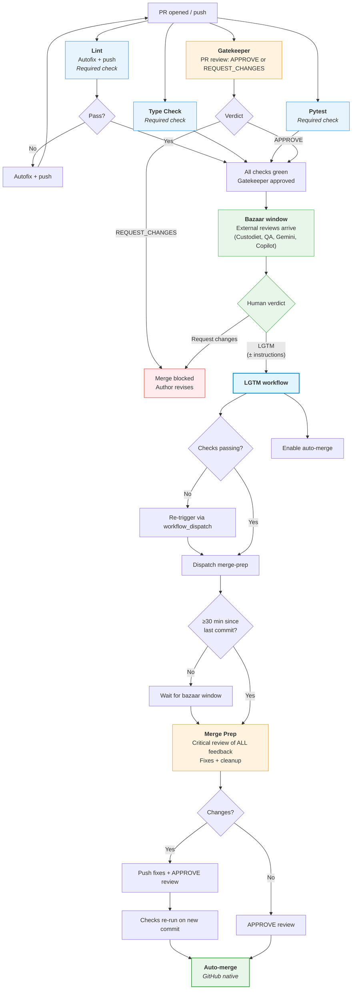

# PR Process

How pull requests move from open to merged (or rejected) in the aops repository.

## Design principles

1. **Bazaar model**: embrace ALL contributions from any source. External reviews (Gemini Code Assist, GitHub Copilot, etc.) are first-class feedback. We get maximum value from them but are not reliant on them.
2. **Separate cheap from expensive**: deterministic checks (lint, typecheck, tests) run on every push. Expensive LLM reviews run once, at the right time.
3. **Use GitHub affordances**: required status checks, PR reviews, and auto-merge handle state management. No custom commit statuses, label-based state machines, or cron dispatchers where GitHub provides a native mechanism.
4. **One human action**: the human reviews once and says "lgtm." Everything after that is automated — no second approval needed.
5. **Time for the bazaar**: merge-prep waits for external reviews to arrive before processing feedback. The pipeline doesn't race to completion.
6. **Independence**: every check and agent runs independently. No workflow chains another. If a check can run, it runs — it never waits for a different check to finish first.
7. **Interchangeability**: any authorized agent (GitHub Actions, Claude, Copilot, local polecat) can fulfil any role, as long as it uses the standard GitHub API. The pipeline doesn't care _who_ posts a review — only that the review exists.

## Workflow files

| Workflow   | File                        | Trigger                                                     | Purpose                                                              |
| ---------- | --------------------------- | ----------------------------------------------------------- | -------------------------------------------------------------------- |
| Lint       | `lint.yml`                  | `pull_request`, `push` (main)                               | `ruff check` + `ruff format`, autofix + push. Required status check. |
| Type Check | `typecheck.yml`             | `pull_request`, `push` (main)                               | `basedpyright`. Required status check.                               |
| Pytest     | `pytest.yml`                | `pull_request`, `push` (main)                               | Unit tests. Required status check.                                   |
| Gatekeeper | `agent-gatekeeper.yml`      | `pull_request: [opened, synchronize]`                       | Scope/strategy review. Posts PR review (APPROVE or REQUEST_CHANGES). |
| LGTM       | `pr-lgtm-merge.yml`         | `pull_request_review`, `issue_comment`, `workflow_dispatch` | Detects human approval, enables auto-merge, dispatches merge-prep    |
| Claude     | `claude.yml`                | `@claude` in comments                                       | On-demand interaction                                                |
| Polecat    | `polecat-issue-trigger.yml` | `@polecat` in comments                                      | On-demand agent work                                                 |

### Removed workflows

| Old workflow                  | Why removed                                                                            |
| ----------------------------- | -------------------------------------------------------------------------------------- |
| `merge-prep-gate.yml`         | Custom commit status gate replaced by branch protection requiring Gatekeeper PR review |
| `merge-prep-cron.yml`         | Cron polling replaced by event-driven dispatch from LGTM workflow                      |
| `code-quality.yml` (combined) | Split into independent `lint.yml` and `typecheck.yml`                                  |

### Agent workflows (reusable)

| Agent      | File                   | Role                        | Authority                                                  |
| ---------- | ---------------------- | --------------------------- | ---------------------------------------------------------- |
| Gatekeeper | `agent-gatekeeper.yml` | Scope/strategy guardian     | PR review: APPROVE / REQUEST_CHANGES                       |
| Custodiet  | `agent-custodiet.yml`  | Scope compliance reviewer   | PR review: APPROVE / REQUEST_CHANGES / COMMENT             |
| QA         | `agent-qa.yml`         | Verification and testing    | PR review: APPROVE / REQUEST_CHANGES                       |
| Merge Prep | `agent-merge-prep.yml` | Critical reviewer + cleanup | Edit code, push commits, post comments, PR review: APPROVE |

All agents use the same GitHub affordance: **PR reviews**. This means any agent with repo access can fulfil any role — Gatekeeper, QA, Custodiet — as long as it posts the right kind of review. The pipeline doesn't check _who_ posted the review, only that the review exists and satisfies branch protection.

Agent prompts live in `.github/agents/<name>.md`.

## How it works

The pipeline is designed so that **by the time the human looks at a PR, cheap checks are already green and external reviews have arrived**. The human's approval triggers merge-prep to clean everything up and merge — no second approval needed.

### Phase 1: Immediate (on every push)

**Cheap, deterministic, independent.** Each check runs on its own — no dependencies between them.

- **Lint** (`lint.yml`): `ruff check` + `ruff format`. Autofix and push if needed. Required status check.
- **Type Check** (`typecheck.yml`): `basedpyright`. Required status check. Runs independently — does NOT wait for Lint.
- **Pytest** (`pytest.yml`): fast unit tests (slow/integration excluded). Required status check.
- **Gatekeeper** (`agent-gatekeeper.yml`): evaluates scope/strategy alignment against STATUS.md, VISION.md, AXIOMS.md. Posts a **PR review** — APPROVE or REQUEST_CHANGES. Initially advisory; becomes a required review after tuning (see Rollout below).

All four run concurrently on every push, including bot pushes. If Lint autofixes and pushes, the others re-run on the new commit — but they were never waiting for Lint in the first place.

**Why Gatekeeper uses PR review (not commit status):**

- PR reviews are GitHub's native mechanism for "does this change look right?"
- Any agent with write access can post a PR review — interchangeable
- `REQUEST_CHANGES` blocks merge natively via branch protection (no custom status needed)
- The review body provides the explanation (no separate comment needed)
- Gatekeeper's review is visible in the same UI as human and bazaar reviews

### Phase 2: Bazaar window (~30 min)

**No pipeline activity.** External reviewers do their thing at their own pace.

- Gemini Code Assist posts its review
- GitHub Copilot posts suggestions
- Custodiet and QA post their reviews
- Other contributors comment
- Human reads, thinks, asks questions

This is not enforced mechanically — it's the natural delay between "PR opened" and "human is ready to approve." For trivial PRs, the human can approve immediately. For complex PRs, the bazaar has time to contribute.

### Phase 3: Human review (single action)

The human reviews the PR with full context: the diff, Gatekeeper's review, and any bazaar feedback. They give their verdict:

- **"lgtm"** — approve as-is, let merge-prep clean up and merge
- **"lgtm, but change x y z"** — approve the direction, instruct merge-prep what to fix
- **Approve via GitHub review UI** — same as "lgtm"
- **Request changes** — not ready yet, author/agent needs to revise

The LGTM workflow (`pr-lgtm-merge.yml`):

1. Detects human approval (PR review `state: approved` from any human, OR "lgtm" comment from authorized users)
2. Checks whether required status checks are passing on the PR HEAD
3. If checks haven't run or are failing, re-triggers individual workflows via `workflow_dispatch` (recovers stuck PRs where checks never triggered — e.g., bot-created branches using GITHUB_TOKEN)
4. Enables GitHub auto-merge (rebase mode)
5. Dispatches `agent-merge-prep.yml` via `workflow_dispatch` (event-driven, not cron)
6. Posts acknowledgment summarizing status: what's passing, what's blocking, what was dispatched

**This is the human's only action.** They do not need to approve again after merge-prep pushes.

### Phase 4: Merge Prep (event-driven, after LGTM)

Merge Prep is dispatched directly by the LGTM workflow — no cron, no polling, no label checking.

**Merge Prep** is a smart LLM with instructions to do critical review. It:

1. Reads the PR description and diff
2. Reads ALL review feedback from every source:
   - Gatekeeper's review
   - Custodiet and QA reviews
   - Bazaar reviews (Gemini, Copilot, human commenters, etc.)
   - The human's LGTM comment (including any specific instructions like "change x y z")
3. Makes judgment calls about each piece of feedback:
   - **Fix**: genuine bugs, valid improvements, human's explicit instructions
   - **Dismiss**: false positives, misunderstandings, irrelevant suggestions
   - **Defer**: scope creep, future work suggestions
4. Runs lint + typecheck + tests locally to verify clean code
5. Pushes fixes (if any) with a `Merge-Prep-By: agent` trailer
6. Posts a triage summary comment
7. Posts a PR review: APPROVE (signals completion to branch protection)
8. Dismisses stale REQUEST_CHANGES reviews it has addressed

After merge-prep pushes:

- Lint, Type Check, Pytest re-run (required status checks) — cheap, expected
- Gatekeeper re-runs (required review) — evaluates final code
- Human's approval is still valid (`dismiss_stale_reviews_on_push: false`)
- Auto-merge fires when all required checks pass and required reviews are met

If merge-prep makes no changes (PR was already clean), it posts APPROVE and auto-merge fires on that tick.

#### Failure handling

If Merge Prep fails (API timeout, logic error, etc.):

- The workflow run shows as failed in the Actions tab (standard GitHub visibility)
- The human can re-trigger via `workflow_dispatch` or comment "lgtm" again
- After 3 consecutive failures on the same PR, merge-prep posts a comment requesting human intervention and adds a `needs-attention` label (informational, not load-bearing)

#### Time gate

Merge Prep checks the time since the last commit before starting work:

- If last commit was < 30 minutes ago, merge-prep waits (sleep or re-dispatch with delay)
- This preserves bazaar window without requiring a cron dispatcher
- The LGTM workflow can pass `skip_time_gate: true` for urgent merges

### Phase 5: Auto-merge

GitHub's native auto-merge handles the final step. It merges (rebase) when ALL conditions are met:

**Required status checks** (branch protection):

- Lint: `success`
- Type Check: `success`
- Pytest: `success`

**Required reviews** (branch protection):

- At least 1 approving review from a human or bot
- No outstanding REQUEST_CHANGES reviews (Gatekeeper's REQUEST_CHANGES blocks merge; merge-prep dismisses it after fixing the issue, or Gatekeeper re-approves on the fixed commit)

That's it. No custom commit statuses, no label gates, no cron polling. Branch protection is the only orchestrator.

## Approval architecture

The branch protection ruleset requires **1 approving review** before merge:

| Review     | Actor                 | When                    | How                                             |
| ---------- | --------------------- | ----------------------- | ----------------------------------------------- |
| Gatekeeper | `github-actions[bot]` | Phase 1 (on push)       | `gh pr review --approve` or `--request-changes` |
| Bazaar     | Various               | Phase 2 (natural delay) | External tools + human comments                 |
| Human      | `nicsuzor`            | Phase 3 (single action) | GitHub review UI or "lgtm" comment              |
| Merge Prep | `github-actions[bot]` | Phase 4 (after LGTM)    | `gh pr review --approve` (signals completion)   |

Any of these can satisfy the "1 approving review" requirement. In practice, the human's approval + Gatekeeper's approval means the review count is always met.

**Blocking reviews**: If Gatekeeper posts REQUEST_CHANGES, that blocks merge via branch protection. The author fixes the code, Gatekeeper re-runs on the new push and (if satisfied) posts APPROVE. Alternatively, a human can dismiss Gatekeeper's review if they disagree.

## GitHub ruleset

```json
{
  "required_approving_review_count": 1,
  "required_status_checks": [
    { "context": "Lint" },
    { "context": "Type Check" },
    { "context": "Pytest" }
  ],
  "dismiss_stale_reviews_on_push": false
}
```

**Note:** Gatekeeper is enforced via **required reviews**, not required status checks. Its REQUEST_CHANGES review blocks merge natively. This is cleaner than a custom commit status because it uses the same mechanism as human reviews.

**Rollout:** Start with just `Lint` as required status check (current state). Add `Type Check` and `Pytest` after verifying they run reliably on all PRs. Gatekeeper reviews are advisory until the review enforcement is tuned.

## Flowchart



## LGTM detection

The LGTM workflow detects human approval via:

1. **`pull_request_review` event**: `state: approved` from a non-bot user
2. **`issue_comment` event**: LGTM-pattern comment from authorized users (nicsuzor)
3. **`workflow_dispatch`**: manual trigger with PR number

LGTM patterns (case-insensitive, start of comment):

```
lgtm | merge | ship it
```

The LGTM comment body is preserved and passed to Merge Prep as human instructions. "lgtm, but fix the docstring on line 42" means Merge Prep will read "fix the docstring on line 42" as a directive.

### LGTM with failing or missing checks

When a human says "lgtm" but required status checks are failing or haven't run:

1. The LGTM workflow checks the current state of all check runs on the PR HEAD commit
2. If any check hasn't run or is failing, it re-triggers the specific workflow(s) via `workflow_dispatch`
3. It posts a comment explaining what's blocking and what it did about it
4. It still enables auto-merge, which will merge once all checks pass
5. The human does not need to take further action unless the issue cannot be auto-resolved

### LGTM with merge conflicts

When the PR has merge conflicts at LGTM time:

1. The LGTM workflow detects `mergeable: CONFLICTING` state
2. LGTM still enables auto-merge, but passes `resolve_conflicts: true` to merge-prep
3. Merge-prep resolves conflicts by merging from main, then proceeds with normal review triage
4. After merge-prep pushes the resolved branch, checks re-run and auto-merge fires when they pass

The human does not need to take further action unless merge-prep cannot resolve the conflicts.

## Safety mechanisms

| Mechanism                                         | What it prevents                                        |
| ------------------------------------------------- | ------------------------------------------------------- |
| Gatekeeper PR review (REQUEST_CHANGES)            | Misaligned/harmful PRs reaching merge                   |
| Required status checks (Lint, Type Check, Pytest) | Broken code reaching main                               |
| Required review count = 1                         | Merging without human oversight                         |
| `dismiss_stale_reviews_on_push: false`            | Merge-prep push invalidating human approval             |
| Time gate in merge-prep (30 min)                  | Merge-prep running before bazaar reviews arrive         |
| `Merge-Prep-By:` commit trailer                   | Identifying bot commits in git history                  |
| LGTM check re-trigger                             | Stuck PRs where checks never ran (bot-created branches) |
| LGTM conflict detection                           | Merge conflicts blocking auto-merge silently            |
| `workflow_dispatch` override                      | Manual intervention when automation isn't enough        |
| `needs-attention` label (after 3 failures)        | Surfacing persistent problems                           |

### What we removed (and why)

| Old mechanism                                  | Why it's gone                                                                  |
| ---------------------------------------------- | ------------------------------------------------------------------------------ |
| `Merge Prep` commit status (custom gate)       | Branch protection + PR reviews do this natively                                |
| `merge-prep-gate.yml` (pending status on push) | Was a workaround for not using PR reviews                                      |
| `merge-prep-cron.yml` (polling dispatcher)     | Event-driven dispatch from LGTM is simpler and faster                          |
| `lgtm` label (load-bearing)                    | LGTM workflow dispatches merge-prep directly; no label needed for coordination |
| `merge-prep-running` label                     | No cron = no duplicate dispatch risk                                           |
| `merge-prep-failed` label                      | Replaced by `needs-attention` (informational only)                             |
| Lint → Type Check dependency                   | They're independent checks that have no reason to chain                        |

## Concurrency

| Scope      | Group key                | Cancel in-progress? |
| ---------- | ------------------------ | ------------------- |
| Lint       | `lint-{pr_number}`       | Yes                 |
| Type Check | `typecheck-{pr_number}`  | Yes                 |
| Pytest     | `pytest-{pr_number}`     | Yes                 |
| Gatekeeper | `gatekeeper-{pr_number}` | Yes                 |
| Merge Prep | `merge-prep-{pr_number}` | Yes                 |
| LGTM       | `pr-lgtm-{pr_number}`    | No                  |

## Issue review

Each agent has its own trigger workflow for issues:

| Workflow                     | Agent     | What it does                                                          |
| ---------------------------- | --------- | --------------------------------------------------------------------- |
| `issue-review-custodiet.yml` | Custodiet | Assesses user story quality, acceptance criteria, scope clarity       |
| `issue-review-hydrator.yml`  | Hydrator  | Surfaces existing infrastructure, inconsistencies, downstream impacts |

Both trigger independently on `issues: [opened]`. Skips: bot-created issues, epics. Silence means the proposal is fine.

## Trigger reference

### Merge triggers

| Event                              | Filter                                                | Why                               |
| ---------------------------------- | ----------------------------------------------------- | --------------------------------- |
| `pull_request_review: [submitted]` | Human only (`user.type != 'Bot'`), state = `approved` | Formal human approval             |
| `issue_comment: [created]`         | `nicsuzor` only, on PRs, LGTM pattern                 | Owner's merge signal              |
| `workflow_dispatch`                | Manual                                                | Explicit trigger for specific PRs |

### On-demand agents

| Mention    | Workflow                    | Use case                              |
| ---------- | --------------------------- | ------------------------------------- |
| `@claude`  | `claude.yml`                | Questions, debugging, analysis, fixes |
| `@polecat` | `polecat-issue-trigger.yml` | Task processing, guided work          |

## Configuration

- **Bazaar window**: 30 minutes (checked by merge-prep before starting work)
- **Max merge-prep retries**: 3 (before adding `needs-attention` label)
- **LGTM patterns**: `lgtm | merge | ship it` (case-insensitive, start of comment)
- **Agent prompts**: `.github/agents/<name>.md`
- **Lint rules**: `pyproject.toml` under `[tool.ruff.lint]`
- **Type checking**: `pyproject.toml` under `[tool.basedpyright]`
- **Test markers**: `@pytest.mark.slow` (skipped in CI), `@pytest.mark.integration`

## Design decisions

- **Gatekeeper uses PR review, not commit status.** This is the key architectural change. PR reviews are GitHub's native mechanism for "does this change look right?" Using them means any authorized agent can fulfil the Gatekeeper role interchangeably, and blocking/unblocking works through the standard review UI. Commit statuses are for CI results (did the tests pass?), not for judgment calls.
- **No cron dispatcher.** The LGTM workflow dispatches merge-prep directly via `workflow_dispatch`. This is faster (no 15-minute wait for next cron tick), simpler (no label-based state machine), and more reliable (no polling, no missed qualifications due to exact check name matching).
- **Lint and Type Check are independent.** There's no reason Type Check should wait for Lint. If Lint autofixes and pushes, Type Check will re-run on the new commit. But running them in parallel means faster feedback on the common case where Lint passes.
- **Labels are informational, not load-bearing.** `needs-attention` helps humans notice stuck PRs, but no workflow reads it to make decisions. The pipeline's control flow is entirely through GitHub events and branch protection.
- **Custodiet and QA remain independent agents.** They post reviews during the bazaar window. Merge Prep reads their feedback alongside other reviewers. This preserves independent review perspectives.
- **30 minutes is the default bazaar window.** The LGTM workflow can pass `skip_time_gate: true` for urgent merges.

## Migration plan

### Step 1: Split code-quality.yml

- Create `lint.yml` (lint + autofix only)
- Create `typecheck.yml` (basedpyright only)
- Keep `code-quality.yml` temporarily (both old and new run in parallel)
- Verify both new workflows run correctly on 2-3 PRs

### Step 2: Convert Gatekeeper to PR review

- Update `agent-gatekeeper.yml` to post `gh pr review --approve` or `--request-changes` instead of commit status
- Remove Gatekeeper from required status checks (it's now enforced via required reviews)
- Verify on 2-3 PRs

### Step 3: Make LGTM dispatch merge-prep

- Update `pr-lgtm-merge.yml` to dispatch `agent-merge-prep.yml` directly
- Update `agent-merge-prep.yml` to post PR review (APPROVE) instead of commit status
- Add time gate check inside merge-prep
- Remove `merge-prep-gate.yml`
- Remove `merge-prep-cron.yml`
- Verify on 2-3 PRs

### Step 4: Clean up

- Remove `code-quality.yml` (replaced by lint.yml + typecheck.yml)
- Remove label-based logic from all workflows
- Update branch protection: add Type Check and Pytest to required status checks
- Update this spec to remove migration notes

## Known limitations

- **Force-pushes disable auto-merge**: Merge-prep uses `git merge` (not rebase) to avoid force-pushes. If a force-push happens for other reasons, auto-merge must be re-enabled manually or by re-triggering LGTM.
- **All agent reviews show as `github-actions[bot]`**: Reviews from gatekeeper, custodiet, QA, and merge-prep all share the `GITHUB_TOKEN` identity. Agents identify themselves in the review body text.
- **`issue_comment` triggers are noisy**: Any PR comment triggers Claude Code, Polecat, and LGTM workflows (all skip via job-level `if:` filters, but show as 1-second skipped runs in Actions).
