# PR Process

How pull requests move from open to merged (or rejected) in the aops repository.

## Workflow files

| Workflow    | File                        | Trigger                                        | Purpose                            |
| ----------- | --------------------------- | ---------------------------------------------- | ---------------------------------- |
| Code Quality| `code-quality.yml`          | `push` (main), `pull_request` (opened, synchronize, assigned) | Lint + gatekeeper (parallel), then type-check |
| PR Pipeline | `pr-review-pipeline.yml`    | `workflow_run` (Code Quality), LGTM comments, dispatch | LLM review chain (strategic → QA) + merge agent |
| Claude      | `claude.yml`                | `@claude` in comments                          | On-demand Claude interaction       |

Merge is handled by GitHub's **merge queue**. The ruleset requires **2 approvals**: one from the gatekeeper bot (`claude[bot]`, automated) and one from the LGTM merge agent (`github-actions[bot]`, triggered by human approval). When the merge agent confirms LGTM, it adds the PR to the merge queue. GitHub then rebases the PR against the latest main, reruns required checks, and merges automatically — eliminating manual serial rebases when multiple PRs are in flight.

> **Setup note**: Merge queue is enabled in the repository ruleset (GitHub Settings → Rules → Rulesets → "PR Review and Merge rules"). It cannot be configured via REST API — use the GitHub UI to enable/configure the merge queue rule.

## Flowchart

```mermaid
flowchart TD
    PR["PR opened / updated<br/><i>push to branch targeting main</i>"]

    %% ── code-quality.yml: Lint + Gatekeeper in parallel, then Type Check ──
    PR --> Lint["<b>1a. Code Quality</b><br/>Ruff lint + format"]
    PR --> Gatekeeper["<b>1b. Gatekeeper</b><br/>Alignment vs VISION.md<br/>Code quality + fit<br/><i>🔑 Approval #1 (claude[bot])</i>"]

    Lint --> LintPass{Passed?}
    LintPass -- No --> AutoFix["Autofix: ruff check --fix<br/>+ ruff format<br/><i>commit & push</i>"]
    AutoFix --> AutoFixOk{Changes<br/>made?}
    AutoFixOk -- Yes --> PR
    AutoFixOk -- No --> FixLint["Author fixes lint errors"]
    FixLint --> PR
    LintPass -- Yes --> TypeCk

    TypeCk["<b>2. Type Check</b><br/>BasedPyright"] --> TypePass{Passed?}
    TypePass -- No --> FixType["Author fixes type errors"]
    FixType --> PR

    Gatekeeper --> GKPass{Verdict}
    GKPass -- "Reject" --> EarlyReject["PR closed early<br/><i>with explanation</i>"]
    GKPass -- "Request changes" --> FixGK["Author revises approach"]
    FixGK --> PR

    %% ── pr-review-pipeline.yml: starts after ALL code-quality jobs pass ──
    TypePass -- Yes --> WFRun["workflow_run<br/><i>all code-quality passed</i>"]
    GKPass -- Approved --> WFRun

    WFRun --> Strategic["<b>3. Strategic Review</b><br/>Design coherence<br/>Best practices"]
    Strategic --> StratPass{Verdict}
    StratPass -- "Close: misaligned" --> EarlyReject
    StratPass -- "Request changes" --> FixStrat["Author revises approach"]
    FixStrat --> PR
    StratPass -- Approved --> Custodiet

    %% ── Scope + Acceptance ──
    Custodiet["<b>4. Custodiet</b><br/>Scope compliance<br/>Unauthorized changes"] --> CustPass{Passed?}
    CustPass -- "Request changes" --> FixScope["Author fixes scope issues"]
    FixScope --> PR
    CustPass -- Approved --> QA

    QA["<b>5. QA</b><br/>Acceptance criteria<br/>Test coverage<br/>Regressions"] --> QAPass{Passed?}
    QAPass -- "Request changes" --> FixQA["Author fixes QA issues"]
    FixQA --> PR

    %% ── Ready for Review ──
    QAPass -- Approved --> Notify["<b>6. Ready for Review</b><br/>Post summary comment<br/>with all check results"]

    Notify --> HumanReview["<b>Human review</b><br/>Owner reviews changes,<br/>agent comments, CI status"]

    HumanReview --> Decision{Human<br/>decision}
    Decision -- "Request changes" --> AuthorFix["Author addresses feedback"]
    AuthorFix --> PR
    Decision -- "Close" --> Rejected["PR closed / rejected"]
    Decision -- "Approve / LGTM /<br/>merge / ship it" --> MergeAgent

    %% ── Merge Preparation ──
    MergeAgent["<b>7. Merge Agent</b><br/>claude-lgtm-merge"]

    MergeAgent --> AggComments["Aggregate + triage<br/>all review comments<br/><i>(bot + human)</i>"]
    AggComments --> FixAll["Fix genuine issues,<br/>respond to false positives"]
    FixAll --> Rebase["Rebase on main"]
    Rebase --> RunTests["Run tests,<br/>fix lint / CI errors"]
    RunTests --> TestPass{CI<br/>passing?}
    TestPass -- No --> FixCI["Fix issues,<br/>commit + push"]
    FixCI --> RunTests
    TestPass -- Yes --> Verdict{Claude<br/>verdict}
    Verdict -- "LGTM:" --> AutoApprove["Workflow approves PR<br/><i>🔑 Approval #2 (github-actions[bot])</i><br/>+ adds to merge queue"]
    Verdict -- "Request changes" --> BackToAuthor["Back to human review"]
    BackToAuthor --> HumanReview
    Verdict -- "Close" --> Rejected

    AutoApprove --> Merged["Merged by GitHub merge queue<br/><i>(rebased + checks passed)</i>"]

    %% ── Styling ──
    classDef gate fill:#e8f4fd,stroke:#2196f3
    classDef agent fill:#fff3e0,stroke:#ff9800
    classDef gatekeeper fill:#e3f2fd,stroke:#1565c0,stroke-width:2px
    classDef human fill:#e8f5e9,stroke:#4caf50
    classDef fail fill:#ffebee,stroke:#f44336
    classDef success fill:#e8f5e9,stroke:#4caf50,stroke-width:2px

    class Lint,TypeCk gate
    class Custodiet,QA,MergeAgent,Strategic agent
    class Gatekeeper gatekeeper
    class HumanReview,Decision human
    class Rejected,EarlyReject,FixLint,FixType,FixGK,FixStrat,FixScope,FixQA,AuthorFix fail
    class Merged,AutoApprove success
```



## Pipeline design

The PR lifecycle runs across **three workflows**, linked by `workflow_run`:

1. **Code Quality** (`code-quality.yml`): Lint, gatekeeper, and type-check. Lint and gatekeeper run in parallel with no dependency on each other; type-check runs after lint passes. The gatekeeper is the first substantive LLM review and runs early so that misaligned PRs get feedback immediately, even if lint or type-check fail.
2. **Pytest** (`pytest.yml`): Runs automated tests. Triggered on push/PR to main, and also after `Code Quality` passes.
3. **PR Pipeline** (`pr-review-pipeline.yml`): LLM review chain (strategic → custodiet → QA → notify). Only starts when ALL Code Quality jobs complete successfully, via a `workflow_run` trigger. A `setup` job extracts PR metadata from the `workflow_run` event and passes it to downstream stages.

```
code-quality.yml:        [lint, gatekeeper]  ← parallel, no dependency
                              ↓
                          type-check          ← needs: lint (not gatekeeper)
                              ↓ (workflow_run: completed + success — ALL jobs must pass)
pytest.yml:              pytest               ← runs after Code Quality
                              ↓
pr-review-pipeline.yml:  setup → strategic-review → custodiet → qa → notify-ready
                         (+ merge agent, triggered independently)
```

Lint and gatekeeper run in parallel because they have no logical dependency: lint handles syntax while gatekeeper reviews alignment via `gh pr diff` (GitHub API). Type-check depends on lint (for autofix commits) but not on gatekeeper. The `workflow_run` trigger fires with `conclusion: success` only when ALL jobs pass, so a gatekeeper failure still blocks the downstream pipeline.

The merge queue handles the final merge. When a PR is added to the queue, GitHub rebases it against the current head of main, runs all required status checks, and merges it automatically. Multiple PRs queue in order; each is tested against the result of merging all prior queued PRs, preventing cascade conflicts.

## Approval architecture

The ruleset requires **2 approving reviews** before merge:

| Approval | Actor | When | How |
|----------|-------|------|-----|
| #1 Gatekeeper | `claude[bot]` | Automated, parallel with lint (in code-quality.yml) | `gh pr review --approve` inside claude-code-action |
| #2 LGTM merge | `github-actions[bot]` | After human triggers merge via approval/LGTM comment | `gh pr review --approve` via GITHUB_TOKEN |

The human reviewer's LGTM comment or formal approval **triggers** the merge agent, which addresses review comments, lodges the second approval, and adds the PR to the merge queue. The human only acts once.

## Stage-by-stage walkthrough

### 1. Code Quality: lint

**Job**: `lint`
**Depends on**: Any `pull_request` event (opened, synchronize, assigned)
**Blocking**: Yes

Runs `ruff check` and `ruff format --check`. If either fails, the job attempts **autofix**: it runs `ruff check --fix` and `ruff format`, then commits and pushes the fixes back to the PR branch. The push triggers a new `synchronize` event, which re-runs the pipeline with the fixed code. If autofix produces no changes (e.g. the issue requires manual intervention), the pipeline stops and the author must fix manually.

### 2. Code Quality: type check

**Job**: `type-check`
**Depends on**: `lint`
**Blocking**: Yes

Runs `basedpyright` in basic mode. Fails the pipeline if type errors are found.

### 3. Gatekeeper (alignment + quality gate)

**Job**: `gatekeeper` (in `code-quality.yml`)
**Depends on**: None -- runs in parallel with lint
**Blocking**: Yes -- can reject PRs, lodges approval #1

The first substantive review. Runs in parallel with lint so that misaligned PRs get feedback immediately, even if lint or type-check fail. Evaluates whether the PR belongs in the project at all, checking against `docs/VISION.md` and `aops-core/AXIOMS.md`. Because the gatekeeper runs before lint completes, the code may not yet be syntactically valid — the gatekeeper focuses on alignment and fit, not syntax.

What it checks:

- **Framework alignment**: Does this PR further the project's vision? Does it fit with existing patterns?
- **Code quality**: Obvious correctness issues, security concerns, appropriate error handling.
- **Proportionality**: Is the scope proportional to the problem? Could it be split?
- **Fit**: Does it follow structural conventions? Are responsibilities clearly separated?

The gatekeeper **can reject a PR** (recommend close) if it's fundamentally misaligned with the project vision. However, rejection should be rare -- the default for fixable issues is to request changes. Most PRs should pass.

When the gatekeeper approves, it lodges a formal GitHub approval from `claude[bot]`. This is **approval #1 of 2** required for merge. A gatekeeper failure blocks the downstream review pipeline via the `workflow_run` trigger (which requires ALL code-quality jobs to pass).

Agent instructions: `.github/agents/gatekeeper.md`

### 4. Strategic Review

**Job**: `strategic-review` (in `pr-review-pipeline.yml`)
**Depends on**: `setup` (all pr-checks must have passed via workflow_run)
**Blocking**: Yes -- can close PRs early

Evaluates the PR at a higher level: design coherence, best practices, and whether the approach is well-structured. Can close PRs or request changes.

Agent instructions: `.github/agents/strategic-review.md`

### 5. Custodiet (scope compliance)

**Job**: `custodiet`
**Depends on**: `strategic-review`
**Blocking**: Posts review, may request changes

- Compares actual diff against PR description
- Flags out-of-scope file changes
- Detects unauthorized CI/CD, secrets, or permission modifications
- Checks convention compliance
- Posts `gh pr review --approve` or `--request-changes`

### 6. QA (acceptance criteria)

**Job**: `qa`
**Depends on**: `custodiet`
**Blocking**: Posts review, may request changes

- Verifies stated acceptance criteria are met
- Checks CI status and test coverage
- Scans for regressions (broken imports, removed references)
- Lightweight bug/security scan
- Posts `gh pr review --approve` or `--request-changes`

### 7. Ready for Review notification

**Job**: `notify-ready`
**Depends on**: `qa`
**Blocking**: No

Posts a summary comment to the PR aggregating results from all automated stages:

```
## Pipeline Complete

| Stage            | Result  | Notes              |
|------------------|---------|--------------------|
| Lint             | Passed  |                    |
| Type check       | Passed  |                    |
| Strategic review | Approved| Aligns with vision |
| Custodiet        | Approved| Scope matches      |
| QA               | Approved| Criteria met       |

Ready for human review. External bot comments (Copilot, Gemini) are
listed below for reference -- they will be triaged during merge prep.
```

This gives the human reviewer a single notification with full context, rather than requiring them to piece together results from multiple bot comments.

### 8. Human review

The human reviewer (repo owner) evaluates:

- The summary comment from the notification stage
- Code changes and PR description
- Any external bot comments (informational only at this point)

Three possible outcomes:

- **Request changes** -- author iterates, PR re-enters the pipeline
- **Close** -- PR is rejected
- **Approve / LGTM** -- triggers the merge agent (via LGTM comment, formal approval, or assigning to `claude-for-github[bot]`). The human only needs to act once.

### 9. Merge Agent

**Job**: `claude-lgtm-merge`
**Trigger**: Human approval, LGTM-pattern comment from owner, workflow dispatch, or PR assigned to claude bot
**Blocking**: Yes -- controls approval #2

The merge agent prepares the PR for merge by handling everything in one pass:

1. **Aggregate all review comments** -- collect comments from bot reviewers (Copilot, Gemini Code Assist), custodiet, QA, and humans
2. **Triage bot comments**: genuine bug → fix; valid improvement → fix; false positive → respond; scope creep → defer
3. **Address human comments** as highest priority -- these are critical requirements
4. **Commit and push** any fixes
5. **Rebase** on main if needed (never merge-commit from main)
6. **Fix lint/CI errors** introduced by any of the above changes
7. **Run tests** and verify all checks pass
8. **Post final verdict**:
   - `LGTM:` -- workflow approves the PR (`github-actions[bot]`, approval #2) and adds to merge queue
   - `Request changes:` -- back to human review
   - `Close:` -- PR rejected

When the merge agent confirms LGTM, the workflow lodges approval #2 from `github-actions[bot]` and adds the PR to the **merge queue** (`gh pr merge --merge-queue`). The merge queue automatically rebases each PR against the latest main, runs required checks in a temporary merge branch, and merges in order. This eliminates the cascade-conflict problem when multiple polecat PRs are in flight simultaneously.

If merge queue is not yet enabled, the workflow falls back to `gh pr merge --auto --rebase`.

The merge agent has unrestricted Bash access. This is acceptable because it has no repo admin permissions -- the worst case is damage scoped to the PR branch itself.

## Trigger reference

LGTM patterns that activate the merge agent (case-insensitive, from repo owner only):

```
lgtm | merge | rebase | ship it | @claude merge
```

## On-demand agents

These respond to mentions in comments and are independent of the pipeline:

| Mention   | Workflow     | Permissions  | Use case                              |
| --------- | ------------ | ------------ | ------------------------------------- |
| `@claude` | `claude.yml` | read + write | Questions, debugging, analysis, fixes |

`@claude` has write access to make fixes when asked but does **not** trigger automatically on PR events. It only activates when explicitly mentioned.

## Concurrency controls

| Scope           | Group key                    | Cancel in-progress?              |
| --------------- | ---------------------------- | -------------------------------- |
| PR Checks (lint)| `pr-checks-{pr_number}`      | Yes (new push cancels stale run) |
| Gatekeeper      | `pr-gatekeeper-{pr_number}`  | Yes (new push cancels stale run) |
| Review pipeline | `pr-review-{pr_number}`      | Yes (new push cancels stale run) |
| Merge agent     | `pr-merge-{pr_number}`       | No (merge runs to completion)    |

## Configuration

To modify this process:

- **Add/remove lint rules**: Edit `pyproject.toml` under `[tool.ruff.lint]`
- **Change type checking strictness**: Edit `pyproject.toml` under `[tool.basedpyright]`
- **Modify strategic review behavior**: Edit `.github/agents/strategic-review.md`
- **Modify custodiet behavior**: Edit `.github/agents/custodiet.md`
- **Modify QA behavior**: Edit `.github/agents/qa.md`
- **Change merge trigger patterns**: Edit the LGTM grep pattern in `pr-review-pipeline.yml`
- **Adjust concurrency**: Edit `concurrency` blocks in `pr-review-pipeline.yml`
- **Pre-commit hooks** (local): Edit `.pre-commit-config.yaml`
- **Merge queue settings**: Configure via GitHub UI → Settings → Rules → Rulesets → "PR Review and Merge rules" → add merge_queue rule. Recommended settings: merge method = rebase, min entries = 1, max to build = 5, grouping = ALLGREEN.
- **Allowed merge methods**: Currently restricted to rebase-only (enforced by ruleset). Do not add merge-commit or squash without updating the merge agent prompt.
