# PR Process

How pull requests move from open to merged (or rejected) in the aops repository.

## Workflow files

| Workflow         | File                        | Trigger                                        | Purpose                                      |
| ---------------- | --------------------------- | ---------------------------------------------- | -------------------------------------------- |
| Code Quality     | `code-quality.yml`          | `push` (main), `pull_request` (opened, synchronize, assigned) | Lint + gatekeeper (parallel), then type-check |
| PR Review        | `pr-review-pipeline.yml`    | `workflow_run` (Code Quality completed)        | Sequential: custodiet → QA → merge-prep → notify |
| Merge            | `pr-lgtm-merge.yml`         | `pull_request_review`, `issue_comment`, `workflow_dispatch` | Human-triggered: approve + merge |
| Pytest           | `pytest.yml`                | `push` (main), `pull_request`, `workflow_dispatch` | Fast unit tests (slow/integration excluded) |
| Claude           | `claude.yml`                | `@claude` in comments                          | On-demand Claude interaction                 |
| Polecat          | `polecat-issue-trigger.yml` | `@polecat` in comments, `workflow_dispatch`    | On-demand agent work |
| Issue: Custodiet | `issue-review-custodiet.yml`| `issues` (opened)                              | Proposal quality review |
| Issue: Hydrator  | `issue-review-hydrator.yml` | `issues` (opened)                              | Infrastructure context for proposals |

### Reusable agent workflows

Each agent is a first-class entity with its own `workflow_call` file, personality, and defined authority. Orchestrators call agents; agents don't trigger on their own.

| Agent | File | Personality | Authority |
|-------|------|-------------|-----------|
| Gatekeeper | `agent-gatekeeper.yml` | Authoritative guardian. Defaults to approval. Gates everything. | APPROVE, REQUEST CHANGES (fails job on rejection) |
| Custodiet | `agent-custodiet.yml` | Vigilant, precise. Rules enforcer. | PRs: APPROVE/REQUEST CHANGES. Issues: COMMENT only |
| QA | `agent-qa.yml` | Methodical, evidence-based. Verifies claims. | APPROVE, REQUEST CHANGES |
| Merge Prep | `agent-merge-prep.yml` | Diligent, thorough. The janitor. Fixes what reviewers found. | EDIT code, push commits, post comments |
| Hydrator | `agent-hydrator.yml` | Helpful, contextual. Surfaces infrastructure knowledge. | COMMENT only (advisory) |

Agent prompts live in `.github/agents/<name>.md`. Each reusable workflow reads its own prompt file.

## How it works

The pipeline is designed so that **by the time the human looks at a PR, everything should be clean**. The human's approval is the last step — it triggers an immediate merge.

```
code-quality.yml:        [lint ─── gatekeeper] (parallel)
                              ↓
                          type-check
                              ↓ (workflow_run: all pass, gatekeeper approved)
pr-review-pipeline.yml:  custodiet → qa → merge-prep → notify-ready

pr-lgtm-merge.yml:       human approves → approve (Approval #2) → merge
```

If gatekeeper rejects, its job fails → Code Quality fails → the review pipeline never starts.

If custodiet or QA request changes, merge-prep attempts to auto-fix them and push a new commit. Each push re-triggers the PR Review pipeline and reruns the custodiet → QA → merge-prep chain. The notify-ready step **only** posts "Ready for human review" after verifying that the latest custodiet and QA reviews are all in the APPROVED state; if any agent still has CHANGES_REQUESTED, it does not declare readiness. To avoid an infinite loop when merge-prep cannot satisfy the reviewers, merge-prep is bounded by a small maximum number of auto-fix iterations; after that limit is reached (or if it cannot confidently fix the issues), it stops pushing, surfaces the remaining problems in a comment, and allows a human to intervene.

## Approval architecture

The ruleset requires **2 approving reviews** before merge:

| Approval | Actor | When | How |
|----------|-------|------|-----|
| #1 Gatekeeper | `claude[bot]` | Automated, parallel with lint | `gh pr review --approve` in gatekeeper agent |
| #2 Human merge | `github-actions[bot]` | After human triggers merge via approval/LGTM | `gh pr review --approve` via GITHUB_TOKEN |

The human reviewer's approval or LGTM comment triggers the merge workflow, which lodges Approval #2 and adds the PR to the merge queue. The human only acts once.

## Flowchart

```mermaid
flowchart TD
    PR["PR opened / updated"]

    %% ── Code Quality ──
    PR --> Lint["<b>1a. Lint</b><br/>Ruff lint + format"]
    PR --> GK["<b>1b. Gatekeeper</b><br/>Alignment, design, quality<br/><i>🔑 Approval #1</i>"]

    Lint --> LintOK{Pass?}
    LintOK -- No --> AutoFix["Autofix + push"]
    AutoFix --> PR
    LintOK -- Yes --> TypeCk["<b>2. Type Check</b>"]

    GK --> GKV{Verdict}
    GKV -- Reject --> Close["PR closed"]
    GKV -- Changes --> FixGK["Author revises"]
    FixGK --> PR

    %% ── Review Pipeline (only if Code Quality passes) ──
    TypeCk --> AllPass
    GKV -- Approved --> AllPass["All Code Quality passed"]

    AllPass --> Cust["<b>3. Custodiet</b><br/>Scope, principles"]
    Cust --> QA["<b>4. QA</b><br/>Criteria, tests"]
    QA --> MP["<b>5. Merge Prep</b><br/>Fix review comments"]

    MP --> MPPush{Pushed<br/>fixes?}
    MPPush -- Yes --> PR
    MPPush -- No --> Notify["<b>6. Ready for Review</b><br/><i>Your approval = merge</i>"]

    Notify --> Human["<b>Human review</b>"]
    Human --> HV{Decision}
    HV -- Changes --> AuthorFix["Author fixes"]
    AuthorFix --> PR
    HV -- Close --> Close
    HV -- "LGTM" --> Merge["<b>7. Merge</b><br/><i>🔑 Approval #2</i><br/>→ merge queue"]

    %% ── Styling ──
    classDef gate fill:#e8f4fd,stroke:#2196f3
    classDef agent fill:#fff3e0,stroke:#ff9800
    classDef gatekeeper fill:#e3f2fd,stroke:#1565c0,stroke-width:2px
    classDef human fill:#e8f5e9,stroke:#4caf50
    classDef fail fill:#ffebee,stroke:#f44336
    classDef success fill:#e8f5e9,stroke:#4caf50,stroke-width:2px

    class Lint,TypeCk gate
    class Cust,QA,MP agent
    class GK gatekeeper
    class Human human
    class Close,FixGK,AuthorFix fail
    class Merge success
```



## Stage-by-stage walkthrough

### 1a. Lint

**Workflow**: `code-quality.yml` | **Blocking**: Yes (required status check)

Runs `ruff check` and `ruff format --check`. Auto-fixes and pushes corrections on failure.

### 1b. Gatekeeper

**Workflow**: `code-quality.yml` → `agent-gatekeeper.yml` | **Blocking**: Yes (Approval #1, gates pipeline)

Runs in parallel with lint. Evaluates alignment with `VISION.md` and `AXIOMS.md`, design coherence, proportionality, and code quality. On approval, lodges formal GitHub review. On rejection, the job fails — blocking the entire downstream review pipeline.

### 2. Type Check

**Workflow**: `code-quality.yml` | **Blocking**: Yes

Runs `basedpyright` after lint passes.

### 3. Custodiet

**Workflow**: `pr-review-pipeline.yml` → `agent-custodiet.yml` | **Blocking**: Advisory (may request changes)

Only runs after ALL Code Quality jobs pass (gatekeeper approved). Compares actual changes against stated scope, checks framework principles (P#87, P#65, P#25, P#5, P#31, etc.), flags unauthorized modifications.

### 4. QA

**Workflow**: `pr-review-pipeline.yml` → `agent-qa.yml` | **Blocking**: Advisory (may request changes)

Runs after custodiet. Verifies acceptance criteria, checks CI and test coverage, scans for regressions.

### 5. Merge Prep

**Workflow**: `pr-review-pipeline.yml` → `agent-merge-prep.yml` | **Blocking**: May push fixes

Runs after QA. Reads all review comments from custodiet, QA, and external bots. Triages into: genuine bugs (fix), valid improvements (fix), false positives (respond), scope creep (defer). Pushes fixes if needed — this re-triggers the pipeline for a clean pass.

Has a **loop guard**: skips if the last commit was from itself (prevents infinite re-runs).

### 6. Notify Ready

Posts a summary comment: "Pipeline Complete — Ready for Human Review. Your approval is the last step needed to merge."

### 7. Human Approval → Merge

**Workflow**: `pr-lgtm-merge.yml`

The human reviews the clean PR. Their approval or LGTM comment triggers the merge workflow, which:
1. Dismisses any outstanding `claude[bot]` change requests
2. Lodges Approval #2 (`github-actions[bot]`)
3. Adds the PR to the merge queue

## Issue review

Each agent has its own trigger workflow for issues:

| Workflow | Agent | What it does |
|----------|-------|-------------|
| `issue-review-custodiet.yml` | Custodiet | Assesses user story quality, acceptance criteria, scope clarity |
| `issue-review-hydrator.yml` | Hydrator | Surfaces existing infrastructure, inconsistencies, downstream impacts |

Both trigger independently on `issues: [opened]`. Skips: bot-created issues, epics. Silence means the proposal is fine.

## Trigger reference

### Merge triggers

| Event | Filter | Why |
|-------|--------|-----|
| `pull_request_review: [submitted]` | Human only (`user.type != 'Bot'`), state = `approved` | Formal human approval |
| `issue_comment: [created]` | `nicsuzor` only, on PRs, LGTM pattern | Owner's merge signal |
| `workflow_dispatch` | Manual | Explicit trigger for specific PRs |

LGTM patterns (case-insensitive, must appear at the **start** of the comment):
```
lgtm | merge | rebase | ship it | @claude merge
```

### On-demand agents

| Mention   | Workflow     | Use case                              |
| --------- | ------------ | ------------------------------------- |
| `@claude` | `claude.yml` | Questions, debugging, analysis, fixes |
| `@polecat` | `polecat-issue-trigger.yml` | Task processing, guided work |

## Concurrency controls

| Scope           | Group key                    | Cancel in-progress? |
| --------------- | ---------------------------- | ------------------- |
| Lint            | `code-quality-{pr_number}`   | Yes |
| Gatekeeper      | `gatekeeper-{pr_number}`     | Yes |
| PR Review       | `pr-review-{pr_number}`      | Yes |
| Merge Prep      | `pr-review-{pr_number}` (inherits PR Review group) | Yes |
| Merge           | `pr-merge-{pr_number}`       | No |

## Configuration

- **Add a new review agent**: Create `agent-<name>.yml` + `.github/agents/<name>.md`, add `uses:` line to orchestrator
- **Add agent to issue review**: Create `issue-review-<name>.yml` trigger file
- **Change agent behavior**: Edit `.github/agents/<name>.md`
- **Change merge trigger patterns**: Edit LGTM grep in `pr-lgtm-merge.yml`
- **Lint rules**: `pyproject.toml` under `[tool.ruff.lint]`
- **Type checking**: `pyproject.toml` under `[tool.basedpyright]`
- **Test markers**: `@pytest.mark.slow` (skipped in CI), `@pytest.mark.integration`
