# PR Process

How pull requests move from open to merged (or rejected) in the aops repository.

## Workflow files

| Workflow         | File                        | Trigger                                        | Purpose                                      |
| ---------------- | --------------------------- | ---------------------------------------------- | -------------------------------------------- |
| Code Quality     | `code-quality.yml`          | `push` (main), `pull_request` (opened, synchronize, assigned) | Lint + gatekeeper (parallel), then type-check |
| PR Review        | `pr-review-pipeline.yml`    | `pull_request` (opened, synchronize, reopened) | 3 review agents in parallel: strategic, custodiet, QA |
| Issue Review     | `async-qa-review.yml`       | `issues` (opened)                              | Proposal quality: custodiet + hydrator in parallel |
| Merge Agent      | `pr-lgtm-merge.yml`         | `pull_request_review`, `issue_comment`, `workflow_dispatch` | Human-triggered merge: triage comments, rebase, add to queue |
| Claude           | `claude.yml`                | `@claude` in comments                          | On-demand Claude interaction                 |
| Polecat          | `polecat-issue-trigger.yml` | `issue_comment`, `pull_request_review_comment`, `workflow_dispatch` | `@polecat` on-demand agent |

### Reusable agent workflows

Each agent is a first-class entity with its own `workflow_call` file, personality, and defined authority. Orchestrators call agents; agents don't trigger on their own.

| Agent | File | Personality | Authority |
|-------|------|-------------|-----------|
| Gatekeeper | `agent-gatekeeper.yml` | Authoritative guardian. Defaults to approval. | APPROVE, REQUEST CHANGES |
| Strategic Review | `agent-strategic-review.yml` | Thoughtful, big-picture. Evaluates design direction. | APPROVE, REQUEST CHANGES |
| Custodiet | `agent-custodiet.yml` | Vigilant, precise. Rules enforcer. | PRs: APPROVE/REQUEST CHANGES. Issues: COMMENT only |
| QA | `agent-qa.yml` | Methodical, evidence-based. Verifies claims. | APPROVE, REQUEST CHANGES |
| Hydrator | `agent-hydrator.yml` | Helpful, contextual. Surfaces infrastructure knowledge. | COMMENT only (advisory) |

Agent prompts live in `.github/agents/<name>.md`. Each reusable workflow reads its own prompt file.

Merge is handled by GitHub's auto-merge feature. The ruleset requires **1 approval** from the gatekeeper bot (`claude[bot]`, automated) plus the "Lint" status check. The LGTM merge agent (`github-actions[bot]`) provides a second approval triggered by human approval, and GitHub merges automatically once both approvals and status checks are satisfied.

## Flowchart

```mermaid
flowchart TD
    PR["PR opened / updated<br/><i>push to branch targeting main</i>"]

    %% ── code-quality.yml: Lint + Gatekeeper in parallel, then Type Check ──
    PR --> Lint["<b>1a. Code Quality</b><br/>Ruff lint + format"]
    PR --> Gatekeeper["<b>1b. Gatekeeper</b><br/>Alignment vs VISION.md<br/>Code quality + fit<br/><i>🔑 Approval #1 (claude[bot])</i>"]

    Lint --> LintPass{Passed?}
    LintPass -- No --> AutoFix["Autofix: ruff check --fix<br/>+ ruff format<br/><i>commit & push</i>"]
    AutoFix --> AutoFixOk{Changes<br/>made?}
    AutoFixOk -- Yes --> PR
    AutoFixOk -- No --> FixLint["Author fixes lint errors"]
    FixLint --> PR
    LintPass -- Yes --> TypeCk

    TypeCk["<b>2. Type Check</b><br/>BasedPyright"] --> TypePass{Passed?}
    TypePass -- No --> FixType["Author fixes type errors"]
    FixType --> PR

    Gatekeeper --> GKPass{Verdict}
    GKPass -- "Reject" --> EarlyReject["PR closed early<br/><i>with explanation</i>"]
    GKPass -- "Request changes" --> FixGK["Author revises approach"]
    FixGK --> PR

    %% ── pr-review-pipeline.yml: 3 agents run in PARALLEL ──
    PR --> ReviewParallel["<b>3. PR Review Pipeline</b><br/><i>parallel agents</i>"]

    ReviewParallel --> Strategic["<b>3a. Strategic Review</b><br/>Design coherence<br/>Best practices"]
    ReviewParallel --> Custodiet["<b>3b. Custodiet</b><br/>Scope compliance<br/>Principle violations"]
    ReviewParallel --> QA["<b>3c. QA</b><br/>Acceptance criteria<br/>Test coverage"]

    Strategic --> StratPass{Verdict}
    StratPass -- "Close: misaligned" --> EarlyReject
    StratPass -- "Request changes" --> FixStrat["Author revises"]
    FixStrat --> PR

    Custodiet --> CustPass{Verdict}
    CustPass -- "Request changes" --> FixScope["Author fixes scope"]
    FixScope --> PR

    QA --> QAPass{Verdict}
    QAPass -- "Request changes" --> FixQA["Author fixes QA"]
    FixQA --> PR

    %% ── Ready for Review ──
    StratPass -- Approved --> Notify
    CustPass -- Approved --> Notify
    QAPass -- Approved --> Notify
    GKPass -- Approved --> Notify
    TypePass -- Yes --> Notify

    Notify["<b>4. Ready for Review</b><br/>Summary comment"]

    Notify --> HumanReview["<b>Human review</b><br/>Owner reviews changes,<br/>agent comments, CI status"]

    HumanReview --> Decision{Human<br/>decision}
    Decision -- "Request changes" --> AuthorFix["Author addresses feedback"]
    AuthorFix --> PR
    Decision -- "Close" --> Rejected["PR closed / rejected"]
    Decision -- "Approve / LGTM /<br/>merge / ship it" --> MergeAgent

    %% ── Merge Preparation ──
    MergeAgent["<b>5. Merge Agent</b><br/>claude-lgtm-merge"]

    MergeAgent --> AggComments["Aggregate + triage<br/>all review comments<br/><i>(bot + human)</i>"]
    AggComments --> FixAll["Fix genuine issues,<br/>respond to false positives"]
    FixAll --> Rebase["Rebase on main"]
    Rebase --> RunTests["Run tests,<br/>fix lint / CI errors"]
    RunTests --> TestPass{CI<br/>passing?}
    TestPass -- No --> FixCI["Fix issues,<br/>commit + push"]
    FixCI --> RunTests
    TestPass -- Yes --> Verdict{Claude<br/>verdict}
    Verdict -- "LGTM:" --> AutoApprove["Workflow approves PR<br/><i>🔑 Approval #2 (github-actions[bot])</i><br/>+ enables auto-merge"]
    Verdict -- "Request changes" --> BackToAuthor["Back to human review"]
    BackToAuthor --> HumanReview
    Verdict -- "Close" --> Rejected

    AutoApprove --> Merged["Auto-merged by GitHub<br/><i>(2/2 approvals met)</i>"]

    %% ── Styling ──
    classDef gate fill:#e8f4fd,stroke:#2196f3
    classDef agent fill:#fff3e0,stroke:#ff9800
    classDef gatekeeper fill:#e3f2fd,stroke:#1565c0,stroke-width:2px
    classDef human fill:#e8f5e9,stroke:#4caf50
    classDef fail fill:#ffebee,stroke:#f44336
    classDef success fill:#e8f5e9,stroke:#4caf50,stroke-width:2px

    class Lint,TypeCk gate
    class Custodiet,QA,MergeAgent,Strategic agent
    class Gatekeeper gatekeeper
    class HumanReview,Decision human
    class Rejected,EarlyReject,FixLint,FixType,FixGK,FixStrat,FixScope,FixQA,AuthorFix fail
    class Merged,AutoApprove success
```



## Pipeline design

The PR lifecycle runs across **four workflows**:

1. **Code Quality** (`code-quality.yml`): Lint, gatekeeper, and type-check. Lint and gatekeeper run in parallel; type-check runs after lint passes. The gatekeeper is the first substantive LLM review and runs early so that misaligned PRs get feedback immediately.
2. **PR Review** (`pr-review-pipeline.yml`): Three review agents (strategic-review, custodiet, QA) run **in parallel**. Triggers directly on `pull_request` events — no `workflow_run` chaining. Each agent is independent: they read the PR, post their review, and finish. Reviews are advisory.
3. **Pytest** (`pytest.yml`): Runs automated tests on push/PR.
4. **Merge Agent** (`pr-lgtm-merge.yml`): Triggered by human approval signals only. Kept separate from the review pipeline so the two workflows' check entries don't cross-contaminate.

```
code-quality.yml:        [lint, gatekeeper]  ← parallel
                              ↓
                          type-check          ← needs: lint

pr-review-pipeline.yml:  [strategic-review, custodiet, qa]  ← parallel
                              ↓
                          notify-ready        ← needs: all three

pr-lgtm-merge.yml:       claude-lgtm-merge   ← triggered by human approval
```

The review pipeline and code quality run concurrently on the same `pull_request` event. All review agents are advisory — only "Lint" is a required status check. Merge requires the Lint check plus 1 approval (gatekeeper).

### Agent architecture

Agents are defined as **reusable `workflow_call` workflows** in `.github/workflows/agent-*.yml`. Each agent:

1. **Reads its own prompt** from `.github/agents/<name>.md`
2. **Defines its own permissions**, concurrency, and tool access
3. **Has defined authority** (approve, request changes, or comment-only)
4. **Can be called from any orchestrator** — assign agents to pipelines flexibly

This separation means adding a new agent to the pipeline requires only adding a `uses:` line in the orchestrator, not duplicating boilerplate.

## Approval architecture

The ruleset requires **2 approving reviews** before merge:

| Approval | Actor | When | How |
|----------|-------|------|-----|
| #1 Gatekeeper | `claude[bot]` | Automated, parallel with lint (in code-quality.yml) | `gh pr review --approve` inside claude-code-action |
| #2 LGTM merge | `github-actions[bot]` | After human triggers merge via approval/LGTM comment | `gh pr review --approve` via GITHUB_TOKEN |

The human reviewer's LGTM comment or formal approval **triggers** the merge agent, which addresses review comments and then lodges the second approval. The human only acts once.

## Stage-by-stage walkthrough

### 1. Code Quality: lint

**Job**: `lint`
**Depends on**: Any `pull_request` event (opened, synchronize, assigned)
**Blocking**: Yes (required status check)

Runs `ruff check` and `ruff format --check`. If either fails, the job attempts **autofix**: it runs `ruff check --fix` and `ruff format`, then commits and pushes the fixes back to the PR branch. The push triggers a new `synchronize` event, which re-runs the pipeline with the fixed code.

### 2. Code Quality: type check

**Job**: `type-check`
**Depends on**: `lint`
**Blocking**: Yes

Runs `basedpyright` in basic mode. Fails if type errors are found.

### 3. Gatekeeper (alignment + quality gate)

**Job**: `gatekeeper` (reusable: `agent-gatekeeper.yml`)
**Depends on**: None -- runs in parallel with lint
**Blocking**: Yes -- can reject PRs, lodges approval #1

The first substantive review. Evaluates whether the PR belongs in the project at all, checking against `docs/VISION.md` and `aops-core/AXIOMS.md`. Because the gatekeeper runs before lint completes, the code may not yet be syntactically valid — the gatekeeper focuses on alignment and fit, not syntax.

Agent instructions: `.github/agents/gatekeeper.md`

### 4. PR Review: strategic-review, custodiet, QA (parallel)

**Jobs**: `strategic-review`, `custodiet`, `qa` (reusable: `agent-strategic-review.yml`, `agent-custodiet.yml`, `agent-qa.yml`)
**Depends on**: None -- all three run in parallel, triggered directly by `pull_request`
**Blocking**: Advisory -- may request changes but not required status checks

Three independent review agents run concurrently:

- **Strategic Review**: Design coherence, framework alignment, best practices. Can approve or close.
- **Custodiet**: Scope compliance, unauthorized modifications, principle violations. Can approve or request changes.
- **QA**: Acceptance criteria, test coverage, regressions. Can approve or request changes.

When all three complete, a **Ready for Review** notification posts a summary comment.

Agent instructions: `.github/agents/strategic-review.md`, `.github/agents/custodiet.md`, `.github/agents/qa.md`

### 5. Human review

The human reviewer evaluates the summary comment, code changes, and agent reviews. Three outcomes:

- **Request changes** -- author iterates, PR re-enters the pipeline
- **Close** -- PR is rejected
- **Approve / LGTM** -- triggers the merge agent

### 6. Merge Agent

**Job**: `claude-lgtm-merge`
**Trigger**: Human approval (formal review), LGTM-pattern comment from owner, or workflow dispatch
**Blocking**: Yes -- controls approval #2

The merge agent prepares the PR for merge in one pass: aggregate review comments, triage bot comments, fix genuine issues, rebase on main, run tests, and post a final verdict. On LGTM, the workflow lodges approval #2 and enables auto-merge.

The merge agent has unrestricted Bash access (scoped to the PR branch).

## Issue review pipeline

New issues (proposals) are reviewed by two agents in parallel:

| Agent | Role | Authority |
|-------|------|-----------|
| Custodiet | User story quality, acceptance criteria, scope clarity | COMMENT (silence = approval) |
| Hydrator | Infrastructure context, existing code, downstream impacts | COMMENT (silence = no useful context) |

Skips: bot-created issues, issues labeled `epic`.

Workflow: `async-qa-review.yml` (triggers on `issues: [opened]` only — no PR triggers).

## Trigger reference

### Merge agent triggers

| Event | Filter | Why |
|-------|--------|-----|
| `pull_request_review: [submitted]` | Human only (`user.type != 'Bot'`), state = `approved` | Formal human approval |
| `issue_comment: [created]` | `nicsuzor` only, on PRs | LGTM-pattern comments |
| `workflow_dispatch` | Manual | Explicit trigger for specific PRs |

LGTM patterns (case-insensitive, from repo owner only):

```
lgtm | merge | rebase | ship it | @claude merge
```

### On-demand agents

| Mention   | Workflow     | Permissions  | Use case                              |
| --------- | ------------ | ------------ | ------------------------------------- |
| `@claude` | `claude.yml` | read + write | Questions, debugging, analysis, fixes |
| `@polecat` | `polecat-issue-trigger.yml` | read | Task processing, guided work |

## Concurrency controls

| Scope           | Group key                    | Cancel in-progress?              |
| --------------- | ---------------------------- | -------------------------------- |
| Lint            | `code-quality-{pr_number}`   | Yes (new push cancels stale run) |
| Gatekeeper      | `gatekeeper-{pr_number}`     | Yes (new push cancels stale run) |
| Merge agent     | `pr-merge-{pr_number}`       | No (merge runs to completion)    |

## Configuration

To modify this process:

- **Add/remove lint rules**: Edit `pyproject.toml` under `[tool.ruff.lint]`
- **Change type checking strictness**: Edit `pyproject.toml` under `[tool.basedpyright]`
- **Add a new review agent**: Create `agent-<name>.yml` (workflow_call) + `.github/agents/<name>.md` (prompt), then add a `uses:` line to the appropriate orchestrator
- **Change agent behavior**: Edit `.github/agents/<name>.md`
- **Change merge trigger patterns**: Edit the LGTM grep pattern in `pr-lgtm-merge.yml`
- **Pre-commit hooks** (local): Edit `.pre-commit-config.yaml`
