# PR Process

How pull requests move from open to merged (or rejected) in the aops repository.

## Workflow files

| Workflow       | File                           | Trigger                                                          | Purpose                                         |
| -------------- | ------------------------------ | ---------------------------------------------------------------- | ----------------------------------------------- |
| Code Quality   | `code-quality.yml`             | `push` (main), `pull_request` (opened, synchronize, assigned)    | Lint + gatekeeper (parallel), then type-check   |
| Pytest         | `pytest.yml`                   | `workflow_run` (Code Quality)                                    | Automated test suite                            |
| PR Pipeline    | `pr-review-pipeline.yml`       | `workflow_run` (Code Quality)                                    | LLM review chain (strategic → custodiet → QA)   |
| Merge Agent    | `pr-lgtm-merge.yml`            | LGTM comment, PR review, PR assigned, dispatch                   | Triage comments, final fixes, enqueue for merge |
| Claude         | `claude.yml`                   | `@claude` in comments                                            | On-demand Claude interaction                    |
| Polecat        | `polecat-issue-trigger.yml`    | `@polecat` or `ready for agent` in issue/PR comments             | Agent-driven issue/PR work                      |

The merge agent was separated from the review pipeline so that each workflow triggers only on events its jobs handle. This eliminates SKIPPED check entries in the GitHub UI.

## Flowchart

```mermaid
flowchart TD
    PR["PR opened / updated<br/><i>push to branch targeting main</i>"]

    %% ── code-quality.yml: Lint + Gatekeeper in parallel, then Type Check ──
    PR --> Lint["<b>1a. Code Quality</b><br/>Ruff lint + format"]
    PR --> Gatekeeper["<b>1b. Gatekeeper</b><br/>Alignment vs VISION.md<br/>Code quality + fit<br/><i>🔑 Approval #1 (claude[bot])</i>"]

    Lint --> LintPass{Passed?}
    LintPass -- No --> AutoFix["Autofix: ruff check --fix<br/>+ ruff format<br/><i>commit & push</i>"]
    AutoFix --> AutoFixOk{Changes<br/>made?}
    AutoFixOk -- Yes --> PR
    AutoFixOk -- No --> FixLint["Author fixes lint errors"]
    FixLint --> PR
    LintPass -- Yes --> TypeCk

    TypeCk["<b>2. Type Check</b><br/>BasedPyright"] --> TypePass{Passed?}
    TypePass -- No --> FixType["Author fixes type errors"]
    FixType --> PR

    Gatekeeper --> GKPass{Verdict}
    GKPass -- "Reject" --> EarlyReject["PR closed early<br/><i>with explanation</i>"]
    GKPass -- "Request changes" --> FixGK["Author revises approach"]
    FixGK --> PR

    %% ── pytest.yml + pr-review-pipeline.yml: start after ALL code-quality jobs pass ──
    TypePass -- Yes --> WFRun["workflow_run<br/><i>all code-quality passed</i>"]
    GKPass -- Approved --> WFRun

    WFRun --> Pytest["<b>3a. Pytest</b><br/>Automated tests"]
    WFRun --> Strategic["<b>3b. Strategic Review</b><br/>Design coherence<br/>Best practices"]

    Pytest --> PytestPass{Passed?}
    PytestPass -- No --> FixTests["Author fixes tests"]
    FixTests --> PR

    Strategic --> StratPass{Verdict}
    StratPass -- "Close: misaligned" --> EarlyReject
    StratPass -- "Request changes" --> FixStrat["Author revises approach"]
    FixStrat --> PR
    StratPass -- Approved --> Custodiet

    %% ── Scope + Acceptance ──
    Custodiet["<b>4. Custodiet</b><br/>Scope compliance<br/>Unauthorized changes"] --> CustPass{Passed?}
    CustPass -- "Request changes" --> FixScope["Author fixes scope issues"]
    FixScope --> PR
    CustPass -- Approved --> QA

    QA["<b>5. QA</b><br/>Acceptance criteria<br/>Test coverage<br/>Regressions"] --> QAPass{Passed?}
    QAPass -- "Request changes" --> FixQA["Author fixes QA issues"]
    FixQA --> PR

    %% ── Ready for Review ──
    QAPass -- Approved --> Notify["<b>6. Ready for Review</b><br/>Post summary comment<br/>with all check results"]

    Notify --> HumanReview["<b>Human review</b><br/>Owner reviews changes,<br/>agent comments, CI status"]

    HumanReview --> Decision{Human<br/>decision}
    Decision -- "Request changes" --> AuthorFix["Author addresses feedback"]
    AuthorFix --> PR
    Decision -- "Close" --> Rejected["PR closed / rejected"]
    Decision -- "Approve / LGTM /<br/>merge / ship it" --> MergeAgent

    %% ── Merge Preparation ──
    MergeAgent["<b>7. Merge Agent</b><br/>pr-lgtm-merge.yml"]

    MergeAgent --> AggComments["Aggregate + triage<br/>all review comments<br/><i>(bot + human)</i>"]
    AggComments --> FixAll["Fix genuine issues,<br/>respond to false positives"]
    FixAll --> Rebase["Rebase on main"]
    Rebase --> RunTests["Run tests,<br/>fix lint / CI errors"]
    RunTests --> TestPass{CI<br/>passing?}
    TestPass -- No --> FixCI["Fix issues,<br/>commit + push"]
    FixCI --> RunTests
    TestPass -- Yes --> Verdict{Claude<br/>verdict}
    Verdict -- "LGTM:" --> AutoApprove["Workflow approves PR<br/><i>🔑 Approval #2 (github-actions[bot])</i><br/>+ enqueues for merge"]
    Verdict -- "Request changes" --> BackToAuthor["Back to human review"]
    BackToAuthor --> HumanReview
    Verdict -- "Close" --> Rejected

    AutoApprove --> MergeQueue["Merge queue<br/><i>GitHub rebases, reruns checks,<br/>merges in order</i>"]
    MergeQueue --> Merged["Merged to main"]

    %% ── Styling ──
    classDef gate fill:#e8f4fd,stroke:#2196f3
    classDef agent fill:#fff3e0,stroke:#ff9800
    classDef gatekeeper fill:#e3f2fd,stroke:#1565c0,stroke-width:2px
    classDef human fill:#e8f5e9,stroke:#4caf50
    classDef fail fill:#ffebee,stroke:#f44336
    classDef success fill:#e8f5e9,stroke:#4caf50,stroke-width:2px

    class Lint,TypeCk,Pytest gate
    class Custodiet,QA,MergeAgent,Strategic agent
    class Gatekeeper gatekeeper
    class HumanReview,Decision human
    class Rejected,EarlyReject,FixLint,FixType,FixGK,FixStrat,FixScope,FixQA,AuthorFix,FixTests fail
    class Merged,AutoApprove,MergeQueue success
```



## Pipeline design

The PR lifecycle runs across **four workflows**, linked by `workflow_run`:

1. **Code Quality** (`code-quality.yml`): Lint, gatekeeper, and type-check. Lint and gatekeeper run in parallel; type-check runs after lint passes. The gatekeeper runs early so misaligned PRs get feedback immediately, even if lint or type-check fail.
2. **Pytest** (`pytest.yml`): Automated tests. Triggered after Code Quality passes via `workflow_run`.
3. **PR Pipeline** (`pr-review-pipeline.yml`): LLM review chain (strategic → custodiet → QA → notify). Triggered after Code Quality passes via `workflow_run`. Runs in parallel with Pytest.
4. **Merge Agent** (`pr-lgtm-merge.yml`): Triggered independently by human approval signals (LGTM comment, formal review, PR assignment, or dispatch). Separated from the review pipeline to avoid SKIPPED check entries.

```
code-quality.yml:        [lint, gatekeeper]  ← parallel, no dependency
                              ↓
                          type-check          ← needs: lint (not gatekeeper)
                              ↓ (workflow_run: completed + success — ALL jobs must pass)
                         ┌────┴────┐
pytest.yml:          pytest        │          ← parallel with review pipeline
                                   │
pr-review-pipeline.yml:  setup → strategic-review → custodiet → qa → notify-ready

pr-lgtm-merge.yml:    claude-lgtm-merge      ← independent trigger (LGTM/assign/dispatch)
```

Lint and gatekeeper run in parallel because they have no logical dependency: lint handles syntax while gatekeeper reviews alignment via `gh pr diff` (GitHub API). Type-check depends on lint (for autofix commits) but not on gatekeeper. The `workflow_run` trigger fires with `conclusion: success` only when ALL jobs pass, so a gatekeeper failure still blocks the downstream pipeline.

The merge agent lives in its own workflow file because its triggers (issue_comment, pull_request_review, pull_request assigned) are different from the review pipeline's trigger (workflow_run). Combining them caused every review pipeline run to show SKIPPED entries for the merge agent and vice versa.

## Approval architecture

The ruleset requires **2 approving reviews** before merge:

| Approval | Actor | When | How |
|----------|-------|------|-----|
| #1 Gatekeeper | `claude[bot]` | Automated, parallel with lint (in code-quality.yml) | `gh pr review --approve` inside claude-code-action |
| #2 LGTM merge | `github-actions[bot]` | After human triggers merge via approval/LGTM comment | `gh pr review --approve` via GITHUB_TOKEN |

The human reviewer's LGTM comment or formal approval **triggers** the merge agent, which addresses review comments and then lodges the second approval. The human only acts once.

## Merge strategy

The repository uses **rebase-only merges** (squash and merge-commit are disabled). After the merge agent approves, PRs enter the **merge queue**:

1. GitHub rebases the PR against the current `main` HEAD
2. Required checks re-run against the rebased code
3. If checks pass, the PR merges automatically
4. If checks fail, the PR is removed from the queue and the author is notified

The merge queue prevents cascade conflicts when multiple PRs are in flight. The merge agent enqueues PRs with `gh pr merge --merge-queue`, falling back to `gh pr merge --auto --rebase` if the merge queue is not enabled.

**Note**: The merge queue rule must be enabled in the GitHub Rulesets UI — it cannot be configured via REST API.

## Stage-by-stage walkthrough

### 1. Code Quality: lint

**Job**: `lint` (in `code-quality.yml`)
**Depends on**: Any `pull_request` event (opened, synchronize, assigned)
**Blocking**: Yes

Runs `ruff check` and `ruff format --check`. If either fails, the job attempts **autofix**: it runs `ruff check --fix` and `ruff format`, then commits and pushes the fixes back to the PR branch. The push triggers a new `synchronize` event, which re-runs the pipeline with the fixed code. If autofix produces no changes (e.g. the issue requires manual intervention), the pipeline stops and the author must fix manually.

### 2. Code Quality: type check

**Job**: `type-check` (in `code-quality.yml`)
**Depends on**: `lint`
**Blocking**: Yes

Runs `basedpyright` in basic mode. Fails the pipeline if type errors are found.

### 3. Gatekeeper (alignment + quality gate)

**Job**: `gatekeeper` (in `code-quality.yml`)
**Depends on**: None — runs in parallel with lint
**Blocking**: Yes — can reject PRs, lodges approval #1

The first substantive review. Runs in parallel with lint so that misaligned PRs get feedback immediately, even if lint or type-check fail. Evaluates whether the PR belongs in the project at all, checking against `docs/VISION.md` and `aops-core/AXIOMS.md`. Because the gatekeeper runs before lint completes, the code may not yet be syntactically valid — the gatekeeper focuses on alignment and fit, not syntax.

What it checks:

- **Framework alignment**: Does this PR further the project's vision? Does it fit with existing patterns?
- **Code quality**: Obvious correctness issues, security concerns, appropriate error handling.
- **Proportionality**: Is the scope proportional to the problem? Could it be split?
- **Fit**: Does it follow structural conventions? Are responsibilities clearly separated?

The gatekeeper **can reject a PR** (recommend close) if it's fundamentally misaligned with the project vision. However, rejection should be rare — the default for fixable issues is to request changes. Most PRs should pass.

When the gatekeeper approves, it lodges a formal GitHub approval from `claude[bot]`. This is **approval #1 of 2** required for merge. A gatekeeper failure blocks the downstream review pipeline via the `workflow_run` trigger (which requires ALL code-quality jobs to pass).

Agent instructions: `.github/agents/gatekeeper.md`

### 4. Strategic Review

**Job**: `strategic-review` (in `pr-review-pipeline.yml`)
**Depends on**: `setup` (all code-quality must have passed via workflow_run)
**Blocking**: Yes — can close PRs early

Evaluates the PR at a higher level: design coherence, best practices, and whether the approach is well-structured. Can close PRs or request changes.

Agent instructions: `.github/agents/strategic-review.md`

### 5. Custodiet (scope compliance)

**Job**: `custodiet` (in `pr-review-pipeline.yml`)
**Depends on**: `strategic-review`
**Blocking**: Posts review, may request changes

- Compares actual diff against PR description
- Flags out-of-scope file changes
- Detects unauthorized CI/CD, secrets, or permission modifications
- Checks convention compliance
- Posts `gh pr review --approve` or `--request-changes`

### 6. QA (acceptance criteria)

**Job**: `qa` (in `pr-review-pipeline.yml`)
**Depends on**: `custodiet`
**Blocking**: Posts review, may request changes

- Verifies stated acceptance criteria are met
- Checks CI status and test coverage
- Scans for regressions (broken imports, removed references)
- Lightweight bug/security scan
- Posts `gh pr review --approve` or `--request-changes`

### 7. Ready for Review notification

**Job**: `notify-ready` (in `pr-review-pipeline.yml`)
**Depends on**: `qa`
**Blocking**: No

Posts a summary comment to the PR aggregating results from all automated stages:

```
## Pipeline Complete

| Stage            | Result  | Notes              |
|------------------|---------|--------------------|
| Lint             | Passed  |                    |
| Type check       | Passed  |                    |
| Strategic review | Approved| Aligns with vision |
| Custodiet        | Approved| Scope matches      |
| QA               | Approved| Criteria met       |

Ready for human review. External bot comments (Copilot, Gemini) are
listed below for reference -- they will be triaged during merge prep.
```

This gives the human reviewer a single notification with full context, rather than requiring them to piece together results from multiple bot comments.

### 8. Human review

The human reviewer (repo owner) evaluates:

- The summary comment from the notification stage
- Code changes and PR description
- Any external bot comments (informational only at this point)

Three possible outcomes:

- **Request changes** — author iterates, PR re-enters the pipeline
- **Close** — PR is rejected
- **Approve / LGTM** — triggers the merge agent (via LGTM comment, formal approval, or assigning to `claude-for-github[bot]`). The human only needs to act once.

### 9. Merge Agent

**Job**: `claude-lgtm-merge` (in `pr-lgtm-merge.yml`)
**Trigger**: Human approval, LGTM-pattern comment from owner, workflow dispatch, or PR assigned to claude bot
**Blocking**: Yes — controls approval #2

The merge agent prepares the PR for merge by handling everything in one pass:

1. **Aggregate all review comments** — collect comments from bot reviewers (Copilot, Gemini Code Assist), custodiet, QA, and humans
2. **Triage bot comments**: genuine bug → fix; valid improvement → fix; false positive → respond; scope creep → defer
3. **Address human comments** as highest priority — these are critical requirements
4. **Commit and push** any fixes
5. **Rebase** on main if needed (never merge-commit from main)
6. **Fix lint/CI errors** introduced by any of the above changes
7. **Run tests** and verify all checks pass
8. **Post final verdict**:
   - `LGTM:` — workflow approves the PR (`github-actions[bot]`, approval #2) and enqueues for merge
   - `Request changes:` — back to human review
   - `Close:` — PR rejected

When the merge agent confirms LGTM, the workflow lodges approval #2 from `github-actions[bot]` and enqueues the PR via `gh pr merge --merge-queue`. Combined with the gatekeeper's earlier approval #1 from `claude[bot]`, this satisfies the 2-approval requirement and GitHub merges via the merge queue.

The merge agent has unrestricted Bash access. This is acceptable because it has no repo admin permissions — the worst case is damage scoped to the PR branch itself.

## Trigger reference

LGTM patterns that activate the merge agent (case-insensitive, from repo owner only):

```
lgtm | merge | rebase | ship it | @claude merge
```

## On-demand agents

These respond to mentions in comments and are independent of the pipeline:

| Mention    | Workflow                    | Permissions  | Use case                              |
| ---------- | --------------------------- | ------------ | ------------------------------------- |
| `@claude`  | `claude.yml`                | read + write | Questions, debugging, analysis, fixes |
| `@polecat` | `polecat-issue-trigger.yml` | read only    | Agent-driven issue/PR work            |

`@claude` has write access to make fixes when asked but does **not** trigger automatically on PR events. It only activates when explicitly mentioned.

`@polecat` triggers on issue or PR comments containing `@polecat` or `ready for agent`. Restricted to comments from `nicsuzor`. Does not trigger on formal PR reviews.

## Concurrency controls

| Scope           | Group key                    | Cancel in-progress?              |
| --------------- | ---------------------------- | -------------------------------- |
| Code Quality    | `code-quality-{pr_number}`   | Yes (new push cancels stale run) |
| Review pipeline | `pr-review-{pr_number}`      | Yes (new push cancels stale run) |
| Merge agent     | `pr-merge-{pr_number}`       | No (merge runs to completion)    |
| Polecat         | `polecat-{issue_number}`     | No (runs to completion)          |

## Rulesets as code

The GitHub ruleset configuration is documented in `.github/rulesets/pr-review-and-merge.yml`. This file serves as the reference for what the live ruleset should contain.

Two maintenance scripts keep the ruleset aligned:

- `scripts/validate-ruleset-alignment.sh` — checks that required status check names in the ruleset match actual workflow job names. Runs in CI via `.github/workflows/validate-ruleset.yml` on changes to workflow or ruleset files.
- `scripts/sync-ruleset.sh` — applies API-compatible rules from the YAML reference to the live GitHub ruleset. Supports `--dry-run`.

Some rules (merge_queue, code_quality) can only be configured in the GitHub UI and are documented as such in the YAML reference.

## Configuration

To modify this process:

- **Add/remove lint rules**: Edit `pyproject.toml` under `[tool.ruff.lint]`
- **Change type checking strictness**: Edit `pyproject.toml` under `[tool.basedpyright]`
- **Modify gatekeeper behavior**: Edit `.github/agents/gatekeeper.md`
- **Modify strategic review behavior**: Edit `.github/agents/strategic-review.md`
- **Modify custodiet behavior**: Edit `.github/agents/custodiet.md`
- **Modify QA behavior**: Edit `.github/agents/qa.md`
- **Modify merge agent behavior**: Edit `.github/agents/merge-agent.md`
- **Change merge trigger patterns**: Edit the LGTM grep pattern in `pr-lgtm-merge.yml`
- **Adjust concurrency**: Edit `concurrency` blocks in the relevant workflow file
- **Update ruleset**: Edit `.github/rulesets/pr-review-and-merge.yml` then run `scripts/sync-ruleset.sh`
- **Pre-commit hooks** (local): Edit `.pre-commit-config.yaml`
