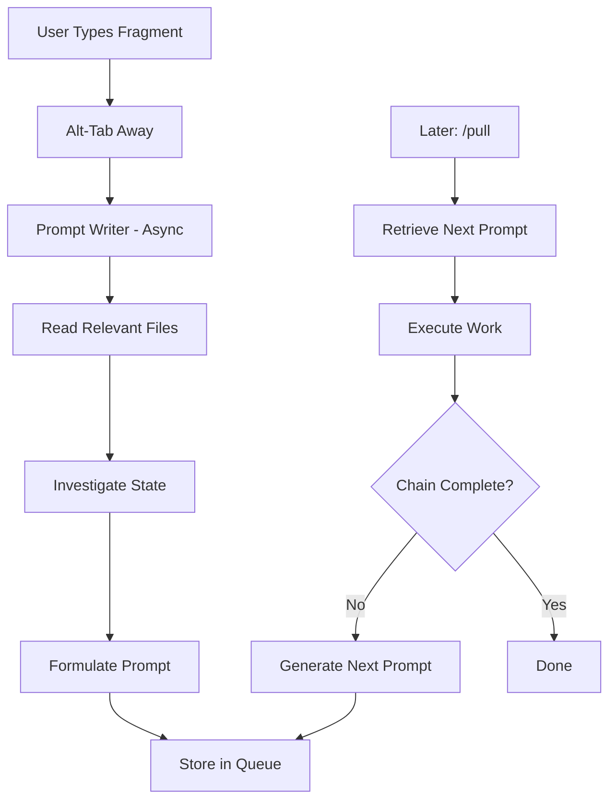

# Prompt Queue

**Status**: Approved (awaiting implementation)

## Workflow



Async idea capture that preserves context as executable prompts.

## User Story

**As** Nic (academic with ADHD experiencing constant idea flow during long-running tasks),
**I want** to capture ideas instantly and have them formalized into executable prompts,
**So that** I can alt-tab away immediately and later execute work without losing context.

## Problem Statement

Current task system captures WHAT to do but loses HOW:

```
Idea: "crap we need to merge those enforcement files"
         ↓
Task: "merge enforcement files"
         ↓
Later: "What did I mean? What files? What was the context?"
         ↓
Can't generate good prompt → Work doesn't happen
```

**Root cause**: The artifact stored is a task *description*, not a task *prompt*.

## Core Insight

**The deliverable is a ready-to-execute prompt, not a task description.**

A prompt preserves:
- What to do
- Why (context that was obvious at capture time)
- How to approach it
- Relevant files/state investigated at capture time

## Proposed Solution

### Capture Flow

```
User types fragment → Alt-tabs away immediately
         ↓
Prompt Writer (async):
  - Reads relevant files
  - Investigates current state
  - Formulates executable prompt
  - Stores in queue
         ↓
Later: /pull → System retrieves next prompt → Executes
```

### Key Components

| Component | Purpose |
|-----------|---------|
| `/add` or similar | Zero-friction capture entry point |
| Prompt Writer | Async agent that enriches fragments into prompts |
| Prompt Queue | Storage for ready-to-execute prompts |
| `/pull` | Retrieves and executes next queued prompt |

### Prompt Writer Responsibilities

At capture time (while context is fresh):
1. Read relevant files mentioned or implied
2. Understand current project state
3. Formulate a prompt that will make sense to a fresh Claude instance
4. Include enough context that user doesn't need to remember anything

### Queue Storage

TBD - options:
- Task files with attached prompts
- Separate prompt queue files
- Subtasks of project roadmap items

## Acceptance Criteria

- [ ] User can capture idea in <5 seconds (type + enter + alt-tab)
- [ ] Prompt writer works async (user doesn't wait)
- [ ] Generated prompts are self-contained (no memory required to execute)
- [ ] `/pull` retrieves next prompt based on priority/project
- [ ] Queue integrates with existing task/priority system

## Design Decisions

### Storage: `$ACA_DATA/queue/`

Dedicated directory for prompt files. Separate from tasks - prompts are executable work units, not tracking items.

```
$ACA_DATA/queue/
├── 20251227-143022-merge-enforcement-specs.md
├── 20251227-151045-dashboard-session-identity.md
└── ...
```

Filename: `YYYYMMDD-HHMMSS-slug.md` (timestamp for ordering, slug for recognition)

### Prompt Writer Scope: Thorough

The prompt writer does real investigation:

1. **Decrypt shorthand** - "merge those enforcement files" → identify which files, what merge means
2. **Determine workflow** - Is this a `/supervise` task? Direct edit? Research first?
3. **Add context** - What's the current state? What files are relevant? Why does this matter?
4. **Structure the chaos** - User's random idea → disciplined, executable prompt

The goal: A fresh Claude instance can execute this prompt without asking clarifying questions.

### Prompt Format: Structured Markdown

```markdown
---
created: YYYY-MM-DDTHH:MM:SS
project: aops
priority: P1
source: "user fragment during session X"
status: queued
end_goal: "The ultimate outcome we're working toward"
step: 1
total_steps: 3
---

# [Clear action title - THIS step only]

## Context
[What's the current state? Why does this matter?]

## Goal
[What THIS prompt should accomplish - small, achievable]

## Approach
[Suggested workflow, relevant skills, key files]

## End Goal
[The bigger picture - what we're ultimately trying to achieve]

## Next Step Template
[What prompt should be generated after this one completes]

## Original Fragment
> [User's exact words preserved]
```

### Chained Prompts Pattern

Complex work breaks into small, achievable prompts that chain together:

```
End Goal: "Terminal windows show session identity"
         ↓
Prompt 1: "Research how terminal titles work"
         → On completion: generates Prompt 2
         ↓
Prompt 2: "Create SessionStart hook"
         → On completion: generates Prompt 3
         ↓
Prompt 3: "Test across sessions"
         → On completion: Goal complete
```

**Why chaining matters**:
- Small prompts succeed (one clear action)
- End goal never gets lost (embedded in each prompt)
- Active continuation (next step auto-generates, not passive "done")
- Prevents both failure modes: overreach AND underdeliver

**Chain metadata**:
- `end_goal`: Ultimate outcome (persists across all prompts in chain)
- `step`: Current position in chain (1, 2, 3...)
- `total_steps`: Estimated chain length (can adjust as we learn)
- `Next Step Template`: What to generate after this prompt completes

## Open Questions

1. **Project routing** - How does `/pull` decide which project's prompt to surface? (defer to implementation)
2. **Priority inference** - Should prompt writer infer priority from context? (start with P2 default)
3. **Task cross-reference** - Link prompts to parent tasks? (nice-to-have, not blocking)

## Non-Goals

- Replacing task system (prompts complement tasks)
- Real-time capture feedback (async is acceptable)
- Complex prioritization logic (simple queue first)
