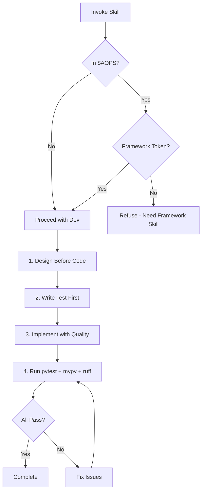

# Python-Dev Skill

**Status**: Implemented

## Workflow



## Purpose

Enforce production-quality Python code with fail-fast philosophy, type safety, and rigorous standards suitable for academic research where correctness and replicability are paramount.

## Problem Statement

Research code risks:
- Silent defaults corrupting data without detection
- Missing type hints obscuring interfaces
- Mocks hiding real integration failures
- Ad-hoc debugging scripts polluting codebase
- Configuration failures masked by fallbacks

## Solution

A skill that enforces strict Python development standards: fail-fast on all errors, mandatory type hints, real-data testing, and modern patterns.

## How It Works

### Invocation

```
Skill(skill="python-dev")
```

Invoke when writing, refactoring, reviewing, or debugging Python code.

### Core Behaviors

**1. Fail-Fast Philosophy**

No defaults, no fallbacks. Missing configuration = immediate failure.

```python
# Wrong - silent corruption
value = config.get("key", "default")

# Right - fail immediately
if "key" not in config:
    raise ValueError("Missing required config: key")
value = config["key"]
```

**2. Type Safety**

All function signatures, class attributes, and complex data structures must have type hints.

```python
def process_records(
    records: List[Dict[str, Any]],
    output_path: Path,
) -> int:
```

**3. Test Against Real Data**

- Use existing test infrastructure (check `conftest.py`)
- Connect to real data via project configs
- Never create fake test data or new databases
- Mock only at system boundaries you don't control

**4. Modern Patterns**

- `pathlib` for file operations
- f-strings for formatting
- Pydantic for configuration/validation
- `logger` not `print()` for output
- Comprehensions over loops where readable

**5. Framework Repository Enforcement**

When working in `$AOPS`, requires "FRAMEWORK SKILL CHECKED" token from [[framework-skill]]. Refuses work without this token.

### Development Workflow

1. **Design Before Code** - Interface first, docstring with Args/Returns/Raises
2. **Write Test First** - TDD against real data
3. **Implement with Quality** - Type hints, error handling, clear names
4. **Run and Debug** - pytest, mypy, ruff (no ad-hoc scripts)

## Relationships

### Depends On
- [[AXIOMS]] #7 (Fail-Fast Code), #24 (Research Data Immutable)
- [[framework-skill]] - Delegates from framework for `$AOPS` work

### Used By
- [[feature-dev]] - Python implementation within feature development
- [[analyst]] - Python for research data analysis
- Any agent writing Python code

### Reference Files (bundled)
- `references/fail-fast.md`
- `references/type-safety.md`
- `references/testing.md`
- `references/modern-python.md`
- `references/code-quality.md`

## Success Criteria

1. **No silent failures**: Missing config always raises, never defaults
2. **Type coverage**: All public functions have complete type hints
3. **Real-data tests**: Tests connect to actual data, not mocks
4. **No debug scripts**: All testing through pytest in `tests/`
5. **Framework compliance**: `$AOPS` work flows through [[framework-skill]]

## Design Rationale

**Why fail-fast?**

Per [[AXIOMS]] #7: Silent defaults corrupt research data. When configuration is wrong, immediate failure enables diagnosis. Hidden failures produce invalid results that may not be detected until publication.

**Why mandatory types?**

Type hints serve as executable documentation. They catch interface errors at development time, enable IDE tooling, and make code self-documenting. Research code especially benefits from explicit interfaces.

**Why real-data testing?**

Mocks hide integration failures. If a test passes with mocks but fails with real data, the test provided false confidence. Testing against real data (read-only) catches actual problems.

**Why framework token enforcement?**

Per [[AXIOMS]] #1: Actions must be justifiable as universal rules. Framework repository changes require strategic context. The token ensures python-dev receives work that has been validated by [[framework-skill]].
