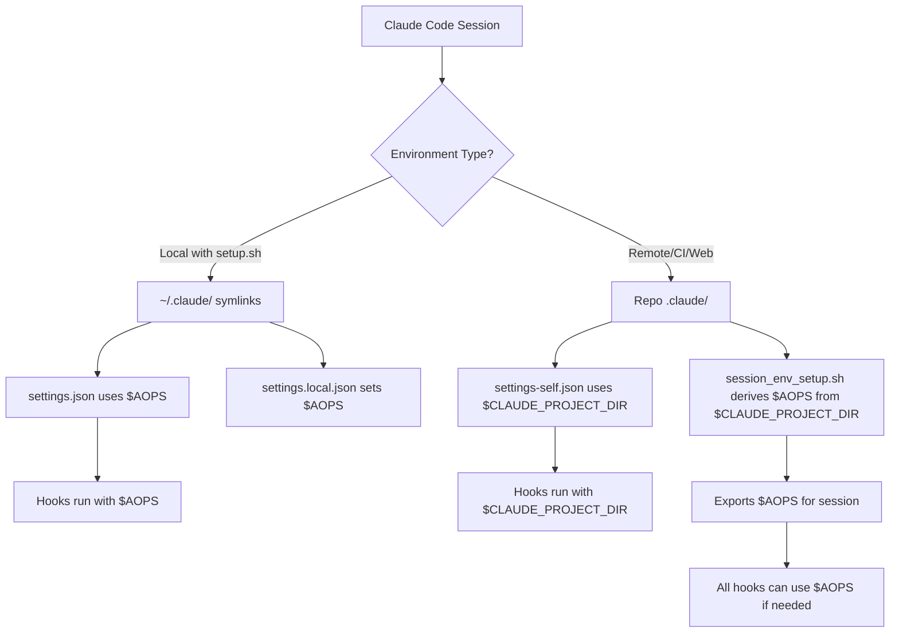

# Remote Automation Setup

**Status**: Implemented

## Problem

The framework needs to work in automated environments (CI, remote VMs, Claude Code Web) where:

1. User-level setup (`~/.claude/` symlinks from `setup.sh`) is not available
2. The `$AOPS` environment variable is not set
3. Only the repository itself is available with its repo-local `.claude/` directory

This created a chicken-and-egg problem:
- Hooks in `settings.json` used `$AOPS` in their commands
- The `session_env_setup.sh` hook was supposed to set `$AOPS` 
- But the hook couldn't run because its command path required `$AOPS` to already be set!

## Solution

Use `$CLAUDE_PROJECT_DIR` instead of `$AOPS` for repo-local `.claude/` settings.

**Key insight**: Claude Code always sets `$CLAUDE_PROJECT_DIR` to the project root, regardless of whether it's a local or remote session. This provides a reliable base path that doesn't require prior setup.

### Architecture



### Files

| File | Purpose | Uses |
|------|---------|------|
| `config/claude/settings.json` | Full settings for `~/.claude/` (local setup) | `$AOPS` |
| `config/claude/settings-self.json` | Settings for repo-local `.claude/` (remote) | `$CLAUDE_PROJECT_DIR` |
| `config/claude/settings-web.json` | Settings for bundled projects (no hooks) | N/A |
| `hooks/session_env_setup.sh` | Derives and exports `$AOPS` from `$CLAUDE_PROJECT_DIR` | Both |

### Sync Process

#### Local Setup (setup.sh)

```bash
# User runs setup.sh once
./setup.sh

# Creates:
~/.claude/
├── settings.json -> $AOPS/config/claude/settings.json
├── settings.local.json (with env: {AOPS: "/path", ACA_DATA: "/path"})
├── skills -> $AOPS/skills
├── commands -> $AOPS/commands
├── agents -> $AOPS/agents
└── hooks -> $AOPS/hooks

# Also creates repo-local for dogfooding:
academicOps/.claude/
├── settings.json -> ../config/claude/settings-self.json  # Uses CLAUDE_PROJECT_DIR!
├── skills -> ../skills
├── commands -> ../commands
├── agents -> ../agents
├── hooks -> ../hooks
└── CLAUDE.md -> ../CLAUDE.md
```

#### Remote/CI (no setup.sh)

When repo is checked out fresh (GitHub Actions, Codespaces, Claude Code Web):

```bash
# .claude/ already exists in repo (committed)
academicOps/.claude/
├── settings.json -> ../config/claude/settings-self.json
├── skills -> ../skills
├── commands -> ../commands
├── agents -> ../agents
├── hooks -> ../hooks
└── CLAUDE.md -> ../CLAUDE.md

# Claude Code opens project
# Sets CLAUDE_PROJECT_DIR=/workspace/academicOps
# Hooks use: PYTHONPATH=$CLAUDE_PROJECT_DIR uv run python $CLAUDE_PROJECT_DIR/hooks/router.py
# session_env_setup.sh runs first, derives AOPS=$CLAUDE_PROJECT_DIR
# All subsequent hooks have access to $AOPS
```

## Environment Variable Resolution

| Variable | Source | When Available |
|----------|--------|----------------|
| `$CLAUDE_PROJECT_DIR` | Claude Code (always set) | All sessions |
| `$AOPS` | `settings.local.json` or `session_env_setup.sh` | After SessionStart hook |
| `$ACA_DATA` | `settings.local.json` or user export | Local setup only |

### Hook Command Patterns

**Local setup (~/.claude/):**
```bash
PYTHONPATH=$AOPS uv run python $AOPS/hooks/router.py
```
- Uses `$AOPS` from `settings.local.json`
- Works because `setup.sh` configured environment

**Remote/CI (repo .claude/):**
```bash
PYTHONPATH=$CLAUDE_PROJECT_DIR uv run python $CLAUDE_PROJECT_DIR/hooks/router.py
```
- Uses `$CLAUDE_PROJECT_DIR` (always available)
- `session_env_setup.sh` derives and exports `$AOPS` for the session
- Subsequent hooks can use `$AOPS` if needed

## Testing

### Manual Test (Remote Scenario)

Simulate remote environment:

```bash
# Unset AOPS to simulate remote VM
unset AOPS
unset ACA_DATA

# Set only what Claude Code provides
export CLAUDE_PROJECT_DIR=/home/runner/work/academicOps/academicOps

# Test hook command directly
cd $CLAUDE_PROJECT_DIR
PYTHONPATH=$CLAUDE_PROJECT_DIR python3 $CLAUDE_PROJECT_DIR/hooks/router.py SessionStart < /dev/null

# Should succeed and output: {"continue": true}
# Should set AOPS=$CLAUDE_PROJECT_DIR
```

### Automated Tests

Tests in `tests/test_sync_web_bundle.py`:

1. **test_creates_symlinks** - Verifies `sync_to_self` creates correct symlinks
2. **test_settings_use_claude_project_dir** - NEW: Verifies settings-self.json uses `$CLAUDE_PROJECT_DIR`
3. **test_session_env_setup_derives_aops** - NEW: Verifies hook sets AOPS from CLAUDE_PROJECT_DIR

Tests in `tests/test_framework_installation.py`:

1. **test_repo_local_settings** - NEW: Verifies repo `.claude/` uses `settings-self.json`

## Acceptance Criteria

- [x] `settings-self.json` created with `$CLAUDE_PROJECT_DIR` instead of `$AOPS`
- [x] `sync_web_bundle.py --self` uses `settings-self.json`
- [x] `setup.sh` manual fallback uses `settings-self.json`
- [x] Repo-local `.claude/settings.json` symlinks to `settings-self.json`
- [x] `session_env_setup.sh` derives `$AOPS` from `$CLAUDE_PROJECT_DIR`
- [ ] Tests verify remote automation scenario works
- [ ] Documentation updated in WEB-BUNDLE.md

## Related

- [[web-bundle-sync]] - Web bundle architecture
- [[hook-router]] - Hook system architecture
- [[AXIOMS]] #15 - No backups, git is the backup system
