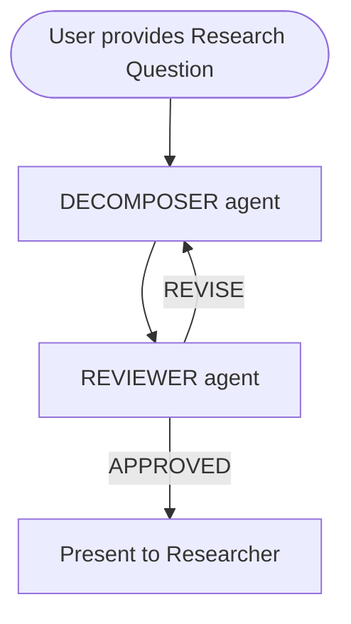
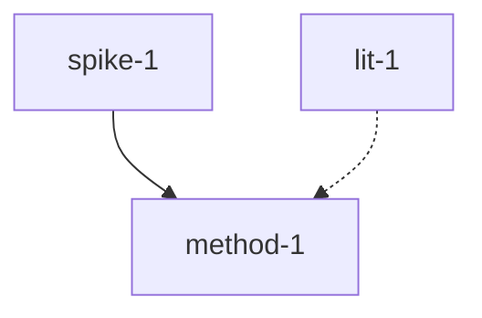

# Research Project Decomposition

## Giving Effect

- (proposed) [[skills/research-decomposer/SKILL.md]] — Skill for iterative research decomposition
- (proposed) [[workflows/research-decompose.md]] — Workflow for the decomposition loop
- [[specs/effectual-planning-agent.md]] — Strategic planning agent (upstream dependency)
- [[specs/mcp-decomposition-tools-v2.md]] — Task graph data tools (reused)
- [[specs/non-interactive-agent-workflow-spec.md]] — Phase 1 decomposition protocol (extended)

## Motivation: The Gist Pattern

This spec is inspired by [LuD1161's Codex-Review skill](https://gist.github.com/LuD1161/84102959a9375961ad9252e4d16ed592), which implements an **iterative multi-agent review loop**:

1. Claude creates an implementation plan
2. Submits it to Codex for structured review
3. Codex returns `VERDICT: APPROVED` or `VERDICT: REVISE` with specific feedback
4. Claude revises the plan based on feedback (max 5 rounds)
5. Session resumption preserves context across rounds

The core insight: **a second agent reviewing a decomposition catches blind spots, missing assumptions, and structural problems that the decomposing agent can't see in its own output.** This is especially valuable for research, where unexamined assumptions are the primary failure mode.

## User Story

**As** an academic researcher with ADHD managing multiple research projects,
**I want** to decompose a high-level research question or project idea into a structured task graph through an iterative, multi-agent refinement process,
**So that** I get a realistic, dependency-aware work plan that surfaces hidden assumptions, identifies what I don't know, and tells me what to do next — without requiring me to hold the whole project in my head.

> **Coherence check**: Research decomposition is the highest-level activity for an academic. A well-decomposed project reveals what's actually hard, what can be parallelised, and what information you need before committing resources. This serves the core academicOps mission: externalise cognitive load so the researcher can focus on thinking, not planning.

## The Problem

### Why research decomposition is hard

Research projects fail for different reasons than software projects:

| Software failure mode | Research failure mode                                 |
| --------------------- | ----------------------------------------------------- |
| Wrong architecture    | Wrong question                                        |
| Missing requirements  | Unexamined assumptions                                |
| Scope creep           | Scope collapse (question too narrow for contribution) |
| Integration bugs      | Methodology doesn't match question                    |
| Tech debt             | Citation debt (building on work you haven't read)     |

Existing task decomposition (Phase 1 of [[non-interactive-agent-workflow-spec]]) targets PR-sized code tasks. Research needs different decomposition primitives:

- **Information spikes** before you can plan (literature search, pilot data, ethics check)
- **Non-linear dependencies** (findings reshape methodology; methodology shapes what literature matters)
- **Varying time horizons** (a literature review takes weeks; coding an analysis takes hours)
- **Collaboration gates** (co-author review, supervisor approval, ethics board, peer review)
- **Multiple artifact types** (literature reviews, methodology documents, datasets, analysis scripts, manuscripts, presentations)

### Why a single agent isn't enough

A single agent decomposing a research project will:

- Assume familiarity with the field (skip literature gaps)
- Under-specify methodology (gloss over analytical choices)
- Miss ethical considerations (data handling, consent, IRB)
- Produce a plan that looks complete but has load-bearing assumptions buried in it
- Default to a linear waterfall when the work is actually iterative

The iterative review pattern fixes this by adding a **methodological critic** that challenges each decomposition round.

## Design

### Positioning: Specialised Effectual Planning

This system is a **specialisation** of the [[specs/effectual-planning-agent.md]]. While the effectual planner handles general strategic uncertainty, this spec provides the **methodological rigour** required for research. It uses the `effectual-planner` as the "Decomposer" but introduces a formal "Reviewer" loop to catch academic-specific failure modes.

### Architecture: Iterative Decomposition Loop

The system supports two entry paths based on project maturity:

1. **Seedling Mode (Lightweight):** For early exploration or small tasks. Bypasses the multi-agent review loop. Produces a "sketch" decomposition directly for the researcher.
2. **Forest Mode (Full):** The iterative multi-agent loop described below. Used for complex projects spanning months or multiple collaborators.

#### The Forest Mode Loop

Adapted from the Codex-Review gist pattern, but specialised for research:



### Why Two Agents, Not One

The decomposer and reviewer are separate agents for the same reason academic peer review separates author from reviewer:

- **Different optimisation targets.** The decomposer optimises for completeness ("did I capture everything?"). The reviewer optimises for rigour ("is this actually sound?").
- **Assumption surfacing.** The decomposer makes assumptions to make progress. The reviewer's job is to find them.
- **Adversarial improvement.** The decomposer can't effectively critique its own output — it'll defend its choices rather than probe them.

### Research-Specific Decomposition Primitives

Standard task types (task, action, bug, feature) don't capture research work. The decomposer uses these primitives:

| Primitive           | Purpose                                    | Example                                                 |
| ------------------- | ------------------------------------------ | ------------------------------------------------------- |
| **spike**           | Resolve an unknown before planning further | "Search for existing validated instruments measuring X" |
| **lit-review**      | Systematic examination of existing work    | "Map the landscape of Y research since 2020"            |
| **methodology**     | Design and justify analytical approach     | "Choose between case study and survey methodology"      |
| **ethics**          | IRB, consent, data governance              | "Draft ethics application for participant interviews"   |
| **data-collection** | Gathering primary or secondary data        | "Scrape court decisions from database Z"                |
| **analysis**        | Running the actual analysis                | "Fit regression model with controls for A, B, C"        |
| **writing**         | Manuscript, presentation, or report        | "Draft methods section for journal X"                   |
| **pilot**           | Small-scale test of feasibility            | "Interview 3 participants to test protocol"             |
| **collaboration**   | Gate requiring another person's input      | "Get supervisor feedback on research design"            |

These map to existing task types: `spike` → `learn`, `lit-review` → `learn`, `methodology` → `task`, `ethics` → `task` with `gate: true`, etc.

### Decomposer Agent Prompt

The decomposer follows this structure:

```markdown
## Decomposition Rules

1. **Start with unknowns.** Every unknown becomes a spike or pilot task.
2. **Assumptions are first-class.** Every assumption gets: Confidence, Validation path, Dependency link, and Contingency (If Wrong).
3. **Information spikes before commitment.** Never plan 10 tasks downstream of an untested assumption.
4. **Non-linear dependencies.** Use `depends_on`, `soft_depends_on`, and `informs`.
5. **Collaboration gates.** Any step requiring human input is a separate task with `gate: true`.
6. **Time horizon awareness.** Label each task: hours, days, weeks, months.
7. **Artifact-aware.** Specify output: document, dataset, code, presentation, etc.
```

## Reviewer Agent Prompt

The reviewer (research-critic) evaluates decompositions against the criteria below.

### Review Strategy: Layered Refinement

To avoid overwhelming the decomposer:

1. **Round 1-2:** Focus on **Assumption Hygiene (1)**, **Methodological Coherence (2)**, and **Feasibility (4)**.
2. **Round 3+:** Refine **Literature (3)**, **Ethics (5)**, **Dependencies (6)**, and **Scope (7)**.

## Review Criteria

1. **Assumption Hygiene:** Load-bearing assumptions identified? Validation paths?
2. **Methodological Coherence:** Methodology matches question? Analysis fit?
3. **Literature Awareness:** Scoped appropriately? Key papers missing?
4. **Feasibility:** Time estimates realistic? Data access validated?
5. **Ethics and Governance:** IRB planned? Data governance addressed?
6. **Dependency Structure:** Circular dependencies? Sequential vs Parallel?
7. **Scope and Contribution:** Specific enough? Standalone contribution?

## Verdict & Convergence

VERDICT: APPROVED or REVISE

### Convergence Criteria

1. **VERDICT: APPROVED** is issued.
2. **Plateau reached:** No new concerns raised across two consecutive rounds.
3. **Round limit:** Maximum 5 rounds.

### Output Format

The decomposition produces a structured proposal:

````markdown
### Assumptions (load-bearing)

| #  | Assumption             | Confidence | Validation | Dependency | If Wrong (Contingency) |
| -- | ---------------------- | ---------- | ---------- | ---------- | ---------------------- |
| A1 | Sufficient data exists | medium     | spike-1    | data-1     | Pivot to case study    |

### Task Graph

| ID       | Type        | Title       | Depends On | Soft Depends | Gate | Duration | Artifact |
| -------- | ----------- | ----------- | ---------- | ------------ | ---- | -------- | -------- |
| spike-1  | spike       | Verify data | -          | -            | no   | days     | decision |
| lit-1    | lit-review  | Map lit     | -          | -            | no   | weeks    | bib      |
| method-1 | methodology | Approach    | spike-1    | lit-1        | no   | days     | doc      |

### Dependency Graph (visual)


````

## Execution Modes

### Mode 1: Local (Interactive)

The default mode. Researcher invokes decomposition in a live session.

## Future Work: GitHub-Coordinated Mode (Async)

For multi-author projects. Loop continues in GitHub issue comments.

## Intellectual Foundations

- **Codex-Review Pattern:** Iterative multi-agent loop (LuD1161).
- **Effectual Mapping:** Strategic decomposition (Sarasvathy, 2001).
- **Assumption-Based Planning:** Surfacing and testing assumptions (Dewar, 2002).

## Dogfooding: Assumptions About This Spec

| #  | Assumption                                  | Confidence | Validation    | If Wrong                 |
| -- | ------------------------------------------- | ---------- | ------------- | ------------------------ |
| S1 | Multi-agent review catches more blind spots | medium     | User feedback | Simplify to single-agent |

## Related

- [[effectual-planning-agent]]
- [[non-interactive-agent-workflow-spec]]
- [[mcp-decomposition-tools-v2]]
