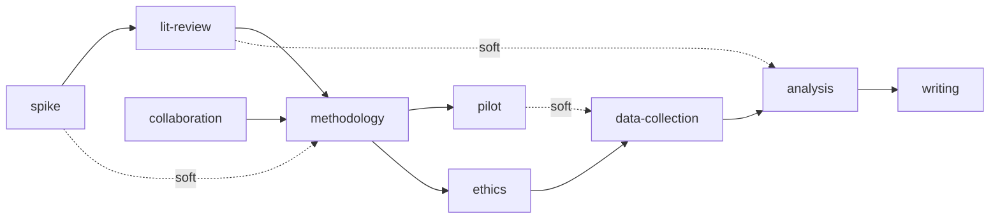

# Research Decomposition

## Giving Effect

_No implementation yet. This spec defines research-specific decomposition as a domain application of several upstream specs:_

- [[specs/conceptual-review-workflow.md]] -- review workflow; this spec instantiates it for research
- [[specs/effectual-planning-agent.md]] -- strategic planning; this spec specialises it for research projects
- [[specs/mcp-decomposition-tools.md]] -- task graph tools (reused)
- [[aops-core/skills/planning/workflows/decompose.md]] -- general decomposition workflow; this spec extends it with research primitives

## Motivation

Research decomposition is the first domain application of the conceptual review workflow. It exists as a separate spec because research has distinct failure modes, distinct primitives, and a distinct relationship to uncertainty. Software projects fail when the architecture is wrong or requirements are missing. Research projects fail when the question is wrong, when assumptions go unexamined, or when the methodology does not match the epistemological stance. These are different kinds of failure, and they require different decomposition strategies.

The intellectual foundations for why research needs its own decomposition approach come from two traditions. Discovery-driven planning (McGrath and MacMillan, 1995) provides the assumption-tracking discipline: every load-bearing hypothesis gets a confidence level, a cheap validation path, and a contingency. Effectual reasoning (Sarasvathy, 2001) provides the means-first orientation: start with what you have (data access, collaborator relationships, methodological expertise) and let the research question emerge from available means rather than forcing means to fit a predetermined question.

Together, these traditions explain why research decomposition cannot simply be software project management with different labels. Research operates under genuine uncertainty -- not risk (known probability distribution) but uncertainty (unknown unknowns). The decomposition must respect this by front-loading information-gathering, treating assumptions as first-class objects, and maintaining the flexibility to pivot when early findings reshape the question.

This spec composes with the general decomposition workflow in `aops-core/skills/planning/workflows/decompose.md` and the conceptual review workflow. It does not replace either. It provides the domain-specific primitives, lenses, and sequencing rules that those upstream systems use when the domain is academic research.

## The User

A researcher with multiple active projects and limited working memory. They might be starting from a vague idea ("I want to study how platform governance affects content moderation outcomes") or refining an existing project plan. They need a thinking partner that catches what they miss -- hidden assumptions, methodology gaps, missing literature -- without forcing ceremony on exploratory work. When it works, it feels like a conversation with a rigorous collaborator. When it fails, it feels like submitting to a committee.

## User Expectations

As a domain-specific extension of the core decomposition and review workflows, this system must meet high standards for academic rigor and ADHD-friendly low-friction interaction.

### 1. Epistemic Rigor (The Thinking Partner)

- **Beyond Task Parsing**: Users expect the system to act as a "peer reviewer" rather than a "task secretary." It should proactively identify methodological gaps (e.g., "You're asking a causal question but your methodology only allows for correlation") and unexamined assumptions.
- **Research Primitives**: Users expect to see familiar academic concepts (`lit-review`, `methodology`, `ethics`, `data-collection`) as first-class task types, with their inherent dependency logic (e.g., ethics as a hard gate before data collection) applied automatically.
- **MVC as a Safety Floor**: The "Minimum Viable Contribution" should be a core output, giving the user confidence that the project has a publishable "floor" even if more ambitious "stretch" bets fail.

### 2. Low-Friction Interaction (The Seedling Experience)

- **Respect for Immaturity**: In Seedling mode, the system must NOT force formal structure (no Gantt charts, no complex task IDs). The user expects a "loose" conversation that helps clarify the "intellectual bet" without the overhead of project management.
- **Means-First Thinking**: Following the effectual planning principle, the system should ask "what do you have?" (data access, relationships, expertise) to help shape the question, rather than demanding a perfect question before planning starts.

### 3. High-Signal Review (The Convergence)

- **Prioritised Critique**: The user expects the "Conceptual Review" to lead with the most critical methodological or structural flaw, providing a proposed resolution. They should not be overwhelmed by minor formatting or stylistic comments until the "load-bearing" logic is sound.
- **Transparency of Assumptions**: All load-bearing assumptions must be surfaced in a dedicated table with clear validation paths (spikes). The user expects to see _why_ a task exists (e.g., "This lit-review validates Assumption #2").

### 4. Verification and Audit

- **Testable Decompositions**: Every decomposition should include verification tasks that cross-reference findings back to the original research question.
- **Auditability**: The resulting task graph should be verifiable via `aops audit` to ensure no orphans are created and all research-specific gates (like ethics) are correctly placed.

## User Stories

**US-1: Early exploration (Seedling)**
A researcher has a half-formed idea and wants to know if it's worth pursuing. They throw it at the system and get back a sketch: what's interesting, what's assumed, what they'd need to find out first. The system respects the idea's immaturity -- no formal task graphs, no time estimates. Just: "here's what you're betting on, and here's how you'd find out if you're right."

**US-2: Project planning (Forest)**
A researcher has a defined project and needs to decompose it into a realistic work plan. The system produces a dependency-aware task graph that surfaces hidden assumptions, identifies knowledge gaps, and sequences work so that cheap information-gathering precedes expensive commitments. A second agent reviews the plan for methodological soundness, flagging concerns the decomposer missed.

## Why Research Decomposition is Hard

Research projects fail for different reasons than software projects:

| Software failure mode | Research failure mode                                 |
| --------------------- | ----------------------------------------------------- |
| Wrong architecture    | Wrong question                                        |
| Missing requirements  | Unexamined assumptions                                |
| Scope creep           | Scope collapse (question too narrow for contribution) |
| Integration bugs      | Methodology doesn't match question                    |
| Tech debt             | Citation debt (building on work you haven't read)     |

These failure modes are well-documented in research methods pedagogy. They motivate the research-specific review lenses and decomposition primitives below.

## Relationship to Upstream Specs

### Effectual Planning Agent

The effectual planner (see `specs/effectual-planning-agent.md`) provides the strategic framework: fragment placement, assumption surfacing, network-based prioritisation, adaptive replanning. It receives fragments of information incrementally, organises them into a semantic web, and proposes high-value next steps based on information value across the network.

This spec does NOT replace the effectual planner. Instead, it provides three things the planner uses when the domain is research:

1. **Domain-specific primitives.** When the effectual planner decomposes a research project, it draws from the research primitive table below (spike, lit-review, methodology, etc.) rather than generic task types. These primitives carry semantic meaning that shapes sequencing and dependency decisions.

2. **Domain-specific review lenses.** When a research decomposition is reviewed, the conceptual review workflow selects from the research lens table below. The effectual planner does not perform review -- it hands off to the review workflow, which uses these lenses.

3. **A maturity-gated entry path.** The effectual planner's formality gradient (seeds vs. active projects) maps to seedling vs. forest mode. A half-formed research idea enters as a seedling; a defined project enters as a forest. The planner's maturity indicators determine which path applies.

The intended handoff works as follows: the effectual planner receives a research idea, applies the primitives and sequencing rules from this spec, produces a decomposition, and then the conceptual review workflow reviews it using the research-specific lenses. The planner's assumption-surfacing capability feeds directly into the assumptions table that this spec requires as output. (See Open Question #5 for integration path alternatives -- this handoff mechanism is not yet specified.)

### Decompose Workflow

The existing `aops-core/skills/planning/workflows/decompose.md` provides general decomposition infrastructure:

- **Spike patterns**: when to investigate vs. commit; spike completion checklists
- **Dependency types**: hard (`depends_on`) vs. soft (`soft_depends_on`) dependency decisions; human handoff patterns
- **Knowledge flow**: propagating findings between siblings; confirmed vs. TBD tables
- **Academic Output Layer**: Prep --> Decision Support --> Decisions --> Writing --> Integration --> Audit
- **Completion loops**: verify-parent tasks that force a return to the original problem
- **Post-decomposition self-checks**: decision prerequisites, execution gating, writing data dependencies, methodology layer

This spec composes with `decompose.md`; it does not replace it. Specifically:

- **Research primitives map to existing types** (no schema changes). A `lit-review` is a `learn` task with a research-semantic label. An `ethics` task is a `task` with a gate marker. The decompose workflow's infrastructure handles all of these.
- **The Academic Output Layer applies to research outputs.** A research paper follows the same Prep --> Decision Support --> Decisions --> Writing --> Integration --> Audit sequence. This spec does not add new layers; it specifies what each layer contains for research (e.g., Prep includes literature search and data access validation; Audit includes claim-evidence cross-referencing).
- **The `soft_depends_on` + knowledge-flow pattern is especially important for research** because findings from one spike reshape sibling tasks more often than in software. A literature review spike may reveal that the intended methodology has known limitations, requiring the methodology task to be revisited. The decompose workflow's knowledge-flow pattern -- propagate findings to downstream tasks whose scope or approach may be affected -- is the mechanism for this.

### Conceptual Review Workflow

When reviewing a research decomposition, the conceptual review workflow (see `specs/conceptual-review-workflow.md`) operates as follows:

- The reviewer selects from the **research-specific lenses** defined below, rather than the general lens registry.
- The **prioritised critique protocol** applies unchanged: lead with the single most important concern, propose a resolution, then list up to 2 secondary concerns.
- The **convergence rules** apply unchanged: each round resolves at least one concern; escalate if new concerns appear without resolution; soft cap at 7 rounds.
- The **formality gradient** maps directly to research modes: seedling = light (1-2 lenses, single pass), forest = standard or thorough (3-4+ lenses, convergence-based).
- The **user override** mechanism is critical for research: a researcher may knowingly accept methodological risk ("I know this sample is small; I'm accepting the limitation because access is constrained").

## Research-Specific Lenses

When reviewing research decompositions, the conceptual review workflow selects from lenses that ask different questions than their general-purpose counterparts:

| Lens                     | General question (Layer 1)                 | Research-specific question                                                                                                                                                             |
| ------------------------ | ------------------------------------------ | -------------------------------------------------------------------------------------------------------------------------------------------------------------------------------------- |
| Methodological coherence | Does the method match the question?        | Is the research design valid? Do analytical choices follow from the question? Is the methodology appropriate for the epistemological stance?                                           |
| Literature awareness     | Is it building on or reinventing?          | Is the lit review scoped to the actual question? Are foundational works cited? Is there awareness of adjacent fields that may have addressed similar questions with different methods? |
| Ethics and governance    | Are ethical obligations addressed?         | Is IRB/ethics approval planned? Is data governance specified? What about consent, anonymisation, data retention? Are there dual-use concerns?                                          |
| Feasibility              | Can this be done with available resources? | Are academic timelines realistic? Is data access validated, not assumed? Are collaborator commitments confirmed? Does the scope fit the intended publication venue?                    |
| Assumption hygiene       | Are assumptions identified and testable?   | Are methodological assumptions distinguished from empirical ones? Are there untested assumptions about data availability or participant recruitment?                                   |

Note: a standard research review selects 3-4 of these plus self-consistency as a background check. The reviewer does not evaluate all lenses exhaustively -- the prioritised critique protocol forces ranking rather than mechanical evaluation.

## Research Decomposition Primitives

Standard task types (task, action, bug, feature) do not capture research work. The decomposer uses these semantic primitives, mapped to existing types via tags:

| Primitive           | Purpose                                    | Maps to       |
| ------------------- | ------------------------------------------ | ------------- |
| **spike**           | Resolve an unknown before planning further | `learn`       |
| **lit-review**      | Systematic examination of existing work    | `learn`       |
| **methodology**     | Design and justify analytical approach     | `task`        |
| **ethics**          | IRB, consent, data governance              | `task` + gate |
| **data-collection** | Gathering primary or secondary data        | `task`        |
| **analysis**        | Running the actual analysis                | `task`        |
| **writing**         | Manuscript, presentation, or report        | `task`        |
| **pilot**           | Small-scale test of feasibility            | `task`        |
| **collaboration**   | Gate requiring another person's input      | `task` + gate |

No new task types or schema changes. Primitives are labels that carry semantic meaning for the decomposer and reviewer agents.

### Typical Sequencing


```mermaid
graph LR
    spike --> litreview[lit-review]
    litreview --> methodology
    methodology --> pilot
    methodology --> ethics
    ethics --> datacollection[data-collection]
    pilot -.soft.-> datacollection
    datacollection --> analysis
    analysis --> writing
    spike -.soft.-> methodology
    litreview -.soft.-> analysis
    collaboration --> methodology
```

Key relationships:

- **spike --> lit-review --> methodology** is the typical discovery sequence. You investigate whether the idea is tractable, survey existing work, then design the approach informed by what exists.
- **ethics is a HARD gate before data-collection.** This is non-negotiable and often requires external approval with unpredictable timelines. Decompositions that treat ethics as a parallel task rather than a prerequisite are a common failure mode.
- **pilot --> data-collection is soft** unless the pilot might invalidate the approach entirely. A pilot that tests whether participants understand the survey instrument is a soft dependency. A pilot that tests whether the data source contains the expected variables is a hard dependency.
- **collaboration gates can appear anywhere** but typically block methodology (co-investigator agreement on design) or writing (co-author review and approval).
- **lit-review has a soft dependency on analysis.** Literature needs revisiting once findings emerge -- the analysis may reveal connections to work not identified in the initial review, or may contradict studies that were assumed to support the hypothesis.

### When to Deviate

The typical sequencing above is a default, not a mandate. Common deviations:

- **Secondary data projects**: skip data-collection; analysis depends on methodology + a data-access spike. The spike validates that the dataset contains the expected variables and is accessible under appropriate terms.
- **Theoretical projects**: no data-collection or analysis primitives; replace with a conceptual-development primitive (mapped to `task`). The sequencing becomes spike --> lit-review --> methodology --> conceptual-development --> writing.
- **Replication studies**: methodology is mostly fixed by the original study; the spike focuses on reproduction feasibility (data access, computational requirements, original authors' cooperation).

## Decomposition Rules

1. **Start with unknowns.** Every unknown becomes a spike or pilot. Information-gathering precedes commitment.
2. **Assumptions are first-class.** Every load-bearing assumption gets: confidence level, validation path, and contingency (what happens if wrong).
3. **Non-linear dependencies.** Research is iterative. Use `depends_on` for hard gates, `soft_depends_on` for informational dependencies where findings reshape downstream work. When an upstream soft dependency completes, propagate its findings to any downstream task whose scope or approach may be affected (knowledge-flow pattern from `aops-core/skills/planning/workflows/decompose.md`). The downstream task is not blocked -- it proceeds with current knowledge -- but should be revisited once upstream findings arrive.
4. **Collaboration gates.** Any step requiring human judgment or external input is a separate task marked as a gate.
5. **Artifact-aware.** Each task specifies its output type: document, dataset, code, presentation, decision.

## Output

The decomposition produces:

- **Assumptions table**: Load-bearing assumptions with confidence, validation path, and contingency
- **Task graph**: Dependency-aware graph using research primitives
- **Dependency visualisation**: Mermaid graph showing non-linear dependencies
- **Minimum viable contribution (MVC)**: A narrative paragraph identifying the minimum publishable claim and the tasks required to substantiate it, with those tasks tagged `mvc: true` in the task graph. Purpose: prevents scope collapse by anchoring what the project is already committed to, even if ambition expands later. The MVC is not the ceiling -- it is the floor. It answers: "If everything beyond this fails, what can still be published?"

## Seedling Mode

### When to Use Seedling Mode

The system selects seedling mode when the input is:

- A question without a defined methodology ("I wonder if X affects Y")
- An observation without a research design ("I noticed that platforms with oversight boards seem to moderate differently")
- A vague connection between ideas ("There might be something interesting in the intersection of X and Y")

The researcher can also explicitly request seedling mode for inputs that would otherwise trigger forest mode, when they want to step back and re-examine foundations.

### Output Format

Seedling mode produces exactly five items:

1. **Interest statement** (1-2 sentences): What makes this worth investigating? Restate the idea to surface its intellectual bet -- the non-obvious claim that, if true, would constitute a contribution.

2. **Assumption inventory** (bulleted list): What must be true for this idea to work? Each assumption gets a confidence tag (high/medium/low) and a one-line validation path describing the cheapest way to test it.

3. **Literature pointers** (2-5 items): What existing work is adjacent? This is not a literature review -- just enough to avoid reinventing and to locate the idea in an intellectual neighbourhood. Use Zotero search if available; otherwise, identify key authors or search terms.

4. **Spikes** (1-3 items): What would you need to find out first? Each spike is a concrete question with a cheap way to answer it. A good spike can be resolved in hours, not weeks.

5. **Go/no-go prompt**: "Based on the above, do you want to develop this into a project plan (forest mode), park it for later, or abandon it?"

### What Seedling Does NOT Produce

- No task graph
- No time estimates
- No dependency chains
- No MVC definition
- No Mermaid diagrams

Seedling mode respects the idea's immaturity. Producing formal structure for a half-formed thought creates false precision and discourages the kind of loose, exploratory thinking that generates good research questions.

### Transition to Forest

When the researcher chooses to develop a seedling, the seedling output becomes input to forest mode:

- The **assumption inventory** seeds the assumptions table. Each assumption retains its confidence tag and gains a fuller validation path and contingency plan.
- The **spikes** become the first tasks in the task graph. They are already concrete questions with validation methods -- they just need to be formalised as task nodes.
- The **literature pointers** scope the lit-review primitive. The forest decomposer knows which intellectual neighbourhood to survey, rather than starting from scratch.
- The **interest statement** informs the MVC. The intellectual bet identified in seedling mode anchors what the project must minimally deliver.

## Forest Mode

### When to Use Forest Mode

Forest mode applies when the researcher has:

- A defined research question with at least a preliminary methodology
- A seedling that the researcher chose to develop (via the go/no-go prompt)
- An existing project plan that needs restructuring or review

### Process

1. **Decomposer agent produces plan.** The agent uses the research primitives, the sequencing rules from this spec, and the Academic Output Layer from `aops-core/skills/planning/workflows/decompose.md`. It runs the post-decomposition self-checks (decision prerequisites, execution gating, writing data dependencies, methodology layer). It produces all four output items: assumptions table, task graph, dependency visualisation, and MVC.

2. **Reviewer agent reviews.** The conceptual review workflow activates with research-specific lenses. The reviewer applies the prioritised critique protocol: lead with the single most important concern (typically methodological coherence or assumption hygiene for research), propose a resolution, then list up to 2 secondary concerns.

3. **Convergence.** The decomposer-reviewer loop follows the convergence rules from the conceptual review workflow. Each round must resolve at least one concern. If new concerns appear without resolving old ones, escalate to the researcher. Soft cap at 7 rounds. In practice, most research decompositions converge in 2-4 rounds.

### Forest Mode Output

Forest mode produces the four standard items:

- **Assumptions table**: Load-bearing assumptions with confidence level (high/medium/low), validation path (cheapest way to test), and contingency (what happens if wrong; what changes in the plan).
- **Task graph**: Dependency-aware graph using research primitives, with hard and soft dependencies, gate markers on ethics and collaboration tasks, and `mvc: true` tags on minimum-viable-contribution tasks.
- **Dependency visualisation**: Mermaid diagram showing the full dependency structure, with solid lines for hard dependencies and dashed lines for soft dependencies.
- **Minimum viable contribution**: Narrative paragraph identifying the floor -- the minimum publishable claim and the specific tasks required to substantiate it.

## Worked Example: Platform Governance Study

A researcher says: "I want to study how platform governance affects content moderation outcomes."

### Seedling Mode Output

**Interest statement:** The bet is that governance structures -- board composition, transparency requirements, appeal processes -- have measurable effects on moderation decisions, and that these effects vary by platform type. If true, this would connect institutional design theory to content moderation practice, contributing to both governance scholarship and platform policy.

**Assumption inventory:**

- Governance structures are documented enough to compare across platforms (medium) -- check transparency reports and published policies for 5 major platforms
- Content moderation outcomes are measurable with available data (medium) -- need to define metrics; may require proxy measures rather than direct outcome data
- Meaningful variation exists across platforms (high) -- likely given known differences in governance models
- A causal (or at least correlational) relationship is identifiable despite confounders (low) -- platform size, user demographics, content type all confound; need careful design
- Platforms' public documentation reflects actual governance practice (low) -- formal structures may differ from operational reality

**Literature pointers:**

- Suzor (2019) on platform governance frameworks and rule of law
- Gorwa (2019) "What is platform governance?" -- definitional and taxonomic work
- Oversight Board case law -- natural experiment in formalised governance
- Klonick (2020) on Facebook Oversight Board design and early decisions
- Myers West (2018) on content moderation practices and labour

**Spikes:**

1. **Is governance data available?** Check transparency reports for 5 platforms (Meta, Google/YouTube, TikTok, Reddit, X). What governance structures are documented? What is missing? (1-2 days)
2. **What outcomes are measurable?** Review content moderation measurement literature. What metrics exist? What data is publicly available vs. requiring platform cooperation? (1-2 days)
3. **Natural experiment potential?** The Oversight Board's creation provides a pre/post design opportunity. Is there sufficient public data on Meta's moderation decisions before and after the Board's establishment? (1 day)

**Go/no-go:** Based on the above, do you want to develop this into a project plan (forest mode), park it for later, or abandon it?

### Researcher Chooses: Develop --> Forest Mode

**Assumptions table (abbreviated):**

| # | Assumption                                    | Confidence | Validation                                       | If wrong                                                                      |
| - | --------------------------------------------- | ---------- | ------------------------------------------------ | ----------------------------------------------------------------------------- |
| 1 | Governance structures are publicly documented | Medium     | Spike 1: check 5 platforms' transparency reports | Narrow to platforms with documented structures; or use FOIA/interview methods |
| 2 | Outcomes are measurable with proxy data       | Medium     | Spike 2: review measurement literature           | Pivot to qualitative comparative design                                       |
| 3 | Oversight Board creates natural experiment    | Low        | Spike 3: check pre/post data availability        | Drop causal claim; use cross-sectional comparison only                        |
| 4 | Five platforms provide sufficient variation   | High       | Literature review on platform governance models  | Add or substitute platforms                                                   |

**Task graph (abbreviated):**

```
spike-1: "Data availability: governance documentation across 5 platforms" [learn, spike]
spike-2: "Outcome measurement: what moderation metrics are available?" [learn, spike]
spike-3: "Natural experiment feasibility: Oversight Board pre/post data" [learn, spike]
lit-review-1: "Literature review: platform governance and content moderation"
    soft_depends_on: [spike-1, spike-2]
methodology-1: "Research design: comparative framework + natural experiment"
    depends_on: [lit-review-1]
    soft_depends_on: [spike-3]
ethics-1: "Ethics review: data governance for public platform data" [gate]
    depends_on: [methodology-1]
data-collection-1: "Collect governance documentation and moderation metrics"
    depends_on: [ethics-1]
    mvc: true
analysis-1: "Comparative analysis of governance structures"
    depends_on: [data-collection-1]
    mvc: true
analysis-2: "Natural experiment analysis (Oversight Board effect)"
    depends_on: [data-collection-1, spike-3]
writing-1: "Manuscript: platform governance and moderation outcomes"
    depends_on: [analysis-1]
    soft_depends_on: [analysis-2]
    mvc: true
verify: "Verify: platform governance study objectives met"
    depends_on: [writing-1]
```

**MVC:** At minimum, a comparative description of governance structures across 5 platforms with documented moderation metrics, showing how structural differences correlate with outcome differences. The natural experiment analysis (Oversight Board effect) is a stretch goal -- the comparative description is the floor. Tasks tagged `mvc: true`: data-collection-1, analysis-1, writing-1.

## Intellectual Foundations

- **Effectual mapping** (Sarasvathy, 2001): Start with means, not goals. Bird-in-hand thinking -- what data, relationships, and methods does the researcher already have access to?
- **Discovery-Driven Planning** (McGrath and MacMillan, 1995): Explicit assumption tracking, knowledge milestones, cheap validation before commitment. The assumptions table is a direct application.
- **Research methods pedagogy**: The reviewer criteria (assumption hygiene, methodological coherence, literature awareness, feasibility, ethics) draw on established research proposal review practices used by funding bodies and ethics boards. The contribution of this spec is applying them in an iterative multi-agent loop, not the criteria themselves.

## Assumptions About This Spec

| #  | Assumption                                                                                                                                   | Confidence | Validation                                                                         | If wrong                                                                                                                                          |
| -- | -------------------------------------------------------------------------------------------------------------------------------------------- | ---------- | ---------------------------------------------------------------------------------- | ------------------------------------------------------------------------------------------------------------------------------------------------- |
| R1 | Research primitives capture meaningful task types                                                                                            | Medium     | Use on 3+ real projects; track whether custom labels emerge                        | Add primitives or allow custom labels                                                                                                             |
| R2 | Typical sequencing is useful as a default                                                                                                    | Low        | Track decomposer deviations from the default sequence                              | Remove default; infer sequencing from context each time                                                                                           |
| R3 | Seedling-to-forest transition preserves information                                                                                          | Low        | Track whether forest mode actually uses seedling output                            | Redesign transition; may need richer seedling output                                                                                              |
| R4 | Researchers will use formal decomposition for complex projects                                                                               | Low        | Track adoption; compare projects planned with/without                              | Reduce friction or simplify; must feel like collaboration                                                                                         |
| R5 | Academic Output Layer applies to research without modification                                                                               | Medium     | Validate on a real research project end-to-end                                     | Add research-specific layers or modify existing layer ordering                                                                                    |
| R6 | MVC definition prevents scope collapse                                                                                                       | Medium     | Track whether MVC anchors hold in practice                                         | Stronger mechanisms needed; possibly contractual MVC                                                                                              |
| R7 | Conceptual review workflow spec (#692) lands with the protocols described here (prioritised critique, convergence rules, formality gradient) | Medium     | #692 is reviewed and merged; compare its protocols against this spec's assumptions | Update the review integration sections (Conceptual Review Workflow relationship, forest mode steps 2-3) to match whatever #692 actually specifies |

## Scope

### In scope

- Research decomposition primitives and sequencing rules
- Seedling and forest modes with fully specified outputs
- Integration with effectual planner and `aops-core/skills/planning/workflows/decompose.md`
- Research-specific review lenses for the conceptual review workflow

### Out of scope

- New MCP tools or task schema changes
- Automated execution of decomposed tasks
- Non-research domains (spec review, manuscript review, etc. are Layer 1 applications, not this spec)

## Open Questions

1. **When to decompose.** What heuristics determine seedling vs. forest? Input length, presence of methodology keywords, and user's stated intent are candidates, but the boundary is fuzzy.
2. **Domain expertise injection.** How do we inject field-specific knowledge into the reviewer? Literature search via Zotero? User-provided context documents? Retrieval-augmented review? (Shared with the conceptual review workflow.)
3. **Methodology primitive granularity.** Is one "methodology" primitive sufficient, or does it need sub-primitives (research design, sampling strategy, analysis plan, instrument development)?
4. **Multi-project decomposition.** How do related projects' decompositions interact? A researcher working on two governance studies should share literature review and ethics tasks. The effectual planner's network-based prioritisation may handle this, but the mechanism is unspecified.
5. **Effectual planner integration path.** What is the concrete handoff mechanism? Does the planner invoke this spec's rules directly, or does it produce a draft that this spec's primitives then reshape?

## Future Work

- **Zotero-integrated literature awareness**: Use the Zotero MCP tools to populate literature pointers in seedling mode and scope lit-review tasks in forest mode.
- **Methodology templates**: Common research designs (case study, experimental, survey, ethnographic) as pre-built primitive sequences with typical dependency structures.
- **Progress tracking against MVC**: As tasks complete, surface whether the MVC is on track or at risk. Flag when stretch-goal tasks are consuming time that MVC tasks need.
- **Multi-project synergy detection**: When decomposing a new project, check the existing task network for shareable spikes, lit-reviews, or data-collection tasks across projects.

## Related

- [[specs/conceptual-review-workflow.md]] -- review layer; this spec is a domain application
- [[specs/effectual-planning-agent.md]] -- upstream strategic planning; this spec specialises it for research
- [[specs/mcp-decomposition-tools.md]] -- task graph tools; reused for structured output
- [[specs/non-interactive-agent-workflow-spec.md]] -- lifecycle management for non-interactive agent execution
- [[specs/polecat-swarms.md]] -- execution layer; consumes decomposed task graphs
- [[aops-core/skills/planning/workflows/decompose.md]] -- general decomposition workflow; this spec extends it with research primitives
