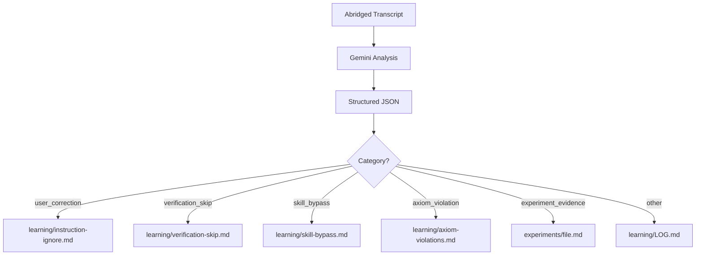

# Session Insights Mining

**Status**: Draft

## Workflow



## Purpose

Automatically extract framework learnings from Claude Code session transcripts. Identify problems, successes, and experiment evidence. Route to appropriate files for accumulation.

## Non-Goals

- Automatic heuristic updates (human review required)
- Real-time monitoring (batch process only)
- Cross-session pattern detection (single transcript at a time)

## Data Flow

```
Transcript → Gemini Analysis → Structured JSON → Router → Learning Files
```

## Input

Abridged session transcript (`*-abridged.md`) containing:
- User prompts
- Agent responses
- Tool calls (success/error)
- Skill invocations

## Learning Categories

| Category | Definition | Example |
|----------|------------|---------|
| `user_correction` | User explicitly corrects agent behavior | "no, I meant X not Y" |
| `implicit_correction` | User redirects without explicit correction | "let's try a different approach" |
| `verification_skip` | Agent claims success without verification | "Done" without running tests |
| `instruction_ignore` | Agent ignores explicit instruction | User says "don't X", agent does X |
| `navigation_failure` | Multiple searches for same thing | Grepping 3+ times for one file |
| `axiom_violation` | Agent violates numbered AXIOM | Workaround instead of halt (AXIOM #8) |
| `skill_bypass` | Agent acts without required skill | Direct file edit instead of skill |
| `success` | Correct behavior worth noting | Proper halt on error |
| `experiment_evidence` | Behavior matching active hypothesis | Predicted outcome observed |

## Routing Rules

```
IF category IN [user_correction, implicit_correction, instruction_ignore]:
    route_to = "learning/instruction-ignore.md"

IF category IN [verification_skip, navigation_failure]:
    route_to = "learning/verification-skip.md"

IF category == skill_bypass:
    route_to = "learning/skill-bypass.md"

IF category == axiom_violation:
    route_to = "learning/axiom-violations.md"  # CREATE IF NOT EXISTS

IF category == experiment_evidence:
    route_to = "experiments/{experiment_filename}"

IF no_match OR category == other:
    route_to = "learning/LOG.md"
```

## Approach Options

### Option A: Organic Discovery (CURRENT)

Gemini analyzes transcripts without framework-specific context. Discovers patterns naturally.

**Prompt**: Simple request to identify successes, failures, improvements, concerns.

**Pros**:
- No maintenance of category definitions
- Discovers patterns we haven't categorized yet
- Lower prompt complexity
- Gemini uses general reasoning about agent behavior

**Cons**:
- May miss framework-specific patterns (axiom violations)
- Routing requires post-processing by Claude
- Output format varies

**When to use**: Starting point. Validates whether extraction is useful before investing in detailed prompts.

### Option B: Guided Extraction (FUTURE)

Gemini receives detailed framework context: category definitions, active experiments, routing rules.

**Prompt**: Structured with learning categories, experiment hypotheses, explicit routing.

**Pros**:
- Precise category assignment
- Direct routing (no post-processing)
- Catches framework-specific violations
- Consistent output format

**Cons**:
- High prompt maintenance burden
- May miss novel patterns outside categories
- Requires keeping prompt in sync with framework

**When to use**: After Option A proves valuable, if we need more precision.

---

**Current implementation**: Option A (organic discovery)

## Output Format

### For learning files (append):

```markdown
### [DATE] [SESSION_ID[:8]]

**Category**: {category}
**Evidence**: "{quoted text from transcript}"
**Context**: {one sentence description}
```

### For experiment files (append to Observations section):

```markdown
- [DATE] [SESSION_ID[:8]]: {observation}. Supports hypothesis: {yes/no}. Evidence: "{quote}"
```

## Deduplication

Before appending, check if similar evidence exists (same session_id prefix). Skip if duplicate.

## Constraints

- ❌ NEVER auto-update HEURISTICS.md or AXIOMS.md
- ❌ NEVER delete existing content
- ✅ Append only
- ✅ Human review required before promotion to heuristics

## Success Criteria

1. Learnings accumulate in appropriate files without manual routing
2. Experiment evidence tracked against hypotheses
3. No false routing (wrong category assignment) in >90% of cases
4. Human can review LOG.md for novel patterns weekly
