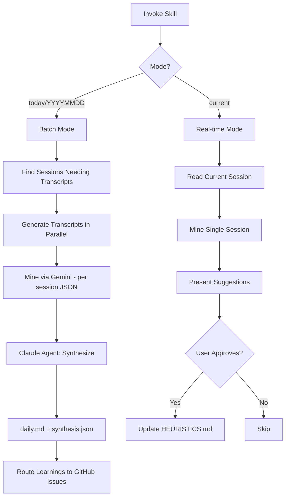

# Session-Insights Skill

**Status**: Implemented
See [[skills/session-insights/SKILL.md]] for full implementation.

## Workflow



## Purpose

Extract accomplishments and learnings from Claude Code sessions. Updates daily summaries and mines for framework patterns to strengthen heuristics.

## Problem Statement

Session value extraction gaps:

- Accomplishments lost in terminal history
- Patterns repeat across sessions without synthesis
- Framework learnings not captured
- User corrections not formalized as heuristics
- No feedback loop for skill effectiveness

## Solution

A skill that processes sessions in parallel, extracts structured data via Gemini analysis, updates daily summaries, and routes learnings to appropriate destinations.

## How It Works

### Invocation

```
Skill(skill="session-insights")           # today
Skill(skill="session-insights", args="YYYYMMDD")  # specific date
Skill(skill="session-insights", args="current")   # current session
```

### Batch Mode (today/YYYYMMDD)

**Step 1: Find Sessions**

```bash
cd $AOPS && uv run python skills/session-insights/scripts/find_sessions.py
```

**Step 2: Generate Transcripts (Parallel)**

```bash
cd $AOPS && uv run python scripts/claude_transcript.py {session_path} -o ...
```

**Step 3: Extract Narrative Signals**

```bash
cd $AOPS && uv run python skills/session-insights/scripts/extract_narrative.py --date YYYYMMDD
```

**Step 4: Update Daily Summary**
Create/update `$ACA_DATA/sessions/YYYYMMDD-daily.md` with accomplishments per project.

**Step 5: Mine for Learnings (Parallel via Gemini)**
Spawn Task agents for each transcript:

```
Task(subagent_type="general-purpose", model="haiku", prompt="Call mcp__gemini__ask-gemini...")
```

Gemini extracts per-session structured data:

- Session summary (what was worked on)
- Accomplishments (completed items with project tags)
- Skill effectiveness (suggested vs invoked)
- Context timing issues
- User corrections with heuristic mapping
- Failures by category
- Successes
- User mood/satisfaction (-1.0 to 1.0 subjective assessment)
- Conversation flow (edited transcript as message tuples)
- Verbatim user prompts (exact text with timestamps)

Output: `$ACA_DATA/dashboard/sessions/{session_id}.json`

**Step 6: Synthesize (Claude Code Agent)**
The main agent (or subagent) reads **only Gemini's per-session JSONs** (NOT transcripts) and idempotently synthesizes:

```
Gemini per-session JSONs (only input)
        │
        ├──> YYYYMMDD-daily.md (human-readable, integrates new sessions)
        └──> synthesis.json (machine-readable, integrates new sessions)
```

**Division of labor**:

- **Gemini**: Reads transcripts, extracts structured data (expensive work, done once)
- **Claude Code**: Reads Gemini output only, synthesizes/integrates (no transcript access)

**Idempotent integration**: If session already in daily.md/synthesis.json, update rather than duplicate. Can run from multiple machines.

**Step 7: Route Learnings**

- Route learning observations to [[learning-log]] skill → GitHub Issues

### Real-time Mode (current)

**Step 7a-e**: Skip transcript generation, mine current session, present heuristic update suggestions via AskUserQuestion, apply approved updates to HEURISTICS.md.

### Output Locations

| Artifact              | Location                                           | Producer          |
| --------------------- | -------------------------------------------------- | ----------------- |
| Full transcripts      | `$ACA_DATA/sessions/claude/YYYYMMDD-*-full.md`     | transcript script |
| Abridged transcripts  | `$ACA_DATA/sessions/claude/YYYYMMDD-*-abridged.md` | transcript script |
| Per-session mining    | `$ACA_DATA/dashboard/sessions/{session_id}.json`   | Gemini            |
| Daily summary         | `$ACA_DATA/sessions/YYYYMMDD-daily.md`             | Claude Code agent |
| Dashboard synthesis   | `$ACA_DATA/dashboard/synthesis.json`               | Claude Code agent |
| Learning observations | GitHub Issues (via learning-log)                   | Claude Code agent |

### Learning Categories

| Category              | Definition                                                         | Example                                             |
| --------------------- | ------------------------------------------------------------------ | --------------------------------------------------- |
| `user_correction`     | User explicitly corrects agent behavior                            | "no, I meant X not Y"                               |
| `implicit_correction` | User redirects without explicit correction                         | "let's try a different approach"                    |
| `verification_skip`   | Agent claims success without verification                          | "Done" without running tests                        |
| `instruction_ignore`  | Agent ignores explicit instruction                                 | User says "don't X", agent does X                   |
| `navigation_failure`  | Multiple searches for same thing                                   | Grepping 3+ times for one file                      |
| `axiom_violation`     | Agent violates numbered AXIOM                                      | Workaround instead of halt (AXIOM #8)               |
| `skill_bypass`        | Agent acts without required skill                                  | Direct file edit instead of skill                   |
| `success`             | Correct behavior worth noting                                      | Proper halt on error                                |
| `context_gap`         | Missing context that caused mistakes                               | Missing hydration data led to wrong approach        |
| `experiment_evidence` | Behavior matching active hypothesis                                | Predicted outcome observed                          |
| `other`               | Mistakes or improvement opportunities not fitting other categories | Suboptimal approach that worked but could be better |

### Routing Rules

```
IF category IN [user_correction, implicit_correction, instruction_ignore]:
    route_to = "GitHub Issue (label: learning)"

IF category IN [verification_skip, navigation_failure]:
    route_to = "GitHub Issue (label: learning)"

IF category == skill_bypass:
    route_to = "GitHub Issue (label: learning)"

IF category == axiom_violation:
    route_to = "GitHub Issue (label: axiom-violation)"

IF category == experiment_evidence:
    route_to = "GitHub Issue for active experiment"

IF no_match OR category == other:
    route_to = "GitHub Issue (label: learning)"
```

### Heuristic Mapping

Each correction/failure maps to relevant heuristic:

- H2: Skill-First - skill bypass patterns
- H3: Verification Before Assertion
- H4: Explicit Instructions Override Inference
- H22: Indices Before Exploration

## Relationships

### Depends On

- [[transcript]] skill for markdown generation
- `scripts/claude_transcript.py` for JSONL parsing
- Gemini API for pattern mining
- [[learning-log]] for GitHub Issue routing

### Used By

- [[dashboard]] skill consumes `insights.json`
- Daily review workflow
- Framework improvement loop

### Triggers

| Trigger            | Mode                |
| ------------------ | ------------------- |
| Daily routine      | Batch (today)       |
| Stop hook          | Real-time (current) |
| `/reflect` command | Real-time (current) |

## Mining Approach

### Current: Organic Discovery

Gemini analyzes transcripts without framework-specific context. Discovers patterns naturally.

**Prompt**: Simple request to identify successes, failures, improvements, concerns.

**Pros**:

- No maintenance of category definitions
- Discovers patterns we haven't categorized yet
- Lower prompt complexity

**Cons**:

- May miss framework-specific patterns (axiom violations)
- Routing requires post-processing by Claude
- Output format varies

### Future: Guided Extraction

Gemini receives detailed framework context: category definitions, active experiments, routing rules.

**When to upgrade**: After Organic Discovery proves valuable, if we need more precision.

## Output Format

### For GitHub Issues (learning observations):

```markdown
**Category**: {category}
**Evidence**: "{quoted text from transcript}"
**Context**: {one sentence description}
**Session**: {date} {session_id[:8]}
```

### For experiment issues (append observation):

```markdown
- {date} {session_id[:8]}: {observation}. Supports hypothesis: {yes/no}. Evidence: "{quote}"
```

## Constraints

- ❌ NEVER auto-update HEURISTICS.md or AXIOMS.md
- ❌ NEVER delete existing content
- ✅ Append observations only
- ✅ Human review required before promotion to heuristics
- ✅ Deduplicate: check if similar evidence exists (same session_id prefix)

## Success Criteria

1. **Parallel execution**: Transcripts and mining run concurrently
2. **Idempotent**: Safe to run multiple times
3. **Structured output**: JSON for dashboard, markdown for daily summary
4. **Heuristic evolution**: Corrections strengthen HEURISTICS.md
5. **No Claude API**: Mining via Gemini, not Claude (cost/speed)
6. **No false routing**: Wrong category assignment in <10% of cases

## Design Rationale

**Why Gemini for mining?**

Claude API calls in batch processing would be slow and expensive. Gemini provides fast, cost-effective analysis for pattern extraction. Dashboard displays pre-computed insights, not real-time analysis.

**Why parallel execution?**

Sessions are independent. Generating transcripts in parallel via multiple Bash calls, and mining via concurrent Task agents, reduces total processing time.

**Why heuristic mapping?**

Individual corrections have limited value. Mapping to framework heuristics creates feedback loop: sessions reveal patterns → patterns strengthen heuristics → stronger heuristics prevent future errors.

**Why AskUserQuestion for current mode?**

Real-time reflection should be interactive. User approves which observations become permanent heuristic evidence, maintaining quality control over framework evolution.
