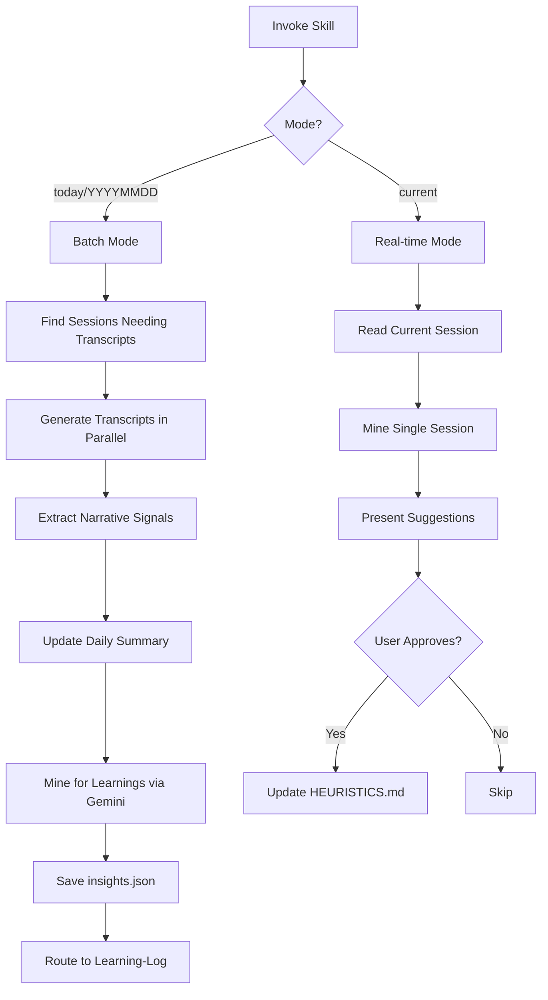

# Session-Insights Skill

**Status**: Implemented
See [[skills/session-insights/SKILL.md]] for full implementation.

## Workflow



## Purpose

Extract accomplishments and learnings from Claude Code sessions. Updates daily summaries and mines for framework patterns to strengthen heuristics.

## Problem Statement

Session value extraction gaps:
- Accomplishments lost in terminal history
- Patterns repeat across sessions without synthesis
- Framework learnings not captured
- User corrections not formalized as heuristics
- No feedback loop for skill effectiveness

## Solution

A skill that processes sessions in parallel, extracts structured data via Gemini analysis, updates daily summaries, and routes learnings to appropriate destinations.

## How It Works

### Invocation

```
Skill(skill="session-insights")           # today
Skill(skill="session-insights", args="YYYYMMDD")  # specific date
Skill(skill="session-insights", args="current")   # current session
```

### Batch Mode (today/YYYYMMDD)

**Step 1: Find Sessions**
```bash
cd $AOPS && uv run python skills/session-insights/scripts/find_sessions.py
```

**Step 2: Generate Transcripts (Parallel)**
```bash
cd $AOPS && uv run python scripts/claude_transcript.py {session_path} -o ...
```

**Step 3: Extract Narrative Signals**
```bash
cd $AOPS && uv run python skills/session-insights/scripts/extract_narrative.py --date YYYYMMDD
```

**Step 4: Update Daily Summary**
Create/update `$ACA_DATA/sessions/YYYYMMDD-daily.md` with accomplishments per project.

**Step 5: Mine for Learnings (Parallel via Gemini)**
Spawn Task agents for each transcript:
```
Task(subagent_type="general-purpose", model="haiku", prompt="Call mcp__gemini__ask-gemini...")
```

Gemini extracts:
- Skill effectiveness (suggested vs invoked)
- Context timing issues
- User corrections with heuristic mapping
- Failures by category
- Successes

**Step 6: Save Insights & Route**
- Write to `$ACA_DATA/dashboard/insights.json` for dashboard
- Route learnings to [[learning-log]] skill → GitHub Issues

### Real-time Mode (current)

**Step 7a-e**: Skip transcript generation, mine current session, present heuristic update suggestions via AskUserQuestion, apply approved updates to HEURISTICS.md.

### Output Locations

| Artifact | Location |
|----------|----------|
| Full transcripts | `$ACA_DATA/sessions/claude/YYYYMMDD-*-full.md` |
| Abridged transcripts | `$ACA_DATA/sessions/claude/YYYYMMDD-*-abridged.md` |
| Daily summary | `$ACA_DATA/sessions/YYYYMMDD-daily.md` |
| Mining results | `$ACA_DATA/dashboard/insights.json` |
| Learning observations | GitHub Issues (via learning-log) |

### Failure Categories

| Category | Description |
|----------|-------------|
| navigation | Wrong file/path |
| verification | Claimed success without testing |
| instruction | Did X when asked for Y |
| hallucination | Made up facts |
| skill-bypass | Skipped recommended skill |
| context-gap | Missing information caused error |

### Heuristic Mapping

Each correction/failure maps to relevant heuristic:
- H2: Skill-First - skill bypass patterns
- H3: Verification Before Assertion
- H4: Explicit Instructions Override Inference
- H22: Indices Before Exploration

## Relationships

### Depends On
- [[transcript]] skill for markdown generation
- `scripts/claude_transcript.py` for JSONL parsing
- Gemini API for pattern mining
- [[learning-log]] for GitHub Issue routing

### Used By
- [[dashboard]] skill consumes `insights.json`
- Daily review workflow
- Framework improvement loop

### Triggers

| Trigger | Mode |
|---------|------|
| Daily routine | Batch (today) |
| Stop hook | Real-time (current) |
| `/reflect` command | Real-time (current) |

## Success Criteria

1. **Parallel execution**: Transcripts and mining run concurrently
2. **Idempotent**: Safe to run multiple times
3. **Structured output**: JSON for dashboard, markdown for daily summary
4. **Heuristic evolution**: Corrections strengthen HEURISTICS.md
5. **No Claude API**: Mining via Gemini, not Claude (cost/speed)

## Design Rationale

**Why Gemini for mining?**

Claude API calls in batch processing would be slow and expensive. Gemini provides fast, cost-effective analysis for pattern extraction. Dashboard displays pre-computed insights, not real-time analysis.

**Why parallel execution?**

Sessions are independent. Generating transcripts in parallel via multiple Bash calls, and mining via concurrent Task agents, reduces total processing time.

**Why heuristic mapping?**

Individual corrections have limited value. Mapping to framework heuristics creates feedback loop: sessions reveal patterns → patterns strengthen heuristics → stronger heuristics prevent future errors.

**Why AskUserQuestion for current mode?**

Real-time reflection should be interactive. User approves which observations become permanent heuristic evidence, maintaining quality control over framework evolution.
