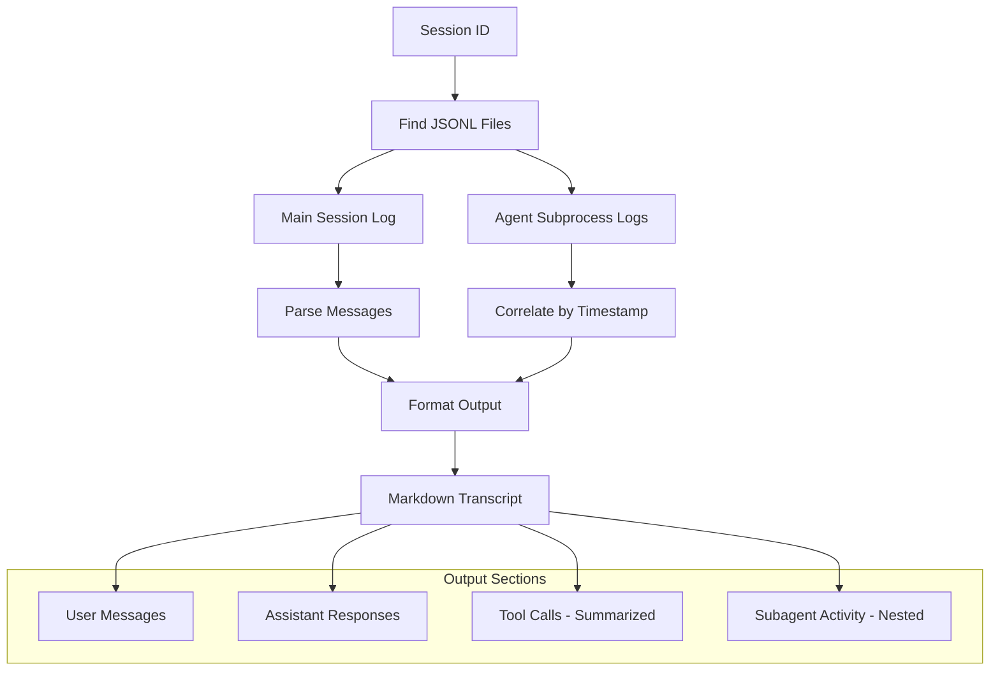

# Session Transcript Extractor

**Status**: Implemented (as /transcript skill)
**Priority**: P2

## Workflow



## Problem Statement

**What manual work are we automating?**

Understanding what happened in a Claude Code session currently requires:
1. Finding the right JSONL files in `~/.claude/projects/`
2. Correlating main thread with agent subprocess logs
3. Parsing raw JSON to extract meaningful conversation flow
4. Mentally reconstructing the timeline of events

The framework-debug skill provides methodology but still requires agent interpretation of raw logs.

**Why does this matter?**

- **Debugging**: Understanding why agents misbehaved requires seeing full context
- **Learning**: Reviewing successful patterns helps refine skills and workflows
- **Sharing**: Can't easily share "what happened" with others or future sessions
- **Accountability**: Hard to verify agent actually followed instructions without readable transcript

**Who benefits?**

Nic - faster debugging, better understanding of agent behavior, ability to review and learn from sessions.

## Success Criteria

**The automation is successful when**:

1. Given a session ID, produces human-readable transcript in <30 seconds
2. Transcript clearly shows:
   - User messages (timestamped)
   - Assistant responses (timestamped)
   - Tool invocations and results (summarized, not full content)
   - Subagent spawns (clearly marked with agent type/purpose)
   - Subagent internal activity (indented/nested under spawn)
   - Subagent return values to main thread
3. Output is valid markdown suitable for reading or archiving
4. Works for current session (in-progress) and completed sessions

**Quality threshold**: Transcript should be readable without reference to raw logs. Missing a few messages is acceptable; wrong ordering or attribution is not.

## Scope

### In Scope

- Extract and format main thread conversation
- Identify and inline subagent activity
- Show tool calls with brief summaries (not full file contents)
- Support output to stdout or file
- Handle current working session and past sessions

### Out of Scope

- Real-time streaming (batch extraction only)
- Hook execution logs (separate concern, framework-debug handles this)
- Statistical analysis or metrics
- Cross-session comparison
- Implementation details of parser (this spec defines interface, not implementation)

**Boundary rationale**: Focus on producing a readable transcript. Analysis and metrics are separate tools that can consume this output.

## Interface Design

### Input

```bash
# By session ID (full UUID)
session-transcript 3aa3c020-9641-48bb-8331-f056c6b18917

# By session ID (partial, finds most recent match)
session-transcript 3aa3c

# Current session (most recent in current repo)
session-transcript --current

# With output file
session-transcript --current -o transcript.md

# From specific repository
session-transcript --repo /home/nic/src/academicOps 3aa3c
```

### Output Format

```markdown
# Session Transcript: 3aa3c020-9641-48bb-8331-f056c6b18917

**Repository**: /home/nic/writing
**Started**: 2025-11-21 21:13:16 UTC
**Duration**: 45 minutes (ongoing)

---

## 21:13:16 - User

/meta read this conversation and use it to inform a spec...

---

## 21:13:18 - Assistant

I'll invoke the framework skill to analyze this conversation...

**Tool: mcp__bmem__search_notes**
- Query: "framework pain points skill activation"
- Result: 0 results

**Tool: mcp__bmem__build_context**
- URL: memory://projects/aops/*
- Result: 7 results

**Tool: Read**
- File: /home/nic/writing/data/projects/aops/STATE.md
- Result: 192 lines read

---

## 21:13:45 - Assistant

> **Spawning subagent**: Task (Explore)
> Prompt: "Find files related to hook configuration..."

### Subagent: Explore (agent-abc123)

#### Subagent Tool: Glob
- Pattern: **/*.md
- Result: 45 files

#### Subagent Tool: Read
- File: ~/.claude/settings.json
- Result: 23 lines

#### Subagent Return:
Found 3 hook configuration files...

---

## 21:14:02 - Assistant

Based on the subagent findings, I can see that...

---

## Summary

- **User messages**: 5
- **Assistant responses**: 12
- **Tool calls**: 34
- **Subagents spawned**: 3
- **Errors**: 0
```

## Data Sources

### Primary: Main Session Log

**Location**: `~/.claude/projects/{repo-path-encoded}/{session-id}.jsonl`

**Key fields to extract**:
- `type`: "user", "assistant", "tool", etc.
- `message.content`: The actual content
- `timestamp`: When it happened
- `uuid` / `parentUuid`: For threading

### Secondary: Agent Logs

**Location**: `~/.claude/projects/{repo-path-encoded}/agent-{id}.jsonl`

**Correlation**: Agent logs reference session via embedded metadata; timestamps help correlate spawn points.

**Key fields**:
- Same structure as main session
- Agent-specific metadata (type, prompt, parent session)

## Integration Test Design

### Test Setup

```bash
# Use a known completed session with subagent activity
# (Will identify specific test session after implementation)
TEST_SESSION="known-session-id-with-subagents"
```

### Test Execution

```bash
# Run extractor
session-transcript $TEST_SESSION -o /tmp/test-transcript.md
```

### Test Validation

```python
# Validate output structure
import re

with open('/tmp/test-transcript.md') as f:
    content = f.read()

# Has header with session ID
assert '# Session Transcript:' in content

# Has user messages
assert '## ' in content and '- User' in content

# Has assistant messages
assert '- Assistant' in content

# Has tool calls (formatted)
assert '**Tool:' in content

# Has subagent section (if session had subagents)
assert 'Spawning subagent' in content or 'Subagents spawned: 0' in content

# Timestamps are in order
timestamps = re.findall(r'## (\d{2}:\d{2}:\d{2})', content)
assert timestamps == sorted(timestamps), "Timestamps out of order"

# No raw JSON in output
assert '"type":' not in content, "Raw JSON leaked into transcript"

print("All validations passed")
```

### Success Conditions

- [ ] Test initially fails (no implementation)
- [ ] Test passes after implementation
- [ ] Handles session with no subagents
- [ ] Handles session with multiple subagents
- [ ] Handles in-progress session
- [ ] Handles large session (>1000 messages) in <30s
- [ ] Output is valid markdown

## Implementation Notes

**Parser abstraction**: This spec intentionally does NOT specify the parser implementation. Options to explore:

1. **jq-based**: Shell script using jq for JSON processing
2. **Python script**: More control, easier testing
3. **Existing tools**: Check if Claude Code or community tools already do this
4. **LLM-assisted**: Use small model to summarize verbose tool outputs

**Recommendation**: Start with Python for flexibility, but keep parser logic isolated so it can be swapped.

### Error Handling

**Fail-fast**:
- Session ID not found → Error with list of recent sessions
- Log file unreadable → Error with permissions info

**Graceful degradation**:
- Malformed JSONL lines → Skip, note in summary
- Missing agent logs → Show "[agent log not found]" placeholder
- Truncated session → Process what exists, note incompleteness

## Open Questions

1. Should tool results be fully included or summarized? (Leaning: summarized with option for verbose)
2. How to handle very long assistant responses? (Leaning: truncate with "[... N more lines]")
3. Should we detect and label "thinking" blocks separately?
4. Format for nested subagent-within-subagent scenarios?
