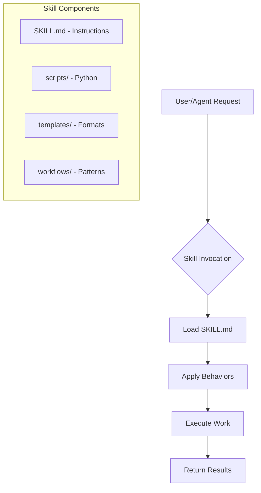

# Skills Overview

**Status**: Implemented (core skill system active)

## Skill Architecture

## Core Skills

| Skill | Purpose | Status |
|-------|---------|--------|
| [[framework-skill]] | Categorical governance | Implemented |
| [[python-dev-skill]] | Fail-fast Python | Implemented |
| [[feature-dev-skill]] | Test-first development | Implemented |
| [[remember-skill]] | Knowledge persistence | Implemented |
| [[supervisor-skill]] | Multi-agent orchestration | Implemented |
| [[tasks-skill]] | Task lifecycle | Implemented |
| [[learning-log-skill]] | Pattern documentation | Implemented |
