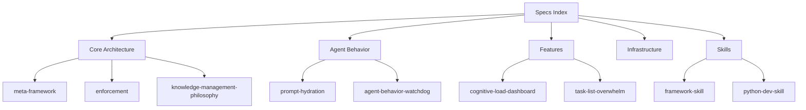

# Technical Specifications

**Status**: Index file (always current)

## Spec Organization

Design documents for the academicOps framework. Per [[AXIOMS]] #29: one spec per feature, timeless.

## Spec Lifecycle

| Status | Meaning |
|--------|---------|
| `draft` | In development, not yet approved |
| `approved` | Approved design, awaiting implementation |
| `implemented` | Built and working |
| `requirement` | User story, not yet designed |

## Core Architecture

- [[meta-framework]] - Strategic partner design (implemented)
- [[knowledge-management-philosophy]] - Everything capture, just-in-time delivery
- [[enforcement]] - Enforcement layers and mechanisms
- [[spec-maintenance]] - Ensure specs remain single source of truth (implemented)

## Agent Behavior

- [[specs/prompt-hydration]] - Context gathering, classification, workflow selection (draft)
- [[agent-behavior-watchdog]] - Detection of bypass patterns (draft)
- [[conclusion-verification-hook]] - Verify claims have evidence (draft)
- [[plan-quality-gate]] - Critic review before presenting plans (requirement)
- [[framework-aware-operations]] - Agents know framework architecture (requirement)

## Features

- [[cognitive-load-dashboard]] - Live Streamlit dashboard (implemented)
- [[task-list-overwhelm]] - Task state index and synthesis (in progress)
- [[session-insights-mining]] - Extract learnings from transcripts (draft)
- [[session-transcript-extractor]] - Generate readable transcripts (implemented as /transcript skill)
- [[parallel-batch-command]] - Parallel file processing (implemented as /parallel-batch skill)
- [[email-to-tasks-workflow]] - Email to task extraction (draft)
- [[tasks-mcp-server]] - Task CRUD via MCP (draft)

## Infrastructure

- [[testing-framework-overview]] - Test types and requirements
- [[multi-terminal-sync]] - Cross-device state sync (requirement)
- [[informed-improvement-options]] - Context7 + research before fixes (requirement)

## Skills

- [[framework-skill]] - Categorical governance for framework changes (implemented)
- [[python-dev-skill]] - Fail-fast Python with type safety (implemented)
- [[feature-dev-skill]] - Test-first development workflow (implemented)
- [[remember-skill]] - Knowledge persistence to markdown + memory server (implemented)
- [[supervisor-skill]] - Multi-agent orchestration with quality gates (implemented)
- [[tasks-skill]] - Task lifecycle management (implemented)
- [[learning-log-skill]] - Pattern documentation via GitHub Issues (implemented)
- [[docs-update-skill]] - README.md/INDEX.md drift detection and correction (implemented)
