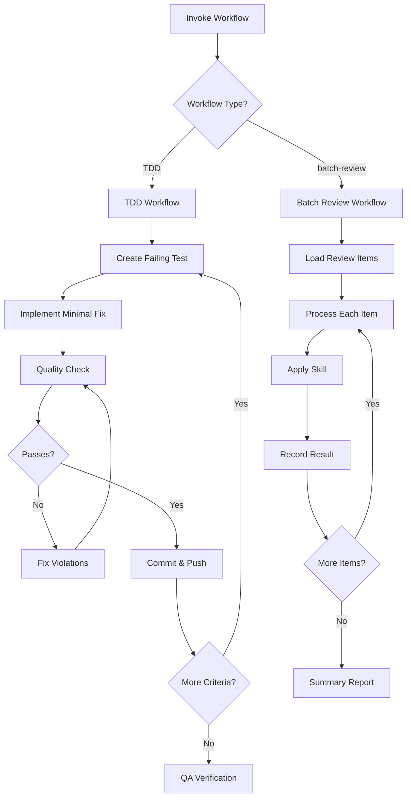

# Supervisor Skill

**Status**: Implemented
See [[skills/supervisor/workflows/]] for workflow templates.

## Workflow



## Purpose

Orchestrate complex multi-step workflows with quality gates, delegating implementation to specialized skills and subagents.

## Problem Statement

Development workflow risks:
- Tests written after implementation (not TDD)
- Quality checks skipped under time pressure
- Commits without verification
- Batch work done without tracking
- python-dev skill not invoked for code work

## Solution

Workflow templates that enforce process: TDD cycles with mandatory skill invocation, quality gates before commits, and batch processing with progress tracking.

## How It Works

### Invocation

Supervisor workflows are invoked via `/do` or `/ttd` commands:
```
/ttd [task description]
```

### TDD Workflow

Implements test-driven development with mandatory [[python-dev]] skill invocation.

**Iteration Unit**: ONE failing test → minimal implementation → passing test → commit + push

**Quality Gate (Before Each Commit)**:
- [ ] pytest passes for new test
- [ ] pytest passes for all tests (no regressions)
- [ ] Fail-fast compliance verified
- [ ] Code reviewed via python-dev skill
- [ ] Commit created and pushed

**Step 1: Test Creation**
```
Task(subagent_type="general-purpose", prompt="
Create ONE failing test.
**FIRST**: Invoke Skill(skill='python-dev')...
")
```

Pre-Check (MANDATORY):
- ❌ No creating new databases
- ❌ No running vectorization pipelines
- ❌ No creating new configs
- ❌ No generating fake data

**Step 2: Implementation**
```
Task(subagent_type="general-purpose", prompt="
Implement MINIMAL code to make this ONE test pass.
**FIRST**: Invoke Skill(skill='python-dev')...
")
```

If tests fail: Iterate up to 3 times per issue. If still failing, HALT and ask user.

**Step 3: Quality Check**
```
Task(subagent_type="general-purpose", prompt="
Validate code quality and commit this change.
**FIRST**: Invoke Skill(skill='python-dev')...
")
```

Validation checklist:
- No `.get(key, default)` patterns
- No defaults or fallbacks
- Real fixtures, no mocked internal code
- Type safety

**Step 4: Push**
Push committed changes. If push fails (diverged branches), HALT - do not force push.

### Batch Review Workflow

For processing multiple items with consistent skill application.

**Workflow**:
1. Load items to process
2. For each item, apply appropriate skill
3. Record result
4. Generate summary report

## Relationships

### Depends On
- [[python-dev]] - MANDATORY for all code work
- [[feature-dev]] - Full feature development workflow

### Used By
- `/ttd` command
- `/do` command (routes to TDD for development work)
- Feature implementation workflows

### Subagent Types Used

| Type | Purpose |
|------|---------|
| Plan | Create detailed plans, break down tasks |
| Explore | Understand codebase, find files |
| general-purpose | Implementation (MUST invoke python-dev first) |

## Success Criteria

1. **Skill invocation enforced**: Subagents MUST invoke python-dev
2. **TDD cycle complete**: Test → implement → verify → commit → push
3. **Quality gates passed**: No commits without validation
4. **No regressions**: All tests pass before commit
5. **Iteration limit**: Max 3 fix attempts before escalating

## Design Rationale

**Why mandatory python-dev invocation?**

Subagents forget coding standards without explicit skill invocation. Making it mandatory in the prompt ensures fail-fast principles and testing patterns are loaded.

**Why quality gates?**

Pressure to ship leads to skipped checks. Explicit gates ensure every commit passes validation. Quality check happens BEFORE commit, not after.

**Why iteration limit?**

Infinite fix loops waste time. 3 attempts is enough for straightforward issues. Beyond that, the problem needs human insight.

**Why push after each cycle?**

Work committed but not pushed is at risk. Pushing after each complete cycle ensures progress is preserved and visible.
