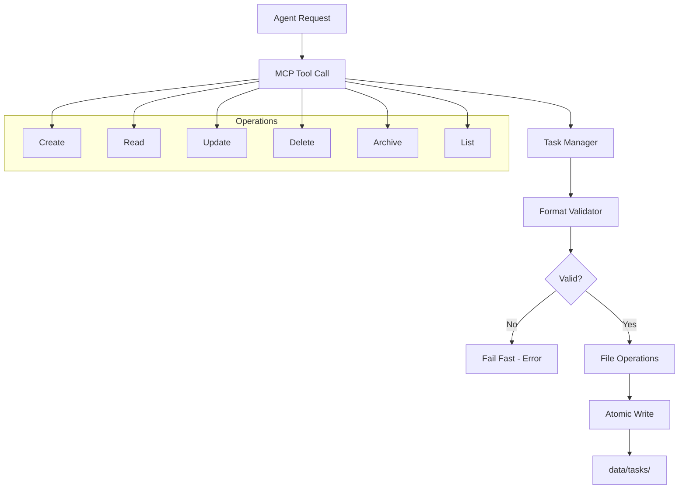

# Tasks MCP Server

**Status**: Draft
**Priority**: P1 (blocks task workflow reliability)

## Workflow



## User Story

**As** Nic (academic relying on task system across multiple agent sessions),  
**I want** guaranteed task state integrity through exclusive MCP-controlled write access,  
**So that** agents can't bypass scripts to corrupt task data, all task operations work reliably, and I never lose tasks or encounter format mismatches.

## Acceptance Criteria

- [ ] **Exclusive write access** - MCP server is the ONLY way to modify data/tasks/ (agents cannot bypass)
- [ ] **All CRUD operations work** - create, read, update, delete, archive, list tasks work reliably 100% of the time
- [ ] **Format consistency enforced** - All tasks use Obsidian-compatible bmem format consistently (no .json vs .md mismatches)
- [ ] **Flexible task references** - Both filename-based and index-based task references work
- [ ] **Zero state corruption** - No format mismatches, no partial writes, no race conditions
- [ ] **Fail-fast validation** - Malformed data, invalid operations, or format violations halt immediately with clear errors

## Context & Problem

**Current pain point**: Task management uses Python scripts (task_add.py, task_view.py, task_archive.py) that have:

- Format inconsistencies (.json vs .md)
- No unified identifier scheme
- No enforcement of exclusive write access to data/tasks/
- Agents sometimes bypass scripts and directly read/write files, causing state inconsistencies

**Why this matters**:

- Tasks created by scripts can't be archived (format mismatch)
- No update capability (must recreate tasks to change priority/status)
- Agents don't reliably use scripts (documentation-only enforcement fails)
- File-based access allows state corruption
- Integration with other systems (email, bmem) requires script-level coordination

**Who benefits**: Nic gets reliable task management that integrates with email extraction and knowledge base, without state corruption or format mismatches.

## Key Architecture: Drop-In Replacement

**MCP server is pure infrastructure** - data validation and CRUD operations only. All intelligence (categorization, extraction, linking) lives in agent skills that orchestrate the MCP tools.

This is a drop-in replacement for existing task scripts with the critical difference: **write access is enforceable** through MCP protocol.

## Success Metrics

**Quality threshold**: Fail-fast on malformed data, invalid operations, or format violations. No silent failures, no workarounds.

**Reliability target**: >99% operation success rate (compared to task_view.py's current ~50% failure rate)

## Scope

### In Scope

- MCP server implementation with tools for: create, read, update, delete, archive, list tasks
- Obsidian-compatible bmem format (frontmatter + markdown content)
- Filename-based identifiers (primary) + index-based references (convenience)
- Exclusive management of data/tasks/ directory structure (inbox/, completed/, archived/)
- Basic validation (required fields, format compliance)
- Drop-in replacement for existing task scripts

### Out of Scope

- AI-powered task categorization (handled by workflow skill)
- Email integration (handled by workflow skill)
- Calendar deadline tracking (future enhancement)
- Task relationships/dependencies (future enhancement)
- Rich task metadata beyond bmem format (future enhancement)

**Boundary rationale**: MCP server is pure infrastructure - data validation and CRUD operations only. All intelligence (categorization, extraction, linking) lives in agent skills that orchestrate the MCP tools.

## Integration Test Design

### Test Setup

```bash
# Create test task directory
mkdir -p /tmp/test-tasks/{inbox,completed,archived}

# Set TEST_TASKS_DIR environment variable
export TEST_TASKS_DIR=/tmp/test-tasks

# Start MCP server in test mode
# (Implementation will include test harness)
```

### Test Execution

```bash
# Test 1: Create task
# Expected: Task file created in inbox/ with valid frontmatter

# Test 2: Read task by filename
# Expected: Returns task content with metadata

# Test 3: Read task by index
# Expected: Returns correct task from sorted list

# Test 4: Update task (change priority)
# Expected: Frontmatter updated, modified timestamp updated

# Test 5: Archive task
# Expected: File moved from inbox/ to archived/

# Test 6: List tasks with filters (priority, status)
# Expected: Returns matching tasks only

# Test 7: Malformed frontmatter
# Expected: Fails with clear error message, doesn't corrupt data

# Test 8: Concurrent operations
# Expected: No race conditions, state remains consistent
```

### Test Validation

```bash
# Verify file locations correct
ls /tmp/test-tasks/inbox/*.md
ls /tmp/test-tasks/archived/*.md

# Verify frontmatter valid
python -c "import yaml; yaml.safe_load(open('task.md').read().split('---')[1])"

# Verify timestamps updated
grep "modified:" task.md

# Verify no data corruption
validate_all_tasks.sh
```

### Test Cleanup

```bash
# Remove test directory
rm -rf /tmp/test-tasks

# Unset environment variable
unset TEST_TASKS_DIR
```

### Success Conditions

- [ ] Test initially fails (MCP server doesn't exist yet)
- [ ] All CRUD operations pass
- [ ] Format validation catches malformed data
- [ ] Index-based references work correctly
- [ ] Concurrent operations don't corrupt state
- [ ] Test is idempotent
- [ ] Test cleanup leaves no artifacts

## Implementation Details

### High-Level Design

**Components**:

1. **MCP Server**: Python FastMCP server exposing tools
2. **Task Manager**: Core logic for CRUD operations
3. **Format Validator**: Ensures bmem format compliance
4. **File Operations**: Atomic read/write with locking
5. **Index Mapper**: Translates index → filename references

**Data Flow**:

- Agent → MCP Tool Call → Task Manager → Validator → File Operations → data/tasks/

### Technology Choices

**Language/Tools**: Python with FastMCP library, uv for dependency management

**Libraries**:

- `fastmcp`: MCP server implementation
- `pydantic`: Data validation and settings
- `pathlib`: File path operations
- `frontmatter`: YAML frontmatter parsing
- `filelock`: Atomic file operations

**Rationale**: FastMCP provides clean MCP protocol implementation; Pydantic enforces fail-fast validation; frontmatter library handles Obsidian-compatible format; filelock prevents race conditions.

### Task Data Format

Tasks must have bmem-compatible frontmatter:

```yaml
---
title: Task title
permalink: tasks/filename
type: task
tags: [tag1, tag2]
priority: P0-P3
status: inbox|completed|archived
created: ISO8601 timestamp
modified: ISO8601 timestamp
---
```

Markdown body contains task description and context. Fail-fast if frontmatter malformed or required fields missing.

### Error Handling Strategy

**Fail-fast cases** (halt immediately):

- Malformed frontmatter (invalid YAML)
- Missing required fields (title, permalink, type)
- Invalid status/priority values
- File operations fail (permissions, disk full)
- Concurrent access conflicts

**Graceful degradation cases** (best effort):

- None - task management must be reliable or fail clearly

**Recovery mechanisms**:

- All operations atomic (file locks + temp files + rename)
- No partial writes
- Clear error messages with file paths and line numbers

## Dependencies

### Required Infrastructure

- MCP protocol support (Claude Code has this)
- Python 3.11+ with uv package manager
- data/tasks/ directory structure: inbox/, completed/, archived/
- bmem format specification for task files

## Rollout Plan

### Phase 1: Validation (Experiment)

- Build MCP server with integration tests
- Test with 20-30 existing tasks
- Validate all operations work correctly
- Document in experiment log

**Criteria to proceed**: All integration tests pass, zero data corruption in test set

### Phase 2: Limited Deployment

- Deploy MCP server, keep task scripts as backup
- Update task skill to prefer MCP, fall back to scripts
- Monitor for 1 week
- Fix any issues found

**Criteria to proceed**: 1 week of reliable operation, <1% error rate

### Phase 3: Full Deployment

- Remove task scripts
- Update all documentation to reference MCP only
- Mark as production in framework

**Rollback plan**: Revert to task scripts by updating skill documentation, MCP server can coexist with scripts (operates on same data format)

## Timeline Estimate

- **Design and specification**: 2 hours (DONE)
- **Integration test development**: 3-4 hours
- **Implementation**: 4-6 hours
- **Testing and refinement**: 2-3 hours
- **Documentation**: 1-2 hours
- **Total**: 12-17 hours

**Confidence level**: Medium (FastMCP is new to us, may have learning curve)

## Failure Modes

### What Could Go Wrong?

1. **Failure mode**: Task file corrupted during write
   - **Detection**: Frontmatter validation fails on next read
   - **Impact**: Task becomes inaccessible
   - **Prevention**: Atomic writes (write to temp, validate, rename)
   - **Recovery**: Restore from git history, log corruption event

2. **Failure mode**: Index reference becomes stale (file renamed/deleted)
   - **Detection**: Index → filename lookup fails
   - **Impact**: Agent can't find task by index
   - **Prevention**: Index rebuilt on each list operation
   - **Recovery**: Agent falls back to filename-based reference

3. **Failure mode**: Concurrent agents modify same task
   - **Detection**: File lock acquisition fails
   - **Impact**: Second operation blocked
   - **Prevention**: File locking on all write operations
   - **Recovery**: Retry with exponential backoff, fail after timeout

4. **Failure mode**: Agent bypasses MCP and reads files directly
   - **Detection**: Can't prevent read access (filesystem permissions same)
   - **Impact**: Stale data if MCP has pending writes
   - **Prevention**: Documentation + agent training to always use MCP
   - **Recovery**: Accept reads are uncontrolled, enforce write-only through MCP

## Monitoring and Validation

### How do we know it's working in production?

**Metrics to track**:

- Operation success rate (should be >99%)
- File format validation failures (indicates data quality issues)
- Concurrent access conflicts (should be rare)
- Index reference failures (indicates stale indexes)

**Monitoring approach**:

- Log all operations to data/logs/task-mcp.jsonl
- Track error types and frequencies
- Weekly review of logs for patterns

**Validation frequency**: Continuous logging, weekly manual review

## Documentation Requirements

### Code Documentation

- [ ] Docstrings for all MCP tools (parameters, return values, errors)
- [ ] Type hints throughout (mypy --strict must pass)
- [ ] README.md in MCP server directory
- [ ] API reference generated from docstrings

### User Documentation

- [ ] Update bots/skills/tasks/SKILL.md with MCP tool usage
- [ ] Document migration from scripts to MCP
- [ ] Add troubleshooting guide for common errors
- [ ] Update bots/CORE.md with MCP server info

### Maintenance Documentation

- [ ] Known limitations (read access not controlled)
- [ ] Future enhancements (relationships, calendar integration)
- [ ] Dependency versions and compatibility

## Risks and Mitigations

**Risk 1**: FastMCP library doesn't meet our needs

- **Likelihood**: Low
- **Impact**: High (would need to find alternative)
- **Mitigation**: Prototype basic server with create/read operations before full implementation

**Risk 2**: File locking causes performance issues

- **Likelihood**: Medium
- **Impact**: Medium (operations slower than expected)
- **Mitigation**: Start with simple locking, optimize only if needed; single-user context means contention rare

**Risk 3**: Index-based references too complex

- **Likelihood**: Low
- **Impact**: Low (can drop feature)
- **Mitigation**: Implement as convenience feature, document that filename-based is canonical

## Open Questions

1. Should MCP server validate task content (beyond frontmatter)? Or purely structural validation?
   - **Decision**: Purely structural - content validation is agent's responsibility

2. How to handle task IDs in frontmatter if we're using filename-based identifiers?
   - **Decision**: Permalink field serves as stable identifier (maps to filename)

3. Should we support batch operations (create multiple tasks at once)?
   - **Decision**: Start with single operations, add batch if workflow demands it

## Completion Checklist

- [ ] All success criteria met and verified
- [ ] Integration test passes reliably (>95% success rate)
- [ ] All failure modes addressed
- [ ] Documentation complete (code, user, maintenance)
- [ ] Experiment log entry created
- [ ] No documentation conflicts introduced
- [ ] Code follows AXIOMS.md principles (fail-fast, DRY, explicit)
- [ ] Monitoring in place and working
- [ ] Rollout plan executed successfully
- [ ] Framework ROADMAP.md updated with progress

## Post-Implementation Review

[After 2 weeks of production use]

**What worked well**: [To be completed after deployment]

**What didn't work**: [To be completed after deployment]

**What we learned**: [To be completed after deployment]

**Recommended changes**: [To be completed after deployment]

---
