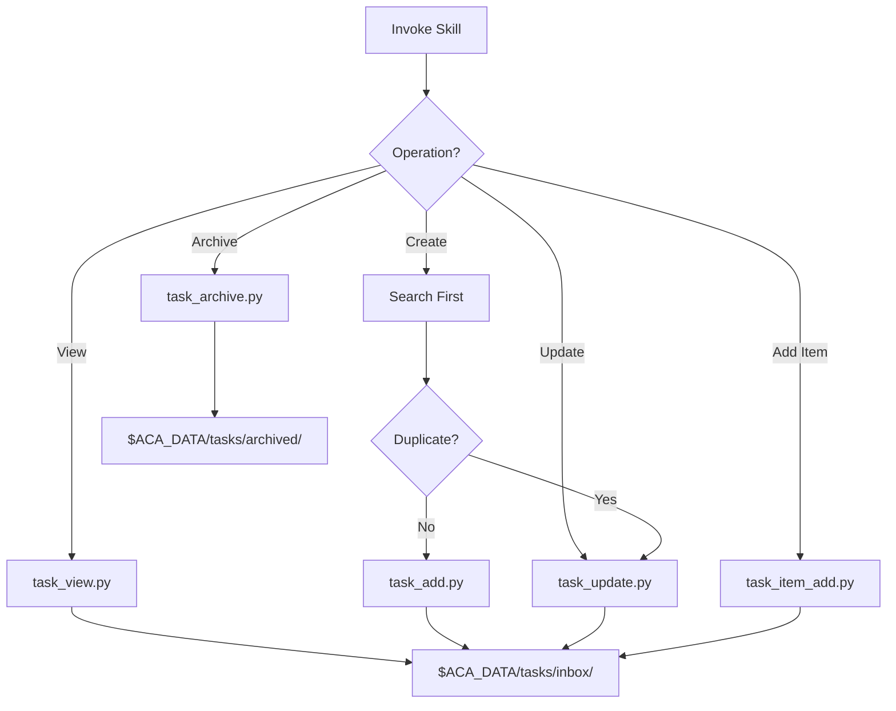

# Tasks Skill

**Status**: Implemented
See [[academicOps/skills/tasks/SKILL|SKILL.md]] for full implementation.

## Workflow



## Purpose

Manage task lifecycle (create, view, archive, update) using scripts that enforce proper formatting and prevent common failure patterns like duplicate creation.

## Problem Statement

Task management risks:
- Duplicate tasks created for same work item
- Inconsistent markdown formatting
- Direct file manipulation bypassing validation
- Missing metadata (priority, project, due dates)
- Checklist items not compatible with Obsidian plugins

## Solution

A skill that wraps Python scripts for all task operations, enforcing search-before-create, proper formatting, and Obsidian-compatible checklist syntax.

## How It Works

### Invocation

```
Skill(skill="tasks")
```

Invoke for viewing, creating, archiving, or updating tasks.

### Core Behaviors

**1. Script-Only Operations**

All task operations go through scripts in `skills/tasks/scripts/`:

| Script | Purpose |
|--------|---------|
| `task_view.py` | Display tasks with filtering/sorting |
| `task_add.py` | Create new tasks |
| `task_update.py` | Modify existing tasks |
| `task_archive.py` | Move to/from archive (batch supported) |
| `task_item_add.py` | Add checklist items |

**2. Search-Before-Create (Mandatory)**

Before creating ANY task:
```bash
grep -li "keyword" $ACA_DATA/tasks/inbox/*.md
```

If related task exists → use `task_update.py` to modify. Do NOT create duplicate.

**3. Storage Structure**

```
$ACA_DATA/tasks/
├── inbox/      # Active tasks
└── archived/   # Completed tasks
```

**4. Priority Levels**

| Priority | Meaning | Time Window |
|----------|---------|-------------|
| P0 | Urgent | Today/tomorrow |
| P1 | High | This week |
| P2 | Medium | Within 2 weeks |
| P3 | Low | Longer timeline |

**5. Checklist Format (Dataview)**

Obsidian-compatible syntax for sub-task tracking:
```markdown
## Checklist

- [ ] Item with due date [due:: 2025-01-15]
- [x] Completed item [completion:: 2025-01-10]
- [ ] High priority [priority:: high]
```

### Critical Rules

**NEVER**:
- Write task files directly via Edit/Write tools
- Move files manually (use scripts)
- Create task without searching for duplicates first

**ALWAYS**:
- Run from `$AOPS`: `cd $AOPS && uv run python skills/tasks/scripts/...`
- Verify script execution succeeded
- Search existing tasks before creating

## Index Generation

The task index is maintained by `scripts/regenerate_task_index.py`:

**Scanning**:
- Scans ALL `*.md` files in `$ACA_DATA` (not just tasks/)
- Filters for files with `type: task` in YAML frontmatter
- Excludes session transcripts and known non-task files

**Output**:
- `$ACA_DATA/tasks/index.json` - Machine-readable index with task metadata
- `$ACA_DATA/tasks/INDEX.md` - Human-readable, organized by project

**Schedule**:
- Runs every 5 minutes via cron (installed by `setup.sh`)
- Manual: `cd $AOPS && uv run python scripts/regenerate_task_index.py`

**INDEX.md Format**:
```
## project-name (count)

- [[path/to/task.md|Task Title]] (P1, due: 2025-01-15, * active, [3/5])
```

Indicators: `P0-P3` (priority), `due: YYYY-MM-DD`, `* active`/`inbox`/`~ waiting`/`/ archived`, `[done/total]` (subtasks)

## Relationships

### Depends On
- Python scripts in `skills/tasks/scripts/`
- `$ACA_DATA/tasks/` directory structure

### Used By
- [[email]] command - Email-to-task extraction
- [[supervisor-skill]] - Documents session outcomes
- Any workflow creating tasks

### Workflows (bundled)
- `workflows/email-capture.md` - Email to task extraction

## Success Criteria

1. **No direct file writes**: All operations through scripts
2. **No duplicates**: Search-before-create enforced
3. **Proper formatting**: YAML frontmatter, markdown body
4. **Obsidian compatible**: Checklist items work with Dataview/Tasks plugins
5. **Batch support**: Archive multiple tasks in single command

## Design Rationale

**Why script-only?**

Scripts enforce validation, proper formatting, and consistent behavior. Direct file writes bypass these checks and create inconsistent task files.

**Why search-before-create?**

Duplicate tasks waste user time on triage. The documented failure pattern shows agents creating duplicates when they don't check first. Mandatory search prevents this.

**Why Dataview format?**

User works in Obsidian with Tasks and Dataview plugins. Using `[due:: YYYY-MM-DD]` syntax makes checklist items queryable and visible in Obsidian's task views.

**Why batch archive?**

Users often complete multiple related tasks together. Batch archiving (`task_archive.py "a.md" "b.md" "c.md"`) is more efficient than individual commands.
