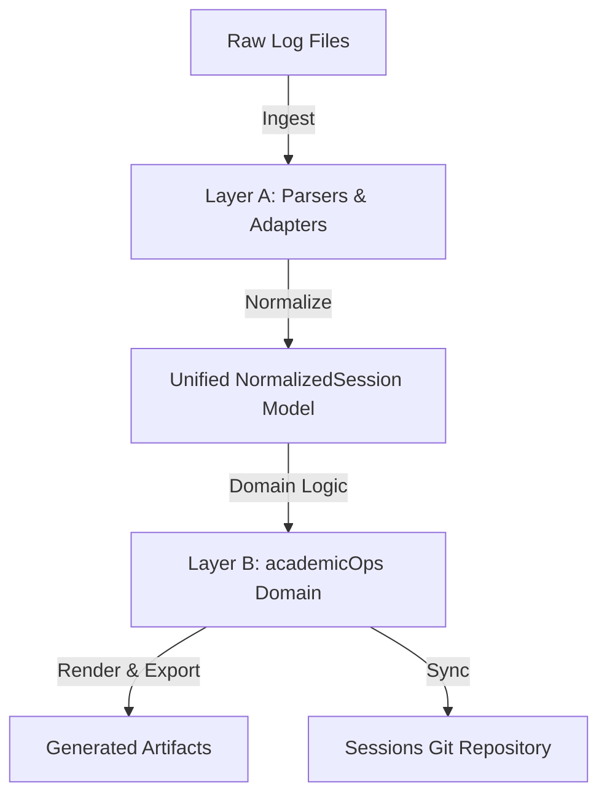

# Transcript Pipeline Specification

This spec outlines the design, scope, and integration of the session-transcript generation and sync pipeline. The pipeline is rebuilt as a modern, two-layer system that separates low-level parsing/rendering from high-level academicOps domain logic.

## 1. Intent & Scope

The transcript pipeline is responsible for:

- Ingesting raw JSONL session logs from Claude Code and agy clients.
- Normalizing them into a single, unified data model.
- Performing domain analysis (slugs, context classification, event timestamps, correlation, insights).
- Generating three structured output artifacts per session.
- Committing and pushing session transcripts to the central sessions repository named by `AOPS_SESSIONS`. There is no default: the repository is site-specific, so an unset variable is a hard error rather than a guessed path.

### Excluded Scope

- **Gemini logs (a2a-serv):** Explicitly excluded due to excessive volume/heartbeat noise.
- **Observability schema:** The broader crew/surface/observability schemas are handled by external tools; the transcript pipeline focuses exclusively on session-level metadata.

---

## 2. Two-Layer Architecture

### Layer A: Parse & Render (Adapters)

Layer A decouples the system from external raw log formats, converting raw logs into a common typed model (`NormalizedSession`).

- **Claude Adapter:** Wraps the live, unpinned `claude-code-log` library. It translates Claude's Pydantic entry union models and handles CLI-level formatting. Unknown top-level entry types are gracefully captured as raw entries and logged rather than causing parser failure.
- **Sessions, not files:** Claude Code writes one trunk log per session plus a sidechain log per subagent under `<session-id>/subagents/`. Every sidechain record reuses the parent's `sessionId`, so a sidechain log is never a session in its own right — treated as one it derives the parent's slug and filename and overwrites the parent's transcript. Discovery therefore yields trunk logs only, and a session is reconstructed as trunk plus sidechains. `claude-code-log` inlines the subagents whose spawning tool call it can resolve and leaves the rest (in-process teammates carry no `toolUseId`; a nested spawn's id lives in another sidechain), so the adapter partitions loaded entries on `isSidechain`, regroups the inlined ones by `agentId`, and reads the remaining sidechain files from disk. Counting either as trunk events would overstate both the conversation and its cost.
- **agy Adapter:** A lightweight, hand-written parser for agy TUI JSONL log streams.

### Layer B: academicOps Domain Layer

Layer B consumes typed `NormalizedSession` objects exclusively and enforces the core business rules:

- **Stable Slug:** Deterministic `session_id`-derived slugs (first part of UUID or first 8 chars) ensuring filenames do not churn if content changes.
- **Semantic User Context (`has_user_context`):** Classifies sessions as interactive (human) vs automated (cron/worker) by checking event structure, entrypoints, and prompt XML envelopes (e.g. `<USER_REQUEST>`) rather than a simple surface whitelist.
- **Event-Time Timestamps:** Derives session lifecycle timestamps (`started_at`, `last_modified`, `ended_at`) exclusively from event-stream timestamps, never relying on filesystem metadata (`mtime`).
- **Skip-Cache:** A persistent cache of sessions that rendered to nothing, keyed by source path and fingerprinted by the mtime and size of every file the session was reconstructed from. The batch runner consults it before parsing, so an unchanged empty session costs a few `stat()` calls. Because the cron reaches a session seconds after it starts — when it is legitimately still empty — recording only "this was empty" would blacklist it for life; any append, truncation, or new subagent log changes the fingerprint and brings the session back. A cache without fingerprints cannot prove anything about the present and is discarded on load.
- **Recent Interactive View:** Filters and sorts (most-recent-first) interactive sessions to populate primary navigation interfaces.
- **Correlation:** Infers related PKB tasks/epics, GitHub pull requests, and project associations via pattern matching across event boundaries.
- **Reflection to Insights:** Extracts model-generated reflections and summary headers.

---

## 3. Output Formats

Every processed session produces three outputs in the sessions repository under the `transcripts/YYYY-MM/` directory:

1. **Markdown (+ YAML Front-matter):** A clean document showing the chronological conversation timeline, prefixed with metadata front-matter (session ID, slug, timestamps, user context, correlation targets).
2. **HTML:** A beautiful, responsive, standalone dark-mode formatted document containing styled blocks for user prompts, thinking processes, assistant messages, and tool outputs.
3. **JSON Sidecar:** A complete machine-readable metadata file containing the front-matter attributes, event counts, extracted insights, and list of user prompts (enabling rapid search indexing).

### Where delegated work lands

A session's subagent conversations dwarf its main thread — the largest session on record carries a 0.9M-char trunk against 3.3M chars of sidechains — so only `.full.md`, the artifact that claims to be complete, expands them event by event. The summary Markdown, the HTML, and the JSON sidecar name every subagent with its type, brief, event count, and token spend, and point at `.full.md` for the conversation itself. That keeps the summary readable and the HTML openable in a browser while nothing goes unrecorded. `.full.md` holds a character budget as a safety valve against a runaway session producing a file nothing can open; subagents beyond it are named in place rather than dropped.

`tokens_used`, `cost_usd`, and `event_count` describe the trunk, as they always have. `total_tokens_used`, `total_cost_usd`, and `total_event_count` describe the whole session including delegated work — for a multi-agent session the difference is several-fold, and the total is the real spend. `user_prompts` stays trunk-only: a subagent's opening message is a delegation brief, not something a human typed, and the prompt ledger reads that key.

---

## 4. Maintenance & Testing Strategy

- **Committed Fixture Corpus:** Real, anonymized session transcripts representing common Claude and agy sessions are committed under `tests/transcripts/fixtures/`, including a subagent sidechain log and its metadata sidecar so tests can stage a real multi-agent session layout on disk.
- **Contract & Snapshot Tests:** Run against the committed fixtures to assert that both adapters map events correctly and that rendered output matches stable snapshots. Upstream changes in the unpinned `claude-code-log` library trigger diffable CI failures rather than silent production regressions.
