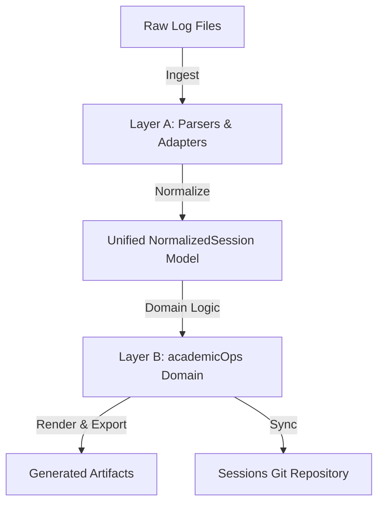

# Transcript Pipeline Specification

This spec outlines the design, scope, and integration of the session-transcript generation and sync pipeline. The pipeline is rebuilt as a modern, two-layer system that separates low-level parsing/rendering from high-level academicOps domain logic.

## 1. Intent & Scope

The transcript pipeline is responsible for:

- Ingesting raw JSONL session logs from Claude Code and agy clients.
- Normalizing them into a single, unified data model.
- Performing domain analysis (slugs, context classification, event timestamps, subagent call tree lineage reconstruction, per-step token/cost accounting, diagnostic error classification, correlation, insights).
- Generating five structured output artifacts per session.
- Committing and pushing session transcripts to the central sessions repository named by `AOPS_SESSIONS`. There is no default: the repository is site-specific, so an unset variable is a hard error rather than a guessed path.

### Excluded Scope

- **Gemini logs (a2a-serv):** Explicitly excluded due to excessive volume/heartbeat noise.
- **Observability schema:** The broader crew/surface/observability schemas are handled by external tools; the transcript pipeline focuses exclusively on session-level metadata.

---

## 2. Two-Layer Architecture



### Layer A: Parse & Render (Adapters)

Layer A decouples the system from external raw log formats, converting raw logs into a common typed model (`NormalizedSession`).

- **Claude Adapter:** Wraps the live, unpinned `claude-code-log` library. It translates Claude's Pydantic entry union models and handles CLI-level formatting. Unknown top-level entry types are gracefully captured as raw entries and logged rather than causing parser failure. Per-step LLM usage metrics (`input_tokens`, `output_tokens`, `cache_read_input_tokens`, `cache_creation_input_tokens`) and step cost estimates (`step_cost_usd`) are extracted into `event.meta["usage"]`. Subagent sidecar metadata is parsed to attach `parentAgentId` (and spawning `toolUseId`) for tree construction.
- **Sessions, not files:** Claude Code writes one trunk log per session plus a sidechain log per subagent under `<session-id>/subagents/`. Every sidechain record reuses the parent's `sessionId`, so a sidechain log is never a session in its own right — treated as one it derives the parent's slug and filename and overwrites the parent's transcript. Discovery therefore yields trunk logs only, and a session is reconstructed as trunk plus sidechains. `claude-code-log` inlines the subagents whose spawning tool call it can resolve and leaves the rest (in-process teammates carry no `toolUseId`; a nested spawn's id lives in another sidechain), so the adapter partitions loaded entries on `isSidechain`, regroups the inlined ones by `agentId`, and reads the remaining sidechain files from disk. Counting either as trunk events would overstate both the conversation and its cost.
- **agy Adapter:** A lightweight, hand-written parser for agy TUI JSONL log streams.

### Layer B: academicOps Domain Layer

Layer B consumes typed `NormalizedSession` objects exclusively and enforces the core business rules:

- **Stable Slug:** Deterministic `session_id`-derived slugs (first part of UUID or first 8 chars) ensuring filenames do not churn if content changes.
- **Semantic User Context (`has_user_context`):** Classifies sessions as interactive (human) vs automated (cron/worker) by checking event structure, entrypoints, and prompt XML envelopes (e.g. `<USER_REQUEST>`) rather than a simple surface whitelist.
- **Event-Time Timestamps:** Derives session lifecycle timestamps (`started_at`, `last_modified`, `ended_at`) exclusively from event-stream timestamps, never relying on filesystem metadata (`mtime`).
- **Skip-Cache:** A persistent cache of sessions that rendered to nothing, keyed by source path and fingerprinted by the mtime and size of every file the session was reconstructed from. The batch runner consults it before parsing, so an unchanged empty session costs a few `stat()` calls. Because the cron reaches a session seconds after it starts — when it is legitimately still empty — recording only "this was empty" would blacklist it for life; any append, truncation, or new subagent log changes the fingerprint and brings the session back. A cache without fingerprints cannot prove anything about the present and is discarded on load.
- **Recent Interactive View:** Filters and sorts (most-recent-first) interactive sessions to populate primary navigation interfaces.
- **Subagent Call Tree Lineage:** Resolves `parent_agent_id` linkages across L1 (top-level subagents where `parent_agent_id == main_agent_id` or `None`) and L2 (child subagents where `parent_agent_id` matches an L1 subagent's ID), generating visual ASCII tree structures (`├──`, `└──`, `│`) and canonical call path strings (`main/<l1_label>/<l2_label>`).
- **Per-Step Token & Cost Accounting:** Computes step-level financial cost via `MODEL_RATE_CARD` and running cumulative spend, rendering token badges on model turns.
- **Diagnostic Error Classification:** Identifies tool execution errors, subagent failures, and session limit cutoffs, rendering them as structured `[!ERROR_BLOCK]` callouts.
- **Correlation:** Infers related PKB tasks/epics, GitHub pull requests, and project associations via pattern matching across event boundaries.
- **Reflection to Insights:** Extracts model-generated reflections and summary headers.

---

## 3. On-Disk Trace Convention

This is the raw layout Layer A ingests — Claude Code's own on-disk format,
undocumented upstream, reverse-engineered and verified live against a running
session (`CLAUDE_CODE_EXPERIMENTAL_AGENT_TEAMS=1`, confirmed set — see
precondition below) rather than inferred from source. `find_subagent_files`
and the adapters in `lib/py/transcripts/adapters/` are the code that reads
this layout.

### Layout

```
~/.claude/projects/<project-slug>/
    <session-uuid>.jsonl                          # trunk
    <session-uuid>/
        subagents/
            agent-<agent-id>.jsonl                 # one subagent's conversation
            agent-<agent-id>.meta.json              # its sidecar
        tool-results/
            <token>.txt                             # large tool output, spilled
```

Every subagent of a session — regardless of true nesting depth — lands in the
_same_ flat `subagents/` directory next to the trunk. Nesting is expressed in
the metadata, never in directory structure: there is no `subagents/subagents/`
for a grandchild.

**Precondition.** The `subagents/` layout requires
`CLAUDE_CODE_EXPERIMENTAL_AGENT_TEAMS=1` in the harness's own environment.
Without it, subagent conversations are not written to durable per-agent files
at all.

### The meta sidecar

`agent-<id>.meta.json` is a flat JSON object. Fields observed live:
`agentType`, `description`, `toolUseId`, `parentAgentId`, `spawnDepth`,
`model`, `isFork`. None are guaranteed present — a sidecar with only
`agentType` and `toolUseId` is normal for a minimal spawn.

- **`isFork`** (`bool`) — true when the agent was spawned as a fork (inherits
  the parent's full conversation context) rather than a fresh subagent.
- **`spawnDepth`** (`int`) — a rendering hint, not authoritative tree
  structure. **Not reliably parent+1 for a team-mode spawn** — a named/mailbox
  agent (reached via the `name` parameter on the `Agent` tool, or
  `SendMessage`/`TeamCreate`) can report a `spawnDepth` that does not follow
  from its own parent's depth. `parentAgentId` is the field that stays correct
  in that case; a consumer that needs real tree structure walks
  `parentAgentId`, not `spawnDepth`.

### Linkage

A child's `meta.toolUseId` matches the `id` of the `Agent` (or `Task`)
`tool_use` block in the **parent's** transcript that spawned it. The parent's
corresponding `tool_result` block carries an `agentId` matching the child's
filename (`agent-<agent-id>.jsonl`). Together these let a reader — or the
renderer — place a subagent's entire conversation at the exact point in the
parent's flow where it was spawned, and mark where its result returned.

### Ordering

Order events within one file by the `uuid`/`parentUuid` chain, not by
timestamp: timestamps are **not monotonic** — ~5% of entries have been
observed out of order in a real session. A jsonl written by normal
sequential append (the common case) happens to already be in chain order, so
trusting append order works today; a file assembled by merging or
concatenating separately-written logs would not be, and needs the explicit
chain walk to render correctly.

### Large tool outputs

A tool result too large to keep inline is spilled to
`<session-uuid>/tool-results/<token>.txt`, with an inline pointer left in the
jsonl in its place. The durable content lives in the spilled file, not the
pointer.

### What is not recoverable

Extended-thinking content is never recoverable from the trunk or a sidechain
log. A `thinking`-type content block always carries an opaque `signature`
field, but its `thinking` text comes back empty — the model turn reasoned,
and that reasoning cannot be shown, which is a materially different fact from
"this turn did not think." A reader (or a renderer) that treats an empty
`thinking` field the same as an absent one is asserting something false.

### Transient vs. durable copies

An `Agent` tool's `tool_result` block also references a path under
`/tmp/.../tasks/<task-id>.output` — this is transient, tied to the live
process, and gone once it is cleaned up. The durable copy of that
conversation is the `subagents/agent-<id>.jsonl` file described above; a
consumer that needs the record after the fact reads that, never the `/tmp`
path.

### Corroborating evidence: the polecat hook-fire log

Inside a polecat container only (gated on `AOPS_HOOK_LOG_PATH` being set;
absent, `lib/hooks/dispatch.py`'s `_log_fire` returns immediately and writes
nothing), every hook fire is appended as one JSON line with exactly five
fields: `ts`, `client`, `event`, `session_id`, `tool`. It carries no
subagent-tree information of its own — it is not a substitute for the
`subagents/` layout above — but every line's `session_id` aligns with the
on-disk trace, so it can corroborate that a given tool call actually fired at
the time the transcript claims, from a source the transcript pipeline never
touches.

### Raw usage metadata and error events

Raw JSONL entries contain LLM token usage objects attached to model completion events (`usage: {input_tokens, output_tokens, cache_read_input_tokens, cache_creation_input_tokens}`) as well as execution status indicators (such as tool result `is_error` flags, exit codes, and system termination messages). Layer A extracts these fields into normalized event metadata (`event.meta["usage"]` and error/cutoff indicators), providing the raw data required for step-level token accounting and diagnostic error callouts.

## 4. Output Formats

Every processed session produces five outputs in the sessions repository under the `transcripts/YYYY-MM/` directory — three Markdown tiers that differ in what they carry, plus the HTML and the sidecar:

1. **`.md` — summary (+ YAML Front-matter):** An index of the session. Front-matter (session ID, slug, timestamps, user context, correlation targets), the insights block, a subagent index, and a capped event table that points at the fuller tiers for anything it elides.
2. **`.controller.md` — the controlling agent:** The controlling agent's full decision flow enriched with an L1/L2 subagent call tree index, per-step token/cost accounting badges, and structured diagnostic error callouts (`[!ERROR_BLOCK]`) for rapid AI post-mortem debugging.
3. **`.full.md` — everything:** The trunk plus every subagent conversation expanded event by event. The only artifact that claims to be complete.
4. **HTML:** A responsive, standalone dark-mode document containing styled blocks for user prompts, thinking processes, assistant messages, and tool outputs.
5. **JSON Sidecar:** A machine-readable metadata file containing the front-matter attributes, event counts, extracted insights, and the list of user prompts (enabling rapid search indexing).

Five is the count today, not a closed design. Nic's ruling `aops_22c422dc` (2026-08-05) additionally requires a separate file per subagent, linked from the parent transcript and recorded in a `manifest.json`; neither ships yet. Anything asserting the number of artifacts — tests included — should assert that the tiers above exist, not that nothing else does, so that landing the owed work does not read as a regression.

### 4.1 Enhanced Controller Transcript Specification (`.controller.md`)

The `.controller.md` format is optimized for AI post-mortems, automated session analysis, and multi-agent debugging. It provides full visibility into the controlling agent's decision flow, multi-agent call lineage, financial token consumption, and failure diagnostics.

#### 4.1.1 Multi-Level Subagent Call Tree Index (L1 & L2)

Instead of a flat subagent table, `.controller.md` MUST render a hierarchical call tree index detailing the full delegation topology:

- **Parent-Child Linkage Contract**: The tree hierarchy MUST be constructed by matching each child subagent's `parentAgentId` (from `agent-<id>.meta.json`) to its parent agent's ID, and matching `meta.toolUseId` to the parent's spawning tool call `id`. `spawnDepth` is an unauthoritative rendering hint and MUST NOT be used to establish parent-child tree edges (due to named/mailbox agent depth anomalies).
- **Hierarchy Definitions**:
  - **Trunk (`main`)**: The root controlling agent.
  - **L1 Subagents**: Direct subagents spawned by `main` (`parent_agent_id` is null or matches `main`).
  - **L2 Subagents**: Child subagents spawned by an L1 subagent (`parent_agent_id` matches an L1 agent's ID).
  - **$L_n$ Nested Subagents**: Arbitrary nesting depth supported by recursively walking `parent_agent_id`.
- **Call Path Strings**: Every node in the subagent index MUST display a canonical call path string adhering to the following formats:
  - Root: `main`
  - Linked L1 Subagent: `main/<l1_label>` (e.g. `main/pauli`)
  - Linked L2 Subagent: `main/<l1_label>/<l2_label>` (e.g. `main/pauli/marsha`)
  - Unlinked L1 Subagent (missing `parentAgentId`): `main/unlinked/<l1_label>` or `main/unlinked/<agent_id>` (e.g. `main/unlinked/worker_1` or `main/unlinked/a270f5ac`)
  - Orphaned L2 Subagent (referencing a non-existent `parentAgentId`): `main/orphaned/<l2_label>` or `main/orphaned/<agent_id>` (e.g. `main/orphaned/marsha` or `main/orphaned/b381e6bd`)
  - Sibling Label Collisions: If multiple sibling subagents under the same parent share identical labels, an 8-character `agent_id` prefix MUST be appended (e.g. `main/pauli-a270f5ac`).
- **Graph Traversal & Cycle Protection**: Tree construction MUST maintain a set of visited `agent_id`s during recursive `parentAgentId` graph traversal to detect and break potential cyclic parent references. If a cycle is detected, the child node is detached, treated as `L2 (orphaned: <parent_id>)`, attached under `main`, formatted with call path `main/orphaned/<id>`, and recorded in `session.degraded`.
- **Edge Cases & Degradation Handling**:
  - **Unparented Subagents**: Subagents missing `parentAgentId` are assigned parent `main`, assigned level `L1 (unlinked)`, formatted with call path `main/unlinked/<id>`, and noted in `session.degraded`.
  - **Orphaned Parent IDs**: Subagents referencing a missing `parentAgentId` are attached under `main`, assigned level `L2 (orphaned: <parent_id>)`, formatted with call path `main/orphaned/<id>`, and noted in `session.degraded`.
  - **`agy` Transcripts**: Log streams without sidechain files report `0 subagents ran` and inline tool invocation events.
- **Visual Representation**: The index MUST render both an ASCII visual tree block (`├──`, `└──`, `│`) and an enriched metadata table containing level (`L1`, `L2`), call path, agent label, agent type, parent agent, event count, token usage, USD cost, and task description.

```
main (Controlling Agent) [1,250,400 tokens | $3.7512]
├── 1. pauli (L1: aops:pauli) [420,100 tokens | $1.2603]
│   └── 1.1 marsha (L2: aops:marsha) [180,000 tokens | $0.5400]
└── 2. rbg (L1: aops:rbg) [310,000 tokens | $0.9300]
```

| Level | Call Path           | Agent Label | Type          | Parent Agent | Events | Tokens  | USD Cost | Task / Description    |
| ----- | ------------------- | ----------- | ------------- | ------------ | ------ | ------- | -------- | --------------------- |
| L1    | `main/pauli`        | `pauli`     | `aops:pauli`  | `main`       | 24     | 420,100 | $1.2603  | Code quality audit    |
| L2    | `main/pauli/marsha` | `marsha`    | `aops:marsha` | `pauli`      | 12     | 180,000 | $0.5400  | Security review       |
| L1    | `main/rbg`          | `rbg`       | `aops:rbg`    | `main`       | 18     | 310,000 | $0.9300  | Performance benchmark |

#### 4.1.2 Per-Step Token Accounting & Cost Headers

Every model turn (`source: model` / `assistant`) in `.controller.md` (and `.full.md`) carrying valid usage metadata MUST include a step-level token accounting badge header immediately under the turn timestamp line:

- **Mandatory Metric Fields**:
  - `input_tokens`: Non-cached prompt tokens for the turn.
  - `cache_read_input_tokens`: Tokens read from Anthropic prompt cache.
  - `cache_creation_input_tokens`: Tokens written to Anthropic prompt cache (if present).
  - `output_tokens`: Tokens generated by the model in this turn.
  - `step_cost_usd`: Financial cost of this single turn in USD, derived from `MODEL_RATE_CARD`.
  - `cumulative_cost_usd`: Running cumulative trunk spend in USD up to and including this turn.
- **Cost Formula**:
  $$\text{step\_cost\_usd} = \frac{(\text{input\_tokens} \times R_{\text{inp}}) + (\text{cache\_creation} \times R_{\text{cc}}) + (\text{cache\_read} \times R_{\text{cr}}) + (\text{output\_tokens} \times R_{\text{outp}})}{1,000,000}$$
- **Badge Formatting**:
  ```markdown
  #### 🤖 Assistant `(2026-08-10T22:15:30Z)`

  > **Tokens:** `12,450` in (`8,200` cache read, `1,000` cache write) | `450` out | **Step Cost:** `$0.0381` | **Cumulative:** `$1.4250`
  ```
  _(If `cache_creation_input_tokens` is 0 or absent, the cache write parenthetical portion is omitted, e.g., `(8,200 cache read)`. If both cache read and cache write are zero or absent, the parenthetical is omitted entirely, e.g., `> **Tokens:** 12,450 in | 450 out | Step Cost: $0.0381 | Cumulative: $1.4250`.)_
- **Omission & Fallback Rules**:
  - Turns with zero total token consumption (`input_tokens + output_tokens + cache_read_input_tokens + cache_creation_input_tokens == 0`) or missing/empty usage metadata MUST omit the token badge header line entirely.
  - Non-model turns (such as user prompts, system events, or tool execution turns) MUST NOT include token accounting badges.
  - If a model is unlisted in `MODEL_RATE_CARD`, render `Step Cost: N/A (unknown model: <model>)` and add a notice to `session.degraded`.

#### 4.1.3 Structured Diagnostic Error Blocks (`[!ERROR_BLOCK]`)

Failed tool executions, subagent errors, process crashes, and session limit terminations MUST be rendered as high-visibility diagnostic error callout blocks using the `[!ERROR_BLOCK]` extension format:

- **Trigger Conditions**:
  - Tool execution returning `is_error: True` or non-zero exit code.
  - Subagent invocation completing with state `failed` or `degraded`.
  - Session termination caused by organization spend limit reached, context window limit, or process exception.
- **Required Block Schema**:
  ```markdown
  > [!ERROR_BLOCK]
  > **Error Type:** `<Error Classification>`
  > **Source Event / Tool:** `<Tool Name or Event ID>` (`<Call ID>`)
  > **Status / Exit Code:** `<Code or Status>`
  > **Message:** `<Verbatim Error Message or Summary>`
  > **Impact:** `<Description of operational impact on session execution>`
  ```
- **Strict Key Uniformity & Schema Rules**:
  - All `[!ERROR_BLOCK]` callouts MUST strictly use the exact 5 canonical schema keys: `Error Type`, `Source Event / Tool`, `Status / Exit Code`, `Message`, and `Impact`.
  - For Tool Failures: `Source Event / Tool` is `<Tool Name> (<Call ID>)`, `Status / Exit Code` is `<Exit Code>`.
  - For System Cutoffs & Terminations: `Source Event / Tool` is `Session Termination`, `Status / Exit Code` is `Limit Exceeded ($<Cumulative Spend> / $<Limit>)` (or `Limit Exceeded ($<Cumulative Spend>)` if max limit threshold is unavailable).
- **Formatting Constraints**:
  - Error messages exceeding 500 characters or 10 lines MUST be truncated to the first 5 lines with full output wrapped in `<details><summary>Full Error Output</summary>`.
  - Abrupt session cutoffs (such as Org Spend Limit Cutoffs) MUST append a final `[!ERROR_BLOCK]` detailing cumulative spend at failure and the cutoff reason.

#### 4.1.4 Structural Before and After Markdown Examples

##### Legacy `.controller.md` Output Example (Before)

````markdown
# Session Transcript: 20260810-12-aops-fd0c5262

## Front-matter

- **Session ID:** 20260810-12-aops-fd0c5262
- **Started:** 2026-08-10T22:03:26Z
- **Tokens Used:** 1,250,400
- **Total Cost:** $3.7512

## 🧵 Subagents

| # | Agent    | Type        | Depth | Events | Tokens | Started              | Task            |
| - | -------- | ----------- | ----- | ------ | ------ | -------------------- | --------------- |
| 1 | `pauli`  | aops:pauli  | 1     | 24     | 420100 | 2026-08-10T22:10:00Z | Code audit      |
| 2 | `marsha` | aops:marsha | 2     | 12     | 180000 | 2026-08-10T22:12:00Z | Security review |

---

### Timeline

#### 👤 User `(2026-08-10T22:03:26Z)`

Analyze session execution and fix pipeline bugs.

#### 🤖 Assistant `(2026-08-10T22:04:10Z)`

I will run `rtk pytest tests/transcripts/`.

#### 🛠️ Tool: Bash `(2026-08-10T22:04:12Z)`

`rtk pytest tests/transcripts/`

```
bash: rtk: command not found
Exit Code: 127
```

#### 🤖 Assistant `(2026-08-10T22:04:15Z)`

Command failed. Retrying with system pytest.
````

##### Enriched `.controller.md` Output Example (After)

````markdown
# Session Transcript: 20260810-12-aops-fd0c5262

## Front-matter

- **Session ID:** 20260810-12-aops-fd0c5262
- **Started:** 2026-08-10T22:03:26Z
- **Trunk Tokens:** 1,250,400 ($3.7512)
- **Total Session Spend:** 41,120,500 tokens ($45.1205)

## 🧵 Subagent Call Tree Index

```
main (Controlling Agent) [1,250,400 tokens | $3.7512]
├── 1. pauli (L1: aops:pauli) [420,100 tokens | $1.2603]
│   └── 1.1 marsha (L2: aops:marsha) [180,000 tokens | $0.5400]
└── 2. rbg (L1: aops:rbg) [310,000 tokens | $0.9300]
```

| Level | Call Path           | Agent Label | Type          | Parent Agent | Events | Tokens  | USD Cost | Task / Description    |
| ----- | ------------------- | ----------- | ------------- | ------------ | ------ | ------- | -------- | --------------------- |
| L1    | `main/pauli`        | `pauli`     | `aops:pauli`  | `main`       | 24     | 420,100 | $1.2603  | Code quality audit    |
| L2    | `main/pauli/marsha` | `marsha`    | `aops:marsha` | `pauli`      | 12     | 180,000 | $0.5400  | Security review       |
| L1    | `main/rbg`          | `rbg`       | `aops:rbg`    | `main`       | 18     | 310,000 | $0.9300  | Performance benchmark |

---

### Timeline

#### 👤 User `(2026-08-10T22:03:26Z)`

Analyze session execution and fix pipeline bugs.

#### 🤖 Assistant `(2026-08-10T22:04:10Z)`

> **Tokens:** `14,200` in (`10,500` cache read, `1,200` cache write) | `320` out | **Step Cost:** `$0.0426` | **Cumulative:** `$0.0426`

I will run `rtk pytest tests/transcripts/`.

#### 🛠️ Tool: Bash `(2026-08-10T22:04:12Z)`

`rtk pytest tests/transcripts/`

> [!ERROR_BLOCK]
> **Error Type:** `Tool Execution Failure`
> **Source Event / Tool:** `Bash` (`toolu_01Me46HjJa47GxqUEh193Rfs`)
> **Status / Exit Code:** `127`
> **Message:** `bash: rtk: command not found`
> **Impact:** Tool call failed; assistant requested fallback execution.

#### 🤖 Assistant `(2026-08-10T22:04:15Z)`

> **Tokens:** `15,100` in (`14,200` cache read) | `180` out | **Step Cost:** `$0.0152` | **Cumulative:** `$0.0578`

Command failed. Retrying with system pytest.

#### 🛑 System Event `(2026-08-10T22:45:00Z)`

> [!ERROR_BLOCK]
> **Error Type:** `Org Spend Limit Cutoff`
> **Source Event / Tool:** `Session Termination`
> **Status / Exit Code:** `Limit Exceeded ($45.1205 / $45.0000)`
> **Message:** `Organization spend limit reached during subagent execution.`
> **Impact:** Session terminated immediately. Subagent calls aborted.
````

### Escaping and redaction

This section is the single source of truth for the escaping contract. The renderer and its tests carry a pointer here, not a second copy.

Redaction runs at a chokepoint, where `runner.py` writes each artifact, so a renderer added later inherits a scrub without having to remember one. It is a backstop, not a guarantee: it sees only what the renderers hand it, so a renderer that transforms text before the chokepoint reads it can put a credential beyond its reach.

That gives the general rule:

> **Any renderer that re-encodes bytes the redaction patterns match must redact before it re-encodes.**

HTML escaping is one instance. URL-encoding, base64, JSON embedding and a future Markdown→HTML converter all behave identically: they preserve the credential while destroying the shape the patterns look for. The chokepoint holds only over text no renderer has transformed.

**The Markdown tiers therefore carry text verbatim.** Two reasons, both independent of any redactor:

1. **Markdown is not HTML.** Escaping turns the body of a fenced code block into `&lt;`-noise — the content is corrupted for every reader, forever.
2. **An escaped corpus is permanently unauditable.** The recorded design (`aops-00c0fa10`) puts three layers over secrets — a pre-tool guard, this write-time scrub, and a pre-commit backstop — all sharing **one** pattern definition. That presupposes the committed corpus stays scannable by those patterns after the fact. `_SENSITIVE_NAME` is a character class admitting no `&` or `;`, so entity-escaped text is structurally invisible to it, and to any future scanner sharing the definition. Escaping a tier makes it permanently un-rescannable, not merely awkward.

Escaping Markdown was never a security control in any case: `html.escape` leaves `[click](javascript:alert(1))` byte-identical, so it blocked one injection vector while leaving a co-located one open. Sanitising is owed by whatever renders this Markdown into a DOM — in this repository that renderer already exists and already escapes: it is the `.html` tier.

The HTML tier escapes everything it interpolates, attributes included, and redacts first, per the general rule above.

### Where delegated work lands

A session's subagent conversations dwarf its main thread — the largest session on record carries a 0.9M-char trunk against 3.3M chars of sidechains — so only `.full.md`, the artifact that claims to be complete, expands them event by event. The summary Markdown (`.md`), the controlling agent view (`.controller.md`), the HTML, and the JSON sidecar name every subagent with its type, brief, event count, and token spend (and in `.md` and `.controller.md`, render the hierarchical L1/L2 call tree index), pointing at `.full.md` for the conversation itself. That keeps the summary and controller views readable and the HTML openable in a browser while nothing goes unrecorded. `.full.md` holds a character budget as a safety valve against a runaway session producing a file nothing can open; subagents beyond it are named in place rather than dropped.

`tokens_used`, `cost_usd`, and `event_count` describe the trunk, as they always have. `total_tokens_used`, `total_cost_usd`, and `total_event_count` describe the whole session including delegated work — for a multi-agent session the difference is several-fold, and the total is the real spend. `user_prompts` stays trunk-only: a subagent's opening message is a delegation brief, not something a human typed, and the prompt ledger reads that key.

---

## 5. Maintenance & Testing Strategy

- **Committed Fixture Corpus:** Real, anonymized session transcripts representing common Claude and agy sessions are committed under `tests/transcripts/fixtures/`, including a subagent sidechain log and its metadata sidecar so tests can stage a real multi-agent session layout on disk.
- **Contract & Snapshot Tests:** Run against the committed fixtures to assert that both adapters map events correctly and that rendered output matches stable snapshots. Automated tests in `tests/transcripts/` explicitly validate `.controller.md` rendering rules: asserting hierarchical L1/L2 call tree lineage building, per-step token pills, and diagnostic error callouts (`[!ERROR_BLOCK]`), while verifying zero regressions across existing `.md`, `.full.md`, `.html`, and `.json` artifacts. Upstream changes in the unpinned `claude-code-log` library trigger diffable CI failures rather than silent production regressions.
