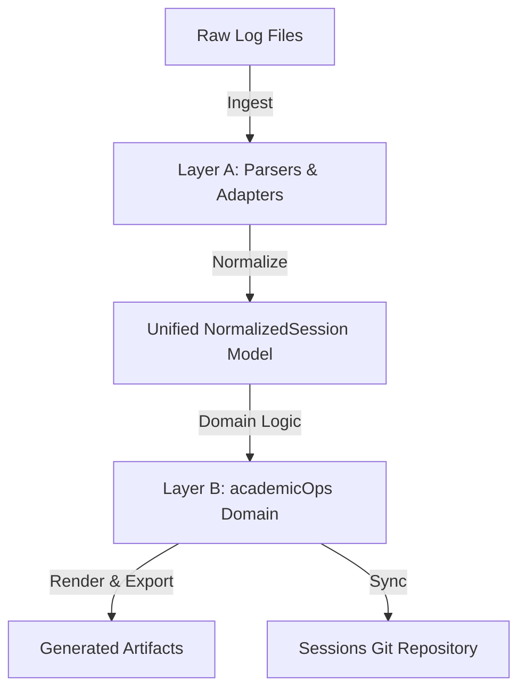

# Transcript Pipeline Specification

This spec outlines the design, scope, and integration of the session-transcript generation and sync pipeline. The pipeline is rebuilt as a modern, two-layer system that separates low-level parsing/rendering from high-level academicOps domain logic.

## 1. Intent & Scope

The transcript pipeline is responsible for:
- Ingesting raw JSONL session logs from Claude Code and agy clients.
- Normalizing them into a single, unified data model.
- Performing domain analysis (slugs, context classification, event timestamps, correlation, insights).
- Generating three structured output artifacts per session.
- Committing and pushing session transcripts to the central sessions repository.

### Excluded Scope
- **Gemini logs (a2a-serv):** Explicitly excluded due to excessive volume/heartbeat noise.
- **Observability schema:** The broader crew/surface/observability schemas are handled by external tools; the transcript pipeline focuses exclusively on session-level metadata.

---

## 2. Two-Layer Architecture

### Layer A: Parse & Render (Adapters)
Layer A decouples the system from external raw log formats, converting raw logs into a common typed model (`NormalizedSession`).
- **Claude Adapter:** Wraps the live, unpinned `claude-code-log` library. It translates Claude's Pydantic entry union models and handles CLI-level formatting. Unknown top-level entry types are gracefully captured as raw entries and logged rather than causing parser failure.
- **agy Adapter:** A lightweight, hand-written parser for agy TUI JSONL log streams.

### Layer B: academicOps Domain Layer
Layer B consumes typed `NormalizedSession` objects exclusively and enforces the core business rules:
- **Stable Slug:** Deterministic `session_id`-derived slugs (first part of UUID or first 8 chars) ensuring filenames do not churn if content changes.
- **Semantic User Context (`has_user_context`):** Classifies sessions as interactive (human) vs automated (cron/worker) by checking event structure, entrypoints, and prompt XML envelopes (e.g. `<USER_REQUEST>`) rather than a simple surface whitelist.
- **Event-Time Timestamps:** Derives session lifecycle timestamps (`started_at`, `last_modified`, `ended_at`) exclusively from event-stream timestamps, never relying on filesystem metadata (`mtime`).
- **Skip-Cache:** Uses a persistent cache of known empty/no-op sessions to skip expensive processing in subsequent batch runs.
- **Recent Interactive View:** Filters and sorts (most-recent-first) interactive sessions to populate primary navigation interfaces.
- **Correlation:** Infers related PKB tasks/epics, GitHub pull requests, and project associations via pattern matching across event boundaries.
- **Reflection to Insights:** Extracts model-generated reflections and summary headers.

---

## 3. Output Formats

Every processed session produces three outputs in the sessions repository under the `transcripts/YYYY-MM/` directory:

1. **Markdown (+ YAML Front-matter):** A clean document showing the chronological conversation timeline, prefixed with metadata front-matter (session ID, slug, timestamps, user context, correlation targets).
2. **HTML:** A beautiful, responsive, standalone dark-mode formatted document containing styled blocks for user prompts, thinking processes, assistant messages, and tool outputs.
3. **JSON Sidecar:** A complete machine-readable metadata file containing the front-matter attributes, event counts, extracted insights, and list of user prompts (enabling rapid search indexing).

---

## 4. Maintenance & Testing Strategy

- **Committed Fixture Corpus:** Real, anonymized session transcripts representing common Claude and agy sessions are committed under `tests/transcripts/fixtures/`.
- **Contract & Snapshot Tests:** Run against the committed fixtures to assert that both adapters map events correctly and that rendered output matches stable snapshots. Upstream changes in the unpinned `claude-code-log` library trigger diffable CI failures rather than silent production regressions.
