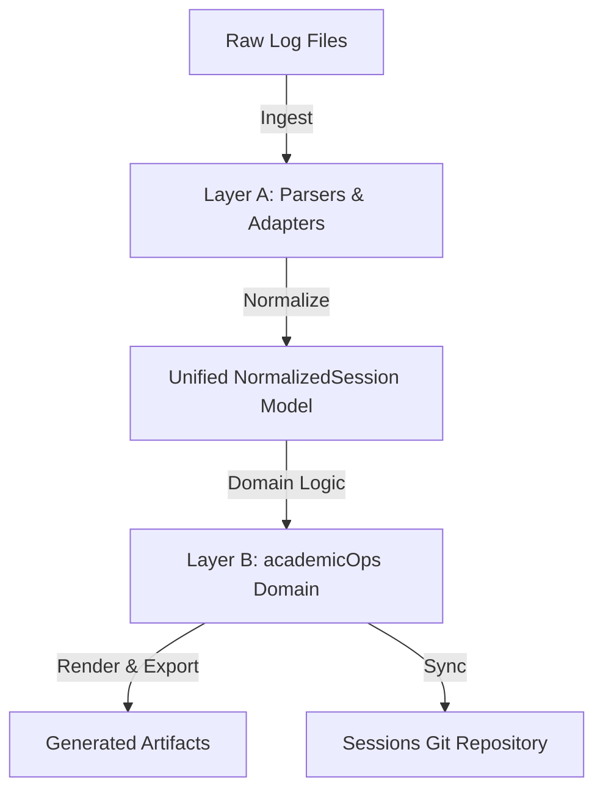

# Transcript Pipeline Specification

This spec outlines the design, scope, and integration of the session-transcript generation and sync pipeline. The pipeline is rebuilt as a modern, two-layer system that separates low-level parsing/rendering from high-level academicOps domain logic.

## 1. Intent & Scope

The transcript pipeline is responsible for:

- Ingesting raw JSONL session logs from Claude Code and agy clients.
- Normalizing them into a single, unified data model.
- Performing domain analysis (slugs, context classification, event timestamps, correlation, insights).
- Generating five structured output artifacts per session.
- Committing and pushing session transcripts to the central sessions repository named by `AOPS_SESSIONS`. There is no default: the repository is site-specific, so an unset variable is a hard error rather than a guessed path.

### Excluded Scope

- **Gemini logs (a2a-serv):** Explicitly excluded due to excessive volume/heartbeat noise.
- **Observability schema:** The broader crew/surface/observability schemas are handled by external tools; the transcript pipeline focuses exclusively on session-level metadata.

---

## 2. Two-Layer Architecture



### Layer A: Parse & Render (Adapters)

Layer A decouples the system from external raw log formats, converting raw logs into a common typed model (`NormalizedSession`).

- **Claude Adapter:** Wraps the live, unpinned `claude-code-log` library. It translates Claude's Pydantic entry union models and handles CLI-level formatting. Unknown top-level entry types are gracefully captured as raw entries and logged rather than causing parser failure.
- **Sessions, not files:** Claude Code writes one trunk log per session plus a sidechain log per subagent under `<session-id>/subagents/`. Every sidechain record reuses the parent's `sessionId`, so a sidechain log is never a session in its own right — treated as one it derives the parent's slug and filename and overwrites the parent's transcript. Discovery therefore yields trunk logs only, and a session is reconstructed as trunk plus sidechains. `claude-code-log` inlines the subagents whose spawning tool call it can resolve and leaves the rest (in-process teammates carry no `toolUseId`; a nested spawn's id lives in another sidechain), so the adapter partitions loaded entries on `isSidechain`, regroups the inlined ones by `agentId`, and reads the remaining sidechain files from disk. Counting either as trunk events would overstate both the conversation and its cost.
- **agy Adapter:** A lightweight, hand-written parser for agy TUI JSONL log streams.

### Layer B: academicOps Domain Layer

Layer B consumes typed `NormalizedSession` objects exclusively and enforces the core business rules:

- **Stable Slug:** Deterministic `session_id`-derived slugs (first part of UUID or first 8 chars) ensuring filenames do not churn if content changes.
- **Semantic User Context (`has_user_context`):** Classifies sessions as interactive (human) vs automated (cron/worker) by checking event structure, entrypoints, and prompt XML envelopes (e.g. `<USER_REQUEST>`) rather than a simple surface whitelist.
- **Event-Time Timestamps:** Derives session lifecycle timestamps (`started_at`, `last_modified`, `ended_at`) exclusively from event-stream timestamps, never relying on filesystem metadata (`mtime`).
- **Skip-Cache:** A persistent cache of sessions that rendered to nothing, keyed by source path and fingerprinted by the mtime and size of every file the session was reconstructed from. The batch runner consults it before parsing, so an unchanged empty session costs a few `stat()` calls. Because the cron reaches a session seconds after it starts — when it is legitimately still empty — recording only "this was empty" would blacklist it for life; any append, truncation, or new subagent log changes the fingerprint and brings the session back. A cache without fingerprints cannot prove anything about the present and is discarded on load.
- **Recent Interactive View:** Filters and sorts (most-recent-first) interactive sessions to populate primary navigation interfaces.
- **Correlation:** Infers related PKB tasks/epics, GitHub pull requests, and project associations via pattern matching across event boundaries.
- **Reflection to Insights:** Extracts model-generated reflections and summary headers.

---

## 3. On-Disk Trace Convention

This is the raw layout Layer A ingests — Claude Code's own on-disk format,
undocumented upstream, reverse-engineered and verified live against a running
session (`CLAUDE_CODE_EXPERIMENTAL_AGENT_TEAMS=1`, confirmed set — see
precondition below) rather than inferred from source. `find_subagent_files`
and the adapters in `lib/py/transcripts/adapters/` are the code that reads
this layout.

### Layout

```
~/.claude/projects/<project-slug>/
    <session-uuid>.jsonl                          # trunk
    <session-uuid>/
        subagents/
            agent-<agent-id>.jsonl                 # one subagent's conversation
            agent-<agent-id>.meta.json              # its sidecar
        tool-results/
            <token>.txt                             # large tool output, spilled
```

Every subagent of a session — regardless of true nesting depth — lands in the
_same_ flat `subagents/` directory next to the trunk. Nesting is expressed in
the metadata, never in directory structure: there is no `subagents/subagents/`
for a grandchild.

**Precondition.** The `subagents/` layout requires
`CLAUDE_CODE_EXPERIMENTAL_AGENT_TEAMS=1` in the harness's own environment.
Without it, subagent conversations are not written to durable per-agent files
at all.

### The meta sidecar

`agent-<id>.meta.json` is a flat JSON object. Fields observed live:
`agentType`, `description`, `toolUseId`, `parentAgentId`, `spawnDepth`,
`model`, `isFork`. None are guaranteed present — a sidecar with only
`agentType` and `toolUseId` is normal for a minimal spawn.

- **`isFork`** (`bool`) — true when the agent was spawned as a fork (inherits
  the parent's full conversation context) rather than a fresh subagent.
- **`spawnDepth`** (`int`) — a rendering hint, not authoritative tree
  structure. **Not reliably parent+1 for a team-mode spawn** — a named/mailbox
  agent (reached via the `name` parameter on the `Agent` tool, or
  `SendMessage`/`TeamCreate`) can report a `spawnDepth` that does not follow
  from its own parent's depth. `parentAgentId` is the field that stays correct
  in that case; a consumer that needs real tree structure walks
  `parentAgentId`, not `spawnDepth`.

### Linkage

A child's `meta.toolUseId` matches the `id` of the `Agent` (or `Task`)
`tool_use` block in the **parent's** transcript that spawned it. The parent's
corresponding `tool_result` block carries an `agentId` matching the child's
filename (`agent-<agent-id>.jsonl`). Together these let a reader — or the
renderer — place a subagent's entire conversation at the exact point in the
parent's flow where it was spawned, and mark where its result returned.

### Ordering

Order events within one file by the `uuid`/`parentUuid` chain, not by
timestamp: timestamps are **not monotonic** — ~5% of entries have been
observed out of order in a real session. A jsonl written by normal
sequential append (the common case) happens to already be in chain order, so
trusting append order works today; a file assembled by merging or
concatenating separately-written logs would not be, and needs the explicit
chain walk to render correctly.

### Large tool outputs

A tool result too large to keep inline is spilled to
`<session-uuid>/tool-results/<token>.txt`, with an inline pointer left in the
jsonl in its place. The durable content lives in the spilled file, not the
pointer.

### What is not recoverable

Extended-thinking content is never recoverable from the trunk or a sidechain
log. A `thinking`-type content block always carries an opaque `signature`
field, but its `thinking` text comes back empty — the model turn reasoned,
and that reasoning cannot be shown, which is a materially different fact from
"this turn did not think." A reader (or a renderer) that treats an empty
`thinking` field the same as an absent one is asserting something false.

### Transient vs. durable copies

An `Agent` tool's `tool_result` block also references a path under
`/tmp/.../tasks/<task-id>.output` — this is transient, tied to the live
process, and gone once it is cleaned up. The durable copy of that
conversation is the `subagents/agent-<id>.jsonl` file described above; a
consumer that needs the record after the fact reads that, never the `/tmp`
path.

### Corroborating evidence: the polecat hook-fire log

Inside a polecat container only (gated on `AOPS_HOOK_LOG_PATH` being set;
absent, `lib/hooks/dispatch.py`'s `_log_fire` returns immediately and writes
nothing), every hook fire is appended as one JSON line with exactly five
fields: `ts`, `client`, `event`, `session_id`, `tool`. It carries no
subagent-tree information of its own — it is not a substitute for the
`subagents/` layout above — but every line's `session_id` aligns with the
on-disk trace, so it can corroborate that a given tool call actually fired at
the time the transcript claims, from a source the transcript pipeline never
touches.

## 4. Output Formats

Every processed session produces five outputs in the sessions repository under the `transcripts/YYYY-MM/` directory — three Markdown tiers that differ in what they carry, plus the HTML and the sidecar:

1. **`.md` — summary (+ YAML Front-matter):** An index of the session. Front-matter (session ID, slug, timestamps, user context, correlation targets), the insights block, a subagent index, and a capped event table that points at the fuller tiers for anything it elides.
2. **`.controller.md` — the controlling agent:** The trunk conversation event by event, without the sidechains. What the session's own agent said and did.
3. **`.full.md` — everything:** The trunk plus every subagent conversation expanded event by event. The only artifact that claims to be complete.
4. **HTML:** A responsive, standalone dark-mode document containing styled blocks for user prompts, thinking processes, assistant messages, and tool outputs.
5. **JSON Sidecar:** A machine-readable metadata file containing the front-matter attributes, event counts, extracted insights, and the list of user prompts (enabling rapid search indexing).

### Escaping and redaction

Redaction runs at a single chokepoint, where `runner.py` writes each artifact, so a renderer added later cannot ship an unredacted format by forgetting to call it.

That places one constraint on the renderers: **the Markdown tiers carry text verbatim.** Markdown is not HTML, and escaping it there does two kinds of damage — it turns the body of a fenced code block into `&lt;`-noise, and, once `"` becomes `&quot;`, the redactor no longer recognises `"KEY": "value"`, so a key-named credential with no distinctive token shape survives into the shipped file. Sanitising is owed by whatever renders this Markdown into HTML, which is the layer that knows it is building a DOM.

The HTML tier is the exception and escapes everything it interpolates, attributes included. Because escaping there would hide the same `"KEY": "value"` shape from the chokepoint, the HTML path redacts _before_ it escapes; the chokepoint's pass then stands as defence in depth rather than as the only line.

### Where delegated work lands

A session's subagent conversations dwarf its main thread — the largest session on record carries a 0.9M-char trunk against 3.3M chars of sidechains — so only `.full.md`, the artifact that claims to be complete, expands them event by event. The summary Markdown, the HTML, and the JSON sidecar name every subagent with its type, brief, event count, and token spend, and point at `.full.md` for the conversation itself. That keeps the summary readable and the HTML openable in a browser while nothing goes unrecorded. `.full.md` holds a character budget as a safety valve against a runaway session producing a file nothing can open; subagents beyond it are named in place rather than dropped.

`tokens_used`, `cost_usd`, and `event_count` describe the trunk, as they always have. `total_tokens_used`, `total_cost_usd`, and `total_event_count` describe the whole session including delegated work — for a multi-agent session the difference is several-fold, and the total is the real spend. `user_prompts` stays trunk-only: a subagent's opening message is a delegation brief, not something a human typed, and the prompt ledger reads that key.

---

## 5. Maintenance & Testing Strategy

- **Committed Fixture Corpus:** Real, anonymized session transcripts representing common Claude and agy sessions are committed under `tests/transcripts/fixtures/`, including a subagent sidechain log and its metadata sidecar so tests can stage a real multi-agent session layout on disk.
- **Contract & Snapshot Tests:** Run against the committed fixtures to assert that both adapters map events correctly and that rendered output matches stable snapshots. Upstream changes in the unpinned `claude-code-log` library trigger diffable CI failures rather than silent production regressions.
