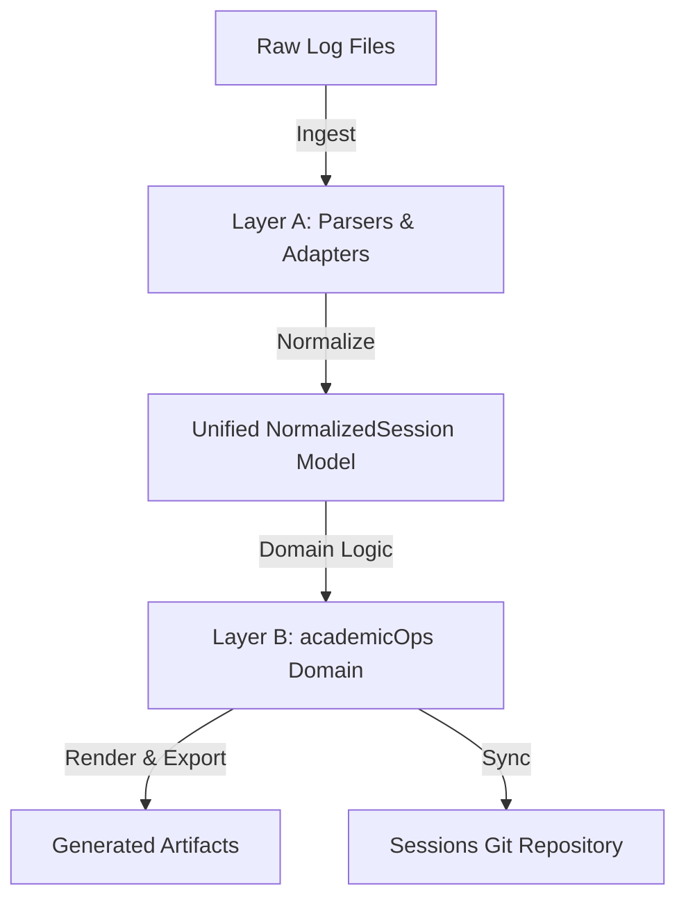

# Transcript Pipeline

Session-transcript generation and sync. Implemented in `lib/py/transcripts/`.

The pipeline ingests raw JSONL session logs from the Claude Code and agy
clients, normalizes them into one data model, applies academicOps domain logic
(slugs, context classification, subagent lineage, per-step token and cost
accounting, error classification, correlation, insights), renders five artifacts
per session, and commits them to the sessions repository.

Out of scope: Gemini (a2a-serv) logs, excluded for heartbeat volume; and the
broader crew/surface observability schemas, which other tools own. This pipeline
handles session-level metadata only.

## Two layers



The split exists so that an upstream log-format change lands in one adapter
instead of in every consumer.

### Layer A — `adapters/`

Converts raw logs into `NormalizedSession`. Nothing downstream sees a raw
format.

- **Claude adapter** wraps the live, unpinned `claude-code-log` library,
  translating its Pydantic entry union and CLI-level formatting. An unknown
  top-level entry type is captured as a raw entry and logged rather than
  failing the parse. Per-turn usage (`input_tokens`, `output_tokens`,
  `cache_read_input_tokens`, `cache_creation_input_tokens`) and `step_cost_usd`
  land in `event.meta["usage"]`; sidecar metadata supplies `parentAgentId` and
  the spawning `toolUseId` for tree construction. Costs come from
  `MODEL_RATE_CARD`.
- **agy adapter** is a hand-written parser for agy TUI JSONL streams.

**A session is not a file.** Claude Code writes one trunk log per session plus a
sidechain log per subagent, and every sidechain record reuses the parent's
`sessionId` — so a sidechain treated as a session derives the parent's slug and
filename and overwrites the parent's transcript. Discovery yields trunk logs
only; a session is reconstructed as trunk plus sidechains. `claude-code-log`
inlines the subagents whose spawning tool call it can resolve and leaves the
rest (in-process teammates carry no `toolUseId`; a nested spawn's id lives in
another sidechain), so the adapter partitions loaded entries on `isSidechain`,
regroups the inlined ones by `agentId`, and reads the remaining sidechain files
from disk. Counting either as trunk events overstates both the conversation and
its cost.

### Layer B — `domain/`

Consumes `NormalizedSession` only, and holds the business rules:

- **Stable slug** derived from `session_id` (first UUID part, or first 8
  characters), so filenames do not churn when content changes.
- **Semantic user context** (`has_user_context`) separates interactive from
  automated sessions by event structure, entrypoint, and prompt XML envelope
  (`<USER_REQUEST>`) — not by a surface whitelist, which cannot tell a cron
  worker from a human on the same entrypoint.
- **Event-time timestamps.** `started_at`, `last_modified`, and `ended_at` come
  from the event stream, never from filesystem `mtime`, which a git checkout
  rewrites.
- **Skip-cache** of sessions that rendered to nothing, at
  `$AOPS_SESSIONS/.transcripts_skip_cache.json`, keyed by source path and
  fingerprinted by each source file's size plus a SHA-256 of its first and last
  kilobyte — deliberately not `mtime`, which `git pull`, `checkout`, and `touch`
  all change. The batch runner consults it before parsing, so an unchanged empty
  session costs a few `stat()` calls. Because the runner reaches a session
  seconds after it starts, when it is legitimately still empty, recording only
  "this was empty" would blacklist it for life; any append, truncation, or new
  subagent log changes the fingerprint and brings it back. A cache entry without
  a fingerprint proves nothing about the present and is discarded on load;
  entries expire after 30 days.
- **Recent interactive view**, most-recent-first, for navigation surfaces.
- **Correlation** of PKB tasks and epics, GitHub pull requests, and projects by
  pattern matching across event boundaries.
- **Reflection extraction** into the insights block.
- The rendering rules specified under [`.controller.md`](#controllermd) below:
  subagent lineage, per-step cost accounting, and error classification.

## Invocation

`python -m transcripts.runner` (module path `lib/py/transcripts`). Arguments:
a single session file, or `--all` / `--recent` (last 7 days) for batch;
`--force` ignores the skip cache; `--no-sync` skips the git commit and push;
`-o/--output` overrides the destination; `--ledger` with `--since YYYY-MM-DD`
generates the prompt ledger alone.

`AOPS_SESSIONS` names the destination repository and has **no default** — the
repository is site-specific, so an unset variable exits 1 rather than writing
session content somewhere the operator did not choose.

`plugins/ts/hooks/session-end-sync.sh` invokes the runner on `SessionEnd`,
against a staging directory with `--no-sync`, naming the single session that
just ended or passing `--all` when it cannot identify one. It locates the
pipeline through `AOPS_SRC_DIR` and nowhere else, because the pipeline has
third-party dependencies and needs a checkout with an environment for them; an
unset or wrong `AOPS_SRC_DIR` means no renderer and a skipped sync, never a
guessed path.

## On-disk trace convention

The raw layout Layer A ingests — Claude Code's own format, undocumented
upstream. `find_subagent_files` and the adapters read it.

```
~/.claude/projects/<project-slug>/
    <session-uuid>.jsonl                          # trunk
    <session-uuid>/
        subagents/
            agent-<agent-id>.jsonl                 # one subagent's conversation
            agent-<agent-id>.meta.json              # its sidecar
        tool-results/
            <token>.txt                             # large tool output, spilled
```

Every subagent of a session lands in the _same_ flat `subagents/` directory next
to the trunk, regardless of true nesting depth. Nesting is expressed in metadata
only: there is no `subagents/subagents/` for a grandchild.

**Precondition.** This layout requires `CLAUDE_CODE_EXPERIMENTAL_AGENT_TEAMS=1`
in the harness's own environment. Without it, subagent conversations are not
written to durable per-agent files at all.

**The meta sidecar.** `agent-<id>.meta.json` is a flat JSON object; fields
observed live are `agentType`, `description`, `toolUseId`, `parentAgentId`,
`spawnDepth`, `model`, `isFork`. None are guaranteed — a sidecar carrying only
`agentType` and `toolUseId` is normal for a minimal spawn.

- `isFork` (bool) — the agent was spawned as a fork, inheriting the parent's
  full conversation context, rather than as a fresh subagent.
- `spawnDepth` (int) — a rendering hint, not tree structure, and **not reliably
  parent+1**: a named or mailbox agent (reached via the `name` parameter on the
  `Agent` tool, or `SendMessage`/`TeamCreate`) can report a depth that does not
  follow from its parent's. Anything needing real structure walks
  `parentAgentId`.

**Linkage.** A child's `meta.toolUseId` matches the `id` of the `Agent` (or
`Task`) `tool_use` block in the _parent's_ transcript that spawned it, and the
parent's corresponding `tool_result` carries an `agentId` matching the child's
filename. Together these place a subagent's whole conversation at the exact
point in the parent's flow where it was spawned, and mark where its result
returned.

**Ordering.** Order events within a file by the `uuid`/`parentUuid` chain, not
by timestamp: timestamps are not monotonic, with ~5% of entries observed out of
order in a real session. A jsonl written by normal sequential append is already
in chain order, so trusting append order works today; a file assembled by
merging separately-written logs is not, and needs the explicit walk.

**Large tool outputs** are spilled to
`<session-uuid>/tool-results/<token>.txt` with an inline pointer left behind.
The durable content is the spilled file.

**Extended thinking is not recoverable.** A `thinking` content block always
carries an opaque `signature`, but its `thinking` text comes back empty. The
turn reasoned and that reasoning cannot be shown — materially different from
"this turn did not think". Treating an empty `thinking` field as an absent one
asserts something false.

**Transient versus durable copies.** An `Agent` tool's `tool_result` also
references a path under `/tmp/.../tasks/<task-id>.output`, tied to the live
process and gone when it is cleaned up. The durable copy is
`subagents/agent-<id>.jsonl`.

**Independent corroboration.** Inside a polecat container only — gated on
`AOPS_HOOK_LOG_PATH`, absent which `lib/hooks/dispatch.py`'s `_log_fire` writes
nothing — every hook fire appends one JSON line of `ts`, `client`, `event`,
`session_id`, `tool`. It carries no subagent-tree information and does not
substitute for the layout above, but its `session_id` aligns with the trace, so
it can confirm that a tool call fired when the transcript claims, from a source
this pipeline never touches.

## Output artifacts

Each processed session writes five files to
`$AOPS_SESSIONS/transcripts/YYYY-MM/`, named
`YYYYMMDD-HH-<project>-<slug>` (project `adhoc` when uncorrelated):

| Artifact         | Carries                                                                                                                                                        |
| ---------------- | -------------------------------------------------------------------------------------------------------------------------------------------------------------- |
| `.md`            | Index: front-matter (session id, slug, timestamps, user context, correlation), insights, subagent index, and a capped event table pointing at the fuller tiers |
| `.controller.md` | The controlling agent's full decision flow, with the call-tree index, token/cost badges, and error blocks                                                      |
| `.full.md`       | Trunk plus every subagent conversation, event by event. The only artifact claiming to be complete                                                              |
| `.html`          | Standalone dark-mode document, styled blocks for prompts, thinking, assistant turns, and tool output                                                           |
| `.json`          | Machine-readable sidecar: front-matter attributes, event counts, insights, user prompts, for search indexing                                                   |

Five is the count today, not a closed design. Ruling `aops_22c422dc` further
requires a separate file per subagent, linked from the parent and recorded in a
`manifest.json`; neither ships. Anything asserting how many artifacts exist —
tests included — asserts that these tiers exist, not that nothing else does, so
that landing the owed work does not read as a regression.

### `.controller.md`

Built for post-mortems: what the controlling agent decided, who it delegated to,
what it cost, and what failed.

**Call-tree index.** A hierarchy, not a flat table. Edges come from matching a
child's `parentAgentId` to its parent's agent id, and `meta.toolUseId` to the
parent's spawning tool call — never from `spawnDepth`, which is unreliable for
named and mailbox agents. `main` is the trunk; L1 subagents have
`parent_agent_id` null or equal to `main`; L2 are children of an L1; arbitrary
depth follows by recursion. Traversal keeps a visited set, because a cyclic
parent reference would otherwise not terminate.

Every node shows a canonical call path: `main`, `main/<l1>`, `main/<l1>/<l2>`.
Siblings under one parent sharing a label get an 8-character agent-id suffix
(`main/pauli-a270f5ac`). Degradation is visible rather than silent — a subagent
missing `parentAgentId` renders as `main/unlinked/<id>` at level
`L1 (unlinked)`, one naming a parent that does not exist renders as
`main/orphaned/<id>` at `L2 (orphaned: <parent_id>)`, and a detected cycle is
broken and treated as orphaned. All three are recorded in `session.degraded`.
An agy stream, having no sidechain files, reports `0 subagents ran` and inlines
tool invocations.

The index renders twice: an ASCII tree, and a table carrying level, call path,
agent label, agent type, parent, event count, tokens, USD cost, and task
description.

```
main (Controlling Agent) [1,250,400 tokens | $3.7512]
├── 1. pauli (L1: aops:pauli) [420,100 tokens | $1.2603]
│   └── 1.1 marsha (L2: aops:marsha) [180,000 tokens | $0.5400]
└── 2. rbg (L1: aops:rbg) [310,000 tokens | $0.9300]
```

**Token badges.** Every model turn carrying usage metadata gets one line under
its timestamp, in `.controller.md` and `.full.md`:

```markdown
#### 🤖 Assistant `(2026-08-10T22:15:30Z)`

> **Tokens:** `12,450` in (`8,200` cache read, `1,000` cache write) | `450` out | **Step Cost:** `$0.0381` | **Cumulative:** `$1.4250`
```

Step cost is
`(input × R_inp + cache_creation × R_cc + cache_read × R_cr + output × R_outp) / 1,000,000`
against `MODEL_RATE_CARD`, and cumulative is running trunk spend. The cache
write parenthetical is omitted when zero; the whole parenthetical is omitted
when both cache figures are. A turn with zero total tokens or no usage metadata
gets no badge at all, and neither do non-model turns — a badge reading zero
would be a claim about cost rather than an absence of data. A model missing from
the rate card renders `Step Cost: N/A (unknown model: <model>)` and is recorded
in `session.degraded`.

**Error blocks.** A tool result with `is_error` or a non-zero exit code, a
subagent finishing `failed` or `degraded`, and a session terminated by spend
limit, context limit, or exception each render as:

```markdown
> [!ERROR_BLOCK]
> **Error Type:** `<classification>`
> **Source Event / Tool:** `<tool name>` (`<call id>`)
> **Status / Exit Code:** `<code or status>`
> **Message:** `<verbatim error or summary>`
> **Impact:** `<operational impact on the session>`
```

Those five keys are the whole schema and are used verbatim, so the blocks stay
machine-greppable. For a termination, `Source Event / Tool` is
`Session Termination` and the status is
`Limit Exceeded ($<spend> / $<limit>)`, dropping the limit when it is unknown.
A message over 500 characters or 10 lines is truncated to five lines with the
full output in a `<details>` block. An abrupt cutoff appends a final block
recording cumulative spend and the reason.

### Escaping and redaction

This section is the single source of truth for the escaping contract; the
renderer and its tests point here rather than restating it.

Redaction runs at one chokepoint, where `runner.py` writes each artifact, so a
renderer added later inherits the scrub without having to remember one. It is a
backstop, not a guarantee: it sees only what the renderers hand it, so a
renderer that transforms text before the chokepoint reads it can put a
credential beyond reach. Hence the general rule:

> **Any renderer that re-encodes bytes the redaction patterns match must redact
> before it re-encodes.**

HTML escaping is one instance; URL-encoding, base64, JSON embedding and a future
Markdown→HTML converter all behave identically, preserving the credential while
destroying the shape the patterns look for.

**The Markdown tiers therefore carry text verbatim**, for two reasons
independent of any redactor. Escaping turns the body of a fenced code block into
`&lt;`-noise, corrupting the content for every reader forever. And an escaped
corpus is permanently unauditable: the recorded design (`aops-00c0fa10`) puts
three layers over secrets — a pre-tool guard, this write-time scrub, and a
pre-commit backstop — all sharing one pattern definition, which presupposes the
committed corpus stays scannable after the fact. `_SENSITIVE_NAME` admits no `&`
or `;`, so entity-escaped text is structurally invisible to it and to any future
scanner sharing that definition.

Escaping Markdown was never a security control in any case: `html.escape` leaves
`[click](javascript:alert(1))` byte-identical. Sanitising is owed by whatever
renders this Markdown into a DOM, and here that renderer exists and already
escapes — the `.html` tier, which escapes everything it interpolates, attributes
included, and redacts first.

### Where delegated work lands

A session's subagent conversations dwarf its main thread — the largest session
on record carries a 0.9M-character trunk against 3.3M characters of sidechains
— so only `.full.md`, which claims completeness, expands them event by event.
The other four name every subagent with its type, brief, event count, and token
spend (and `.md` and `.controller.md` render the call tree), pointing at
`.full.md` for the conversation itself. That keeps the summary and controller
views readable and the HTML openable in a browser while nothing goes unrecorded.
`.full.md` holds a character budget as a safety valve against a runaway session
producing a file nothing can open; subagents beyond it are named in place rather
than dropped.

`tokens_used`, `cost_usd`, and `event_count` describe the trunk.
`total_tokens_used`, `total_cost_usd`, and `total_event_count` describe the
whole session including delegated work — for a multi-agent session the
difference is several-fold, and the total is the real spend. `user_prompts`
stays trunk-only: a subagent's opening message is a delegation brief, not
something a human typed, and the prompt ledger reads that key.

## Testing

Real, anonymized Claude and agy sessions are committed under
`tests/transcripts/fixtures/`, including a subagent sidechain log and its
metadata sidecar so tests can stage a genuine multi-agent layout on disk.
Contract and snapshot tests in `tests/transcripts/` run against them, asserting
adapter event mapping, call-tree lineage, token badges, and `[!ERROR_BLOCK]`
rendering, and holding the `.md`, `.full.md`, `.html`, and `.json` tiers to
stable snapshots. Snapshots are the point: a change in the unpinned
`claude-code-log` library surfaces as a diffable CI failure instead of a silent
production regression.
