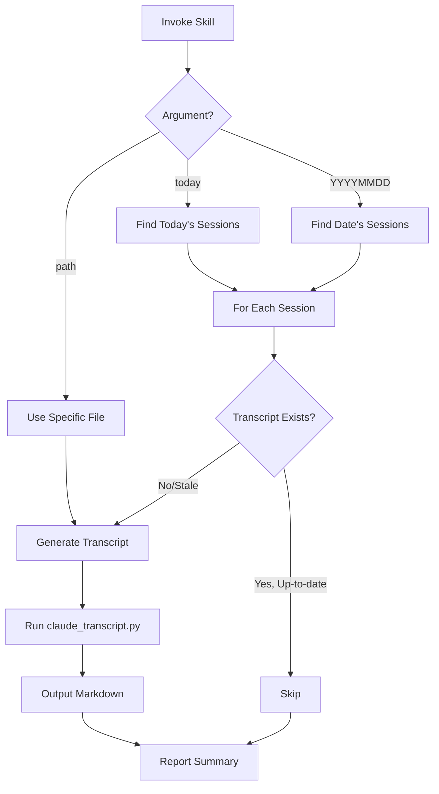

# Transcript Skill

**Status**: Implemented
See [[skills/transcript/SKILL.md]] for full implementation.

## Workflow



## Purpose

Convert Claude Code JSONL session files to readable markdown transcripts for analysis, review, and archival.

## Problem Statement

Session analysis challenges:
- Raw JSONL is unreadable by humans
- Session content mixed with metadata
- No distinction between essential and verbose content
- Hook context not visible
- Agent transcripts scattered

## Solution

A skill that wraps `scripts/claude_transcript.py` to generate formatted markdown transcripts, with abridged and full versions for different use cases.

## How It Works

### Invocation

```
Skill(skill="transcript")                    # today
Skill(skill="transcript", args="YYYYMMDD")   # specific date
Skill(skill="transcript", args="/path/to/session.jsonl")  # specific file
```

### Workflow

**1. Find Sessions**
```bash
cd $AOPS && uv run python -c "
from lib.session_reader import find_sessions
from datetime import datetime, timezone
target = datetime.now(timezone.utc).date()
for s in find_sessions():
    if s.last_modified.date() == target:
        print(f'{s.session_id[:8]} {s.project} {s.path}')
"
```

**2. Check Freshness**
Skip if transcript exists and is newer than session's last_modified.

**3. Generate Transcript**
```bash
cd $AOPS && uv run python scripts/claude_transcript.py \
  /path/to/session.jsonl \
  --abridged-only \
  -o $ACA_DATA/sessions/claude/YYYYMMDD-shortproject-sessionid-slug
```

**4. Report**
```
Transcripts: Generated N | Skipped M (up-to-date)
```

### Output Versions

| Version | Content | Use Case |
|---------|---------|----------|
| `*-abridged.md` | File references only | Quick review, daily summaries |
| `*-full.md` | Full injected content, tool results | Deep analysis, debugging |

Default: Abridged only (reduces token cost).

### Formatting Conventions

- `## User (Turn N)` - User prompts
- `## User (Turn N)` with `**Invoked: ...**` - Skill/command expansion
- `## Agent (Turn N)` - Agent responses
- `### Subagent: type (description)` - Task tool spawns
- Hook status: `✓` = exit 0, `✗ (exit N)` = non-zero

### Output Naming

`YYYYMMDD-<shortproject>-<session_id[:8]>-<slug>-{full,abridged}.md`

- `shortproject`: Last path component, simplified
- `slug`: 1-3 word summary from first user message

## Relationships

### Depends On
- `scripts/claude_transcript.py` for parsing and formatting
- `lib/session_reader.py` for JSONL parsing
- Claude session files in `~/.claude/projects/*/sessions/`

### Used By
- [[session-insights]] for daily transcript generation
- [[learning-log]] for session analysis
- Manual session review

### Architecture

| Component | Role |
|-----------|------|
| `scripts/claude_transcript.py` | CLI entry point |
| `lib/session_reader.py` | Parses JSONL, formats markdown |

Session reader combines:
- Main session JSONL
- Agent transcripts (`agent-*.jsonl`)
- Hook logs (`*-hooks.jsonl`)

## Success Criteria

1. **Freshness check**: Skip up-to-date transcripts
2. **Readable output**: Clear turn markers, hook status
3. **Two versions**: Abridged for overview, full for detail
4. **Consistent naming**: Date-project-session-slug pattern
5. **Combined sources**: Main session + agents + hooks

## Design Rationale

**Why abridged default?**

Full transcripts with all injected content are verbose and expensive to process. Abridged versions with file references are sufficient for daily review and pattern extraction.

**Why skip up-to-date?**

Regenerating unchanged transcripts wastes time. Checking last_modified against transcript age enables idempotent batch processing.

**Why combine sources?**

A complete session picture requires main JSONL, agent transcripts, and hook logs. Session reader merges all sources into unified timeline.

**Why markdown output?**

Markdown is readable in any text editor, renders in Obsidian for navigation, and can be processed by LLMs for analysis. JSONL is machine-readable but not human-scannable.
