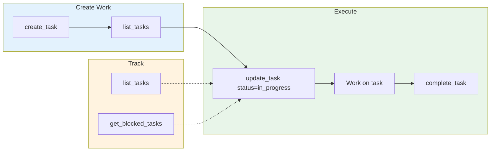

# Work Management: Tasks MCP

## Giving Effect

- [[aops-tools/tasks_server.py]] - MCP server implementing task CRUD operations
- [[mcp__pkb__create_task]] - Create task
- [[mcp__pkb__update_task]] - Update task (status, assignment)
- [[mcp__pkb__list_tasks]] - List tasks with filters
- [[mcp__pkb__complete_task]] - Mark task done
- [[mcp__pkb__get_blocked_tasks]] - Get tasks with unmet dependencies
- [[commands/pull.md]] - `/pull` command for claiming and executing tasks

Tasks MCP is the primary work management system for multi-session tracking, dependencies, and strategic work.


```mermaid
flowchart LR
    subgraph CREATE["Create Work"]
        C1[create_task]
        C2[list_tasks]
    end

    subgraph EXECUTE["Execute"]
        E1[update_task status=in_progress]
        E2[Work on task]
        E3[complete_task]
    end

    subgraph TRACK["Track"]
        T1[list_tasks]
        T2[get_blocked_tasks]
    end

    C1 --> C2 --> E1 --> E2 --> E3
    T1 -.-> E1
    T2 -.-> E1

    style CREATE fill:#e3f2fd
    style EXECUTE fill:#e8f5e9
    style TRACK fill:#fff3e0
```

**When to use Tasks MCP**:

- Multi-session work (spans multiple conversations)
- Work with dependencies (blocked by / blocks)
- Strategic planning and tracking
- Discoverable by future sessions

## Core Functions

| Function                              | Purpose            |
| ------------------------------------- | ------------------ |
| `mcp__pkb__create_task()`             | Create new task    |
| `mcp__pkb__get_task(id)`              | Get task details   |
| `mcp__pkb__update_task(id, ...)`      | Update task fields |
| `mcp__pkb__complete_task(id)`         | Mark task done     |
| `mcp__pkb__list_tasks(...)`           | List/filter tasks  |
| `mcp__pkb__task_search(query)`        | Search tasks       |
| `mcp__pkb__get_blocked_tasks()`       | Get blocked tasks  |
| `mcp__pkb__create_task(id, children)` | Break down task    |

## User Expectations

- **State Transparency**: Users can always see the exact, real-time status of all work. The system must support statuses including `active`, `in_progress`, `done`, `blocked`, `cancelled`, `review`, `merge_ready`, and `waiting`.
- **Justification (The "Why")**: Every task must be anchored in the hierarchy (Goal → Project → Epic → Task). Users can always trace why a task exists by examining its parent field.
- **Actionable Visibility**: Users can query for actionable work and receive a prioritized list of unblocked leaf tasks that are ready for execution.
- **Multi-Session Continuity**: Work state is persisted in markdown files, allowing work started in one session to be safely paused and accurately resumed in another by any agent.
- **Ownership Clarity**: Every task has an explicit `assignee` (`nic` for human, `bot` for agent), ensuring no ambiguity about who is responsible for the next step.
- **Dependency Awareness**: The system explicitly tracks blocking relationships. When a task is stalled, the user can identify exactly which dependency or human input is required to proceed.
- **Fail-Fast Diagnostics**: When an execution fails, the task must record a `diagnostic` message. Users expect to understand the reason for failure without manual log analysis.
- **Searchability & Indexing**: All tasks are indexed and searchable by title, tag, or project, ensuring that every work item remains discoverable and no context is lost over time.

## Task Lifecycle

```
active → in_progress → done
         ↓
      blocked/waiting
```

**Statuses**:

- `active`: Ready to be worked on
- `in_progress`: Currently being worked on
- `blocked`: Waiting on dependencies
- `waiting`: Deferred for later
- `done`: Completed
- `cancelled`: Abandoned
- `merge_ready`: Work complete, awaiting merge to main
- `review`: Needs human/manager review after failure

## Multi-Project Organization

Tasks are organized by `project` field:

| Project   | Use For               |
| --------- | --------------------- |
| `aops`    | Framework tasks       |
| `writing` | Writing project tasks |
| (custom)  | Other projects        |

**Create with project**:

```python
mcp__pkb__create_task(
    title="Task title",
    type="task",
    project="aops",
    priority=2
)
```

## Dependencies

Tasks can depend on other tasks:

```python
# Create dependent task
mcp__pkb__create_task(
    title="Implement feature",
    depends_on=["task-id-of-prerequisite"]
)

# Check what's blocked
mcp__pkb__get_blocked_tasks()
```

## Graph Insertion Responsibility

**The creating agent is responsible for inserting tasks onto the work graph.**

Every task must be connected to the hierarchy:

```
task → epic → chain → project → strategic priority
```

When creating a task, the agent MUST:

1. **Identify the parent epic** - Search for existing epics in the project
2. **Link the task** - Use `depends_on` or wikilinks to connect to parent
3. **Create intermediates if needed** - If no suitable epic exists, create one that links to a project

**Why this matters:**

- Disconnected tasks become invisible to prioritization
- Orphaned work cannot be sequenced for delivery
- The task graph visualization reveals structural gaps

**Anti-pattern:** Creating standalone tasks without graph connections. If a task has no parent, it's not properly inserted.

```python
# WRONG: Orphaned task
mcp__pkb__create_task(
    title="Fix login bug",
    project="webapp"
)

# RIGHT: Connected to parent epic
mcp__pkb__create_task(
    title="Fix login bug",
    project="webapp",
    depends_on=["webapp-auth-epic"]  # Links to parent
)
```

## Task Assignment

Tasks can be assigned to a specific actor:

| Assignee | Meaning                                           |
| -------- | ------------------------------------------------- |
| `nic`    | Human tasks - requires judgment, external context |
| `bot`    | Agent tasks - automatable work                    |
| (unset)  | Available to anyone (legacy compatibility)        |

**Creating assigned tasks**:

```python
mcp__pkb__create_task(
    title="Review proposal",
    assignee="nic"  # Human task
)
```

**Listing tasks by assignee**:

```python
# Bot tasks
mcp__pkb__list_tasks(project="aops", assignee="bot")

# Human tasks
mcp__pkb__list_tasks(project="aops", assignee="nic")
```

## Task Storage

Tasks are stored as markdown files in `data/tasks/`:

- `data/tasks/inbox/` - New tasks
- `data/tasks/index.json` - Task index for fast queries
