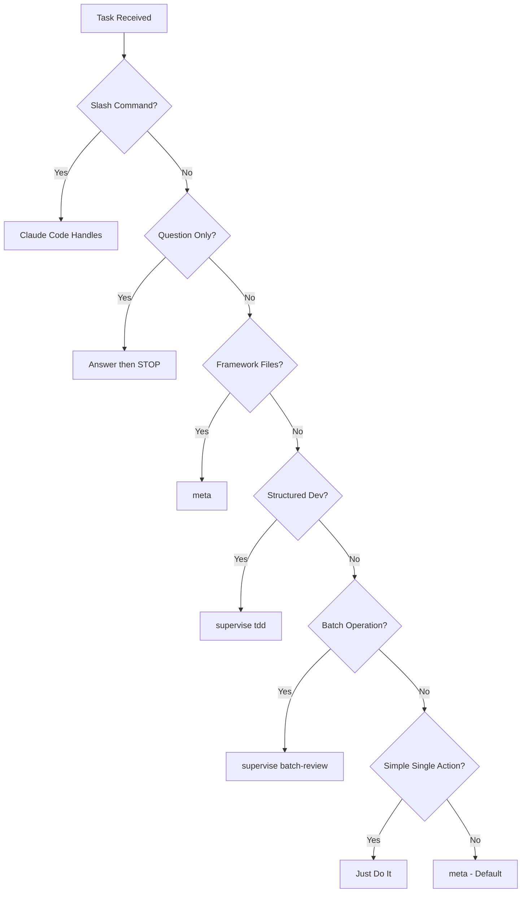

# Workflow Selection

**Status**: Draft - fundamental model under review

## The Core Question

When a task comes in, the system decides HOW to handle it. What exactly are we deciding?

## What We're Trying to Achieve

1. **Prevent known failure modes** - Agents make predictable mistakes. Inject the right constraints at the right time.
2. **Load appropriate context** - Different work needs different skill context.
3. **Set quality gates** - Some work needs more verification than others.
4. **Match user expectations** - A question should get an answer, not an implementation.

## Current Problem: False Alternatives

Current model treats these as mutually exclusive workflows:
- plan-mode, tdd, verify-first, answer-only, direct, checklist

But they're NOT alternatives. They're **different dimensions**:

| Thing | What it actually is |
|-------|---------------------|
| plan-mode | A **gate** - requires approval before implementation |
| tdd | An **approach** - structured sequence (test → implement → verify) |
| verify-first | A **phase** - understand before acting |
| answer-only | A **constraint** - don't implement anything |
| direct | Absence of special process |
| checklist | A **structure** for verification |

These COMPOSE, not compete:
- Debug task = verify-first phase + direct approach + no gate
- Framework task = plan-mode gate + tdd approach + checklist verification
- Question = answer-only constraint (nothing else applies)

## Proposed Model: Composable Dimensions

### Dimension 1: Gates (must pass before implementation)

| Gate | When Required |
|------|---------------|
| plan-mode | High-stakes changes (framework, hooks, MCP) |
| none | Everything else |

### Dimension 2: Approach (how to implement)

| Approach | What It Means |
|----------|---------------|
| tdd | Write failing test → implement → verify passes |
| direct | Just do it |
| none | No implementation (questions, pure info) |

### Dimension 3: Pre-work (before implementing)

| Pre-work | When To Use |
|----------|-------------|
| verify-first | Debug - reproduce and understand before fixing |
| research-first | Unknown territory - explore before proposing |
| none | Clear scope, just proceed |

### Where Guardrails Fit

Guardrails are **constraints during execution**, orthogonal to workflow dimensions:
- `verify_before_complete` - applies to all implementation
- `quote_errors_exactly` - applies during debug
- `fix_within_design` - applies during debug
- `require_acceptance_test` - applies to feature/python work

Workflow dimensions determine the SEQUENCE. Guardrails determine CONSTRAINTS during that sequence.

## Revised WORKFLOWS.md Structure

Not a list of mutually exclusive workflows. Instead, a routing table with explicit dimensions:

| Type | Gate | Pre-work | Approach | Skill | Guardrails |
|------|------|----------|----------|-------|------------|
| framework | plan-mode | - | tdd | framework | critic_review |
| debug | - | verify-first | direct | - | quote_errors, fix_within_design |
| question | - | - | none | - | answer_only |
| feature | - | - | tdd | feature-dev | require_acceptance_test |
| python | - | - | tdd | python-dev | require_acceptance_test |
| persist | - | - | direct | remember | - |
| simple | - | - | direct | - | - |

---

## Legacy Analysis (Pre-Dimensional Model)

### Decision Tree (Proposed)



### Problem Statement

Agents don't know which workflow to use for different task types. This causes:
- Confusion: "No framework workflow exists. I'll use the generic supervisor process."
- Wrong tool: Using `/supervise` when `/meta` is appropriate (or vice versa)
- Skipped orchestration: Doing complex work without proper structure
- Missed workflows: Framework workflows (`01-design`, `02-debug`) not surfaced

## What Exists (Consolidated)

### Orchestration Commands

| Command | Role | Tools Available | Documented Purpose |
|---------|------|-----------------|-------------------|
| `/meta` | Strategic brain + executor | Full (Read, Edit, Bash, etc.) | "Handle framework problems end-to-end. Design AND build." |
| `/supervise {workflow}` | Strict delegator | Only Task, Skill, TodoWrite, AskUserQuestion | "Structured work with quality gates, delegates to subagents" |

### Workflow Templates

**Supervisor Workflows** (`skills/supervisor/workflows/`):

| Workflow | Purpose | Scope |
|----------|---------|-------|
| `tdd` | Test-first development with pytest | Python code with defined acceptance criteria |
| `batch-review` | Parallel batch processing | Multiple files needing same operation |
| `skill-audit` | Review skills for content separation | Skill quality review |

**Framework Workflows** (`skills/framework/workflows/`):

| Workflow | Purpose | When to Use |
|----------|---------|-------------|
| `01-design-new-component` | Adding new capability | New hook, skill, script, command |
| `02-debug-framework-issue` | Diagnosing failures | Framework component not working |
| `03-experiment-design` | Experiment patterns | Testing hypothesis about behavior |
| `04-monitor-prevent-bloat` | Anti-bloat | Periodic framework cleanup |
| `06-develop-specification` | Collaborative spec development | New feature planning |

### Intent Router Classification

The [[intent-router-spec|intent-router-spec]] router (`hooks/prompts/intent-router.md`) classifies prompts and provides guidance:

| Pattern | Current Guidance |
|---------|-----------------|
| Framework files | `Skill("framework")`, Plan Mode, TodoWrite, critic |
| Debug/error | VERIFY STATE FIRST, TodoWrite checklist |
| Question | Answer then STOP |
| Multi-step | TodoWrite, commit after logical units |
| Python | `Skill("python-dev")`, tests first |
| Simple | Just do it |

**Gap**: Router suggests skills but doesn't route to `/meta` vs `/supervise`.

---

## Unresolved: When to Use Each Workflow

### OPTION A: Task-Type Based Selection

| Task Type | Workflow | Rationale |
|-----------|----------|-----------|
| Framework file edits (skills, hooks, specs, commands) | `/meta` | Needs strategic context + implementation power |
| Python development with defined acceptance criteria | `/supervise tdd` | Needs delegation + quality gates |
| Batch operations on multiple files | `/supervise batch-review` | Parallel processing with quality gates |
| Simple single-action tasks | Just do it | Overhead exceeds benefit |
| Questions | Answer then stop | No workflow needed |

**Problem**: Doesn't distinguish "edit a spec" from "build a new feature". Both touch framework files but have different complexity.

### OPTION B: Complexity-Based Selection

| Complexity | Workflow | Criteria |
|------------|----------|----------|
| Trivial | Just do it | Single file, single change, obvious outcome |
| Moderate | `/meta` | Multiple files OR requires context loading OR design decisions |
| Structured | `/supervise {workflow}` | Well-defined phases, acceptance criteria, delegation needed |

**Problem**: "Moderate" is subjective. Agents may misjudge complexity.

### OPTION C: Tool-Need Based Selection

| Need | Workflow | Rationale |
|------|----------|-----------|
| Must directly edit/read files | `/meta` | Has implementation tools |
| Must delegate all work | `/supervise` | Forces subagent orchestration |
| Neither | Just do it or answer question | No orchestration needed |

**Problem**: Doesn't capture WHEN to force delegation vs allow direct work.

### OPTION D: Hybrid (Current Implicit Practice)

```
IF slash command → Claude Code handles
IF question → Answer then STOP
IF framework file edit → /meta (loads context, Plan Mode, critic)
IF structured dev with acceptance criteria → /supervise tdd
IF batch operation → /supervise batch-review
IF simple single action → Just do it
ELSE → /meta (default for complex work)
```

**Problem**: "Framework file edit" includes spec edits, skill edits, hook edits - but some are simple fixes, others are major features.

---

## Unresolved: Framework Workflows Integration

Currently framework workflows (`01-design`, `02-debug`, etc.) are:
- Buried in `skills/framework/workflows/`
- Not visible to intent router
- Only surfaced when `/meta` or `Skill("framework")` is invoked

### OPTION 1: Surface in Intent Router

Add to intent router classification table:
```
| new hook/skill/command | Framework | Skill("framework") + workflow 01-design |
| framework debugging | Framework | Skill("framework") + workflow 02-debug |
```

**Pro**: JIT guidance includes specific workflow
**Con**: Intent router becomes more complex

### OPTION 2: Leave as Internal to Framework Skill

Framework skill already loads these workflows when relevant. Keep routing simple.

**Pro**: Separation of concerns
**Con**: Agents don't know workflows exist until inside framework skill

### OPTION 3: Create Commands for Key Workflows

```
/debug-framework → invokes framework skill + 02-debug workflow
/design-component → invokes framework skill + 01-design workflow
```

**Pro**: Explicit invocation, user can choose
**Con**: More commands to maintain, namespace concerns

---

## Unresolved: What Counts as "Simple"?

Intent router says "Simple → Just do it" but criteria undefined.

### OPTION A: Line Count Heuristic

Simple = single file + <10 lines changed

**Problem**: Some 2-line changes are architectural; some 50-line changes are mechanical

### OPTION B: Decision Count Heuristic

Simple = zero design decisions required

**Problem**: Agents misjudge what requires decisions

### OPTION C: Explicit Enumeration

Simple tasks:
- Typo fixes
- Adding log statements
- Single import additions
- Comment updates

Everything else requires at least TodoWrite.

**Problem**: Enumeration is never complete

### OPTION D: Default to TodoWrite

If in doubt, use TodoWrite. Cost of over-tracking < cost of losing context.

**Problem**: Overhead for truly trivial tasks

---

## Acceptance Criteria (When Resolved)

1. **Clear decision tree**: Given any task description, an agent can determine the appropriate workflow in <3 reasoning steps
2. **Intent router integration**: Router guidance includes workflow selection, not just skill suggestions
3. **No orphan workflows**: All workflows discoverable via README, INDEX, or intent router
4. **Documented in README**: Workflow selection explained in README.md Quick Start or new section

## Implementation (Pending Decisions)

After resolving the options above:

1. Update `hooks/prompts/intent-router.md` with workflow routing
2. Update `$AOPS/README.md` with workflow selection guide
3. Update `$AOPS/INDEX.md` with workflow cross-references
4. Consider new commands if OPTION 3 chosen for framework workflows

---

## Open Questions for User

1. **Which selection model?** (A: task-type, B: complexity, C: tool-need, D: hybrid, or other?)
2. **Framework workflows**: Surface in router (1), keep internal (2), or create commands (3)?
3. **"Simple" criteria**: How do we define tasks that need no orchestration?
4. **Is `/meta` the default?** For anything complex that doesn't match a specific workflow, should agents default to `/meta`?

