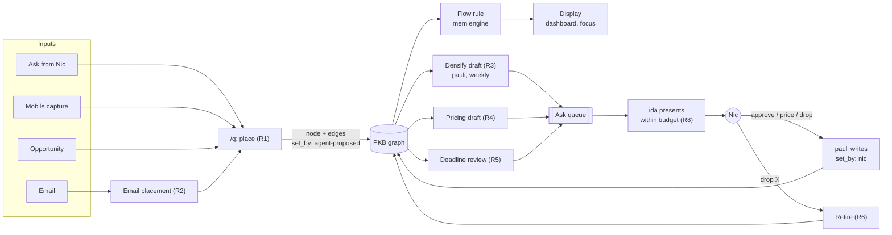

# Graph valuation: skills and agent logic for the flow rule

**Home:** `specs/workflows/graph-valuation.md` in nicsuzor/academicOps. Skills and templates it
changes are listed in §9.

**Depends on:** the flow-rule spec,
[`specs/flow-rule.md` in nicsuzor/mem](https://github.com/nicsuzor/mem/blob/dev/specs/flow-rule.md)
(cited below as `FR:<line>`, at mem commit `2c3fef2`). That spec owns the maths, the edge fields and
the scales. This spec owns everything an agent does around them: who writes which field, when,
on what evidence, and when Nic is asked.

**Brief:** _Ranking physics redesign: requirements brief (draft)_. Tags below follow its numbering:
`S1`-`S16` settled points, `I1`-`I17` invariants, `G2`-`G11` gaps. `U1`-`U20` are the weighting
user stories in _PKB Architecture & Prioritization Framework_. `FQn` is question n in FR §15.
`Kn` is a question this spec raises (§12).

**Status:** draft. Specifies only and implements nothing. Every rule marked _proposed_ waits on the
question named beside it.

## 0. Summary for Nic

**What this is.** The flow rule sets how worth moves through the graph. This spec covers the
agents' side of that: placing new work, proposing values, handling dates, retiring dead
opportunities, and asking you things.

**Your job shrinks to three inputs.**

1. **Price the targets.** An agent recommends an anchor for each target from the worth scale, with
   one line of evidence. Negative anchors cover outcomes you want to avoid. You pick. A sitting
   covers at most ten targets. The 19 unpriced targets take two sittings (FR:467).
2. **Approve link values in batches of fifty.** Agents draft a value for each link: how much of the
   target it delivers and how likely, with one sentence each. You answer one table with "all", "all
   except 4, 17", or "17: some". The batch most likely to change the ranking goes first. Anything you
   have not approved counts as zero, so the graph still works while most links are unvalued.
3. **Say when something is dead.** "Drop the Yale thing" is enough. The agent cancels the
   opportunity and it stops pulling. Nothing is ever retired for being old or quiet.

**Dates.** Every date gets a class. _Fake_ is the default: a date someone else wrote creates no
pressure. _Soft_ is a date you agreed to. _Hard_ means a real loss lands on the day, and only hard
dates surface on their own as they near. Agents may mark a date soft from your own sent mail.
Marking it hard needs your word, or the rule below. Proposed rule: a soft date that has been pushed
back twice becomes hard on the second push. The agent records why and tells you in one line, and one
word from you reverses it.

**Email.** Each message is placed against the graph before it becomes a task: what it would serve,
and how much. A bcc circular with a date in it becomes a note or nothing, never an emergency. A
sender's name adds no weight.

**How often you are asked (proposed).** One sitting a week of about twenty minutes: one link batch
or one pricing set. At most one other valuation question a day, sent in the daily digest, and only
for a proposed hard date within 14 days or a new opportunity that would rank in your top twenty.
Everything else waits for the batch. Nothing in this spec asks you mid-conversation. At this rate
the current backlog of 154 inputs (FR:472) clears in about four weeks.

**What goes.** The seven-word "stated weight" scale on links. Severity as something agents set.
Defaulting new asks to "planned". Turning an email date into a deadline. `soft_depends_on` and
`supersedes` wiring at intake. The weight-repair template becomes the densify template.

**What I need from you:** the eleven questions in §12, most important first.

## 1. Problem and target

**Problem.** Agents set values today under instructions written for the old engine:

- `/q` wires `contributes_to` with "quantum and certainty" but no field contract
  (`plugins/ida/skills/q/SKILL.md:18`). It also defaults `intent` to 3
  (`plugins/ida/skills/q/SKILL.md:24`).
- pauli authors "target severity magnitude vs contributing edge weight probability"
  (`plugins/ida/agents/pauli.md:104`).
- The weight-repair template validates a seven-word scale that mixes amount with likelihood (S2).
- No routine turns agent proposals into approved values at a rate Nic can sustain (S7, U20).
- Email dates become hard emergencies (calibration case 1, U1).
- Nothing classes deadlines (S5) or retires opportunities (S6).

**Target.**

- Every value the flow rule reads comes from one of two places. Nic supplies target worth and
  approved link values. Agents propose everything else, labelled as proposals, and it is read at the
  default until approved (FR:474).
- Every categorical choice the flow rule moved out of the maths has exactly one agent owner here:
  deadline class, soft-to-hard, ripeness, triage, and human gates (S1, FR:422-433).
- Nic's input is bounded by a stated budget (§8).

## 2. Architecture and data flow



**Roles** (each a single owner, so no routine is implemented twice):

| Role                    | Owner                                                                      | Reads                            | Writes                                                            |
| ----------------------- | -------------------------------------------------------------------------- | -------------------------------- | ----------------------------------------------------------------- |
| Placement at intake     | `/q` (`plugins/ida/skills/q/SKILL.md`)                                     | graph search, the input          | node, edges at `set_by: agent-proposed`, `due` + `deadline_class` |
| Email placement         | correspondence sweep, module C (PKB-tier template `wf-email-sweep`) → `/q` | mailbox, graph                   | through `/q` only                                                 |
| Densify drafting        | pauli, run by the new universal template `wf-densify`                      | flow outputs (`stake`), edges    | proposals only                                                    |
| Pricing drafting        | pauli, run by the new universal template `wf-price-targets`                | targets, their contributors      | proposals only                                                    |
| Deadline upkeep         | `/reconcile` (`plugins/ida/skills/reconcile/SKILL.md`)                     | `due`, class, history, sent mail | class transitions per R5                                          |
| Retirement              | `/reconcile` for source-stated closures; pauli for Nic's word              | Nic's input, world facts         | `status: cancelled` + reason                                      |
| Asking Nic              | ida only, through `/gather`                                                | ask queue                        | nothing                                                           |
| Writing approved values | pauli                                                                      | Nic's reply                      | `set_by: nic`, readback                                           |

pauli stays "sole author of edge weights" (`plugins/ida/agents/pauli.md:104`). `/q` may write
proposals because a proposal moves no worth until pauli writes Nic's approval (FR:474).

## 3. R1 -- Placement at intake (`/q`)

Covers U8, U9, U10, U11, S7, I7, I9.

1. **Search before creating.** Search the graph for the targets and open work the input could
   serve. Reuse an existing node where one matches. This is the current step 1, unchanged.
2. **Place.** Give the node its container. Under FQ1 this is a `part_of` edge if the parent edge
   goes, or the parent field if it stays.
3. **Wire what it serves.** Add one edge per thing the work serves, crossing project boundaries
   where they apply (U11). Each edge carries the FR §5.1 fields:
   - `label`: `serves`, `needs`, `supports`, `alternative` or `settles` (FR:322-329; FQ21).
   - `quantum` and `probability`, as a proposal in the FR §5.4/§5.5 words, or left empty when the
     agent cannot judge. Empty is read at the default quantum (S7).
   - `effect: harms` when the work puts a target at risk (S12, U13).
   - `justification`: one sentence on what the work delivers to the target.
   - `set_by: agent-proposed`.
4. **Ask the quantum question as written:** "If this were never done and everything else were, how
   much of the target would be lost?" (FR:346).
5. **A bare idea stays bare.** An idea with no clear link to anything priced gets its container and
   no other edge (U9, I7). Inventing a link to make it count is a defect.
6. **An opportunity is one node plus its edges** (I9, U10). Mark it as an opportunity: proposed as
   `classification: opportunity`, with storage decided by the migration spec. Adding it changes no
   other node's fields: no reparenting, and no edits to the targets' worth.
7. **Dates.** Record any date as `due` with a `deadline_class` set by R5's capture rule. Never derive
   a date from urgency.
8. **Effort.** Record `effort` when the input states it or the work is a known kind. The cliff lane
   reads it (FR:425).
9. **Decisions.** When the input is a choice between options, wire each option `alternative` to the
   decision and each probe `settles` to it (FR §6; FQ8). Do not price the options.
10. **Do not write:** `intent` (pending FQ10), `severity` (FQ24), `stakeholder` as a weight
    (FQ25), target worth, `set_by: nic`, `soft_depends_on`, or `supersedes` (FR:448).

**Headless context** (mobile capture, email). The same steps, but with no question to the user.
Where the container or the targets cannot be identified, leave the input untouched for the next
interactive pass. This matches the capture-intake contract (`specs/workflows/capture-intake.md`).

## 4. R2 -- Email placement

Covers U1, U15, S5, S7, and calibration case 1.

The correspondence sweep (PKB-tier template `wf-email-sweep`) already captures unmatched inbound
asks "through intake" (module C). This spec adds a placement judgment to that step:

1. **Classify first**: `noise`, `reference`, `action` or `opportunity`. This keeps the existing
   classification (email triage guide) and adds `opportunity` for invitations and offers.
2. **`noise`** gets nothing. **`reference`** becomes a knowledge note or nothing. A circular or bcc
   message is `reference` unless it asks Nic by name for something only he can give.
3. **`action` and `opportunity`** go to `/q` in the headless context, carrying the message id. The
   edges `/q` proposes cite the message in their justification.
4. **Dates in the message** are captured `fake`. They become `soft` only where Nic's sent mail
   accepts the date, and `hard` only through R5. A sender's own stated date ("by next Monday")
   creates no pressure (U15).
5. **The sender's name adds no worth** (FR:498). Who is waiting is context in the body, and moves
   worth only through an edge to a priced target.
6. **Strategic contacts.** Some senders bear on a target, for example institutional leadership
   (calibration case 4). The agent proposes the edge to that target. If no target fits, it adds a
   one-line "no target fits" entry to the ask queue (R8). It never forces a mismatched target.

## 5. R3 -- The densify routine (batches of fifty)

Covers S7, U20, FR:474, and FR:472.

**Trigger.** Weekly, as one step of the sleep-cycle run (`specs/agents/sleep-cycle.md`). It drafts
one batch and runs again only after the previous batch is answered or expires (R8).

**Candidate pool.** Rows are drawn in this order. Pricing comes first, through R4, before any link
batch.

1. Edges at `set_by: migrated` that await confirmation: 51 `supports` quanta and 83 `serves` words
   on today's graph (FR:467-468).
2. Edges at `set_by: agent-proposed`.
3. Edges with no quantum, for which pauli drafts a proposal.

**Ordering.** Each row's _reach_ is `|worth of the priced targets the edge leads to| × proposed
strength`. It is read from the flow outputs' `stake` map (FR:604-610). Rows are sorted by reach,
highest first, then by age of proposal. Reach is used only to order the rows. It is never shown as
a value and never summed across tasks (FR:207).

**Granularity before value.** Wire at the highest node where the answer is the same for everything
beneath it. This carries over from the weight-repair template's rule. A row covering fungible
siblings is one row for their container, not one row each.

**The batch table** (one message, at most 50 rows):

| # | Work | → Target (worth) | Label | Proposed quantum | Probability | Effect | Why (one sentence) |
| - | ---- | ---------------- | ----- | ---------------- | ----------- | ------ | ------------------ |

**Nic's approval step.** This is the only step that writes `set_by: nic`.

- Reply grammar: `all` | `all except <#,#>` | `<#>: <quantum word>[, <probability word>]` |
  `<#>: drop` | `<#>: harms`. Items can be combined, separated by `;`.
- pauli writes exactly the rows approved or amended, sets `set_by: nic`, re-reads each edge, and
  reports the readback.
- Rows excluded or not answered stay `agent-proposed` and re-enter a later batch.
- `drop` sets the quantum to `none` with `set_by: nic`. It does not delete the edge.
- Silence approves nothing. A batch unanswered after 14 days is withdrawn and rebuilt with fresh
  ordering (K4).

**Agent corrections without Nic.** An agent may correct a row without asking only on evidence in
the node itself. This keeps the weight-repair template's four tests: a word outside the scale; an
edge to the wrong class of node; a justification describing a different target; a weight
contradicting its own justification. The correction is written as `agent-proposed`, never as
`nic`.

## 6. R4 -- Pricing every target

Covers S14, S12, S16, U20, FR:377-391.

- **Scale.** The worth anchors in FR §5.6: five positive (+1.00 to +0.05) and five negative
  (-1.00 to -0.05). These replace the standing-weight instrument's five positive-only anchors (FQ7,
  FQ28).
- **Recommendation.** pauli drafts one anchor per target and one line of evidence. The evidence is
  what serves the target, how much open work sits behind it, and its old `severity` used only as a
  prompt (FR:391). ida presents the draft as a recommendation. Nic's assent prices the target; an
  unanswered draft prices nothing, so the target stays at 0 (FR:389).
- **Sitting.** At most ten targets, outer bounds first: one Critical and one Low-or-Minor anchor
  set first. Gain and loss targets are priced in the same sitting, so their ratios are judged
  together (S16).
- **Consistency pass**, in the same sitting: ordering is transitive, and the ratios are plausible
  ("about one Critical balances three Substantial"). This is the existing instrument's procedure,
  kept.
- **Re-confirmation.** A target priced more than 180 days ago gets one row in a pricing sitting
  (K5). Its stored worth never decays.
- **New targets.** An agent never creates a target. Work that fits no target goes into the ask
  queue as a finding.

## 7. Rules outside the maths

### 7.1 R5 -- Deadline classes

Covers S5, S13, U14, U15, G11, FR:424-426.

**Classes:**

| Class  | Meaning                                                                    | Who may set it                                                |
| ------ | -------------------------------------------------------------------------- | ------------------------------------------------------------- |
| `fake` | Someone wrote a date; no loss lands on it                                  | default for every captured date (FQ18)                        |
| `soft` | Nic accepted the date; slipping it has a cost but can be negotiated        | an agent, citing Nic's own words or sent mail that accepts it |
| `hard` | A real loss lands on the date (a round closes, a legal or employment duty) | Nic; or the soft-to-hard rule below                           |

**Capture rule.** A new date is `fake` unless one of these holds:

- the input carries Nic's acceptance: `soft`;
- Nic says the date is hard: `hard`.

An agent that judges a date hard on evidence (a published closing date, say) _proposes_ `hard`. A
proposed hard date within 14 days goes into the ask queue as a priority ask (§8). One further away
waits for the next batch.

**Extension.** An extension is a later `due` written while the class is `soft`. Each change of
`due` or class appends `{previous_due, new_due, class, changed_at, by, reason}` to a
`deadline_history` list on the node (storage: migration spec).

**Soft → hard (proposed; G11, K1).** When a soft deadline is extended for the second time, the
agent writing the extension sets the class to `hard`. It records the reason "extended twice"
together with the history, and puts one line in the next daily digest. A reply of `soft` reverses
it. A `fake` date never hardens by extension, because nobody is holding it.

**Hard → anything** is Nic's call only.

**Who checks.** `/reconcile` re-reads open `soft` and `hard` dates against sent mail and inbound
mail. It records a counterpart's extension as an extension, and a counterpart's withdrawal as
grounds for retirement (R6).

### 7.2 R6 -- Retiring an opportunity that is no longer ripe

Covers S6, U19, I9, G10, FQ13.

**One input.** Two kinds of statement retire an opportunity:

- Nic's statement in any channel ("drop X", "X is dead");
- a statement from the opportunity's own source (for example, the call has closed) found by
  `/reconcile` as a world fact.

**Effect.** The node is set `cancelled`, with the reason quoting the statement and its source. The
flow rule does not read cancelled nodes (FR:136), so its pull goes at once, with no edits to edges
or targets. Nothing lingers.

**Never.** No agent retires an opportunity for age, silence, a passed `fake` date, or a low
ranking. Agents do not ask "is this still ripe?" on a timer (S6; age is not staleness,
`specs/agents/sleep-cycle.md:106`).

**Revival.** `inbox` restores the node with its edges intact.

### 7.3 Decisions

Covers U12, I10, FR §6.

A decision node keeps its `alternative` and `settles` edges. When Nic decides, the decision node is
set `done` and the losing alternatives `cancelled`. Its `decision_value` then reads zero by the rule
(I10). No agent sets an option's worth.

### 7.4 Explaining a weight

Covers U18, I12.

When asked "why does X carry this?", an agent answers from the flow outputs only. It lists the
priced targets in X's `stake` map and the edge route to each. It never answers from a ranking
position or a display order.

## 8. R8 -- Budget for asking Nic

Covers U20, S11, and the attention rules already in `plugins/ida/agents/ida.md:120-125`. The brief
sets no budget; the figures below are proposed (K2).

| Channel         | Budget                                     | Content                                                                                                                                       |
| --------------- | ------------------------------------------ | --------------------------------------------------------------------------------------------------------------------------------------------- |
| Weekly sitting  | 1 per week, about 20 minutes               | one link batch (≤ 50 rows) **or** one pricing set (≤ 10 targets)                                                                              |
| Priority ask    | ≤ 1 per day, in the daily digest           | a proposed `hard` date within 14 days; or a new opportunity whose `gain` or `loss_averted` would place it in the top 20 under the current key |
| In conversation | 0 valuation questions                      | ida's one-question cap is unchanged; valuation never uses it                                                                                  |
| Notices         | 1 line each in the digest, no reply needed | soft→hard hardenings, retirements from source statements                                                                                      |

**The ask queue.** Every item that would otherwise interrupt Nic goes into one queue: ambiguous
placements, "no target fits", proposed hard dates further out, and pricing for new targets. Items
are ordered by reach (§5) and drained only through the channels above. An item over budget waits.
It never escalates by repetition, and an unanswered item is not re-asked in the same week. This
keeps pauli's rule "never raise the same non-blocking concern twice"
(`plugins/ida/agents/pauli.md:117`).

**Expected load.**

- Backlog of 154 inputs (FR:472): two pricing sittings (19 targets), then about three link batches
  (134 rows). That is five weeks at one sitting a week.
- Steady state: one sitting a week plus at most seven priority asks.

## 9. Skills and workflows that change

| File                                                                                                                                                | Change                                                                                                                                                                                                                                                                                                                                                                                                                                                      |
| --------------------------------------------------------------------------------------------------------------------------------------------------- | ----------------------------------------------------------------------------------------------------------------------------------------------------------------------------------------------------------------------------------------------------------------------------------------------------------------------------------------------------------------------------------------------------------------------------------------------------------- |
| `plugins/ida/skills/q/SKILL.md`                                                                                                                     | Steps 4-6 are replaced by R1. Description :4 changes from "wire contributes_to/depends_on" to "wire what it serves, propose values". :18 becomes the FR §5.1 edge contract with `set_by: agent-proposed`. :19 keeps `needs` and drops `soft_depends_on` and `supersedes`. :23 keeps effort and adds dates with class (R5). :24: the default `intent` of 3 is removed, and the line goes entirely if FQ10 drops the field. A headless context is added (R1). |
| `plugins/ida/agents/pauli.md`                                                                                                                       | :104 "two-axis model (target severity magnitude vs contributing edge weight probability)" becomes: pauli drafts link proposals and target prices, and writes `set_by: nic` only from Nic's reply. :23 "carry … severity magnitude" becomes "carry worth".                                                                                                                                                                                                   |
| `plugins/ida/agents/ida.md`                                                                                                                         | Adds that valuation asks reach the user only through the weekly sitting and the digest (R8). The one-question cap :125 is unchanged.                                                                                                                                                                                                                                                                                                                        |
| `plugins/ida/skills/remember/SKILL.md`                                                                                                              | :22 "carry only graph weights and severity" becomes "carry only worth". :37 "a wikilink … is a real graph edge" is qualified as not read by the flow, pending FQ23. :45 `/pkb:q` becomes `/ida:q`.                                                                                                                                                                                                                                                          |
| `plugins/ida/skills/remember/references/consolidation.md`                                                                                           | Adds a weekly densify stage that runs `wf-densify` (R3).                                                                                                                                                                                                                                                                                                                                                                                                    |
| `plugins/ida/skills/reconcile/SKILL.md`                                                                                                             | Adds deadline upkeep (R5) and source-stated retirement (R6). :49 reserved fields add `deadline_class: hard`, target worth and `set_by: nic`.                                                                                                                                                                                                                                                                                                                |
| `plugins/ida/skills/gather/SKILL.md`                                                                                                                | Adds the ask queue as a source, and the sitting and priority-ask channels with their caps (R8).                                                                                                                                                                                                                                                                                                                                                             |
| `plugins/ida/skills/decompose/SKILL.md`                                                                                                             | :21 and :30: probes wire `settles` and options wire `alternative` (FQ8). `depends_on` becomes `needs`; `soft_depends_on` becomes `supports` at the default quantum.                                                                                                                                                                                                                                                                                         |
| `plugins/ida/skills/reify/SKILL.md`, `plugins/ida/skills/dispatch/SKILL.md`                                                                         | `depends_on` becomes `needs` in :20, :43, :79-80 and dispatch :14. Readiness keeps its meaning (FR:517).                                                                                                                                                                                                                                                                                                                                                    |
| `plugins/ida/skills/pull/SKILL.md`, `plugins/ida/skills/dump/SKILL.md`                                                                              | "wire directed `blocks` edges" becomes "wire a `needs` edge from the blocked task" (FR:334).                                                                                                                                                                                                                                                                                                                                                                |
| `plugins/ida/skills/workflow-library/SKILL.md` and templates `wf-escalated-approval`, `wf-research-and-implement`, `wf-code-task-base`, `wf-finish` | `depends_on` becomes `needs`. The parent in `wf-finish` follows FQ1.                                                                                                                                                                                                                                                                                                                                                                                        |
| New universal template `wf-densify` (in `plugins/ida/skills/workflow-library/workflows/`)                                                           | R3 as an outline: pool, ordering, granularity, table, reply grammar, readback, exit criteria.                                                                                                                                                                                                                                                                                                                                                               |
| New universal template `wf-price-targets` (same directory)                                                                                          | R4 as an outline.                                                                                                                                                                                                                                                                                                                                                                                                                                           |
| PKB-tier template `wf-weight-repair`                                                                                                                | Retired in favour of `wf-densify`. Its granularity rule, correction tests and "measure from the source of record" rule move across.                                                                                                                                                                                                                                                                                                                         |
| PKB-tier template `wf-email-sweep`                                                                                                                  | Module C gains R2 steps 1-6.                                                                                                                                                                                                                                                                                                                                                                                                                                |
| PKB note _Email Triage Workflow Patterns & Guardrails_                                                                                              | Adds the `opportunity` class, the date rule (R2.4) and the no-weight-from-sender rule (R2.5).                                                                                                                                                                                                                                                                                                                                                               |
| PKB spec _Standing-Weight Elicitation Instrument_                                                                                                   | Superseded by R4 and FR §5.6. The rules "Nic prices; agents may recommend" and "no decay" are kept.                                                                                                                                                                                                                                                                                                                                                         |
| `.agents/skills/triage/SKILL.md`                                                                                                                    | :219-220 "raise the `stated_weight`" becomes "add a row to the next densify batch".                                                                                                                                                                                                                                                                                                                                                                         |
| `specs/meta/naming-and-decisions.md`                                                                                                                | :150 densify text changes to the FR edge contract. :68-76 option nodes become `alternative` edges.                                                                                                                                                                                                                                                                                                                                                          |
| `specs/workflows/capture-intake.md`, `specs/workflows/research-decomposition.md`, `specs/enforcement/task-contract.md`                              | References to "valued at intake" now point to R1. The stale `brief` skill references (`specs/enforcement/task-contract.md:43`, `specs/workflows/research-decomposition.md:30`) are corrected to `/q`.                                                                                                                                                                                                                                                       |

**Unchanged** (read in full; nothing to change): agy, axioms, craft, hydrate, learn,
premise-check, session-trace, strategic-review, strategize, verify; templates `wf-fact-check`, `wf-qa`,
`wf-qa-visual`, `wf-research`, `wf-signoff`, `wf-spec`, `wf-structural-map`, `wf-task-base`, `wf-tdd`;
agents james, marsha, rbg, sara; and all tools-plugin skills.

**Out of scope:**

- The varied menu and ordering (U2, FQ3), which belong to the dashboard spec.
- Edge storage and migration values (FQ22), which belong to the migration spec.

## 10. Interface contracts

**Edge write.** Every agent edge write carries the FR §5.1 fields, with `set_by` in
`{agent-proposed, nic}`. `migrated` is written only by the migration. Writing `set_by: nic` is
allowed only inside R3 or R4, and only for a row Nic's reply names. Each write is followed by a
`pkb.get_task` readback with no `parse_warnings`.

**Batch message.** The §5 table, numbered 1..n with n ≤ 50, preceded by one line giving the pool
size and how many rows remain.

**Reply grammar.**

```
reply   := item (";" item)*
item    := "all" | "all except" nums | num ":" ( qword ["," pword] | "drop" | "harms" )
nums    := num ("," num)*
```

**Deadline fields.** `due` (date), `deadline_class` (`fake|soft|hard`), and `deadline_history`
(list of `{previous_due, new_due, class, changed_at, by, reason}`).

**Retirement.** `status: cancelled`; the reason starts `not ripe:` followed by the quoted statement
and its source.

**Ask queue item.** `{kind, node, one_line, reach, created, last_presented}`.

`kind` is one of:

- `placement`
- `no-target-fits`
- `hard-date`
- `new-target-price`
- `reprice`

The queue lives in the graph, as an ida-owned node. Its storage is decided with the migration spec.

**PKB tooling this needs.** Edge fields `quantum`, `probability`, `effect`, `label` and `set_by`;
`deadline_class`; and `deadline_history`. The current PKB tool surface has none of them: its
`create_task` and `update_task` parameters list `contributes_to`, `depends_on` and
`soft_depends_on` but no such fields, observed 2026-10-06. Every routine here is therefore blocked
on the mem build.

## 11. Acceptance criteria and tests

Each test can be checked by an observer reading the graph or a transcript.

| #   | Criterion                                 | Test (observable)                                                                                                                                                                                                                          | Traces to     |
| --- | ----------------------------------------- | ------------------------------------------------------------------------------------------------------------------------------------------------------------------------------------------------------------------------------------------ | ------------- |
| A1  | `/q` writes only proposals                | Run `/q` on three fixture asks. `get_task` on each new node shows every outgoing edge with `label`, `effect`, a justification and `set_by: agent-proposed`. None shows `set_by: nic`, `intent`, `severity` or target worth.                | S7, U9, R1    |
| A2  | A bare idea carries nothing               | `/q` on an idea that names no target. The node has a container and no other edge. Flow `gain` and `loss_averted` are both 0.                                                                                                               | U9, I7        |
| A3  | An opportunity is one node                | Fingerprint every other node's fields before and after `/q` on an opportunity. Only the new node and its own edges differ.                                                                                                                 | U10, I9       |
| A4  | The circular stays quiet                  | Replay calibration case 1 (the "Dear Friends" Copyright Plus forward) through R2. It is classed `reference`, or captured with `deadline_class: fake` and no edge above the default quantum. It is not in the top 50 under any display key. | U1, U15       |
| A5  | No worth from a sender                    | Two fixture emails, identical except the sender (a strategic contact versus an unknown). They produce identical edge proposals.                                                                                                            | FR:498, U1    |
| A6  | Densify batch shape                       | One `wf-densify` run produces one message with ≤ 50 rows, sorted by reach in descending order, each row carrying every column.                                                                                                             | S7, U20       |
| A7  | Approval writes exactly what was approved | Reply `all except 3; 5: some`. Afterwards, rows 1, 2 and 4 read `set_by: nic` with the proposed values, row 5 reads `some` with `set_by: nic`, and row 3 is still `agent-proposed`. The readback is in the transcript.                     | U20, R3       |
| A8  | Silence approves nothing                  | Leave a batch unanswered for 14 days. No edge in it changed `set_by`, and the batch is withdrawn.                                                                                                                                          | U20           |
| A9  | Unapproved means default                  | Before approval, the flow output for a row's source equals its output with that edge's quantum set to the default.                                                                                                                         | FR:474, S7    |
| A10 | Pricing needs assent                      | After a sitting where Nic answers 6 of 10, exactly 6 targets carry worth, and the other 4 read 0.                                                                                                                                          | S14, R4       |
| A11 | Dates default to fake                     | `/q` on an input with a date and no acceptance gives `deadline_class: fake`, and the cliff lane does not surface it.                                                                                                                       | S5, U15, I17  |
| A12 | Soft hardens on the second extension      | Fixture: soft date, extended once, then again. After the second extension the class is `hard`, `deadline_history` has two entries, and the next digest has one line about it. After the first extension the class is still `soft`.         | S5, G11, K1   |
| A13 | Fake never hardens                        | Extend a `fake` date three times. The class is still `fake`.                                                                                                                                                                               | S5            |
| A14 | One input retires                         | Nic says "drop X". X reads `cancelled` with a `not ripe:` reason, and no other node's fields changed. X's flow pull is zero on the next run.                                                                                               | S6, U19, I9   |
| A15 | Nothing retires by age                    | Over a 30-day replay of sleep-cycle and reconcile runs on a fixture graph, no opportunity is cancelled without a quoted statement.                                                                                                         | S6            |
| A16 | Budget held                               | Over one week of transcripts there is ≤ 1 sitting, ≤ 7 priority asks, 0 in-conversation valuation questions, and no queue item presented twice.                                                                                            | R8, K2        |
| A17 | Weights explain themselves                | Ask "why does X carry this?" for 5 nodes. Each answer names priced targets and routes matching X's `stake` map.                                                                                                                            | U18, I12      |
| A18 | Harms are wired, not netted               | `/q` on work that advances one target and endangers another. It produces two edges, one `helps` and one `harms`, and the flow output shows both figures non-zero.                                                                          | S12, S16, I15 |
| A19 | Every changed file changed as §9 says     | Diff of the implementation PR against §9: every row is present, and no unlisted skill changed.                                                                                                                                             | this spec     |

## 12. Questions for Nic

Ordered by how much rides on each. Questions the flow-rule spec already asks are not repeated. This
spec follows whatever FQ1, FQ8, FQ10, FQ13, FQ18, FQ21, FQ23, FQ24 and FQ25 decide.

1. **K1 (G11): The soft-to-hard rule.** The proposal is to harden a soft date on its second
   extension, with the agent acting and Nic able to reverse. The alternatives are a different count,
   or the agent proposing and Nic confirming.
2. **K2: The budget.** The proposal is one weekly sitting of about 20 minutes, at most one priority
   ask a day, and no valuation questions in conversation. Is that the right rate, and does a new
   opportunity in your top twenty justify a priority ask?
3. **K3 (G10, FQ13): Who retires an opportunity.** The proposal is you, or the opportunity's own
   source (for example, a closing notice). Should a source statement retire it without telling you?
4. **K4: Batch expiry.** Should an unanswered batch be withdrawn after 14 days and rebuilt?
5. **K5: Re-pricing.** Should a target be re-confirmed every 180 days (the old instrument used 90),
   or never unless you raise it?
6. **K6: Proposed hard dates.** May an agent set `hard` on published evidence (a funding round's
   closing date) without asking, or only propose it?
7. **K7: Email opportunity class.** Should invitations and offers become `opportunity` nodes by
   default, or only when they name something you have said you want?
8. **K8: Batch size.** The brief says fifty. Should a batch be smaller when fewer than fifty rows
   would move anything?
9. **K9: Pricing sitting size.** The proposal is ten targets. Do you want gain and loss targets
   mixed or kept apart?
10. **K10: Agent corrections.** May agents correct a value on in-node evidence without a batch row,
    still marked `agent-proposed`?
11. **K11 (G5, FQ11): Fun.** If fun is a priced target, `/q` wires to it like any other. If it is a
    display signal, `/q` records it as a tag. Which?

## 13. Behaviour removed

- `/q` defaults `intent` to 3 (`plugins/ida/skills/q/SKILL.md:24`).
- `/q` wires `soft_depends_on` and `supersedes` at intake (`plugins/ida/skills/q/SKILL.md:19`).
- `contributes_to` "quantum and certainty" with no field contract
  (`plugins/ida/skills/q/SKILL.md:18`).
- pauli authors target severity and the "two-axis model" (`plugins/ida/agents/pauli.md:104`).
- The seven-word `stated_weight` vocabulary as the only link value (weight-repair template;
  `specs/meta/naming-and-decisions.md:150`; `.agents/skills/triage/SKILL.md:219-220`).
- Five positive-only standing-weight anchors.
- An email date becoming a hard deadline, and a stakeholder name raising priority.
- `blocks` edges in `/pull` and `/dump`.
- The weight-repair template.

## 14. Traceability

| Requirement     | Brief / stories                                                                         |
| --------------- | --------------------------------------------------------------------------------------- |
| R1 placement    | S2, S7, S12, I7, I9, U8-U11, U13                                                        |
| R2 email        | U1, U15, S5, S7                                                                         |
| R3 densify      | S7, U20, B "densify routine in batches of fifty"                                        |
| R4 pricing      | S14, S12, S16, U20                                                                      |
| R5 deadlines    | S5, S13, I11, I17, U14, U15, G11                                                        |
| R6 ripeness     | S6, U19, I9, G10                                                                        |
| 7.3 decisions   | U12, I10                                                                                |
| 7.4 explanation | U18, I12                                                                                |
| R8 budget       | U20, S11                                                                                |
| §9, §13         | brief "Existing work this would supersede"; common expectations "names what is removed" |
