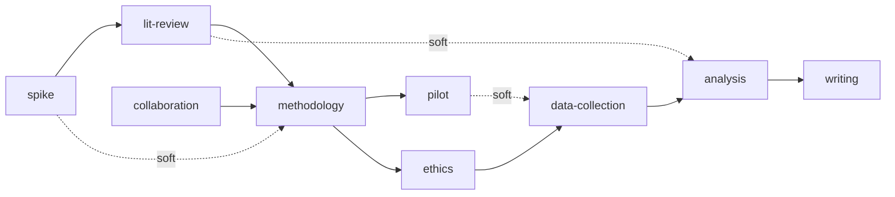

# Research Decomposition

What the `/q` → `/decompose` → `/brief` pipeline and the conceptual review workflow use when the
domain is academic research: domain primitives, sequencing rules, review lenses, and two
maturity-gated modes. It replaces no stage of that pipeline and restates none of them.

- `plugins/aops/skills/q/SKILL.md` — placement and valuation
- `plugins/aops/skills/decompose/SKILL.md` — assumption sorting, fork ranking, probe design
- `plugins/aops/skills/brief/SKILL.md` — process composition and sizing; cuts to the primitives
  below and records review obligations as acceptance criteria on the task body
- `specs/workflows/conceptual-review-workflow.md` — the review layer; runs the lenses below in
  place of its general registry, with its critique protocol, convergence rules, and formality
  gradient unchanged

Formality maps to mode: seedling = light, forest = standard or thorough.

## Research-specific lenses

The conceptual review workflow selects from these instead of its general registry. A standard
research review selects 3–4 plus self-consistency as a background check.

| Lens                     | Research-specific question                                                                                                                                                             |
| ------------------------ | -------------------------------------------------------------------------------------------------------------------------------------------------------------------------------------- |
| Methodological coherence | Is the research design valid? Do analytical choices follow from the question? Is the methodology appropriate for the epistemological stance?                                           |
| Literature awareness     | Is the lit review scoped to the actual question? Are foundational works cited? Is there awareness of adjacent fields that may have addressed similar questions with different methods? |
| Ethics and governance    | Is IRB/ethics approval planned? Is data governance specified? What about consent, anonymisation, data retention? Are there dual-use concerns?                                          |
| Feasibility              | Are academic timelines realistic? Is data access validated, not assumed? Are collaborator commitments confirmed? Does the scope fit the intended publication venue?                    |
| Assumption hygiene       | Are methodological assumptions distinguished from empirical ones? Are there untested assumptions about data availability or participant recruitment?                                   |

## Primitives

Semantic labels on existing task types. No new task types, no schema changes.

| Primitive           | Purpose                                    | Maps to       |
| ------------------- | ------------------------------------------ | ------------- |
| **spike**           | Resolve an unknown before planning further | `learn`       |
| **lit-review**      | Systematic examination of existing work    | `learn`       |
| **methodology**     | Design and justify analytical approach     | `task`        |
| **ethics**          | IRB, consent, data governance              | `task` + gate |
| **data-collection** | Gathering primary or secondary data        | `task`        |
| **analysis**        | Running the actual analysis                | `task`        |
| **writing**         | Manuscript, presentation, or report        | `task`        |
| **pilot**           | Small-scale test of feasibility            | `task`        |
| **collaboration**   | Gate requiring another person's input      | `task` + gate |

### Default sequencing

- **spike → lit-review → methodology** is the discovery sequence: establish tractability, survey
  existing work, then design the approach informed by what exists.
- **ethics is a HARD gate before data-collection.** Non-negotiable, and often gated on external
  approval with unpredictable timelines. Treating ethics as a parallel task is a failure.
- **pilot → data-collection is soft** unless the pilot could invalidate the approach entirely. A
  pilot testing whether participants understand the instrument is soft; a pilot testing whether
  the data source contains the expected variables is hard.
- **collaboration gates can appear anywhere**, but typically block methodology (co-investigator
  agreement on design) or writing (co-author approval).
- **lit-review has a soft dependency on analysis.** Findings may reveal connections to work not
  identified initially, or contradict studies assumed to support the hypothesis.

Deviate where the project shape demands it:

- **Secondary data**: no data-collection; analysis depends on methodology plus a data-access
  spike that validates the dataset contains the expected variables under appropriate terms.
- **Theoretical**: no data-collection or analysis; substitute a conceptual-development primitive
  (mapped to `task`), giving spike → lit-review → methodology → conceptual-development → writing.
- **Replication**: methodology is mostly fixed by the original study; the spike targets
  reproduction feasibility — data access, computational requirements, original authors'
  cooperation.

## Decomposition rules

1. **Start with unknowns.** Every unknown becomes a spike or pilot. Information-gathering precedes
   commitment.
2. **Assumptions are first-class.** Every load-bearing assumption carries a confidence level, a
   validation path, and a contingency.
3. **Non-linear dependencies.** `depends_on` for hard gates, `soft_depends_on` for informational
   dependencies where findings reshape downstream work. The downstream task is not blocked; when
   the upstream lands, `reconcile` writes the finding and returns what it touched to `inbox`.
4. **Collaboration gates.** Any step requiring human judgment or external input is a separate task
   marked as a gate.
5. **Artifact-aware.** Each task specifies its output type: document, dataset, code, presentation,
   decision.
6. **Every task that unblocks judgment-required work carries an explicit follow-up mechanism** —
   a supervisor task that checks readiness, or a `soft_depends_on` from the downstream task to the
   session pipeline so it surfaces. Test: "when this completes, who notices?" If the answer is
   nobody, add a convergence check.
7. **Every decomposition creating parallel tracks includes an explicit convergence task**
   depending on all of them, whose job is synthesising findings across threads. Assign it to a
   human or to a judgment-requiring review, never to an unsupervised agent.
8. **Decompose to the level of rigor, not just the level of action.** Work needing care splits
   into methodology decision, implementation, validation, and documentation rather than one task
   covering all four. Test: "if an agent rushed this in 15 minutes, would the output be usable?"
   If no, decompose further or add explicit quality constraints.
9. **Acceptance criteria specify quality, not completion.** "Metrics computed" is insufficient;
   "metrics computed using modal predictions, validated against known baselines, edge cases
   documented, methodology justified in report" is actionable. Where depth matters, state the
   expected depth in the task body.

## Output

Every forest-mode decomposition produces four items:

- **Assumptions table** — load-bearing assumptions with confidence (high/medium/low), validation
  path (cheapest way to test), and contingency (what changes in the plan if wrong).
- **Task graph** — dependency-aware, using the primitives, with hard and soft dependencies, gate
  markers on ethics and collaboration tasks, and `mvc: true` tags on minimum-viable-contribution
  tasks.
- **Dependency visualisation** — Mermaid diagram, solid lines for hard dependencies, dashed for
  soft.
- **Minimum viable contribution (MVC)** — a narrative paragraph naming the minimum publishable
  claim and the tasks required to substantiate it. The MVC is the floor, not the ceiling: it
  answers "if everything beyond this fails, what can still be published?"

## Seedling mode

**Select** when the input is a question without a defined methodology, an observation without a
research design, or a vague connection between ideas — or when the researcher asks for it
explicitly to re-examine foundations.

**Produces exactly five items:**

1. **Interest statement** (1–2 sentences) — the intellectual bet: the non-obvious claim that, if
   true, would constitute a contribution.
2. **Assumption inventory** (bulleted) — what must be true for the idea to work; each with a
   confidence tag (high/medium/low) and a one-line validation path.
3. **Literature pointers** (2–5 items) — adjacent work, enough to avoid reinventing and to locate
   the idea in an intellectual neighbourhood. Not a literature review.
4. **Spikes** (1–3 items) — concrete questions with a cheap way to answer each, resolvable in
   hours, not weeks.
5. **Go/no-go prompt** — "develop this into a project plan (forest mode), park it, or abandon it?"

**Seedling mode is the stopping rule for Stage 1 intake.** It produces no task graph, no time
estimates, no dependency chains, no MVC, and no Mermaid diagrams, and it leaves the idea at
`inbox` without acceptance criteria until the researcher chooses to develop it.

**Transition to forest.** The assumption inventory seeds the assumptions table, each assumption
gaining a fuller validation path and contingency. The spikes become the first task nodes. The
literature pointers scope the lit-review primitive. The interest statement anchors the MVC.

## Forest mode

**Select** when the researcher has a defined question with at least a preliminary methodology, a
seedling they chose to develop, or an existing plan needing restructuring.

1. **Decomposer produces the plan** — primitives, sequencing rules, and decomposition rules above,
   emitting all four output items.
2. **Reviewer reviews** — the conceptual review workflow with the research lenses above, applying
   the prioritised critique protocol. Lead concern is typically methodological coherence or
   assumption hygiene.
3. **Converge** — the convergence rules from the conceptual review workflow. Each round resolves
   at least one concern; new concerns without resolution escalate to the researcher; soft cap at 7
   rounds.

## Out of scope

- New MCP tools or task schema changes.
- Automated execution of decomposed tasks.
- Non-research domains — those are applications of the general review workflow, not this spec.

## Open questions

1. **Seedling vs. forest selection.** Input length, methodology keywords, and stated intent are
   candidate heuristics; the boundary is fuzzy.
2. **Domain expertise injection.** Shared with the conceptual review workflow.
3. **Methodology primitive granularity.** One primitive, or sub-primitives for research design,
   sampling strategy, analysis plan, and instrument development?
4. **Multi-project decomposition.** Related projects should share lit-review and ethics tasks.
   `decompose`'s network-based fork ranking may cover this; the mechanism is unspecified.
5. **Pipeline integration path.** Do the pipeline stages apply these rules directly, or produce a
   draft that these primitives then reshape?

## Related

- [[specs/workflows/conceptual-review-workflow.md]] — the review layer this spec instantiates
- [[plugins/aops/agents/pauli.md]] — strategic planning; specialised here for research
- [[specs/polecat/polecat-system.md]] — execution layer; consumes decomposed task graphs
- PKB task-graph MCP tools (`mcp__services__pkb__*`) — structured task-graph output
